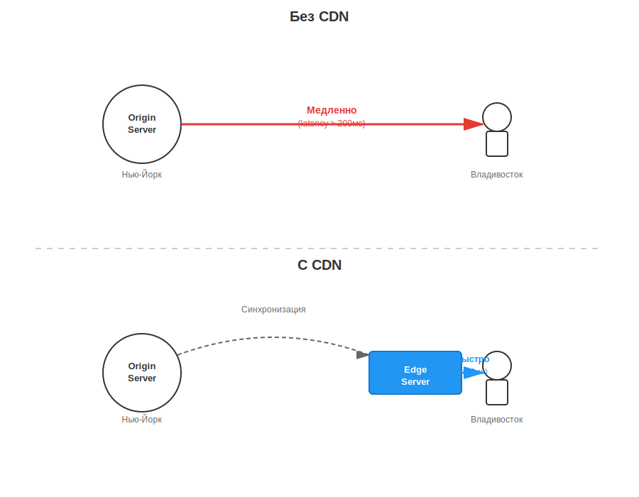
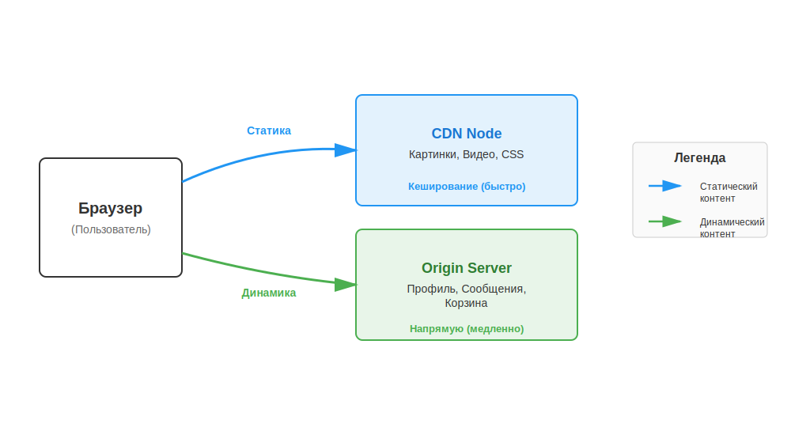

# CDN: Как интернет становится молниеносным

Представь, что ты живёшь в Москве и хочешь заказать пиццу. Если её повезут прямо из Италии, она приедет холодной и через неделю. Но если у итальянского ресторана есть филиал на соседней улице, ты получишь горячую пиццу через 15 минут.

В интернете всё работает так же. Если сервер сайта находится в Нью-Йорке, а ты открываешь его во Владивостоке, данным нужно пролететь через половину планеты по кабелям на дне океана. Это создаёт задержки (**latency**).

**CDN** (Content Delivery Network, сеть доставки контента) — это группа серверов, разбросанных по всему миру, которые хранят копии файлов сайта и отдают их пользователю с ближайшей к нему «точки».

---

## Как это работает?

Когда сайт использует CDN, он не просто лежит на одном главном сервере (его называют **Origin** — оригинал). Вместо этого «тяжёлые» файлы (картинки, видео, скрипты) копируются на сотни промежуточных серверов — **Edge-серверы** (краевые сервера).

Процесс выглядит так:
1. Ты вводишь адрес сайта.
2. Система [**DNS**](dns.md) понимает, что сайт использует CDN, и определяет твой город.
3. Запрос отправляется не в другую страну на главный сервер, а на ближайший к тебе Edge-сервер (например, в твоём же городе или соседнем регионе).
4. Ты получаешь данные почти мгновенно.

---

## Зачем сайтам нужен CDN?

### 1. Скорость (Уменьшение задержки)
Это главная причина. Чем ближе сервер, тем быстрее загружаются картинки и видео. Для современных игр и стриминговых сервисов (вроде YouTube или Twitch) это критически важно.

### 2. Снятие нагрузки с главного сервера
Если на сайт внезапно зайдёт миллион человек, один сервер может «упасть» от нагрузки. CDN распределяет этих людей по сотням своих серверов. Главный сервер при этом «отдыхает».

### 3. Надежность и доступность
Если один сервер CDN в Лондоне сломается, система просто перенаправит лондонских пользователей на сервер в Париже или Амстердаме. Сайт продолжит работать как ни в чем не бывало.

### 4. Защита от атак
CDN часто служат «щитом». Если хакеры попытаются завалить сайт мусорными запросами ([**DDoS-атака**](../security/ddos.md)), CDN примет удар на себя и отфильтрует плохой трафик.

---

## Сравнение: С CDN и без него

| Параметр | Без CDN | С CDN |
|----------|---------|-------|
| **Скорость загрузки** | Зависит от расстояния до сервера | Всегда высокая |
| **Нагрузка на основной сервер** | Очень высокая | Низкая |
| **Устойчивость к наплыву людей** | Низкая (сайт может лечь) | Высокая |
| **Цена** | Платишь только за 1 сервер | Нужно платить за услуги сети CDN |

---

## Что именно хранит CDN?

Обычно CDN кеширует (сохраняет копии) **статического контента**. Это файлы, которые не меняются для каждого пользователя индивидуально:
* **Картинки и фото** (JPEG, PNG, WebP)
* **Видеоролики** (MP4, потоковое видео)
* **Стили сайта** (CSS) и программный код (JS)
* **Шрифты**

А вот твой профиль, личные сообщения или корзина покупок — это **динамический контент**. Он обычно запрашивается напрямую с главного сервера (Origin), потому что эта информация уникальна для тебя.

---

## Популярные CDN-провайдеры

Многие крупные компании строят свои собственные сети (как Google или Netflix), но большинство сайтов арендуют место у специальных провайдеров:
* **Cloudflare** — один из самых популярных в мире, им пользуются миллионы сайтов.
* **Akamai** — один из старейших и крупнейших игроков, через него проходит огромная часть мирового трафика.
* **G-Core / EdgeCenter** — популярные провайдеры с большим количеством серверов в СНГ.

---

## Интересные факты

- **Netflix** настолько заботится о скорости, что устанавливает свои собственные серверы (Open Connect) прямо внутри зданий интернет-провайдеров. Буквально в паре метров от оборудования, которое раздаёт интернет в твои квартиры.
- Более **50% всего трафика** в интернете сегодня проходит через те или иные сети CDN.
- Использование CDN помогает сайтам подниматься выше в поиске Google, потому что скорость загрузки страницы — важный фактор для поисковиков.

---

## Читай также

- [Что такое DNS](dns.md) — как браузер узнает, какой CDN-сервер ближе
- [Что такое кеширование](../caching/README.md) — базовый принцип работы CDN
- [DDoS-атаки: как защитить свой сайт](../security/ddos.md)
- [Протокол HTTP/3](../http_https/README.md) — как новые технологии ускоряют доставку данных вместе с CDN

---

Авторы: Сетраков Фёдор
*Ресурсы: LLM — Claude Sonnet 4.5*
