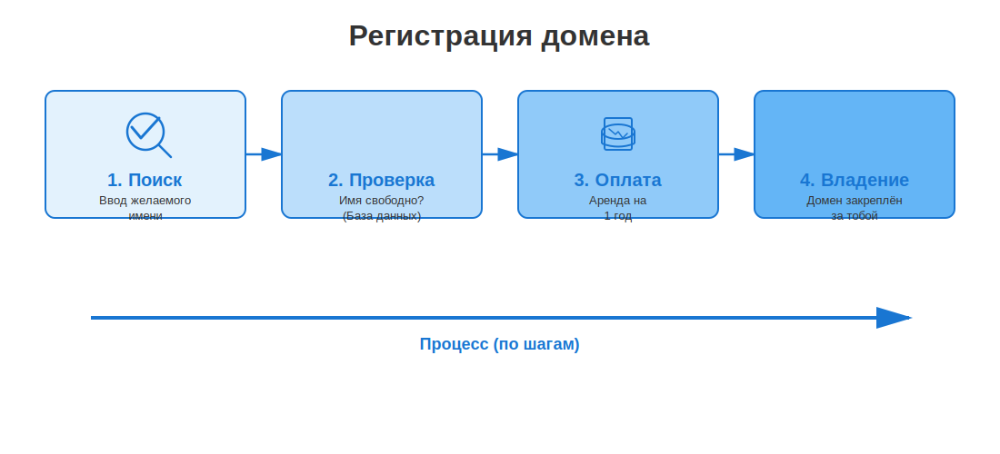

# Домены: как занять своё место в интернете

В прошлой статье мы узнали, что [**DNS**](dns.md) — это телефонная книга, которая связывает имена сайтов с их IP-адресами. Но как эти имена появляются? Кто решает,  что `google.com` принадлежит Google, и можно ли тебе завести себе адрес вроде `super-vanya.pro`?

**Домен** (или доменное имя) — это уникальный «адрес» твоего сайта в интернете. Купить домен — значит арендовать это имя у глобальной системы, чтобы никто другой не мог его использовать.

Представь, что интернет — это огромный город. [**IP-адрес**](../ip_address/README.md) — это координаты дома на карте, а **домен** — это красивая табличка на дверях с твоим именем.

---

## Из чего состоит домен?

Как мы уже знаем, домены строятся по иерархии (как матрёшка). Давай посмотрим на них с точки зрения владельца.

| Уровень | Как называется | Кто распоряжается |
|---------|----------------|-------------------|
| **.ru / .com** | Первый уровень (TLD) | Государства или крупные организации (ICANN) |
| **mysite**.ru | Второй уровень | **Ты!** Именно это имя ты придумываешь и покупаешь |
| **blog**.mysite.ru | Третий уровень | **Тоже ты!** Купив второй уровень, ты можешь создавать сколько угодно поддоменов бесплатно |

### Какие бывают зоны (TLD)?
Зоны (окончания доменов) делятся на две большие группы:
1.  **Географические:** указывают на страну. `.ru` (Россия), `.us` (США), `.kz` (Казахстан), `.me` (Черногория).
2.  **Тематические:** указывают на тип сайта. `.com` (коммерция), `.org` (организации), `.edu` (образование), `.info` (информация).
3.  **Новые (New gTLD):** для красоты и оригинальности. `.pizza`, `.ninja`, `.shoppping`, `.agency`.

---

## Как купить домен: пошаговая инструкция

На самом деле домен нельзя купить «навсегда» — его можно только **арендовать**. Обычно аренда оплачивается на 1 год, после чего её нужно продлевать.

### Шаг 1: Выбор Регистратора
**Регистратор** — это магазин-посредник, у которого есть лицензия на продажу имен в определенных зонах. Популярные в России: Reg.ru, Nic.ru (Ru-Center), Beget.

### Шаг 2: Проверка на занятость
Ты вводишь желаемое имя в строку поиска на сайте регистратора. Если имя `vanya.ru` уже занято кем-то другим, купить его не получится (разве что перекупить у владельца за огромные деньги).

### Шаг 3: Оплата и данные
Для регистрации домена в зоне `.ru` по закону нужны паспортные данные. Это делается для того, чтобы было понятно, кто несет ответственность за содержание сайта. 

### Шаг 4: Настройка (связка с хостингом)
После покупки домен нужно «направить» на сервер, где лежат файлы твоего сайта. Это делается через **NS-записи** (Name Server) в личном кабинете регистратора. Ты просто говоришь домену: «Твой IP-адрес нужно спрашивать вот у этого сервера».

---

## Сколько это стоит?

Цена зависит от «престижности» зоны и жадности регистратора.

* **.ru / .рф**: от 200 до 1000 рублей в год.
* **.com / .net**: обычно дороже, от $10 до $20 (в рублях — около 1000–2000 руб.).
* **Красивые зоны (.art, .pro)**: могут стоить как 500 рублей, так и несколько тысяч.

> **Важно:** Часто регистраторы предлагают первый год за 100 рублей, но продление на второй год будет стоить уже 1000. Всегда читай мелкий шрифт!

---

## Как выбрать крутое имя? (Чек-лист)

Выбор домена — это как выбор названия для группы или бренда. Вот пара советов:

1.  **Коротко — это круто.** `ya.ru` лучше, чем `moy-samy-luchshiy-poiskovik.ru`.
2.  **Легко написать на слух.** Если ты диктуешь адрес другу по телефону, он не должен переспрашивать «S как доллар или C как русская С?».
3.  **Избегай тире и цифр**, если в них нет смысла. Они только путают людей.
4.  **Соответствуй зоне.** Если твой проект для русскоязычных ребят — бери `.ru`. Если делаешь международный стартап — `.com`.

---

## Что такое WHOIS?

**WHOIS** — это публичный протокол, который позволяет узнать, кому принадлежит домен. Если ты вобьешь любой адрес в сервис WHOIS, ты увидишь:
* Кто регистратор.
* Когда домен был куплен и когда он «протухнет» (освободится).
* Иногда — контакты владельца (хотя сейчас их часто скрывают ради приватности).

---

## Интересные факты

- **Самый дорогой домен в истории** — `business.com`. В 2007 году его перепродали за **345 миллионов долларов**.
- **Первый зарегистрированный домен** — `symbolics.com`. Это случилось 15 марта 1985 года. Он работает до сих пор!
- **Домены из трех букв** в популярных зонах (`.com`, `.ru`) давно закончились. Все комбинации типа `abc.com` или `xyz.ru` уже кем-то заняты.
- **Опечатки приносят деньги.** Существует «тайпсквоттинг» — люди регистрируют домены с ошибками, например `gogle.com`, чтобы ловить трафик тех, кто промахнулся по клавишам.

---

## Читай также

- [Что такое DNS и как работают сервера имен](dns.md) — как именно браузер находит сайт по этому имени
- [Что такое хостинг](../hosting/README.md) — где живут файлы сайта, к которым привязан домен
- [IP-адреса: IPv4 и IPv6](../ip_address/README.md) — цифровые координаты интернета
- [Как работает CDN](cdn.md) — как сделать так, чтобы сайт открывался быстро из любой точки мира

---

Авторы: Сетраков Фёдор
*Ресурсы: LLM — Claude Sonnet 4.5*
