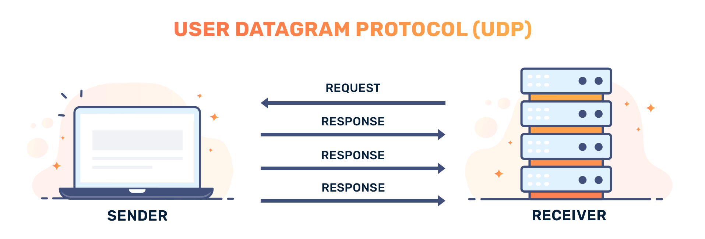

# TCP и UDP: два способа доставить данные через интернет

Когда ты смотришь видео, играешь в онлайн-игру или открываешь сайт — твой компьютер постоянно отправляет и получает данные. Но данные не летят одним куском: они разбиваются на маленькие кусочки — **пакеты**. И вот тут возникает вопрос: *как именно их доставлять?* Надёжно, но медленно? Или быстро, но без гарантий? Именно для этого существуют два протокола транспортного уровня модели OSI — **TCP** и **UDP**.

> 📦 Если [IP и MAC-адреса](../ip_mac/README.md) отвечают на вопрос *«куда везти?»*, то TCP и UDP отвечают на вопрос *«как везти?»*

---

## Что такое протокол?

Представь, что ты договариваешься с другом как передавать записки на уроке. Вы заранее решаете: складывать ли записку вчетверо, ждать ли ответа, что делать если записка потерялась. **Протокол** — это именно такая договорённость между компьютерами: набор правил, по которым они общаются.

TCP и UDP — два разных набора таких правил. Оба живут на **транспортном уровне** — это четвёртый уровень из семи в модели OSI. Их задача — взять данные от программы и передать их через сеть, используя [IP-адреса](../ip_mac/README.md) для доставки.

---

## TCP — надёжная доставка 📬

**TCP** расшифровывается как *Transmission Control Protocol* — «протокол управления передачей». Он описан в документе **RFC 793**, опубликованном в 1981 году, а актуальная версия — **RFC 9293**.

### Аналогия: заказное письмо

Представь, что отправляешь другу важные документы по почте. Ты идёшь на почту, платишь за **заказное отправление** с уведомлением о вручении. Когда друг получает письмо — он расписывается, и тебе приходит подтверждение. Если письмо потерялось — почта отправит его снова.

Именно так работает TCP.

### Как TCP устанавливает соединение: 3-way handshake

Прежде чем отправить хоть один байт данных, TCP «здоровается» с получателем. Это называется **трёхстороннее рукопожатие**:


После этого рукопожатия данные передаются пакетами, каждый из которых **пронумерован**. Получатель подтверждает каждый пакет: *«Получил №1, жду №2»*. Если пакет потерялся — отправитель пришлёт его снова.

### Где используется TCP

| Приложение | Почему TCP |
|-----------|------------|
| 🌐 Сайты — [HTTP и HTTPS](../http_https/README.md) | Страница должна загрузиться полностью |
| 📧 Электронная почта | Письмо нельзя потерять |
| 📁 Скачивание файлов | Файл должен быть целым |
| 💬 Мессенджеры (текст) | Сообщения должны приходить по порядку |
| 🌐 [DNS over TCP](../dns/README.md) | Большие DNS-ответы |

---

## UDP — быстрая доставка 🚀

**UDP** расшифровывается как *User Datagram Protocol* — «протокол пользовательских датаграмм». Описан в **RFC 768**, опубликованном **1 января 1980 года** — чуть раньше TCP!

### Аналогия: листовки в почтовые ящики

Представь рекламщика, который разбрасывает листовки по почтовым ящикам. Он не проверяет, получил ли ты листовку. Может, получил — хорошо. Может, она упала на пол — ну и ладно. Зато рекламщик работает **очень быстро**: не ждёт подтверждений и не возвращается.

Именно так работает UDP:



- ❌ Нет установки соединения — данные сразу летят
- ❌ Нет подтверждений — отправитель не знает, дошло ли
- ❌ Нет гарантии порядка — пакеты могут прийти вперемешку
- ✅ Зато очень быстро!

### Где используется UDP

| Приложение | Почему UDP |
|-----------|------------|
| 🎮 Онлайн-игры | Важна скорость — устаревший кадр лучше пропустить |
| 📹 Видеозвонки, стриминг | Лучше чуть «попикселить», чем застыть |
| 🔊 Интернет-радио, VoIP | Живой звук, небольшие потери некритичны |
| 🌐 [DNS](../dns/README.md) | Маленький быстрый запрос — потеря означает просто повтор |
| 🖥️ DHCP | Автоматическое получение [IP-адреса](../ip_mac/README.md) при подключении к сети |

---

## Сравнение TCP и UDP

| Характеристика | TCP 📬 | UDP 🚀 |
|----------------|--------|--------|
| Установка соединения | ✅ Да (3-way handshake) | ❌ Нет |
| Гарантия доставки | ✅ Да | ❌ Нет |
| Порядок пакетов | ✅ Гарантирован | ❌ Не гарантирован |
| Повтор при потере | ✅ Да | ❌ Нет |
| Скорость | 🐢 Медленнее | 🐇 Быстрее |
| Размер заголовка | 20–60 байт | 8 байт |
| Стандарт | RFC 793 / RFC 9293 | RFC 768 |
| Год | 1981 | 1980 |

---

## Порты — «номера квартир» 🏠

И TCP, и UDP используют понятие **порт** — число от 0 до 65535. Если [IP-адрес](../ip_mac/README.md) — это адрес дома, то **порт** — это номер квартиры. Один компьютер одновременно может принимать и веб-страницы, и почту, и игровые данные — потому что каждый сервис «живёт» на своём порту.

IP-адрес + порт вместе образуют **сокет** — полный адрес доставки.

| Порт | Протокол | Сервис |
|------|----------|--------|
| 80 | TCP | [HTTP](../http_https/README.md) — обычные сайты |
| 443 | TCP | [HTTPS](../http_https/README.md) — защищённые сайты |
| 53 | UDP/TCP | [DNS](../dns/README.md) — поиск адресов |
| 67/68 | UDP | DHCP — получение IP |
| 25 | TCP | Электронная почта |

---

## Как всё связано: путь одного запроса

Когда ты открываешь сайт — происходит вот что:

```
Браузер
  │
  ├──[UDP]──> DNS: «Какой IP у сайта?»
  │            └── подробнее: статья про DNS
  │
  ├──[TCP]──> 3-way handshake с сервером
  │
  ├──[TCP]──> HTTP-запрос: «Дай мне страницу!»
  │            └── подробнее: статья про HTTP и HTTPS
  │
  └──[TCP]──> Получаем страницу пакет за пакетом
```

Полное путешествие запроса описано в статье [«Что происходит, когда я открываю сайт?»](../what_happens/README.md)

---

## Интересные факты

- **UDP старше TCP** — RFC 768 вышел в 1980 году, а RFC 793 в 1981-м. Но TCP известнее, потому что весь веб работает на нём.

- **QUIC — протокол будущего** — Google придумал новый протокол QUIC, который объединяет скорость UDP и надёжность TCP. Именно он используется в YouTube и Google Chrome с 2020 года.

- **Лаги в играх — это UDP** — когда твой персонаж в игре вдруг «телепортируется» — это значит несколько UDP-пакетов с его позицией потерялись, а потом пришёл новый.

- **Заголовок UDP — 8 байт** — это меньше одного SMS! Именно поэтому UDP такой быстрый: он почти не тратит место на служебную информацию. У TCP заголовок минимум 20 байт.

---

## Читай также

- [IP и MAC-адреса](../ip_mac/README.md) — по чему едут пакеты TCP и UDP; что такое IP-адрес и порт
- [DNS](../dns/README.md) — DNS-запросы летят по UDP; большие ответы — по TCP
- [HTTP и HTTPS](../http_https/README.md) — HTTP работает поверх TCP; HTTP/3 — поверх UDP
- [Что происходит, когда я открываю сайт?](../what_happens/README.md) — TCP и UDP в действии на каждом шаге

---

Авторы: oguzok2012

*Данные: WikiData (Q8803, Q11163), RFC 793, RFC 768, RFC 9293*

*Ресурсы: LLM — Claude 4.5 Opus*
