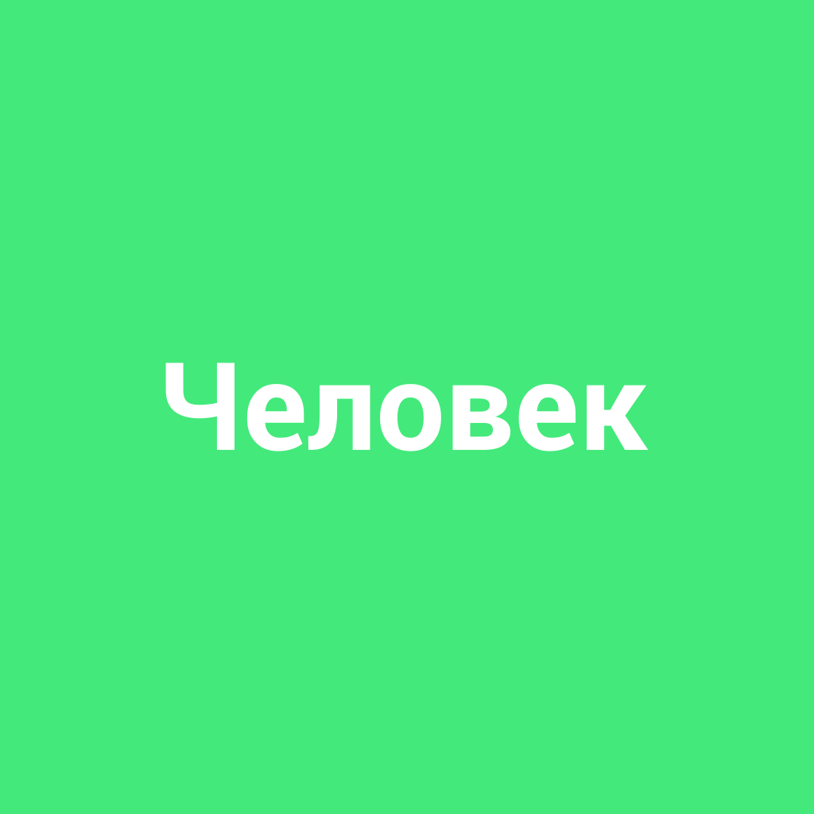

# [Человек](./person.md)

**ID:** `person`  
**WikiData:** [Q5](https://www.wikidata.org/wiki/Q5)  
**Раздел:** 2.1 Общество и взаимодействие [людей](./person.md)

> 💡 **Коротко:** Индивид, обладающий [правами](./right.md) и [обязанностями](./duty.md)

---

# [Человек](./person.md)

## Введение
Привет! 🌟 Сегодня мы поговорим о самом интересном создании на планете — о тебе, о мне, о каждом из нас — о **[человеке](./person.md)**. [Человек](./person.md) — это индивид, который обладает [правами](./right.md) и [обязанностями](./duty.md). Это значит, что каждый из нас имеет свои **[права](./right.md)**, которые защищают нас, и **[обязанности](./duty.md)**, которые мы должны выполнять. Давай разберемся, как это работает в жизни.

## Основная часть
### [Права](./right.md) и [обязанности](./duty.md)
[Человек](./person.md) — это не просто живое существо, которое ходит, говорит и играет. Мы живем в обществе, где есть правила, которые помогают нам мирно сосуществовать. **[Права](./right.md)** — это то, что ты можешь делать, и **[обязанности](./duty.md)** — это то, что ты должен делать.

**[Права](./right.md)**:
- **[Право на образование](./education_right.md)**: Ты имеешь [право](./right.md) учиться и получать знания.
- **[Право](./right.md) на защиту**: Если кто-то причиняет тебе вред, ты можешь обратиться за помощью к взрослым или в [полицию](./police.md).
- **[Право](./right.md) на свободу слова**: Ты можешь высказывать свое мнение, конечно, если оно не вредит другим.

**[Обязанности](./duty.md)**:
- **[Обязанность учиться](./duty_study.md)**: Ты должен стараться учиться хорошо, чтобы стать умным и успешным.
- **[Обязанность](./duty.md) помогать**: Ты должен помогать другим, если они в беде.
- **[Обязанность](./duty.md) соблюдать правила**: Ты должен следовать правилам поведения, чтобы не навредить себе и окружающим.

### Как это работает в реальном мире
Представь, что ты идешь в [школу](./school.md). По дороге ты видишь, что кто-то бросил мусор на улицу. Ты можешь просто пройти мимо, но это будет нарушением твоей [обязанности](./duty.md) поддерживать чистоту. Если ты подберешь мусор и выбросишь его в урну, ты выполнишь свою [обязанность](./duty.md) и внесешь свой вклад в сохранение окружающей среды.

## Примеры из жизни школьника
1. **Учеба**:
   - **[Право](./right.md)**: Ты имеешь [право](./right.md) ходить в [школу](./school.md) и получать образование.
   - **[Обязанность](./duty.md)**: Ты должен стараться учиться хорошо и выполнять домашние задания.

2. **Дружба**:
   - **[Право](./right.md)**: Ты имеешь [право](./right.md) дружить с кем хочешь.
   - **[Обязанность](./duty.md)**: Ты должен быть добрым и поддерживать своих друзей.

3. **[Безопасность](./safety.md)**:
   - **[Право](./right.md)**: Ты имеешь [право](./right.md) чувствовать себя в [безопасности](./safety.md).
   - **[Обязанность](./duty.md)**: Ты должен соблюдать правила [безопасности](./safety.md), например, не переходить дорогу на красный свет.

## Интересные факты
- **Человеческий мозг** 💡: Человеческий мозг — одно из самых сложных и удивительных созданий в мире. Он может запоминать миллионы фактов и решать сложные задачи.
- **Уникальность** 🌱: Каждый [человек](./person.md) уникален. Даже у близнецов есть свои особенности, которые делают их неповторимыми.

## Заключение
Итак, [человек](./person.md) — это не просто существо, которое ходит и говорит. Мы — это индивиды, обладающие [правами](./right.md) и [обязанностями](./duty.md). Эти [права](./right.md) защищают нас, а [обязанности](./duty.md) помогают нам стать лучше и делать мир вокруг нас лучше. Помни, что каждый из нас важен и уникален. Всегда стремись выполнять свои [обязанности](./duty.md) и ценить свои [права](./right.md). Вместе мы можем создать лучше общество! 🌍✨

---

*Автор: Сергей Усов • Сгенерировано с помощью OpenRouter • Слов: 433 • 2026-03-07*
