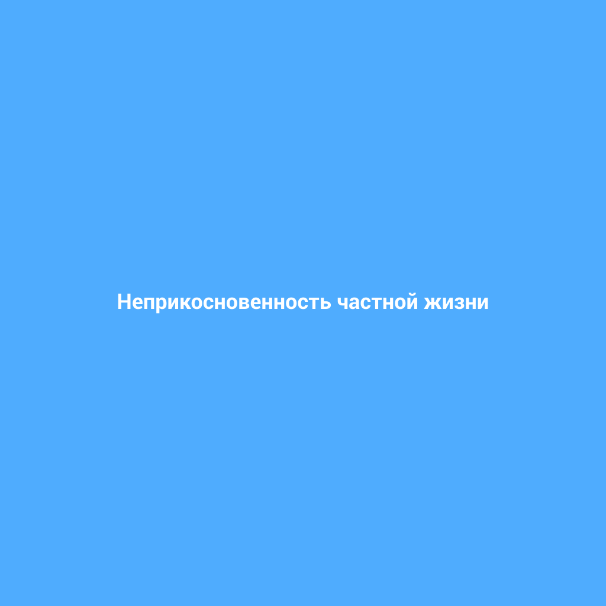

# [Неприкосновенность частной жизни](./privacy.md)

**ID:** `privacy`  
**WikiData:** [Q188728](https://www.wikidata.org/wiki/Q188728)  
**Раздел:** 2.1 Общество и взаимодействие [людей](./person.md)

> 💡 **Коротко:** [Право](./right.md) на свои тайны и личные вещи

---

# [Неприкосновенность частной жизни](./privacy.md) 📚

## Введение

Привет! Сегодня мы поговорим о важном [праве](./right.md), которое называется **[неприкосновенность частной жизни](./privacy.md)**. Это [право](./right.md) означает, что у тебя есть свои секреты, личные вещи и пространство, которые никто не должен нарушать без твоего разрешения. Представь, что у тебя есть сейф, где ты хранишь свои самые ценные вещи и мысли. Это [право](./right.md) защищает твой сейф и гарантирует, что никто не сможет его открыть без твоего согласия.

## Основная часть

### Как это работает в реальном мире?

[Неприкосновенность частной жизни](./privacy.md) работает как защитный щит, который окружает тебя и твои личные вещи. Вот несколько примеров, как это проявляется в повседневной жизни:

- **Личные сообщения**: Когда ты пишешь кому-то сообщение, это твое личное общение. Твои друзья и родители не имеют [права](./right.md) читать его без твоего разрешения.
- **Дневник**: Если у тебя есть дневник, где ты записываешь свои мысли и чувства, никто не имеет [права](./right.md) его читать, если ты не даешь на это разрешение.
- **Комната**: Твоя комната — это твое личное пространство. Твои родители и друзья должны спрашивать твое разрешение, прежде чем входить к тебе.

### Примеры из жизни школьника

Давай рассмотрим несколько примеров, чтобы понять, как это работает в твоей жизни:

1. **Сообщения в социальных сетях**:
   - Предположим, ты написал своему лучшему другу сообщение, в котором рассказал о своих планах на летние каникулы. Твой друг не должен показывать это сообщение другим, даже если они спросят. Это твое личное общение, и оно защищено [правом](./right.md) на [неприкосновенность частной жизни](./privacy.md).

2. **Дневник**:
   - У тебя есть дневник, в который ты записываешь свои мысли и чувства. Однажды твоя мама нашла его и захотела прочитать. Но ты не хочешь, чтобы она читала твои записи. Ты можешь сказать ей, что это твой личный дневник, и она не должна его читать без твоего разрешения. Это твое [право](./right.md) на [неприкосновенность частной жизни](./privacy.md).

3. **Личные вещи**:
   - У тебя есть любимая куртка, которую ты всегда носишь. Однажды твой младший брат взял её без твоего разрешения и испачкал. Это нарушение твоего [права](./right.md) на [неприкосновенность частной жизни](./privacy.md), потому что твои личные вещи должны оставаться в твоём распоряжении.

### Интересные факты

- **[Закон](./law.md) о неприкосновенности частной жизни**: В разных странах есть [законы](./law.md), которые защищают [неприкосновенность частной жизни](./privacy.md). Например, в США есть **Четвёртая поправка к [Конституции](./constitution.md)**, которая запрещает несанкционированный обыск и изъятие личных вещей.
- **Цифровая неприкосновенность**: В современном мире, где все больше информации хранится в интернете, [неприкосновенность частной жизни](./privacy.md) включает защиту твоих данных в сети. Многие страны принимают [законы](./law.md), чтобы защитить личную информацию пользователей от нежелательного доступа.

## Заключение

[Неприкосновенность частной жизни](./privacy.md) — это важное [право](./right.md), которое помогает тебе чувствовать себя безопасно и комфортно. Оно защищает твои личные вещи, сообщения и пространство. Помни, что у тебя есть [право](./right.md) на свои тайны, и никто не должен их нарушать без твоего согласия. Береги свои личные границы и уважай границы других [людей](./person.md). Вместе мы можем создать более уважительное и безопасное общество! 🌟

---

*Автор: Попов Владимир • Сгенерировано с помощью OpenRouter • Слов: 470 • 2026-03-07*
