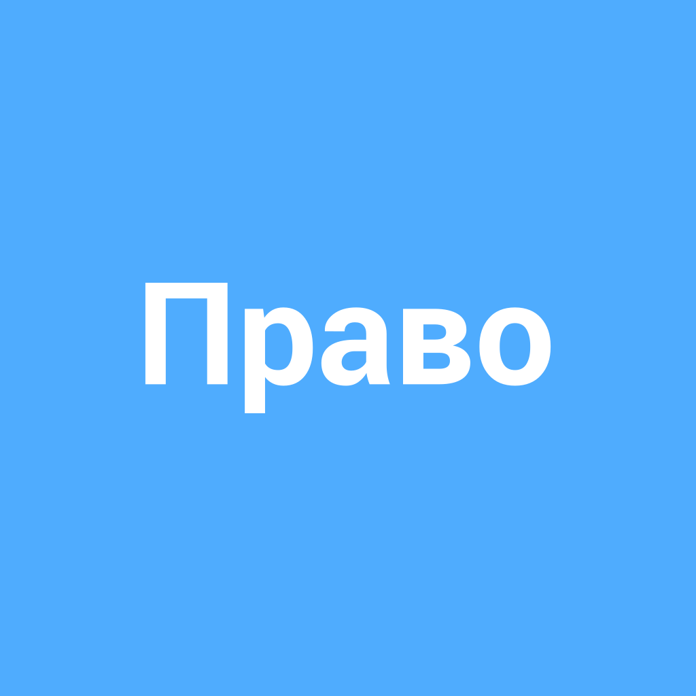

# [Право](./right.md)

**ID:** `right`  
**WikiData:** [Q956115](https://www.wikidata.org/wiki/Q956115)  
**Раздел:** 2.1 Общество и взаимодействие [людей](./person.md)

> 💡 **Коротко:** Возможность что-то делать, гарантированная [законом](./law.md)

---

# [Право](./right.md)

Привет, друзья! 🌟 Сегодня мы поговорим о [праве](./right.md) — это слово ты, наверное, слышал много раз. Но что оно значит и как оно работает в нашей жизни? Давай разбираться вместе!

## Введение — что это такое простыми словами

[Право](./right.md) — это **возможность делать что-то**, которая **гарантирована [законом](./law.md)**. Вот, например, ты имеешь [право](./right.md) учиться в [школе](./school.md), потому что [закон](./law.md) это разрешает и даже требует. [Права](./right.md) помогают нам жить в обществе, где каждый [человек](./person.md) уважает друг друга и соблюдает общие правила.

## Основная часть — как это работает в реальном мире

[Права](./right.md) работают через [законы](./law.md), которые принимают депутаты и президент. Эти [законы](./law.md) защищают [людей](./person.md) от несправедливости и помогают решать конфликты. Если кто-то нарушает твои [права](./right.md), ты можешь обратиться в суд, и судьи решат, что делать дальше.

Например, если кто-то обижает тебя в [школе](./school.md), ты можешь рассказать об этом учителю или директору. Если они не помогут, можно обратиться к юристу или в суд. [Права](./right.md) также помогают нам быть свободными и равными. Например, ты имеешь [право](./right.md) высказывать своё мнение, даже если оно отличается от мнения других [людей](./person.md).

## Примеры из жизни школьника

- **[Право на образование](./education_right.md)** 📚: Ты имеешь [право](./right.md) учиться в [школе](./school.md), и никто не может тебе в этом помешать. Если у тебя есть проблемы с учебой, [школа](./school.md) обязана помочь тебе. Например, тебе могут предложить дополнительные уроки или индивидуальные занятия.

- **[Право](./right.md) на защиту от насилия** 🛡️: Если кто-то обижает тебя или бьет, это нарушение твоего [права](./right.md). [Школа](./school.md) обязана создать безопасную обстановку для всех учеников. Если ты стал жертвой буллинга, ты можешь рассказать об этом взрослым, и они обязаны помочь.

- **[Право](./right.md) на свободу слова** 🗨️: Ты имеешь [право](./right.md) высказывать своё мнение, даже если оно отличается от мнения других. Например, если ты не согласен с чем-то, что происходит в [школе](./school.md), ты можешь сказать об этом и предложить свои идеи. Это поможет сделать [школу](./school.md) лучше.

## Интересные факты

- **Декларация [прав](./right.md) [человека](./person.md)** 📜: В 1948 году была принята Всеобщая декларация [прав](./right.md) [человека](./person.md). Это документ, который объясняет, какие [права](./right.md) должны быть у каждого [человека](./person.md), независимо от того, где он живет.

- **[Права](./right.md) детей** 🧒: В 1989 году была принята Конвенция о [правах](./right.md) ребенка. Она объясняет, какие [права](./right.md) должны быть у детей, чтобы они могли расти здоровыми, образованными и счастливыми.

## Заключение — краткий вывод

[Права](./right.md) — это важная часть нашей жизни. Они помогают нам быть свободными, равными и защищенными. Помни, что у тебя есть [права](./right.md), и ты можешь их защитить, если кто-то их нарушает. Всегда обращайся к взрослым, если тебе нужна помощь. Вместе мы можем сделать мир лучше и справедливее! 🌍✨

---

*Автор: Сергей Усов • Сгенерировано с помощью OpenRouter • Слов: 418 • 2026-03-07*
