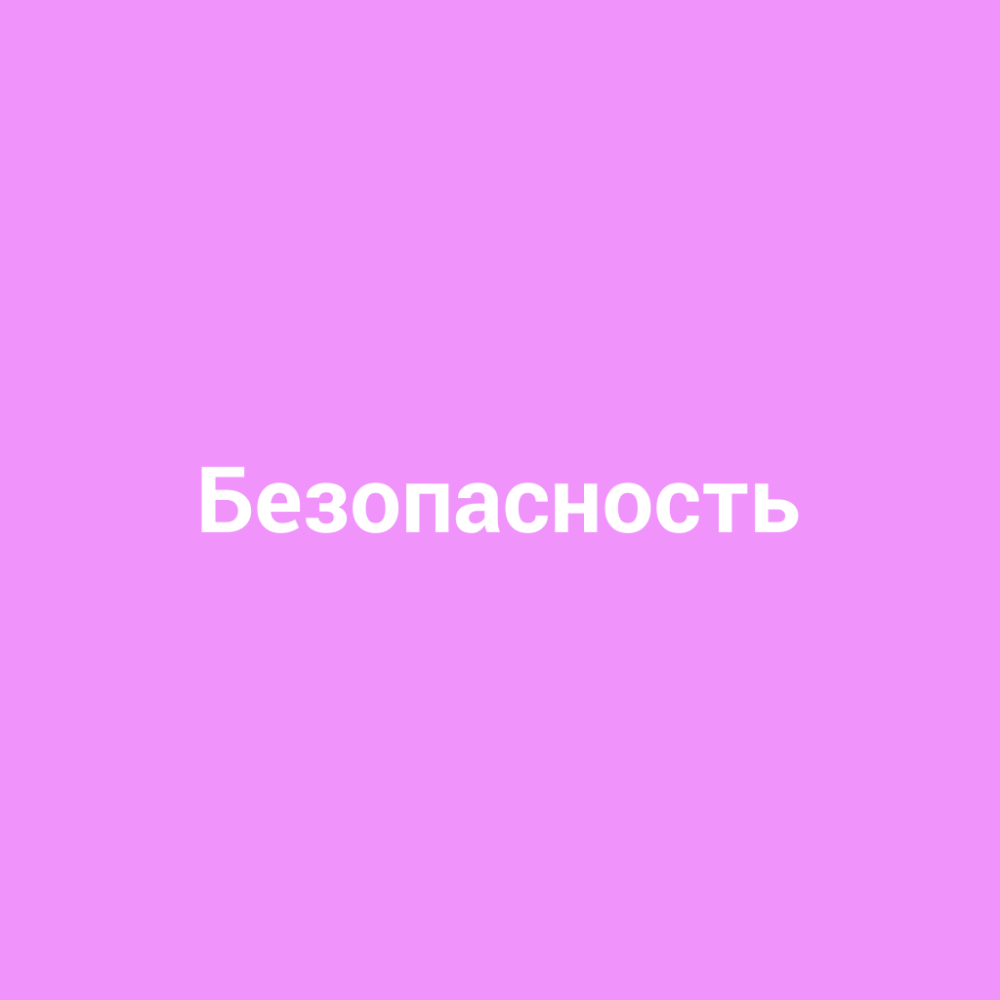

# [Безопасность](./safety.md)

**ID:** `safety`  
**WikiData:** [Q10566551](https://www.wikidata.org/wiki/Q10566551)  
**Раздел:** 2.1 Общество и взаимодействие [людей](./person.md)

> 💡 **Коротко:** Защита от вреда и опасности

---

# [Безопасность](./safety.md) 🛡️

## Введение
[Безопасность](./safety.md) — это когда ты защищён от разных опасностей и вреда. Это важно, чтобы ты мог жить и играть без страха. [Безопасность](./safety.md) касается всего: от того, как ты переходишь дорогу, до того, как ты общаешься в интернете. Давай разберёмся, как это работает в реальной жизни!

## Основная часть
[Безопасность](./safety.md) включает в себя много разных вещей. Вот несколько основных аспектов:

- **Физическая [безопасность](./safety.md)**: Это когда ты защищён от травм и болезней. Например, носить шлем при катании на велосипеде или мыть руки перед едой.
- **Психологическая [безопасность](./safety.md)**: Это когда ты чувствуешь себя спокойно и уверенно. Например, иметь друзей, которые поддерживают тебя, или знать, что ты можешь поговорить с родителями о своих проблемах.
- **Интернет-[безопасность](./safety.md)**: Это когда ты защищён в интернете. Например, не рассказывать незнакомым [людям](./person.md) свои личные данные или не загружать сомнительные файлы.

## Примеры из жизни школьника
1. **Переход через дорогу** 🚶‍♂️
   Каждый день ты переходишь дорогу по пути в [школу](./school.md). Чтобы быть в [безопасности](./safety.md), нужно всегда смотреть на светофор, идти по пешеходному переходу и не отвлекаться на телефон. Если ты будешь внимательным, шансов попасть в аварию будет гораздо меньше.

2. **Игры на детской площадке** 🎢
   Детская площадка — это место для весёлых игр, но здесь тоже нужно соблюдать правила. Не лезь на высокие конструкции, если не уверен, что справишься. Не бегай под качелями, чтобы не задеть других детей. И всегда уступай младшим, ведь они могут не справиться с опасностью.

3. **Интернет-общение** 🌐
   Интернет — это огромный мир, где можно найти много интересного. Но важно быть осторожным. Не рассказывай незнакомцам свои личные данные, такие как имя, адрес или телефон. Если кто-то просит встретиться, обязательно расскажи об этом родителям. Они помогут тебе разобраться, безопасно ли это.

## Интересные факты
- **[Безопасность](./safety.md) в [школах](./school.md)**: Многие [школы](./school.md) проводят учения по эвакуации, чтобы дети знали, что делать в случае пожара или другой чрезвычайной ситуации.
- **Шлемы для велосипедистов**: В некоторых странах [закон](./law.md) обязывает детей до 16 лет носить шлемы, когда они катаются на велосипеде. Это помогает защитить голову от травм.

## Заключение
[Безопасность](./safety.md) — это не просто слово, это твоя защита в мире, полном различных опасностей. Соблюдая простые правила, ты можешь сделать свою жизнь более защищённой и спокойной. Помни, что твоё здоровье и благополучие — самое важное! Будь осторожен и внимателен, и тогда ты сможешь наслаждаться жизнью в полной мере. 🌟

---

*Автор: Мария Люзина • Сгенерировано с помощью OpenRouter • Слов: 381 • 2026-03-07*
