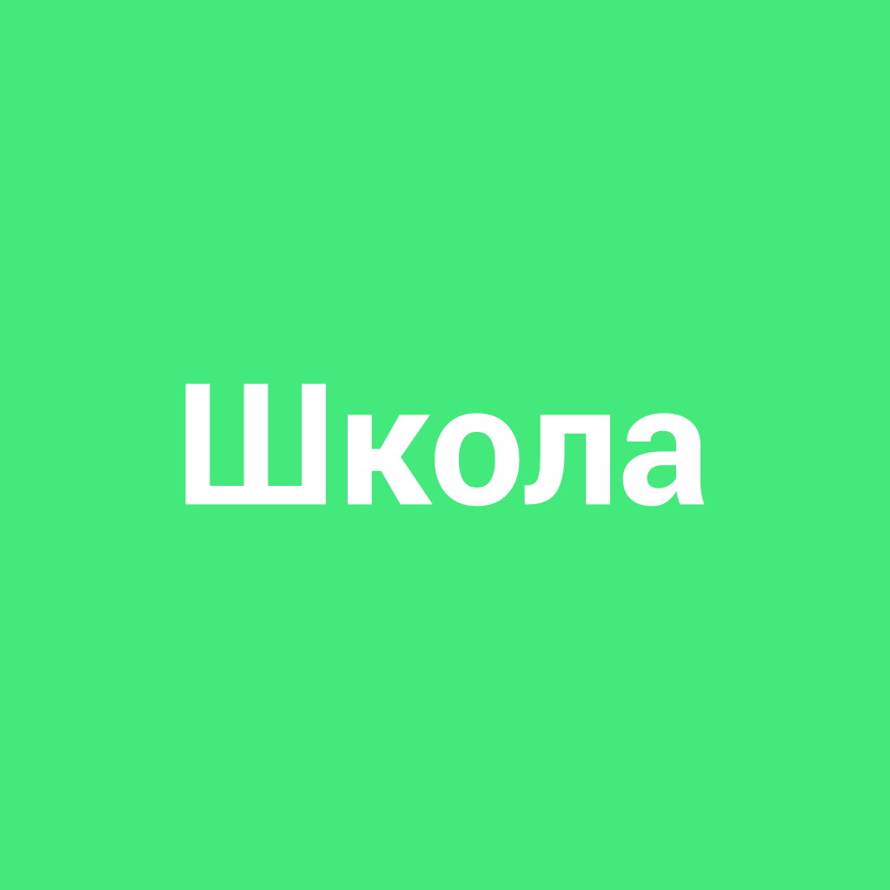

# [Школа](./school.md)

**ID:** `school`  
**WikiData:** [Q3914](https://www.wikidata.org/wiki/Q3914)  
**Раздел:** 2.1 Общество и взаимодействие [людей](./person.md)

> 💡 **Коротко:** Место, где дети получают образование

---

# [Школа](./school.md) 📚

## Введение

Привет, друзья! Сегодня мы поговорим о [школе](./school.md). Это место, где ты проводишь большую часть своего времени, учишься новому и общаешься с друзьями. [Школа](./school.md) — это не просто здание с классами и учителями, это целый мир, полный приключений, новых знаний и интересных [людей](./person.md).

## Как это работает в реальном мире

[Школа](./school.md) — это место, где ты учишься разным предметам, таким как математика, русский язык, история, география и многие другие. Каждый день ты ходишь на уроки, где учителя рассказывают тебе о важных вещах и помогают тебе понять сложные темы.

- **Расписание**: В [школе](./school.md) есть расписание, которое показывает, какие уроки у тебя когда. Обычно уроки начинаются утром и заканчиваются к обеду или немного позже.
- **Домашние задания**: После уроков тебе необходимо выполнять домашние задания. Это помогает тебе лучше усвоить материал и подготовиться к следующим урокам.
- **Оценки**: Учителя ставят тебе оценки за твои знания и работу. Оценки помогают тебе понять, как ты справляешься с учебой и над чем тебе нужно поработать.
- **Дополнительные занятия**: В [школе](./school.md) часто проводятся кружки и секции, где ты можешь заниматься спортом, танцами, рисованием, музыкой и другими увлекательными вещами.

## Примеры из жизни школьника

### Пример 1: Урок математики
Представь, что у тебя сегодня урок математики. Учитель рассказывает о новых правилах решения уравнений, и ты стараешься внимательно слушать. После урока тебе задают домашнее задание — решить несколько задач. Вечером ты садишься за стол, достаешь тетрадь и начинаешь работать. Сначала задачи кажутся сложными, но постепенно ты начинаешь понимать, как их решать.

### Пример 2: Классный час
На классном часе вы обсуждаете планы на предстоящую неделю. Классный руководитель рассказывает о предстоящем школьном празднике и просит вас предложить идеи для конкурсов. Ты предлагаешь организовать викторину по истории, и класс одобряет твое предложение. Вместе с друзьями вы готовитесь к празднику, придумываете вопросы и готовите призы.

### Пример 3: Спортивные соревнования
В [школе](./school.md) проходят соревнования по легкой атлетике. Ты участвуешь в забеге на 100 метров. Перед стартом ты немного волнуешься, но когда раздается выстрел, ты стартуешь и изо всех сил бежишь к финишу. Ты занимаешь третье место и получаешь медаль. Это было здорово, и ты гордишься своими достижениями.

## Интересные факты

- **Первая [школа](./school.md)**: Первая [школа](./school.md) в мире была основана в Древней Греции. Там дети учились читать, писать и изучали философию.
- **[Школа](./school.md) в космосе**: В 2007 году в космосе был проведен урок. Астронавты на Международной космической станции провели урок для школьников, показывая, как они живут и работают в условиях невесомости.
- **[Школа](./school.md) в воде**: В некоторых странах, например, в Индонезии, есть [школы](./school.md), где уроки проходят на лодках. Дети переплывают на лодках из одной деревни в другую, чтобы ходить в [школу](./school.md).

## Заключение

[Школа](./school.md) — это место, где ты растешь и развиваешься, учишься новому и общаешься с друзьями. Здесь ты получаешь знания, которые помогут тебе в будущем, и узнаешь много интересного о мире. Хотя иногда учеба может быть сложной, все усилия стоят того, чтобы стать умным и успешным [человеком](./person.md). Помни, что каждый день в [школе](./school.md) — это новый шаг к твоим мечтам! 🌟

---

*Автор: Агейкин Егор • Сгенерировано с помощью OpenRouter • Слов: 494 • 2026-03-07*
