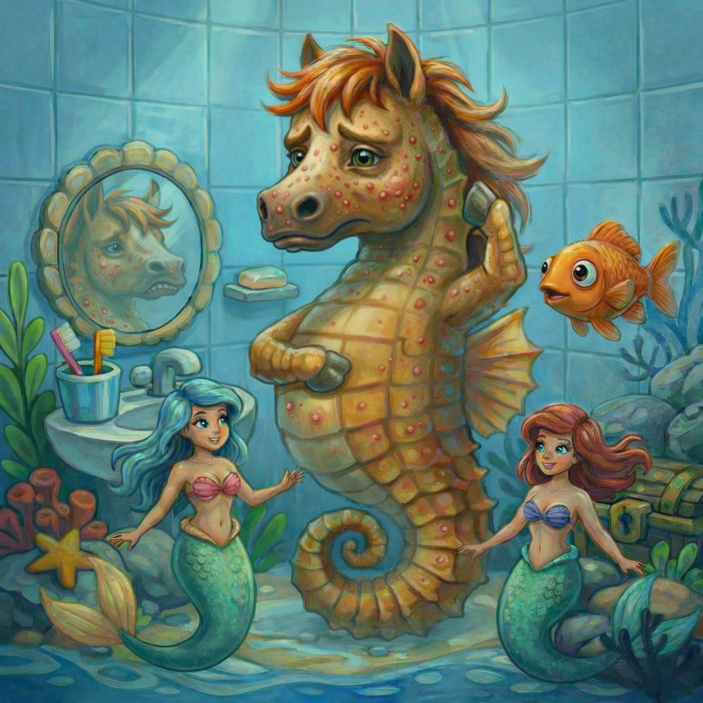

# [Прыщи и акне](./acne.md)

**ID:** `acne`  
**WikiData:** [Q241303](https://www.wikidata.org/wiki/Q241303)  
**Раздел:** 3.1. Здоровый образ жизни

> 💡 **Коротко:** Акне — это воспаление кожи из‑за того, что поры забиваются кожным салом и отмершими клетками, а бактерии усиливают воспаление. Это очень распространено у подростков и лечится — главное делать всё безопасно.

---

## Введение
Если у тебя появились прыщи — ты не один. В 8–10 классе это встречается у большинства: организм перестраивается, гормоны заставляют **сальные железы** работать активнее, а кожа иногда не успевает «справляться» с таким режимом.

Важно понимать: **акне — не признак грязи** и не означает, что ты «плохо умываешься». Да, гигиена помогает, но причина обычно глубже: сочетание жирности кожи, закупорки пор и воспаления. Разберёмся, как это работает и что реально помогает, а что — только ухудшает.

---

## Как это работает: почему появляются прыщи
На коже есть поры — это «выходы» волосяных фолликулов и сальных желез. Упрощённо процесс такой:

1. **Сальные железы выделяют кожное сало (себум)** — оно нужно, чтобы кожа не пересыхала.
2. **Клетки кожи обновляются** — отмершие клетки должны спокойно уходить.
3. Иногда **себум + отмершие клетки** образуют пробку в поре → появляется **комедон**:
   * **черные точки** — открытые комедоны (темнеет верхушка, это не «грязь», а окисление);
   * **белые бугорки** — закрытые комедоны.
4. Если внутри пробки активно размножаются бактерии и иммунитет реагирует, начинается **воспаление**:
   * красный болезненный прыщ (папула),
   * прыщ с «головкой» (пустула),
   * глубокие болезненные узлы (тяжелее и опаснее рубцами).

Что чаще всего усиливает акне:
* **гормональные изменения** (подростковый возраст);
* **стресс и недосып** (да, реально влияет) — см. [сон](./sleep.md);
* **трение и пот** (маска, воротник, шлем, спортивная форма);
* **комедогенная косметика** (жирные тональные кремы/масла «забивают» поры);
* **привычка трогать лицо руками** — тут помогает [мытье рук](./handwashing.md).

 

## Что делать каждый день: базовый план (без фанатизма)
### 1) Умывание 1–2 раза в день
* Утром и вечером — мягким средством (гель/пенка), без «скраба до скрипа».
* Очень частое умывание и спиртовые лосьоны могут пересушить кожу → она начнет выделять **ещё больше** сала.

См. также: [умывание лица](./facewash.md).

### 2) Увлажнение — да, даже если кожа жирная
Лёгкий крем/гель «non-comedogenic» (не забивает поры) помогает коже восстановить барьер. Когда кожа пересушена, воспаления часто становятся хуже.

### 3) Точечно и аккуратно: лечение, а не «выдавливание»
* Выдавливание повышает риск **рубцов**, **пятен** и занесения инфекции.
* Если очень хочется «снять» прыщ — лучше **гидроколлоидный пластырь** (прыщ-патч): защищает от рук и ускоряет заживление.

### 4) Смена наволочки и чистые вещи
Пот и жир остаются на ткани. Чистая наволочка — реальный лайфхак (см. [постельное белье](./bedding.md)). После спорта лучше принять [душ](./shower.md) и переодеться.

### 5) Дезодорант — не на лицо
Иногда подростки пытаются «подсушить» прыщи чем попало. Не надо использовать на лице средства не для кожи лица (включая [дезодорант](./deodorant.md), антисептики и духи).

---

## Примеры из жизни школьника
1. **Физкультура + рюкзак**: спина и плечи могут покрываться прыщами из-за пота и трения лямок. Помогает душ после тренировки и чистая футболка.
2. **Контрольные и стресс**: перед важными днями высыпания часто усиливаются. Это не «магия» — стресс влияет на воспаление. Нормальный сон и режим иногда дают заметный эффект.
3. **Телефон и подбородок**: экран собирает жир и бактерии. Если часто прижимаешь телефон к лицу — протирай его и старайся говорить через наушники.

---

## Частые ошибки (которые делают хуже)
* **Скрабы с крупными частицами** и жесткие щетки: царапают воспаления.
* **Спирт/перекись/йод на всё лицо**: пересушивают и раздражают.
* **Выдавливание**: повышает риск рубцов и «пятен после прыщей».
* **Слишком много средств сразу**: кожа раздражается, и ты не понимаешь, что именно помогает.
* **«Загар лечит акне»**: иногда кажется, что стало лучше (покраснение маскируется), но ультрафиолет может усилить воспаление и пятна. Лучше использовать [защиту от солнца](./sunscreen.md).

---

## Когда точно стоит идти к дерматологу
Обратись к [дерматологу](./dermatologist.md), если:
* прыщи **болезненные, глубокие**, появляются узлы;
* остаются **рубцы** или темные пятна;
* высыпания на груди/спине сильно мешают;
* стало заметно хуже за 1–2 месяца;
* есть ощущение, что «ничего не помогает» (и это нормально — врач подберет схему).

Иногда для лечения нужны аптечные средства (например, ретиноиды/бензоилпероксид/азелаиновая кислота) или рецептурные препараты — это должен подбирать специалист, чтобы было безопасно.

---

## Интересные факты
* **Черная точка — не грязь**: темный цвет появляется из-за окисления содержимого поры на воздухе.
* **Прыщи ≠ аллергия**: чаще это именно акне, а не «что-то съел не то».
* **Вода не “вылечит” акне**, но нормальный [водный баланс](./water.md) помогает коже и общему самочувствию.

---

## Заключение
[Прыщи и акне](./acne.md) — это обычная часть подросткового периода, и с этим можно справляться спокойно и грамотно. Твоя цель — не «стереть кожу до идеала за ночь», а мягко уменьшить воспаление и не делать того, что оставляет следы на годы: не выдавливать, не сушить агрессивно и не лечиться случайными советами.

Если высыпания мешают жить — это не повод стесняться, это повод обратиться к дерматологу и подобрать план.

---

*Автор: Королев Иван • Сгенерировано с помощью ChatGPT 5-2 • Слов: 694 • 2026-03-10*