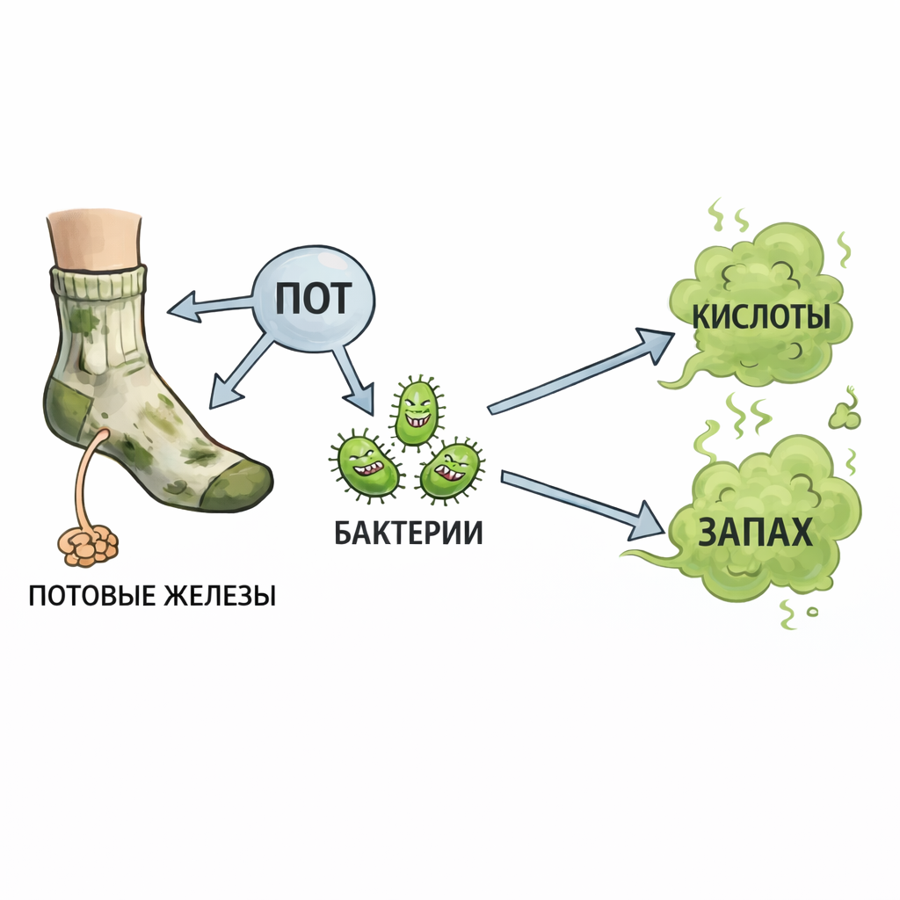

# [Носки и запах ног](./socks.md)

**ID:** `socks`  
**WikiData:** [Q43663](https://www.wikidata.org/wiki/Q43663)  
**Раздел:** 3.1. Здоровый образ жизни

> 💡 **Коротко:** Ноги сами по себе не «пахнут» — запах появляется, когда пот впитывается в носки и обувь, а бактерии начинают его разлагать. Чистые носки + проветриваемая обувь = почти всегда решение.

---

## Введение
Если ты когда-нибудь снимал кроссовки после школы и думал: «О нет…» — ты не один. Запах ног очень распространён, особенно у подростков: ты больше двигаешься, чаще потеешь, носишь тёплую обувь, а иногда забываешь вовремя менять носки.

Хорошая новость: проблема обычно решается простыми привычками. [Носки и запах ног](./socks.md) — это про гигиену, материалы и уход за обувью, а не про «стыд». Разберёмся, откуда берётся запах и как сделать так, чтобы кроссовки не «кусались».

---

## Как это работает: откуда берётся запах
На стопах много потовых желез. Пот нужен, чтобы охлаждать кожу, но:

* **пот** почти не пахнет;
* **запах** появляется, когда бактерии на коже и в ткани **разлагают пот** и кожные выделения;
* если обувь плохо проветривается, внутри тепло и влажно — бактерии размножаются быстрее.

Что усиливает проблему:
* синтетические носки, которые плохо «дышат»;
* одна и та же пара обуви каждый день без просушки;
* привычка ходить в обуви «на босу ногу»;
* редкое мытьё ног или плохо вытертые стопы;
* грибок стопы (уже медицинская история).

 

## База: что делать каждый день
### 1) Мой ноги нормально (и вытирай насухо)
Во время [душа](./shower.md) помой стопы с мылом, а потом **тщательно вытри** — особенно между пальцами. Влажность между пальцами = быстрый путь к раздражению и грибку.

### 2) Меняй носки каждый день (а иногда — дважды)
* **Минимум**: 1 раз в день.
* Если был спорт/жара/ноги сильно вспотели — **переодень носки после школы**.

### 3) Выбирай носки по материалу
* На каждый день хорошо подходят носки с высоким содержанием **хлопка** или **шерсти** (зимой), плюс немного эластана для формы.
* Полностью синтетические носки часто усиливают запах, потому что хуже отводят влагу (но бывают и спортивные синтетические, которые специально сделаны «дышащими» — их надо подбирать).

### 4) Не носи одну пару обуви «без отдыха»
Идеально — **2 пары** на смену: сегодня одни кроссовки, завтра другие. За сутки обувь успевает высохнуть.

---

## Что делать с обувью (самое важное после носков)
Запах часто «живет» не на ногах, а **в обуви**.

1. **Проветривай**: после школы расшнуруй и оставь сохнуть в открытом виде.
2. **Суши правильно**: не на батарее вплотную (клей и материал могут испортиться), лучше при комнатной температуре.
3. **Стельки**: если они пахнут — их нужно стирать/менять. Иногда новая стелька решает проблему на 80%.
4. **Уход за обувью**: регулярная чистка и просушка — см. [уход за обувью](./shoes.md).

---

## Быстрые решения, если запах уже появился
* **Смена носков** + промыть ноги — самый быстрый способ.
* **Тальк/порошок для ног** или специальные средства для обуви могут помочь уменьшить влажность.
* **Антиперспирант** иногда используют и для стоп (только по инструкции и не на раздраженную кожу). Стопы — не подмышки, поэтому сначала лучше решить вопрос носками и обувью.
* Если обувь очень «въелась» запахом, иногда помогает стирка (если допускает материал) или глубокая чистка, но чаще — замена стелек и хорошая просушка.

---

## Когда стоит насторожиться: возможно, это грибок
Обратись к взрослым и лучше к врачу, если есть:
* зуд, шелушение, трещинки между пальцами;
* покраснение, мокнутие;
* неприятный запах + изменения кожи, которые не уходят при нормальной гигиене;
* изменения ногтей (утолщение, крошатся, меняют цвет).

В таких случаях это может быть грибковая инфекция, и нужна правильная терапия, а не «просто помыться».

---

## Примеры из жизни школьника
1. **Сменка в школе**: если весь день в одной обуви, особенно тёплой, стопы потеют сильнее. Сменная обувь и носки «по сезону» сильно помогают.
2. **Тренировка после уроков**: возьми запасные носки. Переобулся/переоделся — и вечером дома не будет «аромата».
3. **Долгая дорога**: в автобусе/метро ноги тоже потеют. Более «дышащие» кроссовки и носки — важнее, чем «супер-спрей от запаха».

---

## Частые ошибки
* Носить носки 2–3 дня подряд «пока не видно грязи».
* Надевать влажные носки или обувь.
* Пытаться залить запах духами/дезодорантом — будет просто «запах + запах».
* Ходить в кроссовках без носков: кожа трётся, пот впитывается прямо в обувь.

---

## Интересные факты
* На стопах — одни из самых активных потовых желез, поэтому потливость ног очень частая.
* Запах сильнее в закрытой обуви, даже если ты чистоплотный: бактериям нужно тепло и влажность.
* Иногда достаточно сменить стельки и начать сушить обувь — и проблема исчезает за неделю.

---

## Заключение
[Носки и запах ног](./socks.md) — это не «стыдно», а решаемо. Почти всегда работают три шага: **мыть и вытирать стопы**, **менять носки**, **сушить и проветривать обувь**. Если же появляются зуд, шелушение или трещины — лучше не терпеть и обратиться к врачу, чтобы исключить грибок.

---

*Автор: Королев Иван • Сгенерировано с помощью ChatGPT 5-2 • Слов: 708 • 2026-03-10*