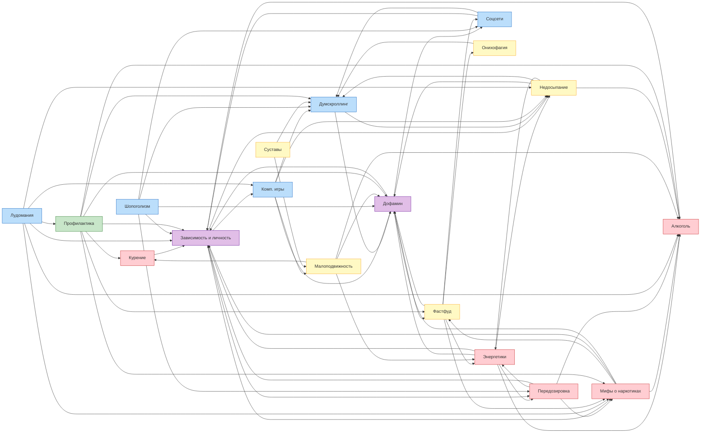

# Вредные привычки

**Раздел:** 3.1. Здоровый образ жизни → Вредные привычки  
**Команда:** 777  
**Дата обновления:** 2026-03-19

---

## 📖 Описание направления

Раздел детской энциклопедии, посвящённый вредным привычкам. Основная идея — объяснить ребёнку 10 лет, что такое вредные привычки, как они формируются, почему они опасны и как от них защититься. Тексты написаны простым и доступным языком с использованием примеров из жизни.

## 🧠 Онтология предметной области

```mermaid
graph TD
    VP["🚫 Вредные привычки"]

    VP --> SUBSTANCE["🧪 Вещества"]
    VP --> MECHANISM["🧠 Механизмы зависимости"]
    VP --> DIGITAL["📱 Цифровые зависимости"]
    VP --> LIFESTYLE["🛋️ Образ жизни"]
    VP --> SHIELD["🛡️ Профилактика"]

    %% Вещества
    SUBSTANCE --> SMOKING["Курение"]
    SUBSTANCE --> ALCOHOL["Алкоголь"]
    SUBSTANCE --> ENERGY["Энергетики"]
    SUBSTANCE --> DRUGS_MYTHS["Мифы о наркотиках"]
    SUBSTANCE --> OVERDOSE["Передозировка"]

    %% Механизмы
    MECHANISM --> DOPAMINE["Дофаминовая петля"]
    MECHANISM --> PERSONALITY["Как зависимость<br/>меняет личность"]

    %% Цифровые
    DIGITAL --> SOCIAL["Соцсети и FoMO"]
    DIGITAL --> DOOM["Думскроллинг"]
    DIGITAL --> GAMES["Комп. игры"]
    DIGITAL --> LUDO["Лудомания"]
    DIGITAL --> SHOP["Шопоголизм"]

    %% Образ жизни
    LIFESTYLE --> FASTFOOD["Фастфуд"]
    LIFESTYLE --> SEDENTARY["Малоподвижность"]
    LIFESTYLE --> SLEEP["Недосыпание"]
    LIFESTYLE --> KNUCKLE["Щёлканье суставами"]
    LIFESTYLE --> NAILS["Грызение ногтей"]

    %% Профилактика
    SHIELD --> PREVENT["Профилактика<br/>вредных привычек"]

    %% Горизонтальные связи
    DOPAMINE -.- SOCIAL
    DOPAMINE -.- SHOP
    DOPAMINE -.- FASTFOOD
    PERSONALITY -.- DRUGS_MYTHS
    PERSONALITY -.- OVERDOSE
    DOOM -.- SOCIAL
    ENERGY -.->|связан с| SLEEP
    SEDENTARY -.->|связан с| FASTFOOD
    PREVENT -.->|противодействует| VP

    %% Стили
    classDef substance fill:#ffcdd2,stroke:#c62828
    classDef mechanism fill:#e1bee7,stroke:#6a1b9a
    classDef digital fill:#bbdefb,stroke:#1565c0
    classDef lifestyle fill:#fff9c4,stroke:#f9a825
    classDef shield fill:#c8e6c9,stroke:#2e7d32
    classDef root fill:#e0e0e0,stroke:#424242

    class SUBSTANCE,SMOKING,ALCOHOL,ENERGY,DRUGS_MYTHS,OVERDOSE substance
    class MECHANISM,DOPAMINE,PERSONALITY mechanism
    class DIGITAL,SOCIAL,DOOM,GAMES,LUDO,SHOP digital
    class LIFESTYLE,FASTFOOD,SEDENTARY,SLEEP,KNUCKLE,NAILS lifestyle
    class SHIELD,PREVENT shield
    class VP root
```

## 🔗 Граф перекрёстных ссылок между статьями

> 64 ссылки расставлены автоматически скриптом `crosslink.py` с учётом падежей (pymorphy3)

## 📋 Таблица понятий

| # | Понятие | WikiData | Категория | Автор |
|---|---------|----------|-----------|-------|
| 1 | Курение | [Q662860](https://www.wikidata.org/wiki/Q662860) | Вещества | Дмитрий Марьин |
| 2 | Алкоголь и подростки | [Q154](https://www.wikidata.org/wiki/Q154) | Вещества | Дмитрий Марьин |
| 3 | Энергетики | [Q30574535](https://www.wikidata.org/wiki/Q30574535) | Вещества | Воробьев Глеб |
| 4 | Мифы о «лёгких» наркотиках | [Q12140](https://www.wikidata.org/wiki/Q12140) | Вещества | Аксельрод Анастасия |
| 5 | Передозировка | [Q1347065](https://www.wikidata.org/wiki/Q1347065) | Вещества | Аксельрод Анастасия |
| 6 | Дофаминовая петля | [Q170304](https://www.wikidata.org/wiki/Q170304) | Механизмы | Гуляев Антон |
| 7 | Как зависимость меняет личность | [Q2739434](https://www.wikidata.org/wiki/Q2739434) | Механизмы | Аксельрод Анастасия |
| 8 | Соцсети и FoMO | [Q202833](https://www.wikidata.org/wiki/Q202833) | Цифровые | Гуляев Антон |
| 9 | Думскроллинг | [Q97210710](https://www.wikidata.org/wiki/Q97210710) | Цифровые | Гуляев Антон |
| 10 | Компьютерные игры | [Q56828378](https://www.wikidata.org/wiki/Q56828378) | Цифровые | Дмитрий Марьин |
| 11 | Лудомания | [Q860861](https://www.wikidata.org/wiki/Q860861) | Цифровые | Мустафаев Алим |
| 12 | Шопоголизм | [Q1140705](https://www.wikidata.org/wiki/Q1140705) | Цифровые | Воробьев Глеб |
| 13 | Фастфуд и пищевой мусор | [Q223557](https://www.wikidata.org/wiki/Q223557) | Образ жизни | Воробьев Глеб |
| 14 | Малоподвижный образ жизни | [Q1349194](https://www.wikidata.org/wiki/Q1349194) | Образ жизни | Пономарев Артем |
| 15 | Недосыпание | [Q15070482](https://www.wikidata.org/wiki/Q15070482) | Образ жизни | Пономарев Артем |
| 16 | Щёлканье суставами | [Q241790](https://www.wikidata.org/wiki/Q241790) | Образ жизни | Мустафаев Алим |
| 17 | Онихофагия | [Q225378](https://www.wikidata.org/wiki/Q225378) | Образ жизни | Мустафаев Алим |
| 18 | Профилактика вредных привычек | — | Профилактика | Пономарев Артем |

## Участники группы (Команда 777)

| # | ФИО | Статьи | LLM |
|---|-----|--------|-----|
| 1 | Гуляев Антон | Дофаминовая петля, Соцсети и FoMO, Думскроллинг | Gemini 3, Nano Banana 2 |
| 2 | Дмитрий Марьин | Курение, Алкоголь, Компьютерные игры | OpenRouter |
| 3 | Воробьев Глеб | Энергетики, Фастфуд, Шопоголизм | Claude (Anthropic) |
| 4 | Аксельрод Анастасия | Мифы о наркотиках, Передозировка, Зависимость и личность | DeepSeek |
| 5 | Пономарев Артем | Малоподвижность, Недосыпание, Профилактика | Claude (Anthropic) |
| 6 | Мустафаев Алим | Щёлканье суставами, Лудомания, Онихофагия | DeepSeek |
