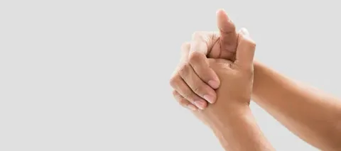

# Щелканье суставами: вредная привычка или безобидная особенность?

Привычка хрустеть пальцами, шеей или позвоночником знакома многим. Кто-то делает это для снятия напряжения, кто-то — просто от скуки или нервного тика. Вокруг этого явления ходит множество мифов: одни утверждают, что это неизбежно приведет к артриту, другие — что в этом нет ничего страшного. Где же правда? В этой статье мы разберемся с физиологией процесса, рассмотрим возможные последствия и выясним, когда щелканье суставами действительно может навредить.

---

## Почему суставы щелкают?

Чтобы понять возможный вред, нужно сначала разобраться в природе звука. Суставы — это подвижные соединения костей, заключенные в суставную капсулу, заполненную синовиальной жидкостью (естественная "смазка" сустава). Звук может возникать по разным причинам:

### 1. Физиологические (безопасные) причины
*   **Кавитация (образование газовых пузырьков):** Это самая частая причина хруста, особенно в пальцах. При резком растяжении суставной капсулы давление в синовиальной жидкости падает, и растворенные в ней газы (азот, кислород) образуют пузырьки, которые с характерным щелчком лопаются или схлопываются. После этого требуется время (15–20 минут), чтобы газы снова растворились — именно поэтому повторно щелкнуть тем же пальцем сразу не получится.
*   **Движение связок и сухожилий:** При движении сухожилие может соскальзывать с костного выступа и возвращаться на место, издавая звук. Это часто происходит в голеностопе или колене.
*   **Физиологические особенности:** Иногда звук возникает, если связки от природы немного длиннее или слабее (гипермобильность).

### 2. Патологические причины
Иногда хруст является симптомом проблем с опорно-двигательным аппаратом. В этом случае щелчки обычно сопровождаются болью, отеком или скованностью:
*   **Артроз:** Износ хрящевой ткани.
*   **Воспаление (артрит, бурсит, тендинит):** Отекшие ткани могут задевать костные структуры.
*   **Нестабильность сустава:** Последствие травм (растяжений, вывихов).

---

## Мифы и реальность: чем грозит привычка хрустеть?

### Миф 1: Хруст пальцами обязательно приведет к артриту
**Реальность:** Это самый популярный миф. Многочисленные исследования, в том числе знаменитый эксперимент доктора Дональда Унгера, который 60 лет хрустел пальцами только на левой руке, не выявили связи между этой привычкой и развитием артрита. Артрит — это воспалительное или аутоиммунное заболевание, а не результат механического воздействия.

### Миф 2: Это расширяет суставы и делает пальцы толстыми
**Реальность:** Длительное намеренное растяжение капсулы сустава теоретически может привести к некоторой нестабильности связочного аппарата и снижению силы сжатия кисти, но визуального изменения формы или "разбалтывания" сустава, ведущего к инвалидности, не происходит.

### Реальный вред и риски
Хотя прямой связи с артритом нет, полностью безобидной эту привычку назвать нельзя:

1.  **Снижение силы хвата:** Исследования показывают, что у людей с многолетней привычкой хрустеть пальцами может наблюдаться отек суставной капсулы и незначительное снижение силы сжатия кисти.
2.  **Нестабильность:** Постоянное растяжение связок (особенно если вы хрустите с усилием) может сделать их более эластичными, чем нужно. Это приводит к микронестабильности, которая со временем повышает риск вывихов и подвывихов.
3.  **Привычка и психологический аспект:** Часто щелканье суставами становится навязчивым действием, ритуалом для снятия тревоги. Это может перерасти в невротическую привычку, от которой сложно избавиться.
4.  **Хруст в шее — зона особого риска:** Самостоятельное и резкое вращение или "хруст" шеи (особенно с помощью рук) крайне опасно! Это может привести к защемлению позвоночной артерии (что грозит инсультом) или серьезному повреждению шейных позвонков.

---

## Когда стоит бить тревогу?

Если хруст в суставах сопровождается следующими симптомами, необходимо обратиться к врачу (ортопеду или неврологу):
*   **Боль** в момент щелчка или после него.
*   **Отек, припухлость, покраснение** кожи в области сустава.
*   **Скованность:** Сустав "заклинивает" или его подвижность ограничена.
*   **Нестабильность:** Ощущение, что сустав "выскакивает" или "ходит ходуном".
*   Хруст возникает **всегда** при определенном движении (например, в колене при приседании).

В этих случаях звук может указывать на трущиеся друг о друга кости из-за истончения хряща (артроз) или на воспалительный процесс.

---

## Как избавиться от привычки хрустеть?

Если вы хотите бросить щелкать суставами (из эстетических соображений или опасений за здоровье), можно попробовать следующие методы:

1.  **Заменить привычку:** Когда хочется похрустеть, займите руки чем-то другим: покрутите ручку, сожмите эспандер, перебирайте четки.
2.  **Снять напряжение:** Часто хрустят, чтобы снять мышечный спазм. Попробуйте альтернативные способы: самомассаж кистей, теплые ванночки для рук, легкая растяжка без хруста.
3.  **Осознанность:** Старайтесь ловить себя на моменте, когда рука тянется к пальцам. Ведение дневника привычек помогает контролировать автоматические действия.
4.  **Физическая активность:** Укрепление мышечного корсета (спорта, плавание) снижает нагрузку на суставы и уменьшает желание их "разминать".

---

## Заключение

Само по себе щелканье суставами (особенно пальцами) не является прямой дорогой к артриту или инвалидности. Это скорее физиологическая особенность или вредная привычка. Однако это не значит, что она абсолютно безопасна: возможны микротравмы связок и снижение силы хвата. Главное правило — прислушиваться к своему телу. Если хруст безболезненный и не вызывает дискомфорта — скорее всего, беспокоиться не о чем. Но если появляется боль, отек или нестабильность — это повод для визита к специалисту. А вот с шеей экспериментировать не стоит — резкие движения в этой области могут быть по-настоящему опасны.

---
Авторы: Мустафаев Алим

*При создании статьи использованы нейросети: DeepSeek*