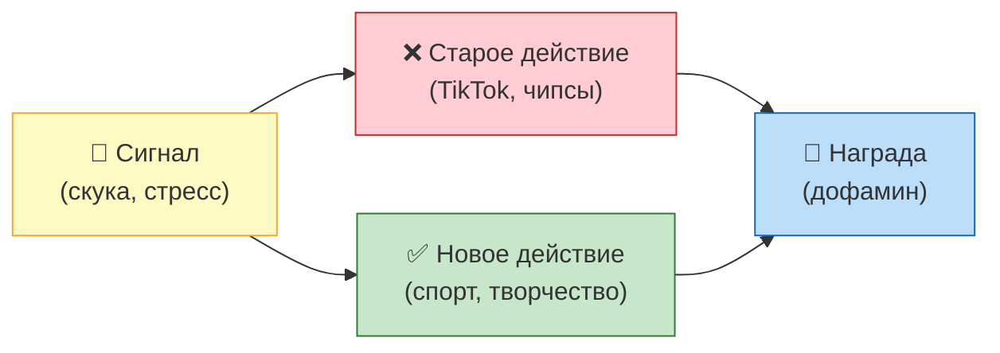
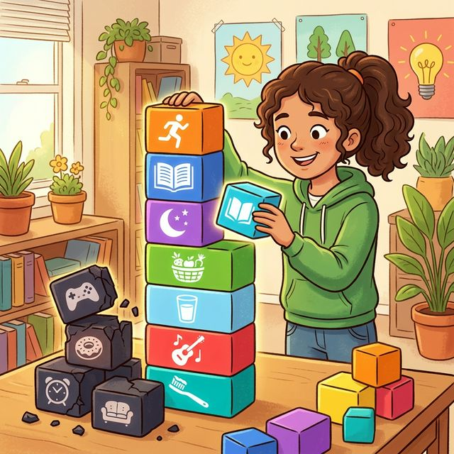

# Профилактика вредных привычек: как сформировать полезные привычки

Ты прочитал (или можешь прочитать) все предыдущие статьи этого раздела. Теперь ты знаешь, как работает [дофаминовая петля](Dopamine.md), что делают [наркотики](myths_about_soft_drugs.md) с мозгом, почему экраны крадут сон, а [фастфуд](fastfud_i_pischevoy_musor.md) — здоровье. Знание — это оружие. Но **знать** и **делать** — разные вещи.

Эта статья — не про «не делай плохого». Она про то, **как делать хорошее**. Потому что лучший способ избавиться от вредной привычки — **заменить её полезной**.

---

## Почему «просто бросить» не работает

Многие думают: вредная привычка — это слабость. Надо просто собрать волю в кулак — и бросить. Не смотри телефон. Не ешь чипсы. Не сиди допоздна. Просто прекрати.

Звучит логично. Но это не работает. И вот почему.

### Пустое место не бывает пустым

Привычка — это **нейронная дорожка** в мозге. Когда ты повторяешь действие много раз, мозг прокладывает «автобан» между стимулом и реакцией. Быстро, без усилий, на автопилоте.

Когда ты просто «бросаешь» привычку, ты оставляешь нейронный автобан на месте. Он никуда не делся. При первом же стрессе, скуке или усталости мозг побежит по старой дорожке — потому что другой нет.

**Решение:** не ломать дорогу, а **построить новую, более привлекательную**. Чтобы мозгу было куда бежать.

### Сила воли — ресурс ограниченный

Психолог Рой Баумайстер провёл десятки экспериментов и доказал: **сила воли работает как мышца** — она устаёт. Утром ты полон решимости, к вечеру — опустошён. Именно поэтому все срывы происходят вечером: [сигарету](smoking.md) курят после трудного дня, телефон берут перед сном, чипсы едят, когда устал.

Если твой план — «буду терпеть», ты проиграешь. Потому что терпение кончается. **Нужна система, которая работает без силы воли.**

---

## Как формируются привычки: Петля привычки

Чарльз Дахигг (журналист и исследователь) описал формулу любой привычки. Она состоит из трёх элементов:

**Сигнал → Действие → Награда**

Примеры:

| Сигнал | Действие | Награда |
| :--- | :--- | :--- |
| Скука | Открыл TikTok | Дофамин от смешных видео |
| Стресс | Съел шоколадку | Кратковременное облегчение |
| Увидел лавочку | Закурил | Никотиновый «расслабон» |
| Пришёл домой | Лёг на диван | Ощущение отдыха |

**Ключевой инсайт:** чтобы изменить привычку, не надо менять сигнал (ты не можешь перестать скучать) и не надо менять награду (мозгу нужно удовольствие). Нужно **подменить действие** — вставить между сигналом и наградой другой, полезный маршрут.

### Пример замены

| Сигнал | Старое действие | Новое действие | Награда (та же!) |
| :--- | :--- | :--- | :--- |
| Скука | TikTok | 15 минут рисования/гитары | Удовольствие от творчества |
| Стресс | Шоколадка | 20 приседаний + стакан воды | Снятие напряжения (эндорфины) |
| Пришёл домой | Диван + телефон | 10 мин прогулка + душ | Расслабление |

Заметь: новое действие должно давать **реальную награду**, иначе мозг не купится. «Почитай учебник вместо TikTok» — не сработает, потому что учебник не даёт дофамин. А вот «порисуй 15 минут» — может, потому что творчество тоже включает систему вознаграждения.

---

## Правило 21 дня — миф. Правда — сложнее

Ты наверняка слышал: «Чтобы сформировать привычку, нужен 21 день». Это красивая фраза, но учёные её опровергли.

Исследование Филиппы Лалли из Университетского колледжа Лондона показало: в среднем на формирование устойчивой привычки уходит **66 дней**. Но разброс огромный — от 18 до 254 дней, в [зависимости](how_addiction_changes_personality.md) от сложности.

* «Выпивать стакан воды утром» — 18 дней
* «Делать зарядку каждое утро» — 50–60 дней
* «Бегать по утрам» — около 80 дней

**Хорошая новость:** пропустить один день — не страшно. Исследование показало, что один «сбой» практически не влияет на формирование привычки. Главное — вернуться на следующий день. Проблема не в одном пропуске, а в **двух подряд**. После двух пропусков мозг начинает считать: «Ну, видимо, мы это больше не делаем».

---

## Метод маленьких шагов (атомные привычки)

Джеймс Клир, автор бестселлера «Атомные привычки», сформулировал главный принцип: **улучшайся на 1% каждый день**.

Звучит мало? Посчитаем. Если ты улучшаешься на 1% каждый день, за год ты станешь лучше в **37 раз**. Если ухудшаешься на 1% — за год от тебя останется **3%** от прежнего уровня.

### Четыре закона формирования привычки (по Клиру)

**1. Сделай это очевидным.**
Хочешь пить больше воды — поставь бутылку на стол, где ты работаешь. Хочешь читать перед сном — положи книгу на подушку. Хочешь заниматься спортом — положи форму рядом с кроватью с вечера. Убери барьеры.

**2. Сделай это привлекательным.**
Привяжи новую привычку к чему-то приятному. «После зарядки я включаю любимую музыку». «После 30 минут учёбы — 10 минут YouTube». Мозг должен предвкушать не наказание, а награду.

**3. Сделай это лёгким.**
Начни с версии привычки настолько маленькой, что отказаться невозможно. Хочешь бегать? Начни с того, что просто **надеваешь кроссовки и выходишь за дверь**. Всё. Первую неделю можешь даже не бежать — просто выйди. Мозг привыкнет к ритуалу, а дальше добавишь нагрузку.

**4. Сделай это удовлетворяющим.**
Веди трекер привычек — простую табличку, где ставишь галочку каждый день. Серия из 7 галочек подряд — это маленькая победа, которая мотивирует не разрывать цепочку.

---

## Окружение решает больше, чем сила воли

Вот факт, который многие недооценивают: **ты — среднее арифметическое пяти людей, с которыми проводишь больше всего времени**.

Если твои друзья курят — вероятность того, что ты закуришь, возрастает на **61%** (исследование, опубликованное в *New England Journal of Medicine*). Если твои друзья занимаются спортом — ты тоже начнёшь.

Это не слабость. Это **зеркальные нейроны** — мозг буквально копирует поведение окружающих. Мы социальные существа, и наш мозг запрограммирован подражать стае.

**Что с этим делать:**

* Не нужно бросать друзей. Но стоит **добавить** в окружение людей, которые живут так, как ты хочешь жить.
* Запишись в секцию, клуб, волонтёрскую группу — любое сообщество, где норма = то, к чему ты стремишься.
* Если друзья давят — перечитай статью «Давление сверстников». Уметь говорить «нет» — это суперсила, а не слабость.

---

## Стресс: главный враг хороших привычек

Почти все срывы происходят под давлением стресса. Экзамены, ссоры с родителями, конфликты с друзьями — и ты возвращаешься к старому: телефон, еда, сигарета.

Это не баг, это **защитный механизм**: мозг ищет самый быстрый способ снять напряжение. И если «быстрый путь» — вредная привычка, он побежит по ней.

**Как прервать цикл:**

1. **Физическая разрядка.** Стресс — это адреналин в крови. Тело готовится «бить или бежать». Сделай 30 приседаний, пробегись по лестнице, побей подушку. Адреналин сгорит, и ты сможешь думать.
2. **Дыхание 4-7-8.** Вдох на 4 секунды → задержка на 7 → выдох на 8. Повтори 4 раза. Это активирует парасимпатическую нервную систему и буквально снижает пульс.
3. **Правило 10 минут.** Когда тянет к вредной привычке — скажи себе: «Подожду 10 минут». Просто 10 минут. Импульс — это волна: она поднимается, достигает пика и **спадает**. Через 10 минут желание будет в 2–3 раза слабее.
4. **Поговори вслух.** Позвони другу, расскажи маме, запиши голосовое самому себе. Когда ты проговариваешь стресс — он теряет власть. Это доказано: вербализация снижает активность **миндалевидного тела** (центр [тревоги](Doomscrolling.md) в мозге) на 30%.

---

## Чек-лист: твой план на первую неделю

| День | Задача |
| :--- | :--- |
| **Пн** | Выбери одну привычку, которую хочешь внедрить. Только одну! |
| **Вт** | Найди сигнал (когда?) и награду (что приятного после?). Запиши |
| **Ср** | Начни с самой маленькой версии. Подготовь всё заранее |
| **Чт** | Сделай. Поставь галочку в трекере |
| **Пт** | Сделай снова. Две галочки подряд. Уже цепочка! |
| **Сб** | Сделай. Три. Замечаешь, как мозг начинает ожидать ритуал? |
| **Вс** | Подведи итог. Что получилось, что нет. Скорректируй, если нужно |

Через неделю — добавь вторую привычку. Через месяц у тебя будет 4 новые привычки. Через три месяца — это уже другой ты.

---

## Навык отказа: как говорить «нет» и не чувствовать себя странным

Профилактика — это не только про «добавить хорошее». Это ещё про **умение отказаться от плохого**, когда тебе его предлагают.

Вот три техники, которые работают:

### 1. «Я не делаю это» вместо «Я не могу»

Исследование из *Journal of Consumer Research* показало: люди, которые говорят **«Я не ем сладкое»** вместо **«Я не могу есть сладкое»**, в 2 раза реже срываются. Почему? «Не могу» = внешнее ограничение, которое хочется нарушить. «Не делаю» = часть твоей личности. Ты не жертва — ты хозяин своих решений.

Примеры:
* «Я не курю» (а не «мне нельзя»)
* «Я не сижу в телефоне после полуночи» (а не «мама запрещает»)
* «Я не ем фастфуд по будням» (а не «я на диете»)

### 2. Сломанная пластинка

Если тебя уговаривают — просто повторяй одну и ту же фразу. Спокойно, без оправданий и объяснений.

— «Давай покурим?»
— «Нет, спасибо».
— «Да ладно, один раз!»
— «Нет, спасибо».
— «Ты чё, маменькин сынок?»
— «Нет, спасибо».

Это работает, потому что ты не вступаешь в спор. Нет аргументов — не за что зацепиться. Обычно после третьего «нет» люди отстают.

### 3. Предложи альтернативу

— «Пойдём попьём [пива](alcohol.md)?»
— «Не, давай лучше в баскетбол? / в кино? / погуляем?»

Ты не отказываешь от **общения** — ты отказываешь от **конкретного действия**. Это важная разница. Ты остаёшься «своим», но на своих условиях.

---

## Главная идея: ты — это то, что ты делаешь каждый день

Не разово. Не когда вдохновение. Не когда «есть настроение». **Каждый день.**

Один бургер не сделает тебя толстым. Одна пробежка не сделает тебя атлетом. Одна сигарета не убьёт. Одна книга не сделает гением.

Но **100 бургеров, 100 пробежек, 100 сигарет, 100 книг** — сделают. Привычки — это сложный процент твоей жизни. Маленькие действия, повторённые тысячу раз, определяют, кто ты.

> **Важный вывод:** Ты не можешь контролировать всё, что с тобой происходит. Но ты можешь выбрать, какие привычки строить. А привычки, в конечном счёте, строят тебя. Начни с одной маленькой. Сегодня.

---

**Автор:** Пономарев Артем

**Нейронные сети, использованные при создании статьи:** Claude (Anthropic)
