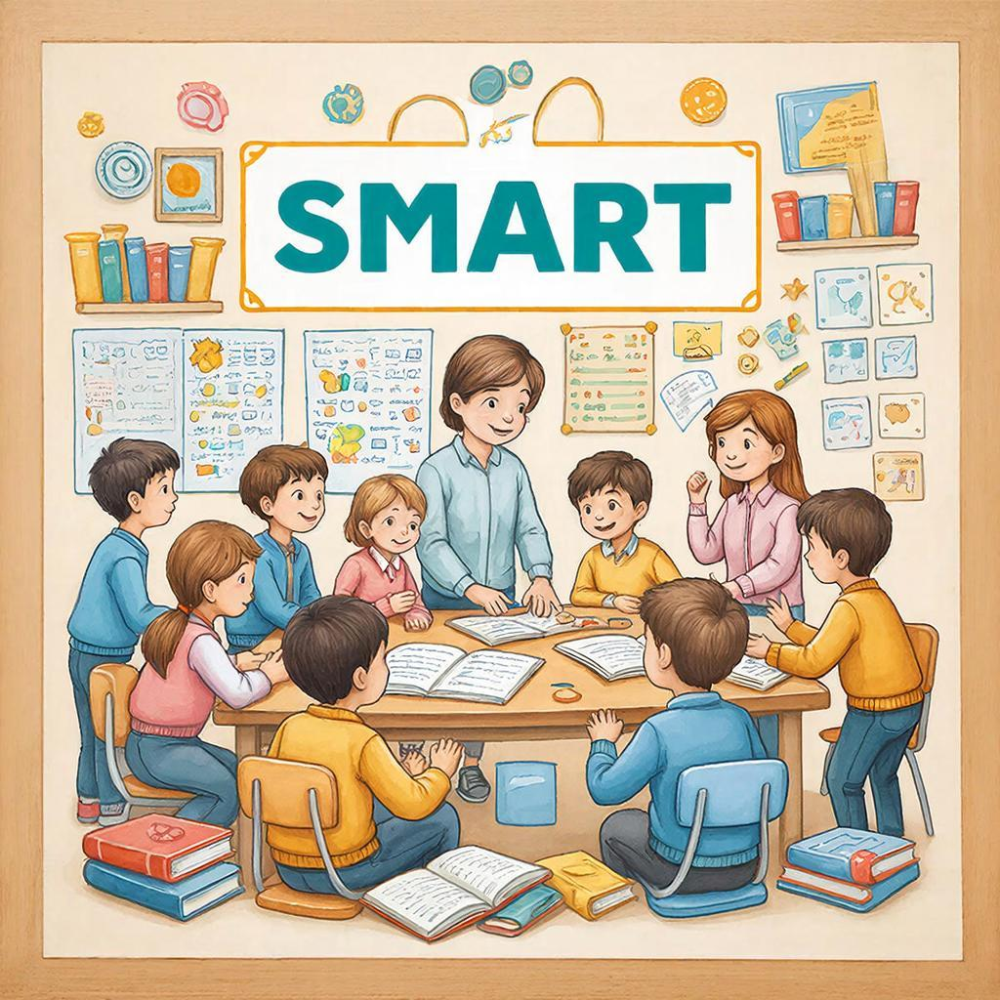

# Цели обучения: как ставить правильные задачи для успеха в учёбе

Учение без цели — как корабль без руля: плывёт, но не знает куда. Правильно поставленная цель помогает понять, зачем вы учитесь, что именно нужно изучить и как понять, что результат достигнут. В этой статье мы разберём, как формулировать цели обучения так, чтобы они вдохновляли и помогали добиваться успеха.

---

## Что такое цель обучения?

**Цель обучения** — это конкретный результат, которого вы хотите достичь в процессе учёбы. Она отвечает на вопросы: «Что я хочу узнать?», «Зачем мне это нужно?» и «Как я пойму, что научился?».

Например:
- ❌ Плохая цель: «Хочу знать математику» (слишком размыто)
- ✅ Хорошая цель: «Научусь решать квадратные уравнения за 2 недели» (конкретно и измеримо)

---

## Почему важно ставить цели?

Цели помогают мозгу сфокусироваться. Когда вы точно знаете, чего хотите, вам легче:
- Выбирать нужную информацию и отбрасывать лишнее
- Замечать свой прогресс
- Сохранять [мотивацию](./motivaciya.md), даже когда трудно
- Планировать время и ресурсы

Исследования показывают, что ученики, которые ставят конкретные цели, учатся на 30% эффективнее!

---

## Как формулировать цели: правило SMART

Хорошая цель должна соответствовать критерию **SMART**:

| Буква | Расшифровка | Пример |
|-------|-------------|--------|
| **S** (Specific) | Конкретная | «Научусь писать эссе на английском» |
| **M** (Measurable) | Измеримая | «Напишу 5 эссе без ошибок» |
| **A** (Achievable) | Достижимая | «За месяц, занимаясь 3 раза в неделю» |
| **R** (Relevant) | Значимая | «Чтобы поехать на летние курсы в Лондон» |
| **T** (Time-bound) | Ограниченная по времени | «К 1 июня» |

---

## Виды учебных целей

### 1. Цели по знаниям
Хочу узнать новую информацию:
- «Изучу 50 новых английских слов»
- «Узнаю, как работает фотосинтез»

### 2. Цели по навыкам
Хочу научиться что-то делать:
- «Научусь играть аккорды на гитаре»
- «Освою слепой метод печати»

### 3. Цели по пониманию
Хочу глубже разобраться в теме:
- «Пойму, почему происходит смена времён года»
- «Разберусь, как работает экономика»

---

## Пример постановки цели для школьника

**Ситуация:** Ученик 7 класса хочет улучшить оценки по физике.

❌ **Плохая цель:** «Хочу лучше знать физику»

✅ **Правильная цель по SMART:**
> «К концу четверти (2 месяца) я подниму оценку по физике с 3 до 4. Для этого буду решать 5 задач после каждого урока и раз в неделю смотреть объясняющие видео на YouTube. В конце каждой недели буду делать самопроверку по пройденным темам.»

Эта цель:
- Конкретная (поднять оценку с 3 до 4)
- Измеримая (оценка в журнале)
- Достижимая (5 задач + видео — реально)
- Значимая (лучше понимать предмет)
- Ограниченная по времени (к концу четверти)

---

## Как разбивать большие цели на маленькие

Большие цели пугают. Маленькие — вдохновляют! Используйте технику «Декомпозиция»:

**Большая цель:** «Выучить английский на уровень B1 за год»

**Маленькие шаги:**
1. Месяц 1–2: выучить 500 базовых слов
2. Месяц 3–4: освоить базовую грамматику (времена Present, Past, Future)
3. Месяц 5–6: научиться понимать простую речь на слух
4. Месяц 7–8: начать говорить на простые темы
5. Месяц 9–10: читать адаптированные книги
6. Месяц 11–12: смотреть фильмы с субтитрами

Каждый маленький шаг — это тоже цель, со своим сроком и результатом.

---

## Частые ошибки при постановке целей

| Ошибка | Почему плохо | Как исправить |
|--------|--------------|---------------|
| Слишком общая цель | Непонятно, что делать | Сделать конкретнее |
| Нереалистичный срок | Ведёт к выгоранию | Оценить свои силы честно |
| Отсутствие плана | Цель остаётся мечтой | Расписать шаги |
| Чужие цели | Нет внутренней мотивации | Спросить себя: «Зачем это МНЕ?» |
| Нет отслеживания | Непонятно, есть ли прогресс | Вести дневник успеха |

---

## Практические советы

1. **Записывайте цели** — на бумаге или в приложении. Записанное = обещанное себе.

2. **Визуализируйте результат** — представьте, как вы используете новые знания. Например: «Я свободно говорю с иностранцем в путешествии».

3. **Делитесь целями** — расскажите друзьям или родителям. Поддержка помогает не сдаваться.

4. **Проверяйте прогресс** — раз в неделю спрашивайте себя: «Что я сделал на этой неделе для своей цели?»

5. **Хвалите себя** — за каждый маленький шаг. Мозг любит награды!

---

## Связь с другими понятиями

Постановка целей тесно связана с:
- [Мотивацией](./motivaciya.md) — цели дают направление
- [Тайм-менеджментом](time_management.md) — помогают планировать время
- [Самоанализом](self_reflection.md) — позволяют оценивать прогресс
- [Мышлением роста](growth_mindset.md) — вера в то, что цели достижимы

---

## Интересный факт

Американские исследователи провели эксперимент: группа студентов, которая записывала свои учебные цели, показала результаты на 42% выше, чем группа, которая просто «хотела учиться лучше». Записывание целей активирует в мозге центры планирования и самоконтроля!

---

## См. также

- [Мотивация](./motivaciya.md)
- [Тайм-менеджмент](time_management.md)
- [Самоанализ](self_reflection.md)
- [Мышление роста](growth_mindset.md)
- [Цели](https://ru.wikipedia.org/wiki/Цель)

---

Цели — это карта вашего учебного путешествия. Без неё легко заблудиться. С ней — вы точно знаете, куда идёте и как туда добраться. Ставьте правильные цели, и учёба станет осмысленной, интересной и эффективной!

---
Авторы: Команда по эффективному обучению;  
Ресурсы: LLM - GigaChat, Wikidata Q1494068
