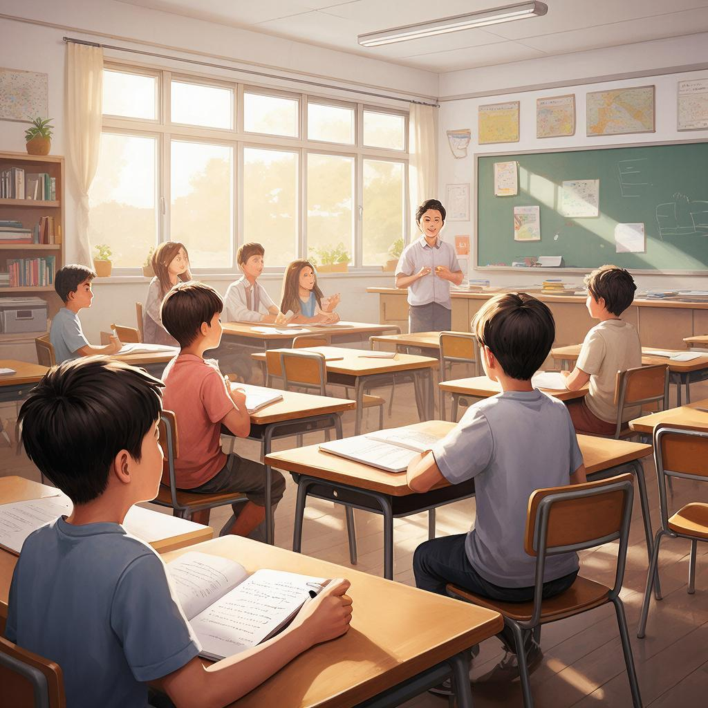

# Искусство конспектирования: методы записи информации для лучшего запоминания



«Самая бледная чернила лучше самой яркой памяти» — говорили древние китайцы. Конспектирование — это не просто переписывание текста. Это **искусство превращать чужие мысли в свои знания**. Правильный конспект экономит часы на повторении и помогает запоминать надолго.

---

## Что такое конспект?

**Конспект** (от лат. *conspectus* — обзор) — это краткая запись основной информации, полученной из книги, лекции, видео или другого источника.

**Хороший конспект:**
- ✅ Содержит только главное
- ✅ Понятен без исходного текста
- ✅ Структурирован и логичен
- ✅ Легко повторять перед контрольной
- ✅ Содержит ваши мысли и вопросы

**Плохой конспект:**
- ❌ Переписывает всё подряд
- ❌ Непонятен без оригинала
- ❌ Хаотичный, без структуры
- ❌ Невозможно найти важное
- ❌ Просто копия чужих слов

---

## Зачем вообще конспектировать?

### 1. Лучшее понимание

Когда вы записываете своими словами, мозг:
- Обрабатывает информацию
- Выделяет главное
- Отбрасывает лишнее
- Связывает с известным

**Исследование:** Студенты, которые ведут конспекты от руки, понимают материал на **40% лучше**, чем те, кто просто слушает.

---

### 2. Долговременная память

Процесс записи создаёт дополнительные нейронные связи:
- 👁️ Визуально видите структуру
- ✋ Физически пишете (моторная память)
- 🧠 Осмысливаете материал
- 📝 Создаёте «якоря» для воспоминаний

---

### 3. Экономия времени

Хороший конспект = готовый материал для повторения:
- Перед контрольной: 30 минут вместо 3 часов
- Через месяц: всё ещё понятно
- Через год: основные идеи свежи в памяти

---

### 4. Развитие навыков

Конспектирование развивает:
- 🎯 Умение выделять главное
- 📐 Структурное мышление
- ✍️ Навык краткого изложения
- 🔗 Способность связывать идеи

---

## Основные методы конспектирования

### Метод 1: Cornell (Корнелл)

**Структура:**

```
┌──────────────────────────────────────────────┐
│  ВОПРОСЫ / КЛЮЧЕВЫЕ СЛОВА    │  ОСНОВНОЙ    │
│  (правая узкая колонка, 1/3) │  КОНСПЕКТ    │
│                              │  (левая часть,│
│  ? Как работает фотосинтез?  │   2/3)       │
│  ? Какие этапы?              │              │
│                              │  Фотосинтез —│
│                              │  процесс     │
│                              │  создания    │
│                              │  растениями  │
│                              │  органических│
│                              │  веществ...  │
├──────────────────────────────────────────────┤
│  РЕЗЮМЕ (2-3 предложения, нижняя строка)     │
│  Растения превращают свет, воду и CO2 в      │
│  сахар и кислород. Происходит в хлоропластах│
│  в несколько этапов.                         │
└──────────────────────────────────────────────┘
```

**Как использовать:**
1. Разделите лист на 3 части
2. Справа: ключевые слова, вопросы (после лекции/чтения)
3. Слева: основной конспект (во время)
4. Внизу: резюме (после)

**Плюсы:**
- ✅ Всё на одном листе
- ✅ Удобно для самопроверки (закройте левую часть, ответьте на вопросы)
- ✅ Есть резюме для быстрого повторения

**Минусы:**
- ⚠️ Нужно привыкнуть к структуре
- ⚠️ Не подходит для очень объёмных тем

**Для чего лучше:** Лекции, учебные тексты, доклады

---

### Метод 2: Mind Map (Интеллект-карта)

**Структура:**

```
                    ┌─ Ветвь 1.1
               ┌────┴─ Ветвь 1.2
          ┌────┤      └─ Ветвь 1.3
     ┌────┤      ┌─ Ветвь 2.1
ЦЕНТР─┤      ┌────┴─ Ветвь 2.2
     └────┤      └─ Ветвь 2.3
          └────┬─ Ветвь 3.1
               └────┬─ Ветвь 3.2
                    └─ Ветвь 3.3
```

**Как использовать:**
1. В центре: главная тема (крупно, с картинкой)
2. Ветви 1 уровня: основные разделы
3. Ветви 2-3 уровня: детали, примеры
4. Используйте цвета, картинки, символы

**Плюсы:**
- ✅ Визуально, легко запоминать
- ✅ Видны связи между идеями
- ✅ Творческий подход
- ✅ Всё на одной странице

**Минусы:**
- ⚠️ Сложно для очень детальных тем
- ⚠️ Требует места (лучше на большом листе)

**Для чего лучше:** Мозговые штурмы, планирование, творческие проекты, повторение

**Приложения:** XMind, MindMeister, FreeMind

---

### Метод 3: Outline (Структурный план)

**Структура:**

```
I. Главная тема
   A. Подтема 1
      1. Деталь 1
      2. Деталь 2
         a. Пример
         b. Пример
   B. Подтема 2
      1. Деталь 1
      2. Деталь 2
II. Вторая главная тема
   A. Подтема 1
   B. Подтема 2
```

**Как использовать:**
1. Используйте римские цифры (I, II, III) для главных разделов
2. Заглавные буквы (A, B, C) для подтем
3. Арабские цифры (1, 2, 3) для деталей
4. Строчные буквы (a, b, c) для примеров

**Плюсы:**
- ✅ Чёткая иерархия
- ✅ Легко добавлять новое
- ✅ Подходит для любых тем
- ✅ Легко превратить в эссе/доклад

**Минусы:**
- ⚠️ Может быть скучновато
- ⚠️ Менее наглядно, чем Mind Map

**Для чего лучше:** Лекции, статьи, книги, подготовка к экзаменам

---

### Метод 4: Таблицы и матрицы

**Структура:**

| Понятие | Определение | Пример | Особенности |
|---------|-------------|--------|-------------|
| Фотосинтез | Создание органики из света | Растения | Требует хлорофилл |
| Дыхание | Расщепление органики | Животные | Выделяет CO2 |

**Как использовать:**
1. Определите категории для сравнения
2. Заполняйте по мере чтения/слушания
3. Используйте для сравнения понятий

**Плюсы:**
- ✅ Наглядное сравнение
- ✅ Всё в одном месте
- ✅ Легко повторять
- ✅ Видны различия и сходства

**Минусы:**
- ⚠️ Не подходит для повествовательных текстов
- ⚠️ Нужно заранее знать категории

**Для чего лучше:** Сравнение понятий, классификации, характеристики

---

### Метод 5: Блок-схемы и диаграммы

**Структура:**

```
┌─────────┐     ┌─────────┐     ┌─────────┐
│  Начало │────▶│ Процесс │────▶│ Результат│
└─────────┘     └─────────┘     └─────────┘
                     │
                     ▼
               ┌─────────┐
               │  Выход  │
               └─────────┘
```

**Как использовать:**
1. Определите этапы процесса
2. Нарисуйте блоки для каждого этапа
3. Соедините стрелками
4. Добавьте условия (да/нет)

**Плюсы:**
- ✅ Идеально для процессов
- ✅ Видна последовательность
- ✅ Легко понять алгоритм

**Минусы:**
- ⚠️ Только для процессов и алгоритмов
- ⚠️ Требует времени на рисование

**Для чего лучше:** Алгоритмы, процессы, циклы, причинно-следственные связи

---

## Конспектирование от руки vs на компьютере

### От руки ✍️

**Плюсы:**
- ✅ Лучше запоминается (моторная память)
- ✅ Меньше отвлекающих факторов
- ✅ Можно рисовать схемы, стрелочки
- ✅ Свобода форматирования
- ✅ Нет соблазна скопировать всё подряд

**Минусы:**
- ⚠️ Медленнее
- ⚠️ Сложно редактировать
- ⚠️ Легко потерять
- ⚠️ Трудно искать

---

### На компьютере ⌨️

**Плюсы:**
- ✅ Быстрее (особенно если быстро печатаете)
- ✅ Легко редактировать
- ✅ Поиск по тексту
- ✅ Облачное хранение (не потеряется)
- ✅ Можно вставлять картинки, ссылки

**Минусы:**
- ⚠️ Легко отвлечься (соцсети, игры)
- ⚠️ Соблазн копировать, а не осмысливать
- ⚠️ Меньше вовлечённости

---

### Лучший подход: **Гибридный**

1. **На лекции/при чтении:** От руки (лучше запоминается)
2. **После:** Перепечатать в цифровой вид (структурировать, дополнить)
3. **Хранить:** В облаке (Notion, Evernote, OneNote)
4. **Повторять:** По цифровому конспекту

---

## Правила эффективного конспектирования

### ✅ До начала:

1. **Подготовьте инструменты:**
   - Тетрадь/блокнот (лучше в точку или клетку)
   - Ручки разных цветов
   - Линейка, карандаш
   - Или ноутбук/планшет

2. **Настройтесь:**
   - Определите цель (зачем конспектируете?)
   - Просмотрите структуру (оглавление, план)
   - Сформулируйте вопросы (что хотите узнать?)

---

### ✅ Во время:

1. **Слушайте/читайте активно:**
   - Не записывайте всё подряд
   - Выделяйте главное
   - Пропускайте воду, примеры (если понятны)

2. **Используйте сокращения:**
   - т.е. (то есть)
   - напр. (например)
   - → (следовательно, ведёт к)
   - ↑↓ (увеличение/уменьшение)
   - ∴ (поэтому)

3. **Делайте пометки на полях:**
   - ❓ — вопрос, уточнить
   - ⭐ — важно, выучить
   - → — связь с другой темой
   - ! — интересно, необычно

4. **Оставляйте место:**
   - Между разделами
   - На полях для дополнений
   - Внизу для резюме

---

### ✅ После:

1. **Обработайте в течение 24 часов:**
   - Расшифруйте сокращения
   - Заполните пробелы
   - Добавьте цвета, выделения
   - Нарисуйте схемы

2. **Составьте резюме:**
   - 2-3 предложения — главная идея
   - 5-10 ключевых слов
   - 1-2 вопроса для самопроверки

3. **Свяжите с известным:**
   - «Это похоже на...»
   - «Раньше я думал..., а теперь...»
   - «Это объясняет...»

---

## Частые ошибки

| Ошибка | Почему это плохо | Как исправить |
|--------|------------------|---------------|
| **Переписывание всего** | Нет осмысления, просто механика | Выделяйте только главное, своими словами |
| **Без структуры** | Невозможно найти важное | Используйте один из методов (Cornell, Outline...) |
| **Нет обработки** | Через неделю непонятно | Обрабатывайте в течение 24 часов |
| **Один цвет** | Невозможно выделить важное | Используйте 2-3 цвета |
| **Нет вопросов** | Пассивное потребление | Задавайте вопросы, пишите на полях |
| **Копирование с доски** | Не успеваете осмыслить | Слушайте, понимайте, потом записывайте |

---

## Связь с другими понятиями

Конспектирование связано с:
- [Навыками чтения](reading_skills.md) — выделение главного в тексте
- [Памятью](./pamyat.md) — лучшее запоминание через запись
- [Визуализацией](./vizualizaciya.md) — схемы, карты ума
- [Самопроверкой](./samoproverka.md) — вопросы в конспекте

---

## Практические упражнения

### Упражнение 1: «Метод недели»

Неделя 1: Cornell  
Неделя 2: Mind Map  
Неделя 3: Outline  
Неделя 4: Таблицы

В конце месяца выберите любимый метод.

---

### Упражнение 2: «Конспект за 5 минут»

Возьмите короткую статью (1-2 страницы). Поставьте таймер на 5 минут. Сделайте конспект. Сравните с оригиналом: всё ли главное captured?

---

### Упражнение 3: «Перевод в схему»

Возьмите свой текстовый конспект. Переведите его в Mind Map или блок-схему. Что получилось нагляднее?

---

### Упражнение 4: «Конспект с вопросами»

Ведите конспект так, чтобы на каждое утверждение приходился один вопрос. Через неделю ответьте на вопросы без подглядывания.

---

## Интересные факты

1. **Леонардо да Винчи** вёл конспекты зеркальным письмом (справа налево). Его записи полны схем, рисунков и заметок на полях — прообраз современных Mind Map.

2. Исследование **Princeton University**: студенты, ведущие конспекты от руки, сдают экзамены на **30% лучше**, чем те, кто печатает на ноутбуке.

3. **Ричард Фейнман** использовал простой метод: «Если не можешь объяснить это на одном листе — ты не понял». Его конспекты всегда были краткими и содержательными.

4. В **Гарварде** всех студентов учат методу Cornell на первом курсе. Это обязательный навык.

5. Самый старый сохранившийся конспект датируется **1490 годом** — записи Леонардо да Винчи о полёте птиц.

---

## См. также

- [Навыки чтения](reading_skills.md)
- [Память](./pamyat.md)
- [Визуализация](./vizualizaciya.md)
- [Самопроверка](./samoproverka.md)
- [Цифровые инструменты](digital_tools.md)

---

Помните: конспект — это не копия чужих мыслей. Это **ваше понимание**, оформленное так, чтобы через месяц (или год) вы могли быстро вспомнить главное.

**Ваш челлендж:** На следующей лекции или при чтении параграфа попробуйте метод Cornell. Через 24 часа обработайте конспект. Через неделю повторьте по нему. Удивитесь, насколько хорошо запомнилось!

---
Авторы: Команда по эффективному обучению;  
Ресурсы: LLM - GigaChat, Wikidata Q209729
