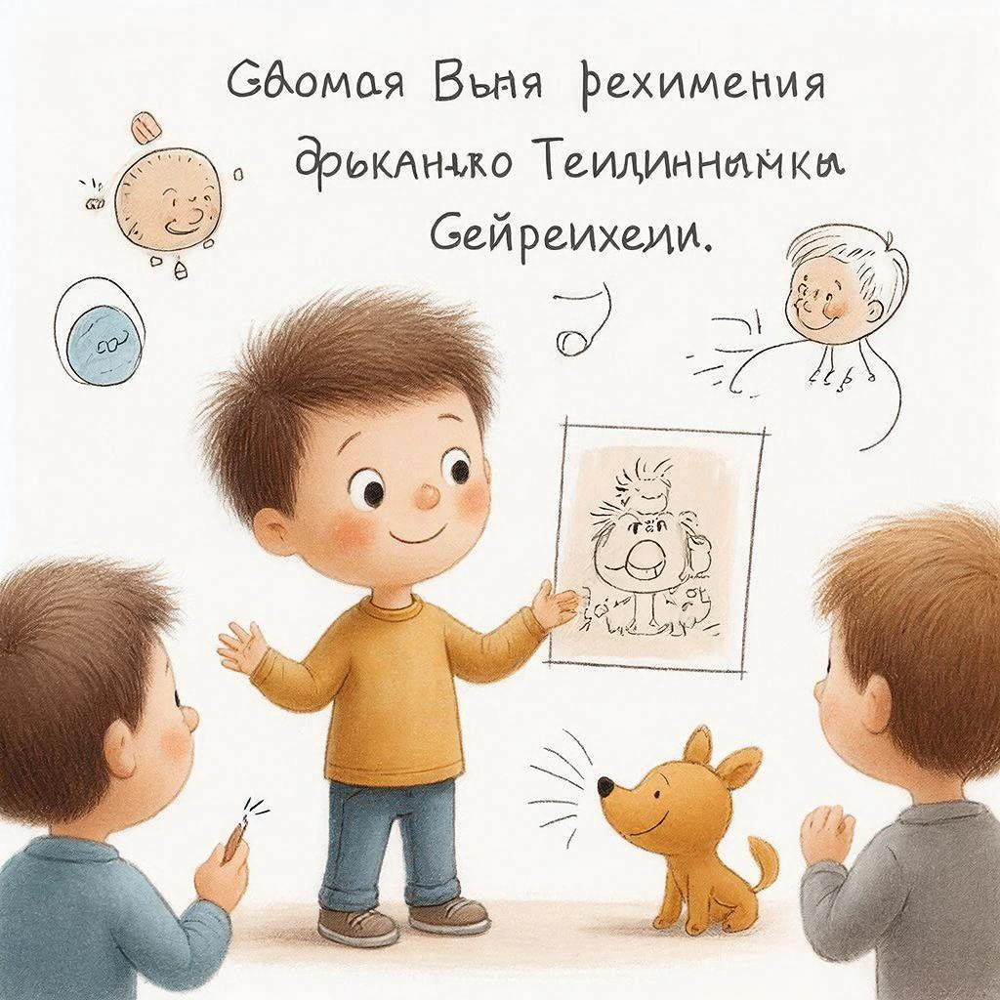

# Учить других — лучший способ учиться самому: метод Фейнмана

Вы когда-нибудь замечали: пока не попробуете объяснить тему другому, не до конца понимаете её сами? Это не случайность. **Обучение других** — мощнейший инструмент для собственного обучения. И у этого есть научное название — **метод Фейнмана**.

---

## Кто такой Ричард Фейнман?

**Ричард Фейнман** (1918-1988) — американский физик, лауреат Нобелевской премии, один из создателей квантовой электродинамики. Но известен он не только открытиями.

Фейнман был **великим учителем**. Он мог объяснить самые сложные концепции так, что их понимали даже дети. Его принцип:

> «Если вы не можете объяснить это просто, вы не понимаете это достаточно хорошо».

---

## Что такое метод Фейнмана?

**Метод Фейнмана** — это техника обучения через объяснение. Вы берёте тему, которую хотите изучить, и объясняете её так, как если бы учили **ребёнка 10 лет**.

**Почему именно 10 лет?**
- Ребёнок не знает жаргона
- Ребёнок задаёт вопрос «почему?» на каждый шаг
- Ребёнок не примет сложное объяснение
- Если ребёнок понял — вы поняли по-настоящему

---

## 4 шага метода Фейнмана

### Шаг 1: Выберите тему и изучите

Возьмите тему, которую хотите понять. Прочитайте учебник, конспект, статью. Сделайте пометки.

**Пример:** «Фотосинтез»

---

### Шаг 2: Объясните ребёнку

Возьмите чистый лист бумаги. Напишите название темы. Начните объяснять своими словами, как если бы учили 10-летнего.

**Правила:**
- Простые слова, без жаргона
- Короткие предложения
- Примеры из жизни
- Аналогии и сравнения

**Пример объяснения фотосинтеза:**

> «Представь, что растение — это маленькая кухня. У него есть солнечные панели (листья), которые ловят свет. Растение берёт свет, воду из земли и воздух, и готовит из этого еду — сахар. Этим сахаром растение питается и растёт. А ещё оно выпускает кислород, которым мы дышим. Вот почему растения так важны!»

---

### Шаг 3: Найдите пробелы

Когда объясняете, вы обязательно застрянете на чём-то. «Эээ... а как именно... гм...»

**Это и есть пробелы в понимании!**

Вернитесь к учебнику. Перечитайте сложные моменты. Найдите ответы на свои «затыки».

**Пример пробела:**
- «Растение берёт воздух... а что именно из воздуха?»
- «А, точно! Углекислый газ!»
- «А как оно его берёт?»
- «Через устьица на листьях... нужно почитать об этом»

---

### Шаг 4: Упростите и используйте аналогии

Теперь, когда вы поняли все пробелы, перепишите объяснение ещё проще. Добавьте аналогии.

**Пример упрощения:**

> «Устьица — это как маленькие дверцы на листьях. Они открываются, чтобы впустить воздух, и закрываются, чтобы растение не теряло воду».

**Идеальная аналогия:** Связывает новое с тем, что ученик уже знает.

---

## Почему это работает?

### 1. Выявляет незнание

Когда просто читаете, кажется: «Понял!». Когда объясняете — сразу видно, где плаваете.

**Исследование:** Студенты, которые объясняли материал кукле (игрушке), показали результаты на **40% выше**, чем те, кто просто перечитывал.

---

### 2. Заставляет структурировать

Нельзя объяснить хаотично. Нужно:
- Выстроить логику
- Выделить главное
- Отбросить лишнее
- Связать части

Это глубокое понимание!

---

### 3. Задействует несколько каналов

Когда объясняете:
- 📖 Визуально видите структуру
- 🗣️ Проговариваете вслух
- ✍️ Записываете
- 🧠 Связываете с известным

Чем больше каналов — тем прочнее память!

---

### 4. Эмоциональная связь

Объясняя другу, вы:
- Волнуетесь, чтобы понял
- Радуетесь, когда дошло
- Ищете новые способы

Эмоции = лучшее запоминание!

---

## Кого учить?

### 1. Реальный человек

- Одноклассник, который не понял тему
- Младший брат/сестра
- Родитель («Мам, слушай, что я узнал!»)
- Друг по переписке

**Плюс:** Живая обратная связь, вопросы  
**Минус:** Нужно найти человека

---

### 2. Воображаемый ученик

Представьте, что объясняете:
- 10-летнему ребёнку
- Иностранцу, который не знает терминов
- Человеку из прошлого (без современных знаний)

**Плюс:** Можно в любое время  
**Минус:** Нет реальных вопросов

---

### 3. Резиновая уточка

Программисты используют «метод резиновой утки»: объясняют код игрушке на столе.

**Почему работает:** Сам процесс проговаривания вслух структурирует мысли!

**Купите уточку и объясняйте ей темы 😊**

---

### 4. Камера или диктофон

Запишите видео или аудио, где объясняете тему. Потом переслушайте.

**Плюс:** Можно найти моменты, где запинаетесь  
**Плюс:** Останется запись для повторения

---

## Техники объяснения

### Техника 1: ELI5 (Explain Like I'm 5)

«Объясни, как если бы мне было 5 лет»

**Правила:**
- Максимум простых слов
- Никаких терминов без объяснения
- Примеры из жизни ребёнка
- Аналогии с играми, игрушками, едой

**Пример:**
- Сложно: «Митохондрия — органелла, производящая АТФ»
- ELI5: «Митохондрия — это маленькая батарейка внутри клетки. Она даёт энергию, чтобы клетка работала, как батарейка в игрушке»

---

### Техника 2: Аналогии и метафоры

Сравнивайте новое с известным:

| Тема | Аналогия |
|------|----------|
| Атом | Как солнечная система (ядро — солнце, электроны — планеты) |
| Интернет | Как дорога для информации |
| Иммунитет | Как армия, защищающая страну |
| Память компьютера | Как рюкзак для хранения вещей |

---

### Техника 3: Истории

Люди любят истории! Оберните тему в сюжет:

**Сухой факт:** «Вода кипит при 100°C»

**История:** «Представь, что молекулы воды — это дети на площадке. Когда холодно, они сидят спокойно. Но когда включаешь огонь, они начинают бегать всё быстрее. При 100 градусах они бегают так быстро, что выпрыгивают из кастрюли! Это и есть кипение»

---

### Техника 4: Вопросы-ответы

Представьте диалог с учеником:

> **Ученик:** А почему небо голубое?  
> **Вы:** Помнишь, как свет разлагается в призме на радугу?  
> **У:** Да!  
> **В:** Так вот, воздух работает как призма. Он рассеивает синий свет сильнее, чем красный. Поэтому днём мы видим голубое небо!  
> **У:** А почему на закате красное?  
> **В:** Потому что солнце низко, свет проходит через больше воздуха. Синий рассеивается совсем, остаётся красный!

---

## Практическое применение

### Для себя:

1. **После урока:** Объясните тему вслух самому себе
2. **Перед контрольной:** Проговорите все темы резиновой утке
3. **При изучении:** Ведите «дневник объяснений» — записывайте темы своими словами

---

### Для класса:

1. **Парное объяснение:** После темы ученики в парах объясняют друг другу
2. **Мини-уроки:** Каждый готовит 5-минутное объяснение темы
3. **Взаимные вопросы:** Ученики составляют вопросы друг для друга

---

### Для проектов:

1. **Создайте блог** с объяснениями сложных тем
2. **Снимите видео** для YouTube или школьного канала
3. **Напишите брошюру** для младших классов

---

## Связь с другими понятиями

Обучение других связано с:
- [Групповое обучение](peer_learning.md) — объяснение в группах
- [Память](./pamyat.md) — лучшее запоминание через объяснение
- [Навыки чтения](reading_skills.md) — выделение главного для объяснения
- [Мышление роста](growth_mindset.md) — признание пробелов и их заполнение

---

## Частые ошибки

| Ошибка | Почему это плохо | Как исправить |
|--------|------------------|---------------|
| Использовать жаргон | Ученик не поймёт | Заменять термины простыми словами |
| Пропускать шаги | «И так понятно» | Проверяйте: а точно ли понятно? |
| Не проверять понимание | Ученик кивает, но не понял | Задавайте вопросы: «А теперь ты объясни» |
| Слишком быстро | Не успевает осмыслить | Делайте паузы, проверяйте |
| Бояться простых вопросов | «Это же глупо» | Глупых вопросов не бывает! |

---

## Практические упражнения

### Упражнение 1: «Пятиминутка Фейнмана»

Выберите тему. Поставьте таймер на 5 минут. Объясните её вслух (утке, стене, диктофону). Найдите моменты, где замялись. Повторите.

---

### Упражнение 2: «Дневник простыми словами»

Ведите дневник: каждый день записывайте одну изученную тему **своими словами**, как для 10-летнего. Через месяц перечитайте — удивитесь прогрессу!

---

### Упражнение 3: «Научи друга»

Найдите одноклассника, который не понял тему. Объясните ему. Если он понял — вы тоже поняли!

---

## Интересные факты

1. **Ричард Фейнман** получил Нобелевскую премию в 39 лет, но самой большой гордостью считал свою книгу «Фейнмановские лекции по физике» — где он объяснял сложнейшие вещи просто.

2. Исследование **Washington University**: студенты, которые готовились объяснить материал другим, запомнили на **50% больше**, чем те, кто готовился просто для себя.

3. В медицинской школе **Johns Hopkins** студенты обязаны объяснять темы друг другу. Это называется «Peer Instruction» и повышает успешность сдачи экзаменов на **30%**.

4. Древнеримский философ **Сенека** сказал 2000 лет назад: «Homines dum docent discunt» — «Люди учатся, пока учат». Метод Фейнмана был известен ещё тогда!

---

## См. также

- [Групповое обучение](peer_learning.md)
- [Память](./pamyat.md)
- [Навыки чтения](reading_skills.md)
- [Мышление роста](growth_mindset.md)
- [Конспектирование](./konspektirovanie.md)

---

Помните: **объяснение — это тест на понимание**. Если можете объяснить просто — вы действительно понимаете. Если нет — есть пробелы, которые нужно заполнить.

**Ваш челлендж:** Возьмите тему, которую изучаете сейчас. Объясните её 10-летнему (реальному или воображаемому). Найдите пробелы. Заполните их. Повторите объяснение. Вы удивитесь, насколько глубже стали понимать тему!

---
Авторы: Команда по эффективному обучению;  
Ресурсы: LLM - GigaChat, Wikidata Q559130 (Ричард Фейнман)
