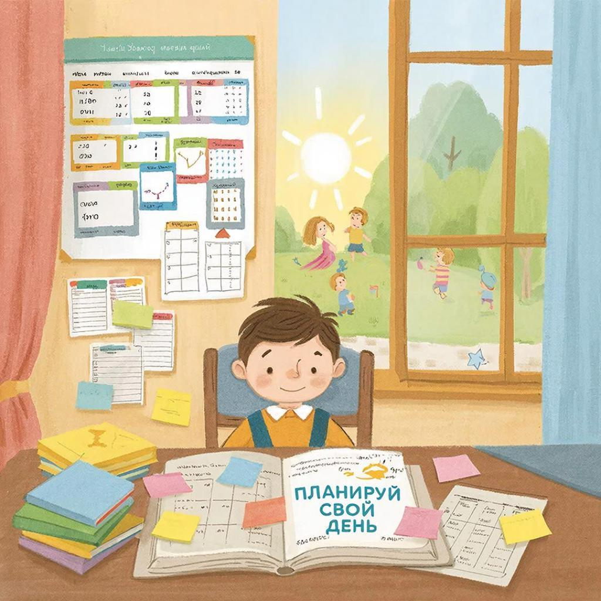

# Тайм-менеджмент для учёбы: как управлять временем эффективно

В сутках 24 часа. У всех. Но почему одни успевают учиться, заниматься спортом, встречаться с друзьями и ещё находят время на хобби, а другие постоянно опаздывают и не делают домашку? Секрет в **тайм-менеджменте** — умении управлять временем.

---

## Что такое тайм-менеджмент?

**Тайм-менеджмент** (от англ. *time* — время, *management* — управление) — это набор методов и приёмов, которые помогают эффективно использовать время.

Простыми словами: это когда вы решаете, **что** делать, **когда** делать и **сколько времени** на это потратить.

---

## Почему это важно для учёбы?

Правильное планирование времени помогает:
- Делать уроки быстрее и без стресса
- Находить время на отдых и хобби
- Успевать готовиться к контрольным
- Не откладывать всё на последнюю ночь
- Лучше запоминать информацию (мозг любит режим!)

Исследования показывают: ученики, которые планируют время, получают оценки на 25% выше и меньше устают.

---

## Главные принципы тайм-менеджмента

### 1. Приоритеты: что важнее?

Не все дела одинаково важны. Используйте **Матрицу Эйзенхауэра**:

| | **Срочно** | **Не срочно** |
|---|------------|---------------|
| **Важно** | 🔴 Делать сейчас: контрольная завтра, проект горит | 🟢 Планировать: подготовка к экзамену через месяц, изучение языка |
| **Не важно** | 🟠 Делегировать: некоторые сообщения, чужие просьбы | ⚪ Не делать: соцсети, сериалы без меры |

**Совет:** Начинайте день с важных дел, даже если они не срочные.

---

### 2. Правило 80/20

20% усилий дают 80% результата. Найдите эти 20% в учёбе:

- Вместо того чтобы перечитывать весь учебник, выделите ключевые темы
- Вместо 10 задач одного типа, решите 2-3 разных
- Вместо зубрёжки всех дат, запомните ключевые события

---

### 3. Одно дело за раз

Мультизадачность — миф! Мозг не может качественно делать несколько дел одновременно. Когда вы переключаетесь, теряется до 40% продуктивности.

**Правильно:** 25 минут математика → перерыв → 25 минут литература  
**Неправильно:** математика + телефон + музыка + еда

---

## Метод Помодоро: таймер — ваш друг

**Метод Помодоро** — простая техника управления временем:

1. Выберите задачу
2. Поставьте таймер на 25 минут
3. Работайте без отвлечений до звонка
4. Сделайте перерыв 5 минут
5. После 4 циклов — длинный перерыв 15-30 минут

**Почему 25 минут?** Это оптимальное время, когда мозг может сосредоточиться без усталости.

**Приложения для Помодоро:**
- Focus To-Do
- Forest (выращиваете дерево, пока не трогаете телефон)
- Pomodoro Timer

---

## Как планировать учебный день?

### Утро (до школы)
- ☐ Встать за 1 час до выхода
- ☐ Повторить материал вчерашнего дня (15 мин)
- ☐ Проверить дневник, собрать рюкзак

### После школы
- ☐ Отдохнуть 30-60 минут (обед, прогулка)
- ☐ Сделать самое сложное задание первым
- ☐ Чередовать предметы (математика → отдых → литература)

### Вечер
- ☐ Подготовить одежду и рюкзак на завтра
- ☐ Лечь спать в одно и то же время

---

## Недельное планирование

Возьмите привычку в воскресенье планировать неделю:

| День | После школы | Вечер |
|------|-------------|-------|
| Пн | Математика (25×3) | Чтение 30 мин |
| Вт | Русский язык (25×2) + Спорт | Подготовка к среде |
| Ср | Физика (25×3) | Отдых |
| Чт | Литература (25×2) + Хобби | Семья |
| Пт | Повторение недели (30 мин) | Отдых, друзья |
| Сб | Проекты, творчество | Отдых |
| Вс | Планирование недели | Отдых, сон |

---

## Типичные пожиратели времени

| Пожиратель | Сколько крадёт | Как бороться |
|------------|----------------|--------------|
| Соцсети | 2-3 часа в день | Отключить уведомления, использовать таймер |
| Телефон во время уроков | +40% ко времени | Убрать в другую комнату |
| Идеализм | 1-2 часа | «Сделанное лучше идеального» |
| Отсутствие плана | Весь день | Вечером писать план на завтра |
| Долгие сборы | 30-60 мин | Готовить с вечера |

---

## Баланс: учёба ≠ вся жизнь

Помните правило: **Учёба + Отдых + Сон = Успех**

| Компонент | Сколько нужно | Почему |
|-----------|---------------|--------|
| Сон | 8-10 часов | Мозг обрабатывает информацию во сне |
| Учёба | 3-5 часов | Оптимально для продуктивности |
| Отдых | 2-3 часа | Восстановление сил |
| Спорт | 30-60 мин | Кислород для мозга |
| Хобби | 1 час | Эмоциональная разгрузка |

[!WARNING]
Недостаток сна снижает способность запоминать на 40%! Не жертвуйте сном ради уроков.

---

## Инструменты для планирования

### Бумажные:
- Ежедневник
- Планер на неделю
- Стикеры на видном месте

### Цифровые:
- Google Calendar (напоминания)
- Notion (база знаний + планировщик)
- Todoist (список задач)
- Trello (карточки дел)

---

## Практические советы

1. **Начинайте с самого сложного** — пока есть силы
2. **Чередуйте предметы** — математика, потом литература (разные полушария)
3. **Делайте перерывы** — 5-10 минут каждый 25-30 минут
4. **Используйте «окна»** — 15 минут в транспорте = повторить слова
5. **Говорите «нет»** — не все просьбы друзей важны
6. **Хвалите себя** — отметили выполнение — маленький приз!

---

## Что делать, если всё идёт не по плану?

План — это не приговор, а ориентир. Если что-то пошло не так:

1. Не паникуйте
2. Оцените, что действительно важно
3. Перенесите менее важное на завтра
4. Сделайте выводы на будущее

---

## Связь с другими понятиями

Тайм-менеджмент связан с:
- [Целями обучения](learning_goals.md) — план помогает достигать целей
- [Перерывами и отдыхом](breaks_and_rest.md) — баланс работы и отдыха
- [Мотивацией](./motivaciya.md) — видимые результаты мотивируют
- [Самоанализом](self_reflection.md) — анализ, куда уходит время

---

## Интересный факт

Илон Маск, основатель SpaceX и Tesla, планирует день с точностью до 5 минут. Но он не работает 24/7 — у него есть строгое время на сон, семью и даже просто «подумать».

---

## Практическое задание

**Неделя тайм-менеджмента:**

1. Возьмите лист бумаги или откройте приложение
2. Каждый вечер записывайте 3 главных дела на завтра
3. Используйте таймер (25 минут работы + 5 отдых)
4. В конце недели ответьте:
   - Что получилось?
   - Что мешало?
   - Что измените на следующей неделе?

---

## См. также

- [Цели обучения](learning_goals.md)
- [Перерывы и отдых](breaks_and_rest.md)
- [Мотивация](./motivaciya.md)
- [Самоанализ](self_reflection.md)
- [Сон](./son.md)

---

Помните: время — ваш самый ценный ресурс. Его нельзя купить, сохранить или одолжить. Но можно использовать с умом! Начните с малого: спланируйте завтрашний день уже сегодня вечером.

---
Авторы: Команда по эффективному обучению;  
Ресурсы: LLM - GigaChat, Wikidata Q1072005
