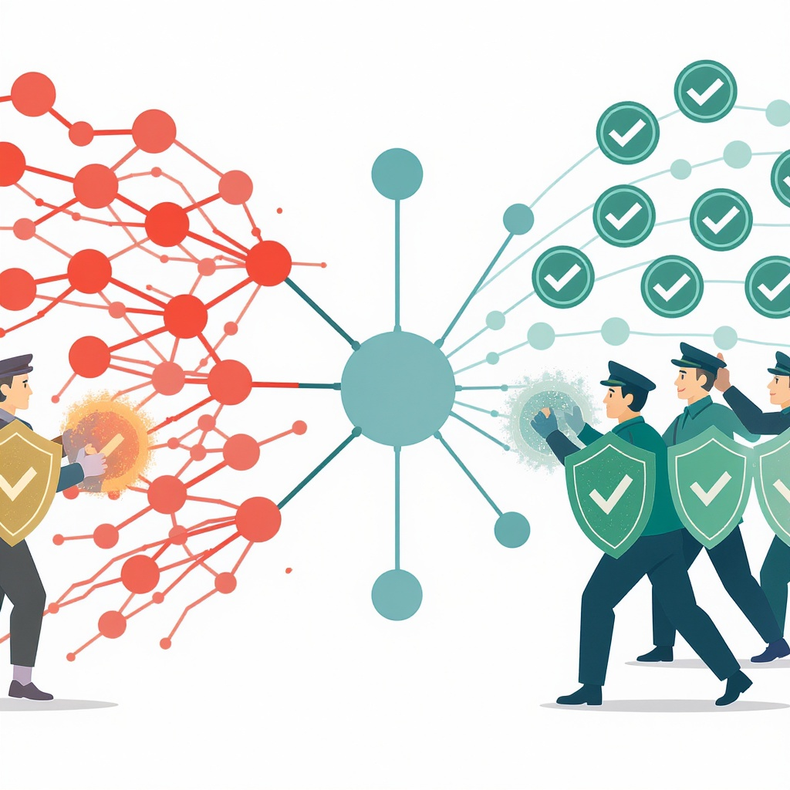

# Дезинформация и фейки: как не попасться на уловки

**Wiki** [Wikidata](https://www.wikidata.org/wiki/Q189656)  
**Parent topic** Информационная и медиаграмотность  

## Что такое дезинформация и фейки?

**Дезинформация** — это намеренно ложная или вводящая в заблуждение информация, созданная с целью обмануть, запутать или повлиять на мнение людей.  
**Фейк** (от англ. *fake* — «подделка») — это конкретный пример дезинформации: ложное фото, видео, текст, статистика или новость, выданная за правду.

> 💡 **Важно:** Не вся неправда — это дезинформация. Если человек просто ошибся, это — ошибка. А если кто-то специально придумал ложь, чтобы вызвать панику, разжечь конфликт или заработать деньги — это уже дезинформация.

### Примеры фейков, с которыми ты можешь столкнуться:
- Фото кота, якобы «спасённого из горящего дома», на самом деле — старая картинка из архива.
- Видео, где «учёные доказали», что Земля плоская — смонтировано в TikTok с помощью AI.
- Сообщение в Telegram: «Сегодня в школе будут тесты по математике, все должны прийти в 7 утра!» — это не правда, но многие верят, потому что «всё так пишут».
- Пост в Instagram: «Если ты перешлёшь это 10 друзьям, тебе подарят iPhone» — классический мем-фейк.

## Почему фейки так эффективны?

Фейки работают, потому что они:
- **Эмоциональны** — вызывают страх, гнев или радость.
- **Просты** — легко понять, даже если они ложные.
- **Распространяются быстро** — особенно в соцсетях и мессенджерах.
- **Подкрепляют наши убеждения** — если ты уже думаешь, что «власти скрывают правду», тебе легче поверить в фейк, который это подтверждает.

> 🔍 Это называется **когнитивное искажение** — мозг хочет верить тому, что уже кажется ему правдоподобным, даже если это ложь.

## Где чаще всего встречаются фейки?

| Место | Пример фейка                                                         | Почему опасно |
|-------|----------------------------------------------------------------------|----------------|
| **Телеграм** | «Ваш аккаунт взломан! Нажмите сюда, чтобы восстановить»              | Фишинг — кража паролей |
| **TikTok / YouTube Shorts** | «Этот ребёнок — снимался в фильме 20 лет назад, а теперь он пропал»  | Манипуляция эмоциями, клевета |
| **Instagram / ВКонтакте** | «Учёные доказали, что сахар вызывает рак — не ешьте сладкое вообще!» | Упрощение сложной науки |
| **Сообщения от «друзей»** | «Посмотри, что нашёл! Это точно правда!» — без ссылки на источник    | Доверие к знакомым снижает критичность |

## Как отличить фейк от правды? Мини-чек-лист

Вот простая памятка, которую можно запомнить за 5 минут. Используй её **каждый раз**, когда видишь что-то «суперважное» или «шокирующее»:

✅ **1. Проверь источник**  
— Кто написал? Официальный сайт? Известный СМИ? Или просто анонимный аккаунт?  
— Если нет имени автора — будь настороже.

✅ **2. Найди первоисточник**  
— Нажми на ссылку. Ведёт ли она на реальный сайт? Или на поддельный (например, `russian-news24.ru` вместо `ria.ru`)?

✅ **3. Ищи другие подтверждения**  
— Гугли ключевые фразы в кавычках: `"вот этот текст"` — посмотри, есть ли другие сайты, которые это пишут.  
— Если только один сайт говорит это — это тревожный звоночек.

✅ **4. Проверь дату**  
— Фото 2018 года может быть выдано за событие 2025 года. Используй Google Images → «Поиск по изображению».

✅ **5. Не верь эмоциям**  
— Если тебе хочется тут же переслать это всем — это признак фейка.  
— Спокойная проверка = твоя суперсила.

✅ **6. Проверь на фактчекинг-сайтах**  
— [Snopes.com](https://www.snopes.com/fact-check/) — международный фактчекинг
— [FactCheck.org](https://www.factcheck.org/our-process/) — американский проект  

> 🚫 **Не пересылай**, пока не проверишь!

## Распространённые ошибки (и как их избежать)

### ❌ Ошибка 1: «Это же написал мой друг!»  
**Почему плохо:** Друзья не всегда проверяют информацию.  
**Как исправить:** Спроси: «А ты уверен, что это правда? Где ты это взял?»

### ❌ Ошибка 2: «Это видео выглядит реально!»  
**Почему плохо:** Современные технологии (AI, Deepfake) могут создать видео, где человек говорит то, чего никогда не говорил.  
**Как исправить:** Ищи несоответствия: странное моргание, неестественные движения губ, звук, который «скользит».

### ❌ Ошибка 3: «Все это пишут — значит, это правда»  
**Почему плохо:** Это называется «эффект толпы». Множество людей не делает информацию правдивой.  
**Как исправить:** Задай вопрос: «А есть ли официальное подтверждение?»

### ❌ Ошибка 4: «Я уже знаю, что это правда — мне так сказали в школе»  
**Почему плохо:** Информация может устареть или быть искажена.  
**Как исправить:** Перепроверяй даже то, что «все знают». Например, раньше говорили, что «в мозге используется только 10%» — это **фейк**.

## Что делать, если ты нашёл фейк?

1. **Не пересылай.** Даже если ты хочешь «предупредить» других — ты распространяешь ложь.
2. **Скажи автору:** «Привет! Я проверил это — кажется, это фейк. Вот ссылка на проверку: [ссылка].»
3. **Сообщи в приложении:** В Telegram и ВК есть кнопка «Пожаловаться» — используй её.
4. **Объясни другу:** Не обвиняй, а спроси: «Ты знал, что такие фейки часто делают, чтобы запутать?»

## Как родителям и учителям помочь?

### 👨‍👩‍👧‍👦 Для родителей:
- **Обсуждайте новости вместе.** Не говорите: «Это всё ложь!» — а спрашивайте: «А как ты думаешь, это правда? Почему?»
- **Покажите, как проверять.** Откройте вместе с ребёнком [Rusfact.ru](https://rusfact.ru/) и найдите один фейк.
- **Не запрещайте соцсети — учите детей критическому мышлению.**

### 👩‍🏫 Для учителей:
- Включите тему «медиаграмотность» в уроки информатики, обществознания или русского языка.
- Устройте игру: «Найди фейк» — дайте ученикам 5 текстов, и пусть они определят, где ложь.
- Используйте примеры из реальных случаев: например, фейк про «пожар в школе» в 2023 году, который вызвал панику в нескольких городах.

## Ресурсы для глубокого изучения

| Название | Что даёт | Ссылка |
|----------|----------|--------|
| **Snopes.com** | Проверка мемов, новостей, городских легенд | [snopes.com](https://www.snopes.com/fact-check/) |
| **MediaSmarts (англ.)** | Обучающие материалы для школьников | [mediasmarts.ca](https://mediasmarts.ca/digital-media-literacy/media-issues/fake-news-misinformation) |
## 💬 Важно помнить

> **Правда не всегда громкая. Ложь — всегда яркая.**  
>  
> Если что-то кажется «слишком шокирующим», «слишком простым» или «слишком срочным» — это почти наверняка фейк.

Ты не обязан верить всему, что видишь. Ты — не пассивный потребитель информации. Ты — **критический мыслитель**. И это твоя суперсила.

## См. также

- [Фактчекинг пошагово](./фактчекинг_пошагово.md)
- [Манипуляции и пропаганда](./манипуляции_и_пропаганда.md)
- [Проверка фото на манипуляции](./проверка_фото_на_манипуляции.md)

---
**Авторы:** Михайлов Александр  
**Слов:** 989  
**Дата генерации:** 2026-03-12  
**Сервис генерации:** qwen
