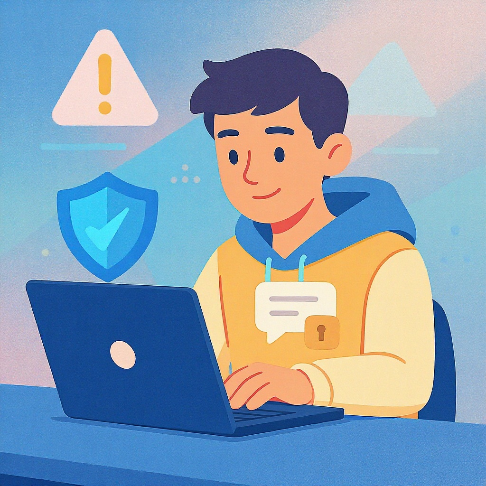

# Информационная безопасность для детей

**Wiki** [Wikidata](https://www.wikidata.org/wiki/Q14594699)  
**Parent topic** Информационная и медиаграмотность  

## Что такое информационная безопасность?

**Информационная безопасность** — это защита личной информации, устройств и онлайн-аккаунтов от вредоносных действий. Это не про то, чтобы не пользоваться интернетом. Это про то, чтобы пользоваться им *безопасно*. Даже если ты играешь в Fortnite, общаешься в Telegram или делаешь домашку в Google Docs — ты оставляешь следы. И если их не защитить, злоумышленники могут их использовать.

> 💡 **Пример**: Ты написал в чате: «Моя школа — №15, я живу на улице Ленина, 34». Злоумышленник может найти тебя по этим данным. Это не шутка — такие случаи бывают.

### Основные термины, которые нужно знать

| Термин | Что значит | Пример |
|--------|------------|--------|
| **Фишинг** | Поддельные письма или сайты, которые выглядят как настоящие, чтобы украсть пароли | Письмо от «ВКонтакте» с просьбой «сразу войти» по ссылке — это фишинг |
| **Вирус** | Вредоносная программа, которая портит файлы или управляет твоим компьютером | Скачал игру с непонятного сайта — и компьютер начал тормозить |
| **Пароль** | Секретная комбинация, которая открывает доступ к аккаунту | `123456` — плохой пароль. `MyDogBuddy2024!` — хороший |
| **Двухфакторная аутентификация (2FA)** | Дополнительная защита: пароль + код из смс или приложения | Включил 2FA в Instagram — даже если кто-то узнает пароль, войти не сможет |
| **Кибербуллинг** | Злоупотребление в интернете: оскорбления, угрозы, распространение фото без согласия | Тебя высмеивают в комментариях под видео — это кибербуллинг |

## Частые ошибки, которые делают дети (и взрослые!)

### ❌ Ошибка 1: Использую один пароль для всего
Ты используешь `qwerty123` для Instagram, Gmail, YouTube и школьного портала? Если один аккаунт взломают — все остальные тоже под угрозой.

### ❌ Ошибка 2: Перехожу по подозрительным ссылкам
«Скачай бесплатно игру!» — это почти всегда вирус. Даже если ссылка пришла от друга — он мог не знать, что его аккаунт взломали.

### ❌ Ошибка 3: Публикую личные данные
Фото с домом, школьный адрес, номер телефона, дата рождения — всё это можно использовать для мошенничества. Даже «моя любимая кошка» может быть подсказкой для ответа на вопрос безопасности: *«Как зовут твою кошку?»*

### ❌ Ошибка 4: Не обновляю приложения
Старые версии приложений — как дверь с сломанным замком. Хакеры знают, где их взломать. Обновления закрывают эти дыры.

### ❌ Ошибка 5: Не использую 2FA
Это как оставлять ключи от машины в замке. Даже если пароль украдут, 2FA остановит злоумышленника.

## Как защитить себя: простой чек-лист

Вот то, что ты можешь сделать *сегодня*:

- ✅ **Создай разные сложные пароли** для каждого аккаунта (используй менеджер паролей, например Bitwarden или Google Password Manager)
- ✅ **Включи двухфакторную аутентификацию** в Instagram, YouTube, Gmail, VK, TikTok
- ✅ **Не кликай по ссылкам** из незнакомых сообщений, даже если они «от друзей»
- ✅ **Не публикуй** фото дома, школы, документов, номеров телефонов
- ✅ **Обновляй приложения и ОС** (Windows, iOS, Android) как только появляется уведомление
- ✅ **Используй антивирус** — даже бесплатные версии (Kaspersky Free, Avast Free)
- ✅ **Скажи взрослому**, если кто-то угрожает, просит деньги или хочет встретиться
- ✅ **Проверяй настройки приватности** в соцсетях — пусть только друзья видят твои посты

> [!TIP]  
> **Запомни правило: «Если не уверен — не нажимай!»**  
> Лучше пропустить одну игру, чем потерять аккаунт, фото или деньги.

## Что делать, если что-то пошло не так?

Даже если ты уже попался на уловку — не паникуй. Вот что делать:

1. **Сразу сообщи взрослому** — родителю, учителю, школьному психологу.
2. **Смени пароли** на всех важных аккаунтах (почта, соцсети, банковские приложения).
3. **Заблокируй аккаунт**, если он взломан — в настройках есть кнопка «Потерял доступ».
4. **Сообщи в службу поддержки** платформы (например, в Instagram — «Пожаловаться» → «Мой аккаунт взломан»).
5. **Если угрожают или шантажируют** — звони в полицию или в Роскомнадзор (сайт: [rkn.gov.ru](https://rkn.gov.ru)).

> [!WARNING]  
> Никогда не соглашайся на встречу с человеком из интернета. Даже если он «очень милый» и «знает всё про тебя». Это может быть опасно.

## Как родителям и учителям помочь детям?

### Для родителей:
- Установите **родительский контроль** (например, в Google Family Link или Apple Screen Time).
- Обсуждайте онлайн-опыт ребёнка — не как «нагоняй», а как разговор: «Что ты сегодня интересного увидел?»
- Не запрещайте интернет — объясняйте, почему нужно быть осторожным.

### Для учителей:
- Проводите **мини-уроки по цифровой грамотности** (10–15 минут в месяц).
- Используйте примеры из реальной жизни: «Вот как один мальчик потерял 10 000 рублей, потому что нажал на ссылку...»
- Создайте в классе **плакат «Безопасный интернет»** — повесьте его на стену.

## Таблица: Безопасные vs. Опасные действия

| Безопасно | Опасно |
|----------|--------|
| Использую надёжный пароль + 2FA | Использую пароль `123456` |
| Пишу в чат: «Привет, как дела?» | Пишу: «Я живу в Казани, учуся в школе 12, мама работает в банке» |
| Скачиваю приложения только из Google Play / App Store | Скачиваю «бесплатные игры» с сайтов вроде `free-games-2024.ru` |
| Проверяю адрес сайта перед входом | Кликаю на ссылку `bit.ly/xyz` без проверки |
| Рассказываю взрослым о подозрительных сообщениях | Молчу, потому что «стыдно» |

## Где учиться дальше?

Вот надёжные ресурсы, где можно узнать больше:

1. [**Кибербезопасность для детей — детский портал**](https://kids.kaspersky.com/) — интерактивные игры и тесты на безопасность (на английском, но понятно даже без знания языка).
2. [**Google Family Link**](https://families.google.com/familylink/) — инструмент для родителей, чтобы контролировать время в интернете и приложениях.

## Заключение: ты — главный защитник себя

Информационная безопасность — это не про страх. Это про **умение**. Ты уже умеешь пользоваться телефоном, интернетом, соцсетями. Теперь ты умеешь и защищаться. Это как носить шлем на велосипеде — не потому что ты боишься упасть, а потому что ты умный.

Каждый раз, когда ты:
- не кликаешь на подозрительную ссылку,
- меняешь пароль,
- включаешь 2FA,
- говоришь взрослому о проблеме,

— ты становишься сильнее. И не только для себя — ты помогаешь и другим.

> 🌟 **Помни: в интернете ты не один. Но ты — главный в своей истории.**

## См. также

- [Приватность и цифровой след](./приватность_и_цифровой_след.md)
- [Кибербуллинг: как распознать и действовать](./кибербуллинг_как_распознать_и_действовать.md)
- [Семейные правила потребления контента](./семейные_правила_потребления_контента.md)

---
**Авторы:** Никитцев Антон  
**Слов:** 1023  
**Дата генерации:** 2026-03-12  
**Сервис генерации:** qwen
