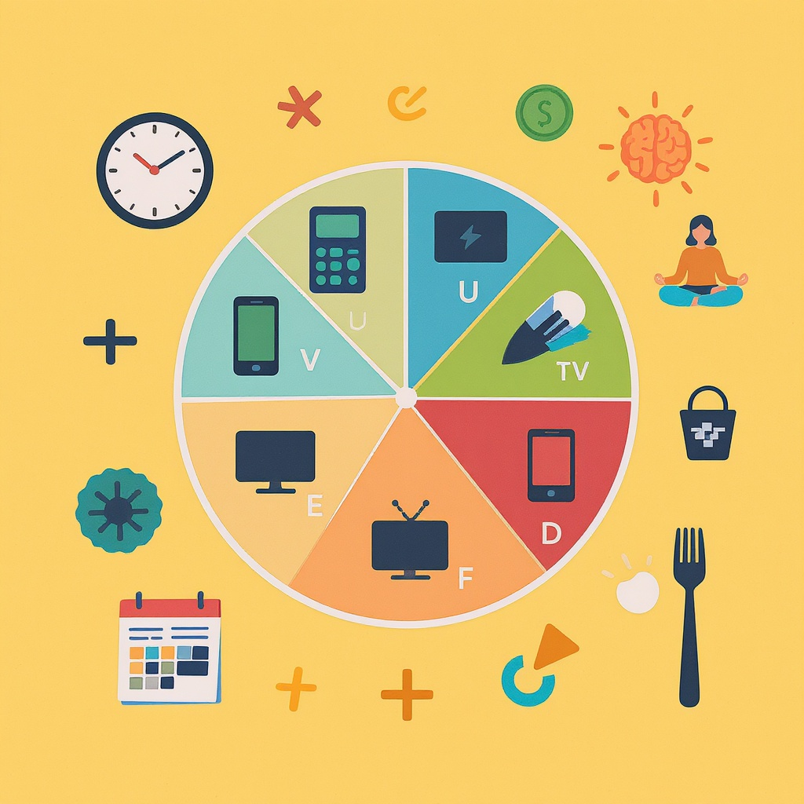

# Информационная диета

**Wiki** [Wikidata](https://www.wikidata.org/wiki/Q1130191)  
**Parent topic** Информационная и медиаграмотность  

Информационная диета — это не про то, что есть на обед, а про то, **что ты читаешь, смотришь и слышишь каждый день**. Представь, что твой мозг — это организм, который тоже нуждается в полезной пище. Если ты ешь только чипсы и сладкое (в виде бесконечных видео, спама и фейков), твой мозг начнёт «болеть»: станет трудно сосредоточиться, появится тревожность, усталость и даже депрессия. Информационная диета — это умение выбирать, что полезно для твоего разума, а что стоит удалить.

## Что такое информационная диета?

**Информационная диета** — это осознанный выбор источников информации, которые ты потребляешь, чтобы поддерживать психическое здоровье, концентрацию и эмоциональное равновесие.  

Это не про то, чтобы вообще ничего не смотреть. Это про то, чтобы **есть только то, что питает тебя**, а не отравляет.

### Примеры "полезной" и "вредной" информации:
| Тип информации | Примеры полезного | Примеры вредного                                                                                             |
|----------------|-------------------|--------------------------------------------------------------------------------------------------------------|
| **Контент**     | Научные статьи, документальные фильмы, книги, образовательные YouTube-каналы | Вирусные мемы, провокационные посты, фейковые новости, бесконечные сторис                                    |
| **Источники**   | Учебники, сайты вроде Wikipedia, официальные сайты школ, каналы NASA или National Geographic | Неизвестные блогеры, Telegram-каналы с заголовками "ТЫ НЕ ПОВЕРИШЬ, ЧТО СЛУЧИЛОСЬ!", TikTok с дезинформацией |
| **Время**       | 30 минут в день на изучение новой темы | 3 часа в день в ленте Instagram или YouTube Shorts                                                           |

> 💡 *Представь, что ты выбираешь еду для своего тела. Ты же не ешь 10 пачек чипсов за день, правда? Так и с информацией — количество не всегда равно качеству.*

## Почему это важно для подростков?

Ты, возможно, не осознаёшь, но **твой мозг в 13–14 лет активно развивается**. Нейронные связи формируются на основе того, чем ты занимаешься. Если ты постоянно переключаешься между видео, сообщениями и играми — твой мозг привыкает к быстрой стимуляции. И тогда, когда нужно читать учебник или писать сочинение, он просто *отказывается работать*.

### Частые ошибки:
- ✖️ **"Я просто отдыхаю"** — Бесконечный скроллинг не отдых, а перегрузка.
- ✖️ **"Всё равно всё знаю"** — Ты не знаешь, если не проверяешь источники.
- ✖️ **"Все так делают"** — Если все едят мусор, это не значит, что это правильно.
- ✖️ **"Нельзя всё отключить"** — Ты не обязан быть на связи 24/7. Это твой выбор.

## Как построить свою информационную диету: 5 шагов

### 1. Сделай аудит своих источников
Запиши, какие приложения и сайты ты открываешь чаще всего. Потом раздели их на три группы:

- ✅ **Полезные** (учеба, развитие, вдохновение)
- ⚠️ **Нейтральные** (развлечения без вреда)
- ❌ **Вредные** (запугивание, дезинформация, токсичность)

> 🔍 *Пример: Ты смотришь TikTok 2 часа в день. 1 час — танцы, 1 час — "Почему учёные скрывают правду о космосе". Первое — нейтральное. Второе — вредное. Удали второе.*

### 2. Установи лимиты
Используй встроенные функции телефона:
- **Screen Time** (iOS)
- **Digital Wellbeing** (Android)

Назначь себе:
- До 1 часа в день — развлечения (без соцсетей)
- До 30 минут — соцсети (только проверенные каналы)
- До 15 минут — новости (только от надёжных источников)

### 3. Замени "мусор" на "витамины"
Вместо того, чтобы скроллить ленту — попробуй:
- Прочитать главу из книги
- Посмотреть TED-Ed (на YouTube)
- Подписаться на канал **"Наука 2.0"** или **"Кот Шрёдингера"**
- Слушать подкаст **"Большой вопрос"** от РБК

> 📚 *Ты не обязан читать "Войну и мир". Начни с "Приключений Шерлока Холмса" — это интересно и развивает логику.*

### 4. Проверяй информацию
Не верь всему, что видишь. Спроси себя:
- Кто написал это?
- Есть ли ссылки на источники?
- Проверяли ли это другие СМИ?

Используй сайты для проверки фейков:
- [Snopes.com](https://www.snopes.com) — международный фактчекинг
- [FactCheck.org](https://www.factcheck.org)

> 🛑 *Если заголовок кричит "ТЫ УМРЕЁШЬ, ЕСЛИ НЕ ПОДЕЛИШЬСЯ!" — это почти всегда ложь.*

### 5. Создай "информационный детокс"
Раз в неделю выдели 1–2 часа, когда:
- Ты **не трогаешь телефон**
- Не смотришь YouTube
- Не читаешь соцсети

Замени это на:
- Прогулку
- Рисование
- Разговор с родителями
- Чтение бумажной книги

> 🌿 *Ты не отключаешься от мира — ты перезагружаешь свой мозг.*

## Мини-чеклист: Твоя информационная диета на неделю

✅ Я проверяю источник, прежде чем верить новости  
✅ Я не смотрю видео дольше 15 минут без перерыва  
✅ Я отписался от 3-5 каналов, которые вызывают тревогу  
✅ Я читаю хотя бы 10 страниц книги в день  
✅ Я выключаю уведомления от соцсетей после 21:00  
✅ Я заменил 1 час скроллинга на подкаст или статью  
✅ Я говорю "нет" информации, которая заставляет меня чувствовать себя хуже

> 📌 *Сделай этот чеклист на бумаге и повесь на холодильник. Проверяй его раз в неделю.*

## Что говорят эксперты?

> "Подростки, которые ограничивают потребление социальных медиа до 2 часов в день, показывают лучшие результаты в учебе и меньше страдают от тревожности."  
> — *Американская академия педиатрии, 2023*

> "Постоянное потребление эмоционально заряженного контента меняет структуру мозга — снижается способность к глубокому мышлению."  
> — *Доктор Марк Маррион, нейропсихолог, Гарвард*

> "Информационная гигиена — это навык XXI века, не менее важный, чем умение писать или считать."  
> — *ЮНЕСКО, Руководство по цифровой грамотности, 2022*

## Советы для родителей и учителей

### Для родителей:
- Не кричите: "Ты всё время в телефоне!" — лучше предложите: "Давай вместе посмотрим один хороший документальный фильм?"
- Обсуждайте, что вы видите: "Как ты думаешь, это правда или фейк?"
- Покажите пример: самим не сидеть в телефоне за ужином.

### Для учителей:
- Добавьте в уроки задания: "Найди 3 источника по теме и выбери самый надёжный"
- Обсуждайте фейки как часть урока обществознания или информатики
- Дайте ученикам "информационный дневник" — записывать, что они читали и как это повлияло на их настроение

## Что будет, если ты начнёшь?

Представь, что через месяц ты:
- Лучше концентрируешься на уроках  
- Не паникуешь от новостей  
- Можешь читать 20 страниц подряд  
- У тебя появилось больше времени на хобби  
- Ты перестал сравнивать себя с "идеальными" людьми в Instagram  

Это не магия. Это **информационная диета**.

Ты не обязан быть "всегда в курсе". Ты обязан быть **в курсе того, что важно**.

---

<!--- Это не реклама, а рекомендация: попробуй завтра заменить 15 минут скроллинга на одну статью с сайта [National Geographic Kids](https://kids.nationalgeographic.com) — и посмотри, как ты себя почувствуешь. --->

## См. также

- [Алгоритмы и пузырь фильтров](./алгоритмы_и_пузырь_фильтров.md)
- [Эмоциональные триггеры в контенте](./эмоциональные_триггеры_в_контенте.md)
- [Семейные правила потребления контента](./семейные_правила_потребления_контента.md)

---
**Авторы:** Попов Александр  
**Слов:** 1035  
**Дата генерации:** 2026-03-12  
**Сервис генерации:** qwen
