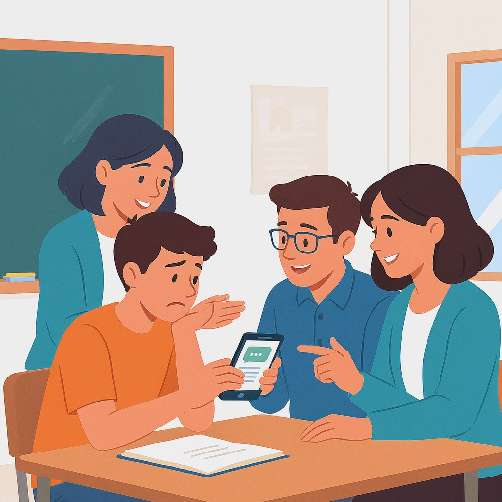

# Кибербуллинг: как распознать и действовать

**Wiki** [Wikidata](https://www.wikidata.org/wiki/Q494348)  
**Parent topic** Информационная и медиаграмотность  

Кибербуллинг — это намеренное, повторяющееся издевательство или запугивание человека через интернет или цифровые устройства: смартфоны, соцсети, мессенджеры, игры и т.д. Это не просто «шутка» или «перепалка». Это серьёзная угроза психическому здоровью, особенно для подростков.

> [!WARNING]  
> **Кибербуллинг — это преступление.** В России за него предусмотрена ответственность по статьям Уголовного кодекса, включая клевету, угрозы и оскорбления. Если ты или твой друг страдаете — не молчи. Помощь доступна.

---

## Что такое кибербуллинг? Простыми словами

Представь, что кто-то пишет тебе в Telegram:  
> «Ты такой урод, никто не будет с тобой дружить. Лучше бы ты исчез».  

Или публикует твою старую фотографию во ВКонтакте с подписью:  
> «Вот кто у нас в классе клоун! 😂»  

Или создаёт фейковый аккаунт, чтобы писать от твоего имени оскорбления другим.  

Это и есть кибербуллинг. Он может быть:

- **Прямым**: оскорбления, угрозы, насмешки в личных сообщениях.
- **Косвенным**: распространение слухов, исключение из групп, публикация личных данных (доксинг).
- **Социальным**: создание фейковых профилей, чтобы подставить тебя.

### 🔑 Ключевые термины

| Термин | Объяснение |
|--------|------------|
| **Доксинг** | Публикация личной информации (адрес, телефон, фото) без согласия |
| **Фейковый аккаунт** | Аккаунт, созданный под чужим именем, чтобы обманывать или травить |
| **Троллинг** | Намеренное провоцирование конфликтов ради развлечения |
| **Сайбер-преследование** | Повторяющиеся действия, вызывающие страх или стресс |

---

## Как распознать кибербуллинг: 5 признаков

Не все обиды — это кибербуллинг. Вот как понять, что это именно он:

1. **Повторяется** — один раз: ошибка. Пять раз — цель.
2. **Целенаправленно** — человек хочет причинить боль, а не просто «пошутил».
3. **Публично** — посты, комментарии, видео с участием других людей.
4. **Анонимно или скрытно** — фейковые аккаунты, скрытые никнеймы.
5. **Вызывает страх, стыд, тревогу** — ты перестаёшь пользоваться телефоном, боишься идти в школу, начинаешь плакать.

> [!NOTE]  
> Если ты чувствуешь, что твои эмоции изменились после онлайн-общения — это повод поговорить с взрослым. Ты не слабый. Ты просто честный.

---

## Примеры кибербуллинга в реальной жизни

### 📱 Пример 1: Групповой чат
> В чате 9Б класса кто-то начал писать:  
> *«Андрей, ты же не умеешь петь, зачем ты в хоре?»*  
> *«Его мама в армии работает, значит, он сирота»*  
> *«Пусть уйдёт из школы»*  
>  
> Андрей больше не заходит в чат. Он перестал ходить на музыку.

→ Это **групповой кибербуллинг**. Даже если «все так говорят», это не значит, что это нормально.

### 📸 Пример 2: Фото в сторис
> Маша опубликовала в Instagram сторис с твоей фотографией без разрешения, с подписью:  
> *«Кто знает, где она была вчера? 😏»*  
>  
> Через 10 минут у тебя 30 сообщений: «Ты вообще нормальная?»

→ Это **публикация личного без согласия** + **оскорбления**. Это кибербуллинг.

### 🎮 Пример 3: В игре
> Ты играешь в Fortnite. Тебя убивают, и в чате пишут:  
> *«Ты играешь как девочка»*  
> *«Уходи, если не можешь»*  
> *«Ты же не настоящий мальчик»*

→ Это **язык ненависти** и **дискриминация**. Даже в игре это не «шутка».

---

## Частые ошибки: что НЕ делать

| Ошибка                           | Почему это плохо |
|----------------------------------|------------------|
| **Отвечать агрессией**           | Это усугубляет конфликт. Ты становишься таким же, как обидчик. |
| **Удалять доказательства**       | Без скриншотов и переписок невозможно доказать кибербуллинг. |
| **Молчать**                      | Тишина даёт обидчику силу. Ты не виноват, но молчание вредит тебе. |
| **Публиковать, чтобы отомстить** | «Я его выложу в TikTok» — это тоже кибербуллинг. Ты не герой, ты жертва, которая стала агрессором. |
| **Винить себя**                  | Ты не виноват, что тебя травят. Это не про тебя — это про них. |

> [!TIP]  
> **Сохраняй всё**: скриншоты, ссылки, даты, времена. Это твои доказательства. Даже если ты не хочешь жаловаться сейчас — сохрани. На всякий случай.

---

## Что делать, если ты жертва кибербуллинга: мини-чек-лист

✅ **1. Не отвечай.** Не вступай в перепалку. Это то, чего хочет обидчик.  
✅ **2. Сохрани доказательства.** Скриншоты, видео, ссылки — всё в папке «Доказательства».  
✅ **3. Заблокируй и пожалуйся.** В соцсетях есть кнопки «Заблокировать» и «Пожаловаться». Используй их.  
✅ **4. Поговори с взрослым.** Учитель, родитель, школьный психолог — кому ты доверяешь.  
✅ **5. Обратись за помощью.**  
- **Телефон доверия**: 8-800-2000-122 (круглосуточно)
- **Полиция**: если есть угрозы жизни, смерти, сексуальные домогательства — звони 112.

> [!IMPORTANT]  
> **Ты не один.** В России каждый третий подросток сталкивался с кибербуллингом. Ты не слабый. Ты смелый, потому что читаешь это — и хочешь разобраться.

---

## Что делать, если ты свидетель

Ты не жертва — но ты видишь, как травят другого. Ты можешь изменить ситуацию.

| Что можно сделать | Почему это важно |
|-------------------|------------------|
| **Не лайкать и не репостить** | Ты не поддерживаешь травлю. |
| **Сказать обидчику: «Это не смешно»** | Иногда достаточно одного слова. |
| **Поддержать жертву** | Напиши: «Я с тобой. Ты не один». |
| **Сообщить взрослому** | Даже если ты не жертва — ты можешь спасти жизнь. |

> [!NOTE]  
> **Свидетель — это не безразличный. Свидетель — это герой.**

---

## Как помочь другу, которого травят

1. **Спроси тихо**: *«Ты в порядке? Я заметил, что ты стал молчаливым»*.  
2. **Не давай советов типа «Просто переживи»** — это отрицает его боль.  
3. **Предложи вместе поговорить с учителем или психологом**.  
4. **Не давай обещаний, которые не можешь выполнить** (например: «Я всё решу»).  
5. **Будь рядом**. Иногда — просто сидеть рядом, не говоря ни слова — это самое сильное, что ты можешь сделать.

---

## Ресурсы для родителей и учителей

| Ресурс | Что даёт |
|--------|----------|
| [**Сайт Роскомнадзора**](https://rkn.gov.ru) | Как подать жалобу на незаконный контент |

---

## Таблица: Что делать, если кибербуллинг стал серьёзным

| Ситуация | Действие |
|----------|----------|
| Тебе угрожают физической расправой | **Немедленно** звони 112 и рассказывай взрослому |
| Тебя шантажируют фото/видео | Не отправляй ничего! Сохрани доказательства → сообщи в «Дети онлайн» |
| Тебя обвиняют в преступлении, которого ты не делал | Не паникуй. Напиши: «Я не делал этого. Покажите доказательства». Запиши всё. |
| Ты видишь, как кто-то публикует личные данные (доксинг) | Скриншот → жалоба в соцсеть → сообщи взрослому |
| Ты не знаешь, как ответить на сообщение | Напиши: «Я не хочу об этом говорить. Пожалуйста, остановись» — и заблокируй |

---

## Заключение: ты не один

Кибербуллинг — это не «норма». Это болезнь общества, которую можно вылечить, если каждый сделает шаг.

Ты можешь:
- **Сохранить доказательства**
- **Сказать «нет»**
- **Поговорить с кем-то**
- **Поддержать другого**

Ты не обязан быть героем. Ты просто обязан быть собой — и знать: твоя жизнь важнее любого комментария.

> [!TIP]  
> **Если ты читаешь это — ты уже на пути к спасению.**  
> Ты не слабый. Ты — сильный.  
> И ты не один.

## См. также

- [Информационная безопасность для детей](./информационная_безопасность_для_детей.md)
- [Этика общения в сети](./этика_общения_в_сети.md)
- [Семейные правила потребления контента](./семейные_правила_потребления_контента.md)

---
**Авторы:** Михайлов Александр  
**Слов:** 1149  
**Дата генерации:** 2026-03-12  
**Сервис генерации:** qwen
