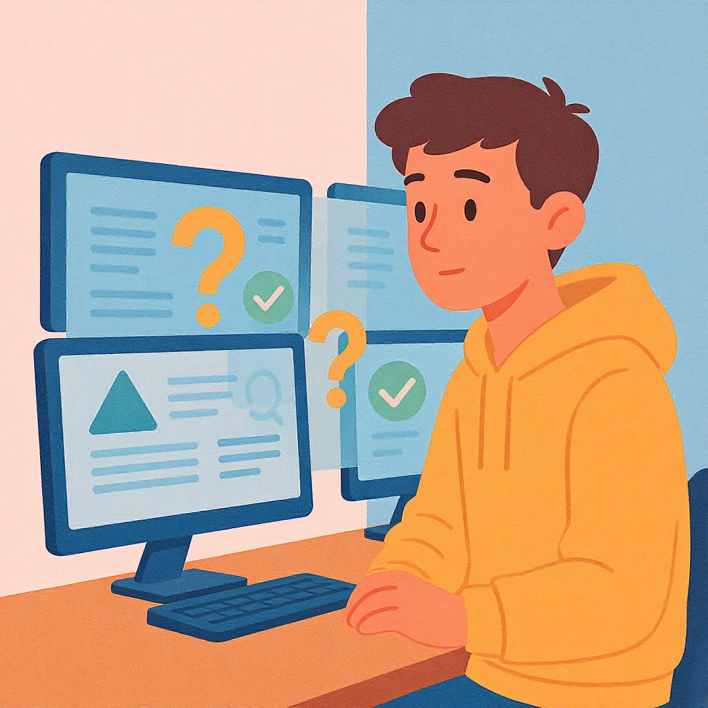

# Критическое мышление в онлайн-среде

**Wiki** [Wikidata](https://www.wikidata.org/wiki/Q843894)  
**Parent topic** Информационная и медиаграмотность  

## Что такое критическое мышление и зачем оно нужно в интернете?

**Критическое мышление** — это умение анализировать информацию, задавать вопросы, проверять факты и не принимать всё на веру. В онлайн-среде, где каждый может опубликовать что угодно — от научных статей до мемов про котиков с ложными утверждениями — этот навык жизненно важен.

Представь: ты заходишь в TikTok и видишь видео, где человек утверждает, что «кофе убивает мозг». Ты сразу веришь? Или задаёшь вопрос: *«А где доказательства? Кто это сказал? Это правда или просто кликбейт?»* — вот это и есть критическое мышление.

> 💡 **Ключевая идея**: Критическое мышление — не про то, чтобы всё отвергать. Это про то, чтобы *понимать*, что ты принимаешь за правду.

### Почему это особенно важно для подростков?

- Ты проводишь в интернете **5–7 часов в день** (по данным Pew Research).
- 70% подростков верят в информацию, которая им нравится, даже если она ложная (*Common Sense Media, 2023*).
- Манипуляции, фейки и дезинформация могут влиять на твои мнения, поведение и даже здоровье.

## Основные термины, которые нужно знать

| Термин | Определение | Пример |
|--------|-------------|--------|
| **Фейк** | Ложная или искажённая информация, представленная как правда | Видео, где якобы «учёные доказали, что Земля плоская» |
| **Кликбейт** | Заголовок или контент, созданный только чтобы привлечь внимание | «Ты не поверишь, что произошло с этим котом! 😱» (а там просто кот спит) |
| **Алгоритм** | Система, которая решает, что показывать тебе в соцсетях | Если ты смотришь видео про космос — тебе будут показывать всё больше космоса, даже если это не полезно |
| **Эмоциональная манипуляция** | Попытка заставить тебя поверить, используя страх, гнев или радость | «Если ты не поделишься этим, кто-то умрёт!» |
| **Источник** | Тот, кто создал или опубликовал информацию | Веб-сайт, блогер, научный журнал, YouTube-канал |

## Частые ошибки, которые допускают все (даже взрослые!)

1. **Верю, потому что мне нравится**  
   Ты видишь пост, где говорят: «Этот сок избавит от всех болезней!» — и ты думаешь: «О, это то, что я хочу услышать!» → Проверять не надо.  
   ❌ **Ошибка**: Эмоции заменяют логику.

2. **Смотрю только на количество лайков**  
   100 тысяч лайков = правда? Нет. Это значит, что много людей *реагировали*, а не то, что информация *верна*.  
   ❌ **Ошибка**: Popular = True.

3. **Не проверяю источник**  
   Ты читаешь статью «Как уничтожить вирус за 5 минут» на сайте `coolhealthtips123.ru` — и не задаёшь вопрос: *«А кто это написал? Есть ли у них медицинское образование?»*  
   ❌ **Ошибка**: Доверяю анонимности.

4. **Думаю, что «все так говорят» — значит, это правда**  
   Все друзья пересылают мем про «запрет на шоколад в школах» — и ты веришь. А на самом деле это фейк из 2018 года.  
   ❌ **Ошибка**: Конформизм вместо анализа.

5. **Не разделяю мнение и факт**  
   «Я думаю, что школа — это скучно» — это мнение.  
   «Средняя продолжительность урока в России — 45 минут» — это факт.  
   ❌ **Ошибка**: Смешиваю чувства с данными.

## Как проверять информацию: мини-чек-лист (используй его каждый раз!)

Перед тем как поделиться, поверить или перепостить — пройди этот простой чек-лист:

✅ **1. Кто написал?**  
   Есть ли имя, фамилия, должность, организация? Или просто «Анонимный пользователь»?

✅ **2. Где опубликовано?**  
   Это официальный сайт (например, `who.int`, `edu`, `gov`)? Или блог, TikTok, Telegram-канал с 5 подписчиками?

✅ **3. Есть ли доказательства?**  
   Цитируются ли исследования? Есть ли ссылки на научные статьи? Или только «мне сказали»?

✅ **4. Другие источники это подтверждают?**  
   Попробуй найти ту же информацию на сайтах вроде *BBC*, *Reuters*, *Википедии* (с проверенными ссылками), *Научной России*.

✅ **5. Это вызывает сильные эмоции?**  
   Страх? Ярость? Восторг? Если да — будь осторожен. Фейки часто работают на эмоциях.

✅ **6. Когда это опубликовано?**  
   Информация 2015 года может быть устаревшей. Особенно в науке и медицине!

> 🛠️ **Совет**: Скопируй текст фразы в Google в кавычках — например:  
> `"кофе убивает мозг"` — и посмотри, что выдаёт поиск. Если только мемы и блоги — скорее всего, это фейк.

## Примеры: фейк vs реальность

| Фейк | Реальность |
|------|------------|
| «Учёные доказали: TikTok делает тебя глупее» | Это не научное исследование. Но есть исследования, например, от *American Psychological Association*, что *чрезмерное* использование соцсетей может снижать концентрацию — но не «делает глупее». |
| «Если ты не перешлёшь это, твой друг заболеет» | Это старый мем. Никто не заболеет. Это эмоциональный шантаж. |
| «В школе запретили все сладости» | Нет, в большинстве школ есть разрешённые сладости — просто ограничивают фастфуд. |
| «Исследование в Nature показало...» | А где ссылка? Если её нет — это подделка. Научные журналы, такие как *Nature*, не публикуют такие заголовки. |

## Как развивать критическое мышление: 5 практических советов

1. **Задавай вопрос «Почему?»**  
   Каждый раз, когда читаешь что-то интересное — спроси себя: *«Почему автор это написал?»*, *«Что он хочет, чтобы я почувствовал?»*

2. **Подписывайся на надёжные источники**  
   Например:  
   - [BBC News](https://www.bbc.com/news)  
   - [Snopes](https://www.snopes.com) — проверяет фейки  
   - [FactCheck.org](https://www.factcheck.org)   
   - [Google Fact Check Explorer](https://toolbox.google.com/factcheck/explorer)

3. **Обсуждай с друзьями и учителями**  
   Не бойся спросить: *«А ты проверял это?»* — это не признак слабости, а признак ума.

4. **Играй в «Детектив по фейкам»**  
   Возьми один мем или пост в неделю — и разберись, правда ли это. Запиши выводы в дневник.

5. **Не делай репосты без проверки**  
   Даже если тебе кажется, что «это важно». Лучше молчать, чем распространять ложь.

## Что говорят эксперты?

> «Цифровая грамотность — это не умение пользоваться телефоном. Это умение *думать* в цифровом мире».  
> — *Доктор Элизабет Лоу, педагог-исследователь, Гарвард*

> «Фейки не исчезнут. Но мы можем научить детей не верить всему подряд — и тогда они станут не жертвами, а защитниками правды».  
> — *Профессор Марина Кузнецова, МГПУ*

## Что делать, если ты уже поделился фейком?

Ничего страшного — это случается со всеми.  
✅ **Признай ошибку**: напиши в комментариях: *«Ой, я проверил — это оказалось фейком. Извините!»*  
✅ **Исправь**: удали пост и поделись правильной информацией.  
✅ **Учись**: теперь ты знаешь, как этого избежать.

## Заключение: ты — супергерой информации

Ты не просто потребляешь контент — ты можешь стать его *защитником*.  
Критическое мышление — это как суперсила:  
- Ты не попадаешься на манипуляции.  
- Ты не становишься частью цепочки фейков.  
- Ты помогаешь другим видеть правду.

Информация — как вода: она может питать, а может отравлять.  
Ты — тот, кто умеет фильтровать.

## См. также

- [Надежные и ненадежные источники](./надежные_и_ненадежные_источники.md)
- [Фактчекинг пошагово](./фактчекинг_пошагово.md)
- [Логические ошибки в медиа](./логические_ошибки_в_медиа.md)

---
**Авторы:** Попов Александр  
**Слов:** 1037  
**Дата генерации:** 2026-03-12  
**Сервис генерации:** qwen
