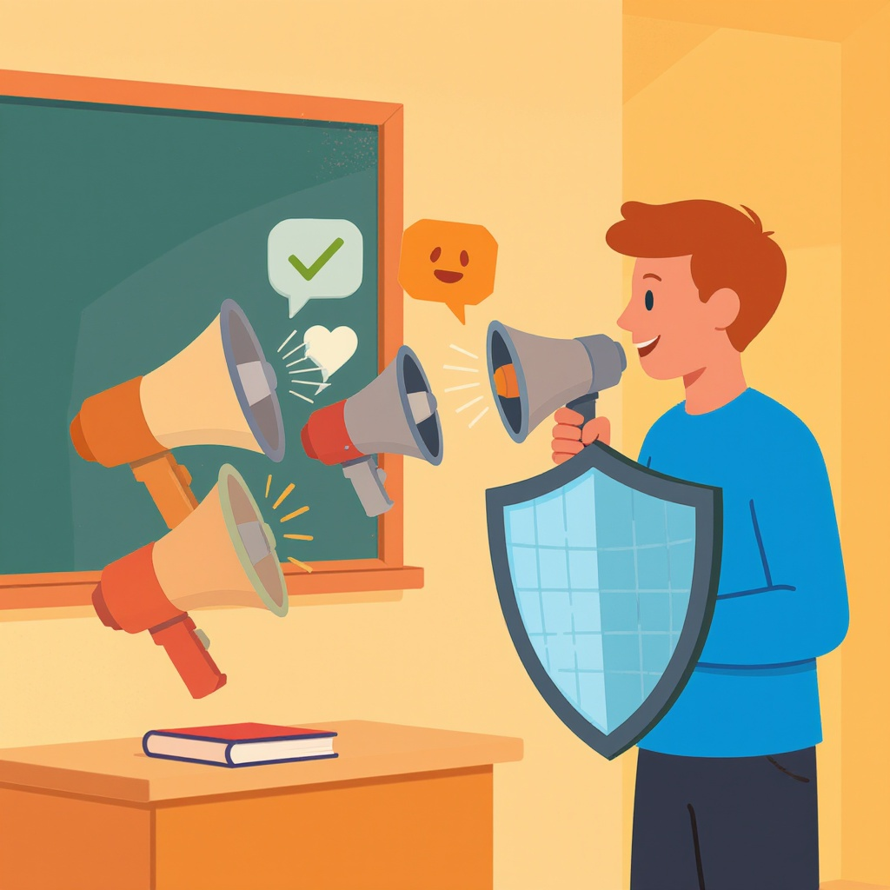

# Манипуляции и пропаганда: как не стать жертвой лжи

**Wiki** [Wikidata](https://www.wikidata.org/wiki/Q7281)  
**Parent topic** Информационная и медиаграмотность  

Манипуляции и пропаганда — это не просто «неправда». Это **умные, продуманные способы заставить тебя думать, чувствовать или действовать так, как этого хотят другие** — часто без твоего согласия. Ты можешь столкнуться с ними в соцсетях, на телевидении, в рекламе, даже в разговорах с друзьями. Главное — **не паниковать, а научиться распознавать их**.

## Что такое манипуляция и пропаганда?

### Манипуляция
Это **скрытое влияние**, когда кто-то использует эмоции, искажённую информацию или психологические приёмы, чтобы ты принял решение, выгодное им, а не тебе.

> *Пример:* Ты видишь рекламу: «Только сегодня! 9 из 10 подростков выбирают этот напиток!» — но на самом деле опрос проводили среди 10 человек из одного класса. Это манипуляция: цифры правдивы, но контекст — ложный.

### Пропаганда
Это **систематическое распространение идей, часто искажённых**, чтобы изменить мнение масс. Часто используется в политике, войне или для продвижения идеологии.

> *Пример:* Видео, где показывают только плохие моменты одной страны, а другую — как «спасителя». Это не объективный отчёт — это пропаганда.

### 🔍 Ключевые термины
| Термин | Что значит |
|--------|------------|
| **Фейк** | Сознательно ложная информация, поданная как правда |
| **Эмоциональный триггер** | Слова или образы, которые вызывают сильные чувства (страх, гнев, сочувствие) — чтобы ты не думал |
| **Дезинформация** | Ложь, распространяемая с целью ввести в заблуждение |
| **Селективный отбор** | Показывают только то, что подходит, а остальное скрывают |
| **Апелляция к авторитету** | «Это сказал профессор!» — даже если профессор не эксперт в этой теме |

## Как манипуляторы работают? 5 самых частых приёмов

Вот как тебя могут обмануть — и как это выглядит на практике:

1. **Создание страха**  
   *«Если не купишь это, тебя обидят в школе!»*  
   → Используют страх потери, одиночества, опасности.

2. **Упрощение сложного**  
   *«Все иммигранты — воры»*  
   → Настоящий мир сложен, но манипуляторы дают чёрно-белые ответы.

3. **Ложная дихотомия**  
   *«Ты либо с нами, либо против нас»*  
   → Убирают возможность «не знаю» или «зависит».

4. **Использование знаменитостей**  
   *«Этот актёр пьёт этот сок — значит, он полезный!»*  
   → Знаменитость не эксперт в питании, но ты веришь ей.

5. **Повторение лжи**  
   *«Это уже 10 раз сказали в TikTok — значит, правда!»*  
   → Чем чаще слышишь, тем больше веришь — даже если это неправда.

## 🔴 Частые ошибки подростков (и как их избежать)

| Ошибка | Почему опасна | Как исправить                                      |
|--------|--------------|----------------------------------------------------|
| Верю, потому что мне нравится автор | Люди могут быть милыми, но лгать | Проверяй факты, а не чувства                       |
| Делюсь, не прочитав до конца | Ложь распространяется быстрее правды | Останавись. Прочитай. Подумай.                     |
| «Все так пишут» = «Это правда» | Мнение толпы ≠ истина | Ищи первоисточники                                 |
| Верю в «научные» слова | «Квантовая энергия», «генетический код» звучат круто, но бессмысленны | Учись отличать науку от псевдонауки                |
| Не проверяю источник | «Из ВК» — не источник. «Из BBC» — уже лучше | Смотри: кто написал? Почему? Какие доказательства? |

## ✅ Практический чек-лист: 5 вопросов, которые спасут тебя

Каждый раз, когда видишь яркое видео, пост или сообщение — задай себе вопрос:

1. **Кто это написал?**  
   → Имя, организация, есть ли контакт? Или просто «Аноним»?

2. **Какие доказательства есть?**  
   → Цифры? Ссылки? Фото? Видео? Или только эмоции?

3. **Что скрыто?**  
   → Что не показывают? Может, есть другая точка зрения?

4. **Чувствую ли я сильную эмоцию?**  
   → Гнев? Страх? Зависть? Это сигнал: на тебя пытаются повлиять.

5. **Где ещё об этом говорят?**  
   → Проверь 2–3 независимых источника (например, BBC, Reuters, Википедия, научные сайты).

> 💡 **Совет:** Если что-то кажется «слишком хорошо, чтобы быть правдой» — скорее всего, так и есть. Проверяй!

## Пример: как разобрать фейк в соцсетях

> **Пост в Telegram:**  
> _«Учёные доказали: TikTok разрушает мозг подростков! Вот видео из лаборатории!»_  
> → Видео: человек в белом халате, мигающие лампочки, звук «бип-бип».

**Разбор:**
- ✅ Кто? — Не названо. Нет имени учёного, института.
- ✅ Доказательства? — Только «видео из лаборатории» — это визуальный трюк.
- ✅ Где ещё? — Проверь Google: «TikTok brain damage study» → Нет реальных научных статей.
- ✅ Эмоции? — Страх: «разрушает мозг!» — классический триггер.
- ✅ Что скрыто? — Научные работы показывают: TikTok влияет на внимание, но **не разрушает мозг**.

**Вывод:** Это фейк. Не делись.

## Где искать правду? 5 надёжных источников

| Источник | Почему надёжен                              | Для чего подойдёт |
|----------|---------------------------------------------|-------------------|
| **BBC News** | Независимый, проверяет факты, международный | Новости, политика, наука |
| **Reuters** | Не зависит от политических партий           | Факты, экономика, глобальные события |
| **Snopes.com** | Специализируется на разборе фейков          | Проверка мемов, цитат, видео |
| **Wikipedia** | Пишется по источникам, со ссылками          | Общие знания, история, наука (но проверяй ссылки!) |
| **Google Scholar** | Поиск научных статей                        | Если хочешь разобраться в исследованиях |

> 📌 **Важно:** Даже надёжные источники могут ошибаться. Главное — **они исправляют ошибки**. А фейки — нет.

## Что делать, если ты уже повелся?

1. **Не вини себя.** Все попадаются — даже взрослые.
2. **Скажи кому-то:** другу, родителю, учителю.
3. **Удали/не делись.** Не помогай лжи распространяться.
4. **Попробуй разобрать это вместе с кем-то.** Это научит тебя думать критически.
5. **Запомни:** ты не глупый — тебя просто обманули. Умение распознавать манипуляции — это навык, как велосипед: чем больше практикуешь, тем лучше ездишь.

## 💬 Для родителей и учителей

Вы не обязаны быть экспертом по соцсетям. Но вы можете:

- **Задавать вопросы:**  
  *«А ты знаешь, откуда взялась эта информация?»*  
  *«Что бы ты сделал, если бы это было про тебя?»*

- **Играть в «разоблачитель»:**  
  Возьмите вместе фейк из TikTok и разбирайте его шаг за шагом. Это весело и полезно.

- **Не запрещайте, а учитесь вместе.**  
  Баны и запреты не работают. Критическое мышление — да.

> *«Не бойся, что не знаешь. Бойся, что не хочешь узнать.»*

## См. также

- [Логические ошибки в медиа](./логические_ошибки_в_медиа.md)
- [Кликбейт и заголовки-ловушки](./кликбейт_и_заголовки_ловушки.md)
- [Дезинформация и фейки](./дезинформация_и_фейки.md)

---
**Авторы:** Власко Михаил  
**Слов:** 973  
**Дата генерации:** 2026-03-12  
**Сервис генерации:** qwen
