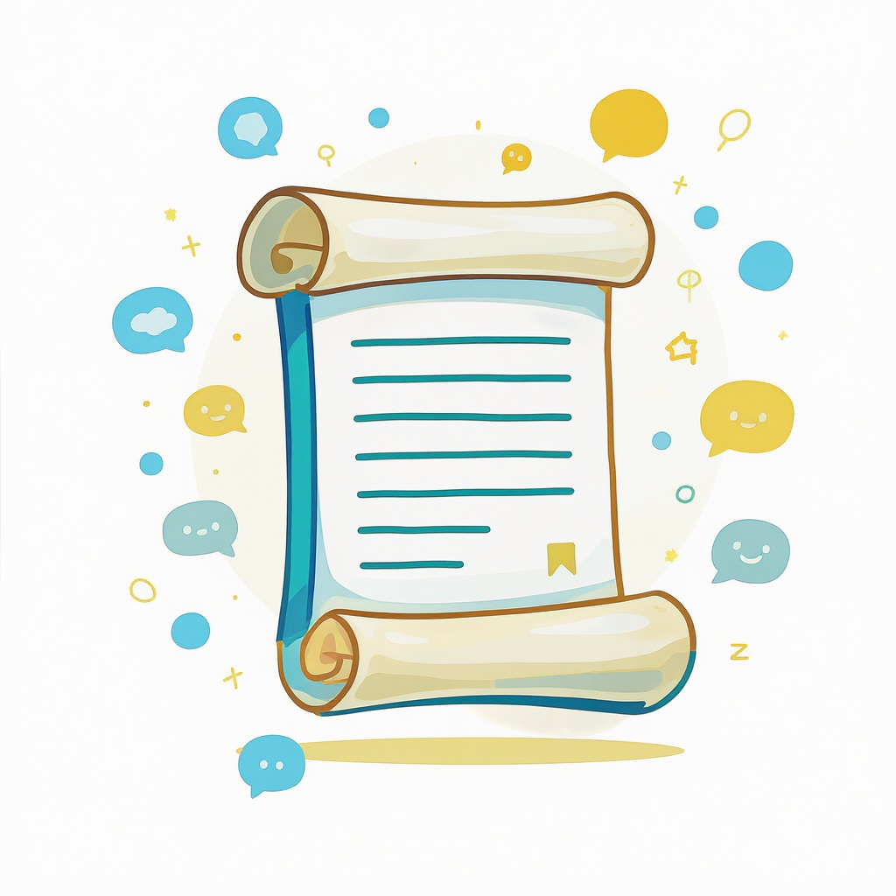

# Первоисточник и пересказ

**Wiki** [Wikidata](https://www.wikidata.org/wiki/Q112754)  
**Parent topic** Информационная и медиаграмотность  

Когда ты пишешь сочинение, готовишь презентацию или делаешь домашнее задание по литературе или истории, ты часто сталкиваешься с двумя важными понятиями: **первоисточник** и **пересказ**. Понимание разницы между ними — ключ к тому, чтобы не просто «списать», а действительно учиться, думать и писать грамотно.

---

## Что такое первоисточник?

**Первоисточник** — это оригинал, из которого взята информация. Это то, что создал автор или участник события впервые. Первоисточники — это «источник источников».

### Примеры первоисточников:
- **Литература**: роман *«Война и мир»* Льва Толстого — это первоисточник. А книга с анализом этого романа — уже нет.
- **История**: дневник Анны Франк — первоисточник. Статья в учебнике о Холокосте — нет.
- **Наука**: научная статья с результатами эксперимента — первоисточник. Статья в журнале «Наука и жизнь», которая о ней рассказывает — нет.
- **Искусство**: картина *«Звёздная ночь»* Ван Гога — первоисточник. Фото этой картины в интернете — тоже первоисточник (если это фото оригинала), но описание в Википедии — уже нет.

> 💡 **Запомни**: Первоисточник — это **оригинал**, а не то, что кто-то о нём написал.

---

## Что такое пересказ?

**Пересказ** — это изложение содержания текста, события или идеи своими словами. Он не копирует текст дословно, а передаёт суть, сохраняя смысл.

### Пример пересказа:
> **Первоисточник (отрывок из «Мёртвых душ» Гоголя):**  
> *«Чичиков, поехавший в гости к помещикам, собирал мёртвые души — то есть умерших крестьян, ещё не вычеркнутых из ревизских списков».*

> **Пересказ (своими словами):**  
> Главный герой, Чичиков, ездил по деревням и покупал у помещиков права на крестьян, которые уже умерли, но ещё не были официально исключены из списков. Он хотел использовать это, чтобы получить деньги от государства.

Пересказ — это **не списывание**, а **понимание и переформулирование**.

---

## Почему важно уметь отличать первоисточник от пересказа?

### ✅ Плюсы работы с первоисточниками:
- Ты получаешь **точную, неискажённую информацию**.
- Ты учишься **анализировать**, а не просто запоминать.
- В сочинениях и проектах это повышает **авторитет** твоей работы.

### ❌ Опасности, когда вместо первоисточника берёшь пересказ:
- Ты можешь **неправильно понять** смысл (например, если пересказчик ошибся).
- Ты рискуешь **переписать чужую ошибку**.
- Учитель или преподаватель сразу заметит, что ты не читал оригинал — и это снижает оценку.

> [!WARNING]  
> **Ошибки, которые делают все**:  
> - «Я прочитал краткое содержание — этого достаточно».  
> - «Я скопировал из Википедии — там же всё написано».  
> - «Я просто перефразировал, и это не плагиат».

---

## Как правильно использовать первоисточник и пересказ?

### ✅ Правильный подход:
| Этап | Что делать |
|------|-------------|
| 1. | Прочитай **первоисточник** (текст, статью, документ). |
| 2. | Запиши свои мысли: *«Что здесь главное?»*, *«Почему автор так написал?»* |
| 3. | Напиши **пересказ своими словами** — без списывания. |
| 4. | Если цитируешь — используй **кавычки** и укажи источник. |
| 5. | Всегда проверяй: *«Это моя мысль или чужая?»* |

### 🚫 Что НЕ делать:
- Не копируй текст из интернета — даже если «переформулировал».
- Не заменяй чтение книги на просмотр видео на YouTube (если это не задание).
- Не используй пересказ как источник в научной работе — он **не надёжен**.

---

## Типичные ошибки и как их избежать

| Ошибка | Почему плохо | Как исправить |
|--------|--------------|----------------|
| «Я прочитал конспект» | Конспект — это уже пересказ. Он может быть упрощённым или ошибочным. | Всегда ищи оригинал. Даже если его 300 страниц — читай хотя бы главу. |
| «Я просто перефразировал» | Если ты просто заменил слова, но структура и мысль — чужие, это **плагиат**. | Пересказ должен быть **твоим**. Перечитай, закрой текст — и расскажи вслух, как будто другу. |
| «Я нашёл в Википедии» | Википедия — это **сборник пересказов**. Она хороша для начала, но не для цитирования. | Используй Википедию как **карту**, а не как источник. Перейди по ссылкам — найди оригинал. |
| «Я не указал источник» | Даже если ты пересказал — ты обязан сказать, откуда взял идею. | Добавляй ссылку или упоминание: *«Как пишет Толстой в „Войне и мире“…»* |

---

## Мини-чеклист: Ты правильно работаешь с первоисточниками и пересказами?

✅ Прочитал оригинал (книгу, статью, документ)?  
✅ Написал пересказ **своими словами**, без копирования?  
✅ Не скопировал текст из интернета?  
✅ Указал источник, даже если пересказал?  
✅ Проверил, не похож ли мой пересказ на чужой?  
✅ Если цитирую — поставил кавычки и указал страницу/автора?  

> [!TIP]  
> **Совет от учителя литературы**:  
> *«Если ты можешь объяснить смысл текста без него перед глазами — ты его понял. Если нет — читай ещё раз».*

---

## Таблица: Примеры первоисточников и пересказов

| Тема | Первоисточник                                                                        | Пересказ (неправильный) | Пересказ (правильный) |
|------|--------------------------------------------------------------------------------------|--------------------------|------------------------|
| *«Герой нашего времени»* Лермонтова | Главный герой — Печорин, эгоист, который «изучает» людей, как будто экспериментирует | Печорин — плохой парень, который всех обманывает | Печорин — сложный персонаж, который исследует человеческую природу, часто жестоко, но с самокопанием — это не просто злодей, а человек, разочарованный в жизни |
| Вторая мировая война | Дневник Анны Франк (1942–1944)                                                       | «Девочка пряталась от нацистов и умерла» | Анна Франк вела дневник, скрываясь от нацистов, и писала о страхе, надежде и повседневной жизни — её записи стали символом человеческой стойкости |
| Закон Ньютона | «Математические начала натуральной философии» (1687)                                 | «Всё падает вниз» | Ньютон сформулировал три закона движения, включая закон инерции и F=ma — это основа классической механики |

---

## Где искать надёжные первоисточники?

1. **Библиотеки и электронные архивы**  
   - [Гутенберг](https://www.gutenberg.org/) — бесплатные книги в оригинале (на английском и русском).  
   - [Руниверс](https://www.runivers.ru/) — русские первоисточники: книги, статьи, архивы.

2. **Научные базы**  
   - [CyberLeninka](https://cyberleninka.ru/) — российские научные статьи.  
   - [Google Scholar](https://scholar.google.com/) — ищи статьи, а не веб-сайты.

3. **Музеи и архивы**  
   - [Архивы Анны Франк](https://www.annefrank.org/) — оригинальные рукописи.  
   - [Российская национальная библиотека](https://nlr.ru/) — цифровые коллекции.

> [!NOTE]  
> **Важно!** Если ты пишешь работу для школы — всегда спрашивай у учителя: *«Можно ли использовать Википедию?»*. Часто разрешают только как **вспомогательный источник**.

---

## Как пересказывать правильно: пошаговая инструкция

1. **Прочитай** текст 2–3 раза.  
2. **Закрой** его.  
3. **Расскажи вслух** (или про себя): *«Что здесь происходило? Почему?»*  
4. **Запиши** своими словами — как будто объясняешь другу.  
5. **Сравни** с оригиналом:  
   - Ты передал смысл?  
   - Ты не скопировал фразы?  
   - Ты не добавил чужого мнения?  
6. **Укажи источник** в конце:  
   > *По тексту Л.Н. Толстого «Война и мир» (Глава 1, 1869 г.)*

---

## Заключение: Первоисточник — твой суперсила

Ты не обязан читать все книги целиком — но **каждый раз, когда тебе дают задание, спрашивай себя**:  
> *«А я читал оригинал? Или просто пересказ?»*

Первоисточник — это как **самое свежее молоко**. Пересказ — как **молоко, которое уже стояло в холодильнике неделю**. Оно не испортилось, но вкус стал хуже, и ты не знаешь, что добавили.

Учись работать с первоисточниками — и ты станешь не просто учеником, а **критическим мыслителем**.

## См. также

- [Надежные и ненадежные источники](./надежные_и_ненадежные_источники.md)
- [Роль поисковых систем](./роль_поисковых_систем.md)
- [Проверка цитат и статистики](./проверка_цитат_и_статистики.md)

---
**Авторы:** Никитцев Антон  
**Слов:** 1126  
**Дата генерации:** 2026-03-12  
**Сервис генерации:** qwen
