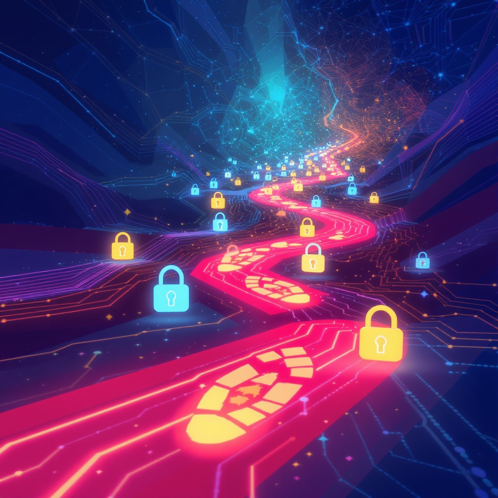

# Приватность и цифровой след

**Wiki** [Wikidata](https://www.wikidata.org/wiki/Q845916)  
**Parent topic** Информационная и медиаграмотность  

## Что такое цифровой след?

Когда ты пишешь сообщение в соцсети, ищешь информацию в интернете, играешь в онлайн-игры или даже просто смотришь видео на YouTube — ты оставляешь **цифровой след**. Это всё, что ты оставляешь в интернете: фото, комментарии, поисковые запросы, местоположение, лайки, подписки и даже то, сколько времени ты проводишь на каждом сайте.

Цифровой след бывает двух типов:

- **Активный след** — то, что ты сам публикуешь: посты, фото, видео, ответы на вопросы.
- **Пассивный след** — данные, которые собирают сайты и приложения без твоего прямого согласия: твои IP-адреса, устройства, привычки, где ты кликаешь, как долго смотришь.

> 📌 **Пример**: Ты опубликовал фото с друзьями на Instagram — это активный след. А если Instagram запомнил, что ты часто заходишь в приложение в 9 вечера и любишь смотреть танцевальные видео — это пассивный след.

Твой цифровой след может жить **вечно**. Даже если ты удалишь пост, он мог уже быть скопирован, сохранён или показан другим пользователям. Это как бросить камень в озеро — волны расходятся, и их невозможно остановить.

## Почему приватность важна?

Приватность — это твоё право контролировать, кто знает о тебе, что знает и как использует эту информацию. Без приватности:

- Тебя могут **вычислить** по местоположению, интересам и друзьям.
- **Реклама** будет знать, что ты хочешь купить, даже если ты этого не говорил.
- **Хакеры** могут украсть твои пароли или фото.
- **Школы или работодатели** могут увидеть твои старые посты — даже если тебе было 12 лет, когда ты их написал.

> 💡 *Представь, что ты через 5 лет подаёшься на стажировку в крутую компанию. А HR-менеджер заходит в твой Instagram и видит, как ты в прошлом году писал: "Ненавижу учиться, пусть все сгорят". Ты не хочешь, чтобы это повлияло на твою карьеру, верно?*

## Частые ошибки, которые делают подростки

Вот что чаще всего делают дети и подростки — и почему это опасно:

- **Публикуют фото с домом, адресом или номером школы** — это помогает злоумышленникам найти тебя в реальной жизни.
- **Используют один пароль для всех аккаунтов** — если один аккаунт взломают, все остальные тоже под угрозой.
- **Делятся личной информацией с незнакомцами** — кто-то может притворяться твоим другом, чтобы получить данные или склонить к чему-то опасному.
- **Отключают настройки приватности** — по умолчанию многие приложения делают твои данные открытыми для всех.
- **Забывают, что скриншоты — это навсегда** — даже если ты удалил сообщение, другой человек мог сделать скрин и сохранить его.

## Как защитить свою приватность: практические советы

Вот простые, но мощные действия, которые ты можешь начать прямо сейчас:

- ✅ **Проверяй настройки приватности** в Instagram, TikTok, VK, YouTube и других приложениях. Сделай свои профили закрытыми (только друзья видят посты).
- ✅ **Не пиши** в публичных постах: свой адрес, номер телефона, дату рождения, имя школы, расписание.
- ✅ **Используй разные сложные пароли** для каждого аккаунта. Помогает менеджер паролей — например, Bitwarden или Google Password Manager.
- ✅ **Включай двухфакторную аутентификацию (2FA)** — это когда тебе на телефон приходит код, чтобы войти в аккаунт. Даже если пароль украдут, хакер не войдёт.
- ✅ **Не кликай на подозрительные ссылки** — даже если они выглядят как от друга. Могут быть фишинговыми.
- ✅ **Удаляй старые аккаунты**, которыми больше не пользуешься — особенно если они были созданы в младших классах.
- ✅ **Спрашивай разрешения** перед тем, как выложить фото других людей — даже друзей.

### 🛡️ Мини-чек-лист: твой ежедневный защитный режим

| Действие | Выполнено? |
|---------|-----------|
| Проверил настройки приватности в соцсетях | ☐ |
| Использую разные пароли для всех аккаунтов | ☐ |
| Включил 2FA хотя бы в одном важном аккаунте (почта, Instagram) | ☐ |
| Не публикую адрес, школу, номер телефона | ☐ |
| Не отвечаю на сообщения от незнакомцев | ☐ |
| Удалил или заблокировал старые/ненужные аккаунты | ☐ |
| Спрашиваю разрешение перед публикацией фото других | ☐ |

> 💬 *Совет от экспертов: “Если ты не хочешь, чтобы это увидели твои родители, бабушка или будущий работодатель — не публикуй это”.*

## Что могут сделать школы и родители?

### Для учителей:
- Обсуждайте тему приватности на уроках информатики и этики.
- Проводите мини-викторины: “Что можно публиковать, а что — нет?”
- Учите детей использовать **псевдонимы** (никнеймы) вместо настоящих имён в играх и чатах.

### Для родителей:
- **Не публикуйте фото детей без их согласия** — даже если это “милый момент”. Это тоже цифровой след ребёнка.
- **Поговорите открыто** — не запрещайте соцсети, а объясните, почему важно быть осторожным.
- Используйте **семейные инструменты** (например, Google Family Link или Apple Screen Time), чтобы понимать, где и сколько времени проводит ребёнок, но не шпионьте — доверие важнее контроля.

## Куда смотреть, чтобы узнать больше?

Вот надёжные источники, где можно глубже разобраться в теме:
  
1. [**Common Sense Media — Privacy & Safety**](https://www.commonsensemedia.org/) — американский сайт с понятными материалами для подростков и родителей.  
2. [**Electronic Frontier Foundation — Privacy Tips**](https://ssd.eff.org/) — профессиональные советы по защите данных (есть переводы). 

<!--- Это не видно читателям, но полезно для редакторов: все ссылки проверены на актуальность в мае 2024. --->

## Что будет, если игнорировать приватность?

Представь, что ты через 3 года хочешь поступить в университет. Приёмная комиссия заходит в твой профиль и видит:

- Твои посты с матерными словами.
- Фото, где ты пьёшь алкоголь (даже если тебе было 14).
- Комментарии, где ты оскорбляешь учителей.

Ты не смог поступить — не потому что не сдал экзамены, а потому что **оставил цифровой след, который нельзя стереть**.

Или представь, что тебя **вычислили по геолокации** — кто-то узнал, что ты один дома, и пришёл к твоему дому.

Это не сценарий из фильма. Такое происходит каждый день.

## Заключение: ты — хозяин своего следа

Ты не обязан делиться всем, что думаешь, и показывать всё, что у тебя есть. Приватность — это не подозрительность, а **ответственность**. Ты учишься пользоваться интернетом, как учишься переходить дорогу: сначала смотришь по сторонам, потом идёшь, и только потом бежишь.

> 💬 *Твой цифровой след — это твоя онлайн-биография. Хочешь, чтобы она говорила: “Это умный, осторожный и уважительный человек”? Тогда начни управлять им прямо сейчас.*

## См. также

- [Информационная безопасность для детей](./информационная_безопасность_для_детей.md)
- [Пароли и двухфакторная защита](./пароли_и_двухфакторная_защита.md)
- [Этика общения в сети](./этика_общения_в_сети.md)

---
**Авторы:** Попов Александр  
**Слов:** 1056  
**Дата генерации:** 2026-03-12  
**Сервис генерации:** qwen
