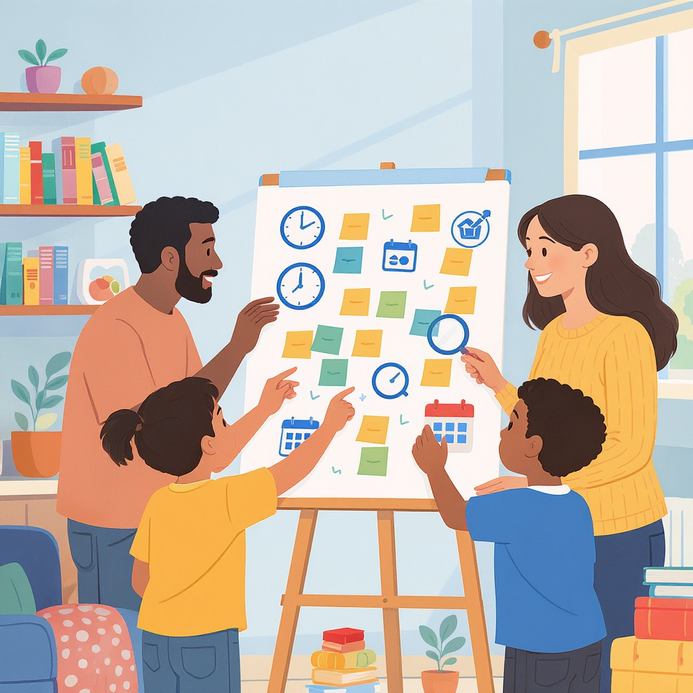

# Семейные правила потребления контента

**Wiki** [Wikidata](https://www.wikidata.org/wiki/Q28130149)  
**Parent topic** Информационная и медиаграмотность  

В современном мире дети и подростки проводят огромное количество времени за экранами: смотрят YouTube, играют в игры, скроллят соцсети, смотрят сериалы. Но без правил это может превратиться в проблему — усталость, плохой сон, снижение успеваемости и даже конфликты в семье. Вот почему **семейные правила потребления контента** — это не ограничение, а инструмент для здорового, сбалансированного и безопасного использования технологий.

---

## Что такое семейные правила потребления контента?

**Семейные правила потребления контента** — это согласованные договорённости между родителями и детьми о том, *когда*, *сколько* и *как* можно использовать цифровые устройства и онлайн-контент. Эти правила помогают:

- Защитить здоровье (сон, зрение, осанку);
- Сохранить баланс между онлайн- и офлайн-жизнью;
- Научить ответственности и самоконтролю;
- Избежать контакта с вредным или неподходящим контентом.

> 💡 **Важно**: Эти правила — не приказы, а договоры. Чем больше ребёнок участвует в их создании, тем с большей охотой он их будет соблюдать.

---

## Ключевые термины

| Термин | Определение                                                                                                          |
|--------|----------------------------------------------------------------------------------------------------------------------|
| **Цифровая гигиена** | Правила, помогающие поддерживать здоровое отношение к экранам: перерывы, режим сна, поза при использовании устройств. |
| **Контент-фильтрация** | Использование программ или настроек, которые блокируют нежелательный контент (насилие, реклама, взрослые темы).      |
| **Экранное время** | Общее время, проведённое перед экранами: телефоны, планшеты, телевизоры, компьютеры.                                 |
| **Контент-модерация** | Проверка, что именно смотрит или во что играет ребёнок — фильмы, игры, каналы, приложения.                           |
| **Цифровая грамотность** | Умение критически оценивать информацию в интернете: отличать правду от лжи, рекламу от реального контента.           |

---

## Почему важно создавать правила вместе?

Многие семьи ошибаются, навязывая правила «сверху». Результат? Сопротивление, обман, конфликты.

✅ **Правильно**:  
> *«Давайте вместе подумаем, сколько времени вы можете проводить за телефоном после школы? Какие игры вам нравятся, а какие — нет? Когда мы отключаем экраны, чтобы спать?»*

❌ **Неправильно**:  
> *«Никаких телефонов после 21:00! И не спорь — так сказано!»*

Когда дети участвуют в создании правил, они:
- Лучше понимают их смысл;
- Учатся отвечать за свои решения;
- Реже нарушают правила — потому что они сами их выбрали.

---

## Примеры хороших правил

Вот несколько реальных примеров, которые работают в реальных семьях:

- 📵 **«Экраны отключаются за 30 минут до сна»** — помогает мозгу расслабиться и заснуть.
- 🎮 **«Игры — только после выполнения домашки и уборки»** — учит приоритетам.
- 📺 **«Смотрим фильмы вместе — и обсуждаем»** — развивает критическое мышление.
- 🔍 **«Если что-то в интернете кажется странным или страшным — сразу говоришь родителям»** — создаёт безопасную среду.
- 📱 **«Телефон — не на столе во время ужина»** — укрепляет семейные связи.

> 🌟 **Совет**: Начните с 3–5 правил. Не пытайтесь всё изменить сразу — это вызовет сопротивление.

---

## Распространённые ошибки

| Ошибка | Почему плохо | Как исправить |
|-------|-------------|---------------|
| **Правила есть, но никто их не соблюдает** | Дети видят, что родители тоже сидят в телефоне до ночи — и считают правила несерьёзными. | **Будьте примером.** Сами отключайте экраны, читайте книги, гуляйте. |
| **Правила слишком жёсткие** | «Никаких соцсетей до 18 лет!» — это вызовет бунт и тайное использование. | Сделайте шаги: сначала — 30 минут в день под присмотром, потом — самостоятельное использование. |
| **Правила только про запреты** | «Не смотри», «Не играй», «Не заходи» — это не мотивирует. | Добавляйте позитив: «Можно смотреть мультик после урока», «Можно играть в Minecraft 1 час, если сделал домашку». |
| **Нет последствий за нарушения** | Правила — как правила дорожного движения: без штрафов — никто не соблюдает. | Продумайте логичные и справедливые последствия: «Если не отключил телефон — завтра без игр». |
| **Правила не обновляются** | Ребёнок растёт, меняются его интересы и обязанности. | Раз в 3–6 месяцев — пересматривайте правила вместе. |

---

## Мини-чек-лист: создай свои правила за 10 минут

✅ **Соберите всех членов семьи** — включая детей.  
✅ **Задайте вопросы:**
- Когда вы чувствуете, что экраны мешают?
- Что вам нравится смотреть/во что играть?
- Что вас беспокоит в интернете?
- Как вы хотите проводить вечера?

✅ **Запишите 3–5 правил** — простыми словами.  
✅ **Повесьте их на холодильник или в комнату** — чтобы все видели.  
✅ **Назначьте «день проверки»** — например, каждое воскресенье вечером.  
✅ **Попробуйте правило 2 недели** — потом обсудите: работает или нет?  

> 💬 *«Мы не наказываем за нарушение — мы обсуждаем, почему оно произошло и как можно сделать лучше».*

---

## Таблица: сравнение подходов к экранному времени

| Подход | Плюсы | Минусы | Рекомендуем? |
|--------|-------|--------|--------------|
| **Полный запрет** | Нет рисков, спокойствие родителей | Ребёнок отстаёт от сверстников, не учится самоконтролю | ❌ Не рекомендуется |
| **Жёсткие лимиты (например, 1 час в день)** | Чёткость, контроль | Может вызывать агрессию, не учит гибкости | ⚠️ Только для маленьких детей |
| **Гибкие правила (по делам)** | Учит ответственности, подходит под растущие потребности | Требует дисциплины и общения | ✅ **Лучший выбор** |
| **Без правил** | Свобода | Риск зависимости, плохой сон, тревожность | ❌ Опасно |

---

## Где найти проверенные ресурсы?

Вот 5 надёжных источников, которые помогут вам разработать правила:

1. [**Common Sense Media**](https://www.commonsensemedia.org/articles/parents-ultimate-guide-to-parental-controls) — обзоры игр, фильмов и приложений на безопасность и возрастную подходящесть.
2. [**Приложение “Screen Time” (iOS) / “Digital Wellbeing” (Android)**](https://support.apple.com/ru-ru/HT208982) — помогает отслеживать, сколько времени тратится на приложения.

---

## Советы для учителей

Вы можете помочь семьям:

- Обсуждайте цифровую гигиену на классных часах;
- Давайте задания, которые требуют офлайн-активности (интервью с родителями, рисунки, чтение книг);
- Предлагайте родителям шаблоны семейных правил;
- Не осуждайте детей за использование гаджетов — помогайте им осознанно ими пользоваться.

> 🎓 *«Цель не в том, чтобы убрать технологии — а в том, чтобы научить ими управлять».*

---

## Заключение: правила — это не контроль, а поддержка

Семейные правила потребления контента — это не про «запретить» или «надзирать». Это про **доверие**, **диалог** и **ответственность**. Когда ребёнок знает, что его мнение важно, а правила — справедливы, он сам начинает выбирать лучшее: больше книг, меньше бессмысленного скроллинга; больше прогулок, меньше часов в игре.

Помните: вы не создаёте полицию, вы создаёте культуру.

---

### Попробуйте сегодня:
1. Спросите ребёнка: *«Как ты думаешь, что мешает тебе хорошо спать?»*
2. Запишите 1 правило, которое вы оба согласны попробовать.
3. Повесьте его на дверь — и начните!

Маленький шаг — большая перемена.

## См. также

- [Информационная безопасность для детей](./информационная_безопасность_для_детей.md)
- [Кибербуллинг: как распознать и действовать](./кибербуллинг_как_распознать_и_действовать.md)
- [Информационная диета](./информационная_диета.md)

---
**Авторы:** Жуховицкий Александр  
**Слов:** 1088  
**Дата генерации:** 2026-03-12  
**Сервис генерации:** qwen
