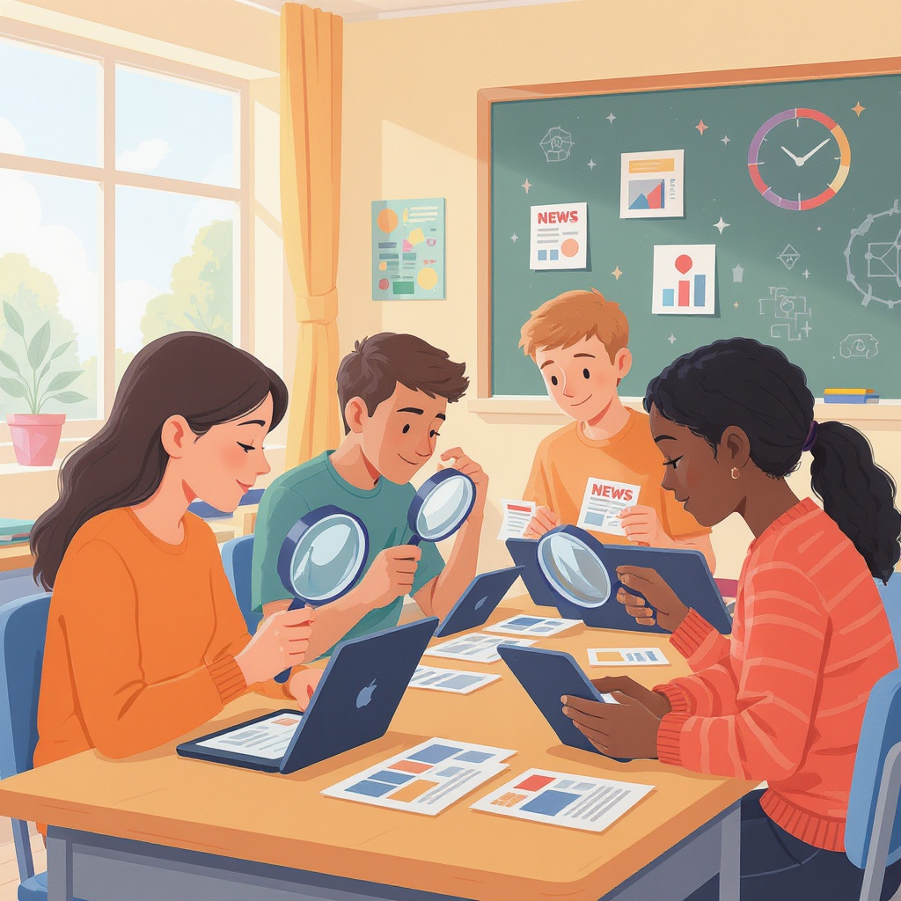

# Что такое информационная и медиаграмотность

**Wiki** [Wikidata](https://www.wikidata.org/wiki/Q242069)  
**Parent topic** Информационная и медиаграмотность  

Информационная и медиаграмотность — это не просто умение пользоваться интернетом или читать новости. Это **навык отличать правду от лжи**, понимать, кто и зачем пишет то, что ты видишь, и принимать осознанные решения на основе информации. В мире, где каждую секунду появляется тысячи постов, видео и сообщений, эти навыки — как броня для твоего разума.

---

## Что такое информационная грамотность?

**Информационная грамотность** — это способность находить, оценивать, использовать и создавать информацию эффективно и этично.  

Простыми словами:  
Ты ищешь информацию — например, “как снять стресс перед экзаменом”.  
Ты находишь 10 статей.  
Но как понять, какая из них правдивая?  
Информационная грамотность помогает ответить на этот вопрос.

### 🔍 Ключевые компоненты:
- **Поиск информации** — умеешь ли ты формулировать запросы в поисковике?
- **Оценка источников** — доверяешь ли ты любому сайту с красивым дизайном?
- **Использование данных** — умеешь ли ты правильно цитировать и не плагиатить?
- **Этичное поведение** — не копируешь ли чужие идеи без указания автора?

> 💡 *Пример:* Ты нашёл статью “5 способов вылечить диабет за 3 дня!” — это подозрительно. Настоящие медицинские рекомендации не обещают чудес за 3 дня.

---

## Что такое медиаграмотность?

**Медиаграмотность** — это умение понимать, анализировать и создавать медиа-контент: видео, рекламу, посты в соцсетях, новости, мемы.

Она помогает ответить на вопросы:
- Почему этот ролик так зацепил?
- Кто стоит за этой рекламой?
- Почему мне показывают именно это, а не что-то другое?

### 📺 Примеры медиаграмотности в жизни:
| Ситуация | Что происходит | Как реагировать |
|----------|----------------|------------------|
| Ты увидел видео “Этот продукт спасёт тебя от всех болезней!” | Это реклама, маскирующаяся под отзыв | Проверь: есть ли у компании сайт? Есть ли реальные отзывы? |
| Твой друг прислал мем “Ученики 8 класса — гении, потому что сдали контрольную на 2!” | Это сарказм, но кто-то может воспринять всерьёз | Подумай: зачем автор так написал? Кто может обидеться? |
| Ты читаешь новость “Учёные доказали: кофе вредит мозгу!” | Это заголовок-приманка (кликбейт) | Прочитай статью до конца — возможно, там говорится о чрезмерном употреблении |

---

## Частые ошибки, которые делают все

Вот что часто принимают за правду — но это **не так**:

- ✖️ *“Если много людей поделилось — значит, это правда.”*  
  → Ложь может распространяться быстрее правды.  
  → *Пример:* В 2020 году в TikTok шёл миф, что “5G вызывает коронавирус” — и его перепостили миллионы.

- ✖️ *“Этот сайт выглядит профессионально — значит, всё правда.”*  
  → Дизайн не гарантирует достоверность. Есть сайты, которые выглядят как BBC, но пишут фейки.

- ✖️ *“Это написал эксперт!”*  
  → А кто он? Где его учёная степень? Есть ли у него конфликт интересов?  
  → Например, человек с “доктором философии” может быть доктором философии по искусству — не по медицине!

- ✖️ *“Это просто шутка — не важно.”*  
  → Мемы и сарказм могут формировать убеждения. Если ты смеёшься над ложью, ты её укрепляешь.

---

## Мини-чек-лист: 5 вопросов, которые нужно задавать каждой новости

Перед тем как поделиться чем-то — пройди этот простой тест:

1. **Кто написал?** — Есть ли имя, организация, контакты?  
2. **Какие доказательства?** — Есть ли ссылки на исследования, данные, цитаты?  
3. **Когда опубликовано?** — Старая новость может быть подана как свежая.  
4. **Зачем это написано?** — Чтобы информировать, напугать, заработать на кликах?  
5. **Проверяли ли другие?** — Ищи ту же новость на надёжных сайтах (например, BBC, Википедия, РИА Новости).

> ✅ Если хотя бы один ответ — “не знаю” или “нет” — не делись этим!

---

## Как развивать эти навыки? Практические советы

### 👨‍🏫 Для учеников:
- **Играй в “Фейк или правда?”** — с друзьями разыгрывайте мини-игру: один пишет фейковую новость, другие угадывают.
- **Используй проверенные источники** — [Википедия: проверяемость](https://ru.wikipedia.org/wiki/Википедия:Проверяемость), [Snopes](https://www.snopes.com/fact-check/), [FactCheck.org](https://www.factcheck.org/our-process/).
- **Смотри видео с критикой** — каналы вроде *“Российская газета: Фактчекинг”* или *“Кто виноват?”* на YouTube объясняют, как распознать ложь.

### 👨‍👩‍👧‍👦 Для родителей:
- Обсуждайте с детьми, что они смотрят в TikTok и YouTube. Не запрещайте — спрашивайте: *“А почему ты решил, что это правда?”*
- Учитесь вместе: откройте [Google Fact Check Tools](https://toolbox.google.com/factcheck/explorer) — там можно проверить любую фразу.

### 🎓 Для учителей:
- Включайте в уроки задания: *“Найдите 3 источника по теме и сравните их”*.

---

## Надёжные источники для проверки информации

| Название | Что делает | Ссылка |
|----------|------------|--------|
| **Snopes** | Проверяет мемы, слухи, вирусные истории | [snopes.com](https://www.snopes.com/fact-check/) |
| **FactCheck.org** | Проверяет политические заявления (на английском) | [factcheck.org](https://www.factcheck.org/our-process/) |
| **Google Fact Check Explorer** | Поиск проверенных фактов по ключевым словам | [toolbox.google.com/factcheck](https://toolbox.google.com/factcheck/explorer) |
| **Википедия (с источниками)** | Не сама по себе — но её ссылки ведут на надёжные книги и статьи | [ru.wikipedia.org](https://ru.wikipedia.org/wiki/Википедия:Проверяемость) |

> ⚠️ Не доверяй только одному источнику. Всегда сравнивай минимум 2–3.

---

## Таблица: Фейк vs Реальность — примеры

| Фейк | Реальность |
|------|------------|
| “Врачи запретили пить воду перед сном — это убивает!” | Нет, это ложь. Вода перед сном безопасна, если не пить литры. |
| “Этот прибор убирает радиацию из воздуха за 5 минут!” | Таких приборов не существует. Радиацию не “убирают” так просто. |
| “Учёные из Гарварда доказали: TikTok разрушает мозг!” | Гарвард не публиковал такое. Это выдумка. |
| “Глобальное потепление — это миф” | Более 97% учёных-климатологов подтверждают: потепление реальное и вызвано людьми. [IPCC](https://www.ipcc.ch/report/ar6/syr/) |
| “Если ты перешлёшь это сообщение — получишь удачу!” | Это “цепочка” — не имеет никакой силы. Но может распространять вирусные троллинги. |

---

## Почему это важно для тебя прямо сейчас?

Ты не просто потребляешь информацию — ты **формируешь своё мнение**, выбираешь друзей, будущую профессию, политические взгляды.  
Если ты веришь фейкам — ты можешь:
- Повредить своей репутации (например, поделишься ложью о друге).
- Попасть на мошенников (например, купить “волшебный” продукт).
- Запутаться в реальности и перестать доверять правде.

А если ты умеешь критически мыслить — ты становишься **лидером**, которого слушают. Ты не просто читаешь новости — ты **понимаешь их**.

---

## Заключение: стань детективом информации

Информационная и медиаграмотность — это не урок в школе. Это **жизненный навык**, как умение вести машину или готовить еду.  
Чем раньше ты начнёшь его развивать — тем увереннее будешь чувствовать себя в цифровом мире.

> ✨ **Помни:**  
> *“Если что-то кажется слишком хорошим, чтобы быть правдой — вероятно, это ложь.  
> Если что-то вызывает сильную эмоцию — задай вопрос: ‘Кто выигрывает от этого?’”*

## См. также

- [Как устроена современная информационная среда](./как_устроена_современная_информационная_среда.md)
- [Критическое мышление в онлайн-среде](./критическое_мышление_в_онлайн_среде.md)
- [Карта компетенций по возрастам](./карта_компетенций_по_возрастам.md)

---
**Авторы:** Попов Александр  
**Слов:** 1075  
**Дата генерации:** 2026-03-12  
**Сервис генерации:** qwen
