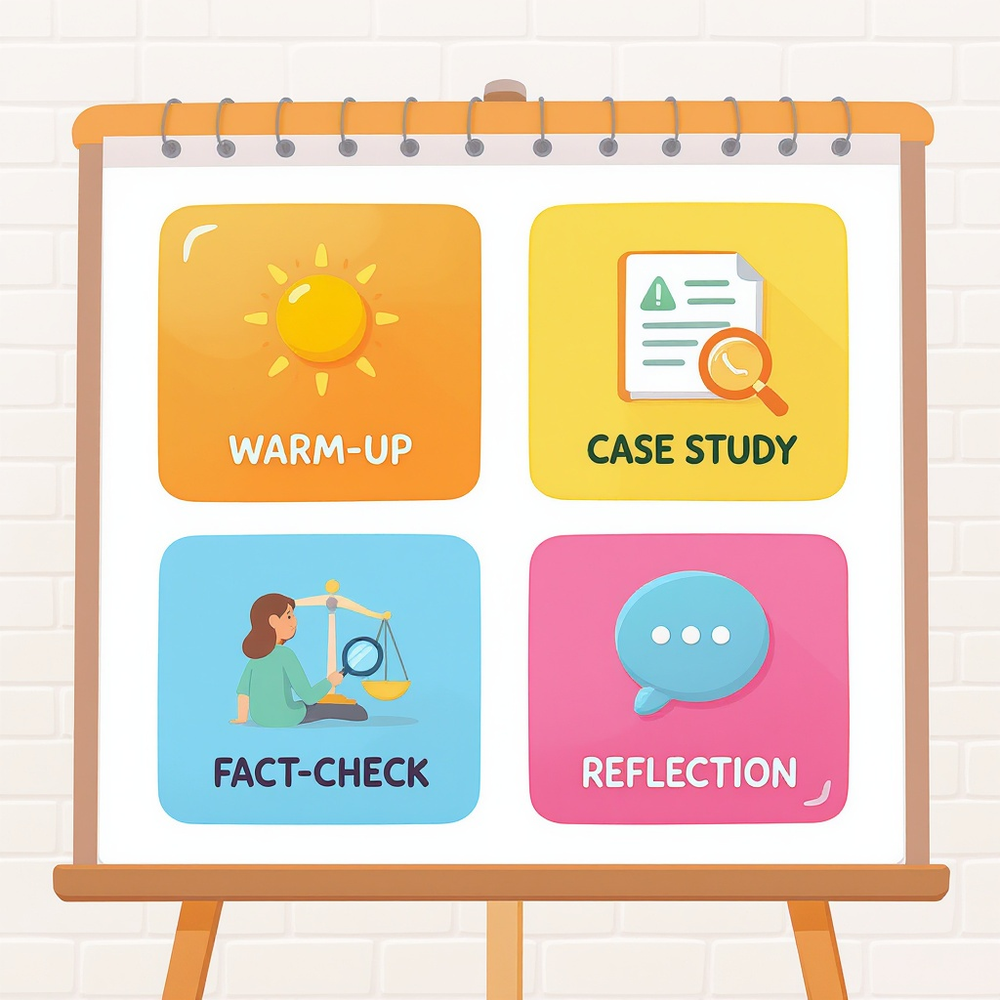

# Шаблон урока по медиаграмотности

**Wiki** [Wikidata](https://www.wikidata.org/wiki/Q2033770)  
**Parent topic** Информационная и медиаграмотность  

Медиаграмотность — это умение понимать, анализировать, оценивать и создавать медиасообщения. В мире, где каждый день мы сталкиваемся с тысячами постов, видео, рекламных роликов и фейковых новостей, эта навык так же важен, как умение читать или считать. Этот шаблон поможет учителям, родителям и даже самим ученикам 8 класса провести эффективный и интересный урок по медиаграмотности.

## Что такое медиаграмотность?

Медиаграмотность — это не просто умение отличать правду от лжи. Это целый набор навыков:

- **Анализ источника**: кто создал сообщение и зачем?
- **Оценка достоверности**: есть ли доказательства? Проверялась ли информация?
- **Понимание манипуляций**: как используют эмоции, стереотипы, заголовки-кликбейты?
- **Создание контента**: как правильно писать пост, чтобы не вводить других в заблуждение?

> 💡 *Пример:* Ты видишь видео, где «учёный» говорит, что «чипы в смартфонах управляют твоими мыслями». Он в лабораторном халате, фон — научный кабинет. Но это реклама браслета «от энергетического вреда». Это классический пример **внешнего обмана** — внешний вид создаёт ложное ощущение авторитетности.

## Ключевые термины, которые должен знать каждый

| Термин | Определение                                                                                             | Пример                                                                                                           |
|--------|---------------------------------------------------------------------------------------------------------|------------------------------------------------------------------------------------------------------------------|
| **Кликбейт** | Заголовок, предназначенный для привлечения кликов, часто с искажением фактов                            | «Ты не поверишь, что произошло с этим котом!» (а там просто кот упал в ведро)                                    |
| **Фейк-новость** | Ложная информация, поданная как правда                                                                  | «В школе запретили пользоваться телефонами — потому что они вызывают мутацию» (нет источников, нет доказательств) |
| **Алгоритм** | Программа, которая решает, какие посты показывать тебе                                                  | Ты смотришь видео про котов — и теперь тебе показывают только котов, даже если ты искал про космос               |
| **Фильтр-пузырь** | Когда алгоритм показывает тебе только то, что ты уже любишь, и ты перестаёшь видеть другие точки зрения | Ты веришь, что Марс — плоский, и алгоритм тебе показывает только подтверждающие это видео                        |
| **Дезинформация** | Ложная информация, распространяемая намеренно                                                           | Фальшивые скриншоты «доказательств» существования вируса, созданные для паники                                   |
| **Манипуляция** | Попытка повлиять на твои чувства или поведение                                                          | Использование плачущего ребёнка в рекламе, чтобы ты купил продукт, даже если он не нужен                         |

## Почему это важно? Примеры из жизни

Представь: ты видишь в ТикТоке видео, где человек говорит:  
> *«Мой учитель сказал, что в 2025 году все школьники будут получать зарплату за учёбу! Вот скрин переписки с директором!»*

Что делать?

1. **Не делай репост!**  
2. **Проверь источник**: кто автор? Есть ли профиль? Есть ли другие подтверждения?  
3. **Ищи контекст**: Может, это юмор? Пародия?  
4. **Проверь дату**: Скрин — от 2022 года? Тогда это устаревшая ложь.  
5. **Задай вопрос**: А почему бы не спросить у учителя?

> 🚫 **Распространённая ошибка**: Доверять вирусным постам, потому что «их уже тысячи раз пересылали».  
> ✅ **Правило**: Чем больше людей поделились — тем больше шансов, что это **фейк**.

## Шаблон урока по медиаграмотности (для учителей и родителей)

### 🕒 Продолжительность: 45–60 минут  
### 👥 Аудитория: 8 класс (можно адаптировать для родителей)

#### 1. Введение (5–7 мин)
- Задай вопрос: *«Кто из вас когда-нибудь верил в сообщение, которое оказалось ложным?»*
- Покажи 2–3 ярких примера фейков (можно из [Snopes](https://www.snopes.com) или [FactCheck.org](https://www.factcheck.org)).
- Объясни: *«Мы не учимся бояться интернета — мы учимся в нём разбираться».*

#### 2. Основная часть (25–30 мин)

##### 🔍 Практика: «Разведчик медиа»
Раздели класс на группы. Каждая группа получает 1 медиасообщение:

- Пост в Telegram с заголовком *«Школа в Москве убрала математику — потому что она «вредит детям»»*  
- Видео на YouTube: *«Учёные доказали: если пить воду с лимоном, ты перестанешь стареть»*  
- Твит с фото: *«Это фото из Украины 2025 года — а на самом деле это фото из 2014 года»*

**Задача:**  
- Определить тип сообщения (новость, реклама, шутка?)  
- Найти признаки манипуляции  
- Проверить источник (поиск в Google, reverse image search)  
- Решить: **Правда? Ложь? Не знаю?**

> 💡 **Совет учителю**: Используй инструменты [Google Reverse Image Search](https://images.google.com) или [TinEye](https://tineye.com) — просто загрузи фото, и он покажет, где оно раньше появлялось.

##### 📊 Обсуждение: «Кто выигрывает от лжи?»
- Кто создал это сообщение?  
- Что он хочет: денег, внимания, страха, политической поддержки?  
- Кому это вредит?

#### 3. Создание контента (10–15 мин)
Теперь ученики сами становятся «медиа-продюсерами».

**Задание:**  
Создай **реалистичный фейк** — но с подсказкой, что это шутка. Например:  
> *«Новый закон: все, кто не знает формулу Эйнштейна, не могут ходить в школу. #ФейкПроверка»*

Затем — обменяйтесь сообщениями и попробуйте «раскрыть» фейк друг друга.

> ✅ Цель: понять, как легко создать ложь — и как важно делать это ответственно.

#### 4. Заключение и чек-лист (5 мин)

### ✅ Мини-чек-лист: «Проверь перед репостом»

- [ ] Я прочитал сообщение **до конца** — не только заголовок?
- [ ] Я проверил **источник** — кто его опубликовал?
- [ ] Я искал **другие источники** — есть ли это в известных СМИ?
- [ ] Я проверил **дату** — это актуально?
- [ ] Я не чувствую сильной эмоции (гнев, страх, восторг)?  
- [ ] Я не стал жертвой **фильтр-пузыря** — а может, это только моя «вселенная»?

> 🧠 *Запомни:* Если сообщение вызывает сильную эмоцию — **остановись**. Это не случайность.

## Что делать родителям?

- **Не запрещайте** — объясняйте.  
- **Смотрите вместе** с ребёнком трендовые видео. Спрашивайте: *«Как ты думаешь, это правда?»*  
- **Используйте игры**: «Угадай фейк» — по одному сообщению в день.  
- **Покажите, как проверить**: откройте Google вместе и найдите информацию о том же событии.

> 👨‍👩‍👧‍👦 *Родительский совет:* Не говори: «Это ложь». Говори: *«Давай вместе проверим, почему это может быть неправдой»*.

## Где проверять информацию? (Надёжные ресурсы)

| Ресурс | Что даёт | Ссылка |
|--------|----------|--------|
| **Snopes** | Проверка мемов, слухов, фейков | [snopes.com](https://www.snopes.com) |
| **FactCheck.org** | Проверка политических заявлений и новостей | [factcheck.org](https://www.factcheck.org) |
| **MediaSmarts** | Учебные материалы для учителей (на английском) | [mediasmarts.ca](https://mediasmarts.ca) |

> 🌐 Все эти сайты — **бесплатные**, **без рекламы** и работают на основе фактов.

## Почему это не «ещё один урок» — а навык на жизнь?

Медиаграмотность — это не про «не верь всему». Это про **критическое мышление**.  
Ты будешь:  
- Проверять информацию перед покупкой  
- Не попадать на мошеннические схемы  
- Не распространять вредные мемы  
- Быть увереннее в своих решениях

> 💬 *«Лучше быть умным, чем популярным» — вот девиз медиаграмотного человека.*

## См. также

- [Фактчекинг пошагово](./фактчекинг_пошагово.md)
- [Авторское право и честное использование](./авторское_право_и_честное_использование.md)
- [Карта компетенций по возрастам](./карта_компетенций_по_возрастам.md)

---
**Авторы:** Фролов Вячеслав  
**Слов:** 1045  
**Дата генерации:** 2026-03-12  
**Сервис генерации:** qwen
