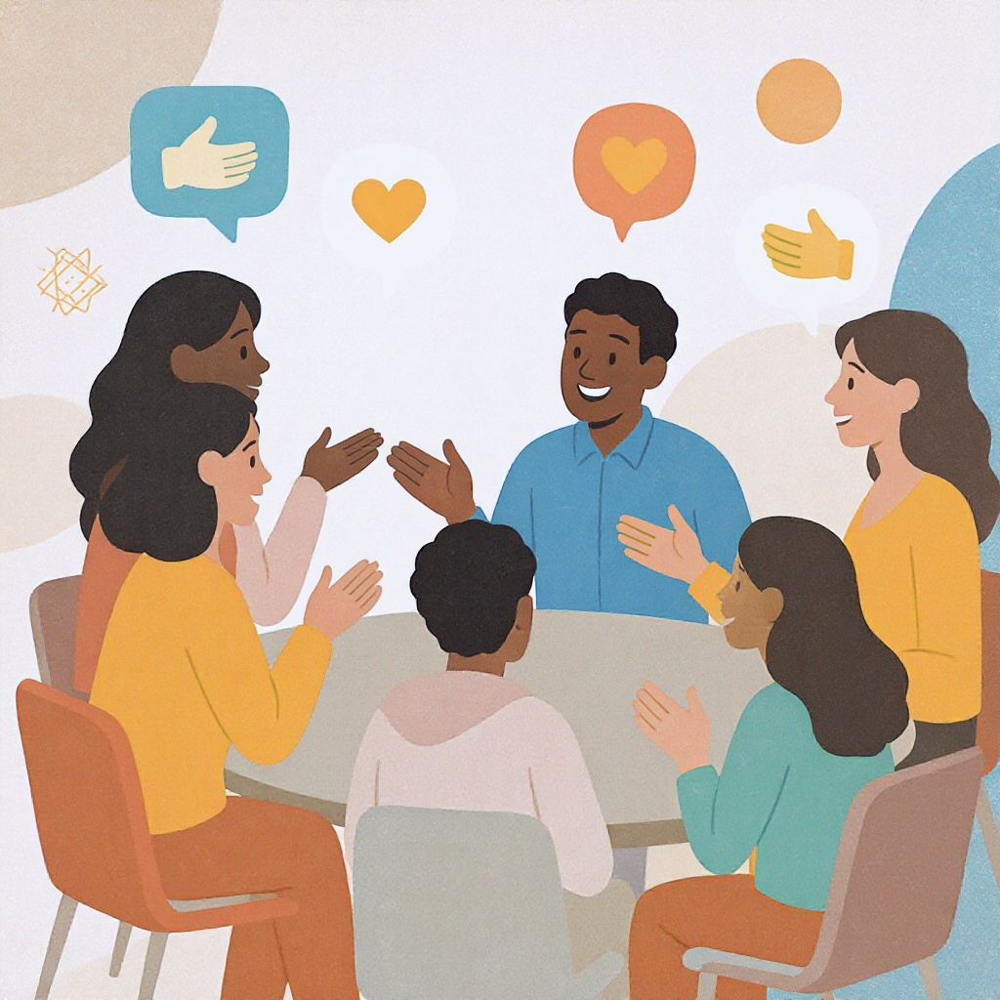

# Этика общения в сети

**Wiki** [Wikidata](https://www.wikidata.org/wiki/Q204554)  
**Parent topic** Информационная и медиаграмотность  

В современном мире мы проводим огромное количество времени в интернете: учимся, общаемся, смотрим видео, играем и даже общаемся с друзьями через мессенджеры. Но не все, что можно написать в чате — стоит писать. **Этика общения в сети** — это набор правил вежливости, уважения и ответственности, которые помогают нам взаимодействовать с другими людьми онлайн так, чтобы никто не пострадал, а все остались довольны.

---

## Что такое этика общения в сети?

Этика общения в сети (или **нетикет**) — это правила поведения в интернете, которые помогают избежать конфликтов, обид и даже кибербуллинга. Это не законы, но они важны, как правила дорожного движения: если их не соблюдать, кто-то может пострадать.

> **Ключевые термины:**
> - **Кибербуллинг** — намеренное запугивание, оскорбление или унижение человека через интернет.
> - **Троллинг** — сознательное провоцирование конфликтов или злых реакций ради развлечения.
> - **Фейковые новости** — ложная информация, поданная как правда, чтобы ввести людей в заблуждение.
> - **Цифровая след** — всё, что вы оставляете в интернете: посты, комментарии, фото, даже удалённые.

### Почему это важно?
Ты можешь думать: «Это же просто интернет, никто не узнает». Но на самом деле:
- Твои слова могут ранить человека глубже, чем ты думаешь.
- То, что ты опубликуешь сегодня, может остаться в интернете навсегда — даже если ты это удалишь.
- Учителя, работодатели и даже будущие друзья могут увидеть твои прошлые посты.

---

## Частые ошибки в онлайн-общении

Вот что **не стоит делать**, даже если кажется, что это «просто шутка»:

- **Писать оскорбления** под ником или анонимно — это не делает тебя «смелым», это делает тебя жестоким.
- **Рассказывать чужие секреты** — даже если «это просто сплетня».
- **Публиковать фото или видео других без разрешения** — это нарушение личной жизни.
- **Отвечать на гневные сообщения гневом** — это только раздувает конфликт.
- **Распространять фейковые новости** — даже если «все это пишут».
- **Использовать капс** — это как кричать. Даже если ты в восторге, лучше написать: *«Это классно!»*.

> 💡 **Запомни**: в интернете ты не «невидимка». Ты — человек, и твои слова имеют последствия.

---

## Как вести себя правильно: практические советы

Вот 5 простых, но мощных правил, которые сделают тебя уважаемым пользователем сети:

### ✅ 1. Подумай, прежде чем писать
Перед отправкой сообщения задай себе вопросы:
- Что я хочу этим сказать?
- Как это может воспринять другой человек?
- Буду ли я гордиться этим постом через год?

### ✅ 2. Не пиши в гневе
Если ты зол, разочарован или обижен — **не пиши сразу**. Отойди на 10 минут, посмотри видео, подыши. Потом перечитай сообщение. Часто ты сам поймёшь: «Это было слишком».

### ✅ 3. Уважай чужое мнение
Даже если кто-то думает иначе — не оскорбляй. Скажи:  
> *«Я понимаю твою точку зрения, но я думаю иначе, потому что…»*  
Это называется **конструктивной критикой** — и это признак зрелости.

### ✅ 4. Не делай репост, пока не проверишь
Перед тем как поделиться новостью:
- Проверь источник: это официальный сайт? Известное СМИ?
- Погугли фразу: «[фраза] фейк» — часто найдёшь разоблачения.
- Используй сайты вроде [Snopes](https://www.snopes.com) или [FactCheck.org](https://www.factcheck.org).

### ✅ 5. Если ты видишь, как кого-то обижают — действуй
Не молчи.  
- Напиши автору сообщения: *«Это не круто. Так нельзя»*.  
- Поддержи жертву: *«Ты не один»*.  
- Сообщить взрослому или модератору — это не «донос», это **героизм**.

---

## Мини-чек-лист: Ты этичный пользователь?

Проверь себя перед тем, как отправить сообщение:

| Вопрос                                                          | Да | Нет |
|-----------------------------------------------------------------|----|-----|
| Я написал это, чтобы помочь, а не оскорбить?                    | ☐ | ☐ |
| Я получил разрешение на публикацию фото/видео другого человека? | ☐ | ☐ |
| Я проверил, правда ли эта новость?                              | ☐ | ☐ |
| Я бы сказал это человеку в глаза?                               | ☐ | ☐ |
| Я готов принять ответную критику на свои слова?                 | ☐ | ☐ |

> ✅ Если ты ответил «Да» на все вопросы — ты молодец!  
> ❌ Если есть «Нет» — подумай, стоит ли отправлять это сообщение.

---

## Что делать, если тебя обижают в сети?

Если ты стал жертвой кибербуллинга:

1. **Не отвечай** — тролли хотят, чтобы ты злился.
2. **Сохрани доказательства** — сделай скриншоты (без удаления сообщений).
3. **Обратись к взрослому** — родителю, учителю, школьному психологу.
4. **Заблокируй** обидчика — ты имеешь право на безопасность.
5. **Сообщи на платформу** — в Telegram, VK, Instagram есть кнопки «Пожаловаться».

> 🚨 **Важно**: если тебе угрожают физической расправой, немедленно сообщи взрослому и в полицию. Это не «просто интернет», это преступление.

---

## Ресурсы для глубокого изучения

Хочешь узнать больше? Вот проверенные и понятные источники:

- [**StopBullying.gov**](https://www.stopbullying.gov/cyberbullying/what-is-it) — официальный сайт США о кибербуллинге. Просто, с примерами и видео.
- [**Common Sense Media**](https://www.commonsensemedia.org/) — отличный сайт для подростков и родителей о цифровой безопасности и этике.
- [**Cyberbullying Research Center**](https://cyberbullying.org/) — научные исследования и практические советы.
- [**Google’s Be Internet Awesome**](https://beinternetawesome.withgoogle.com/ru_ru) — интерактивная игра для детей и подростков про безопасность в сети.

---

## Для родителей и учителей

Вы — ключевые фигуры в формировании цифровой этики у подростков. Вот что можно сделать:

- **Обсуждайте онлайн-ситуации** — не только о вреде, но и о добре: «Как ты поступил, когда увидел, как кто-то оскорбил друга?»
- **Не запрещайте, а объясняйте** — запреты работают слабее, чем понимание.
- **Используйте примеры из реальной жизни** — статьи, видео, истории друзей.
- **Будьте примером** — если ты не пишешь в гневе, не распространяешь фейки и не публикуешь фото без спроса — дети это заметят.

> 👨‍👩‍👧‍👦 **Совет**: Запустите «Семейный цифровой договор» — список правил, которые вы все вместе составляете и подписываете. Это работает лучше, чем наказания.

---

## Заключение: Ты — часть цифрового сообщества

Интернет — это не игра. Это место, где живут реальные люди — как ты. Твои слова могут поднять кого-то на ноги или сломать ему жизнь. Ты не обязан быть идеальным, но ты можешь **выбирать доброту**.

> **«Если ты не можешь сказать что-то хорошее — лучше промолчи»** — это правило работает и в школе, и в интернете.

Соблюдая этику общения в сети, ты не просто избегаешь проблем — ты становишься человеком, на которого можно положиться. И это самое ценное качество в любом мире — реальном или цифровом.

## См. также

- [Кибербуллинг: как распознать и действовать](./кибербуллинг_как_распознать_и_действовать.md)
- [Приватность и цифровой след](./приватность_и_цифровой_след.md)
- [Цифровая репутация](./цифровая_репутация.md)

---
**Авторы:** Ефимов Сергей  
**Слов:** 1025  
**Дата генерации:** 2026-03-12  
**Сервис генерации:** qwen
