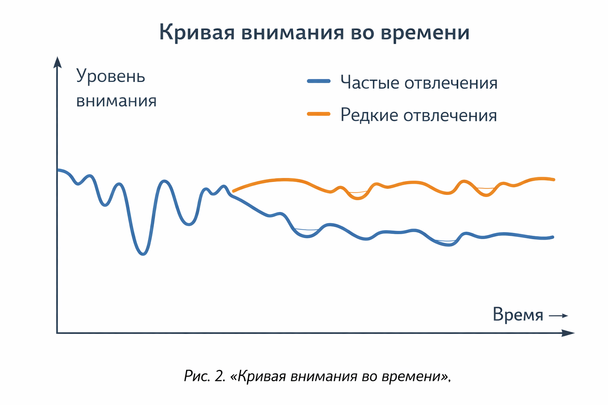

# Сокращение внимания: почему мозг устаёт и «просит новое»

Про внимание часто говорят так, будто это батарейка: «раньше держало час, теперь — пять минут». Реальность интереснее. **Внимание — не одна кнопка, а целая система управления:** что заметить, что игнорировать, на чём удержаться, когда переключиться.

---

## Внимание: что это за «сила»

У тебя есть несколько видов внимания:

- **Выборочное внимание** — в шумном классе ты слышишь именно своё имя.
- **Устойчивое внимание** — можешь делать одно и то же долго (читать, решать задачи).
- **Переключаемое внимание** — было «математика», стало «ответить учителю».
- **Разделённое внимание** — попытка делать несколько дел сразу.

Главный миф: «человек может быть очень многозадачен». На деле мозг чаще **быстро переключается**, и каждое переключение стоит энергии и времени. Это как в игре: если постоянно менять оружие, ты вроде активный, но теряешь секунды на смену.

---

## Почему кажется, что внимание «сократилось»

Причин несколько, и они складываются.

### 1) Уведомления тренируют «режим тревоги»

Каждое «дзынь» — сигнал: вдруг там что-то важное?  
Даже если ты не берёшь телефон, мозг уже сделал микро-поворот внимания в сторону «а что там?». И так десятки раз в день.

### 2) Бесконечная лента = бесконечный выбор

Раньше контент был конечным: глава закончилась — отдых.  
Лента **не заканчивается**. Мозг всё время ощущает: «там может быть ещё лучше». Это мешает остановиться и «дожевать» мысль.

### 3) Яркое выигрывает у спокойного

Короткое видео с музыкой и монтажом «перекрикивает» учебник.  
Не потому что учебник плохой, а потому что он спокойный, а яркое мозг замечает автоматически. Это встроенная функция: человек выживал, замечая резкие сигналы.

### 4) Недосып и усталость бьют по вниманию сильнее, чем кажется

Если спишь мало, внимание становится «скользким»: читать трудно, мысли расползаются. Иногда кажется, что виноват телефон, а виноваты ещё и сон, стресс, перегруз.

Вот почему разговор про внимание — это всегда про **весь режим жизни**, а не только про приложения.

---

## Это всегда плохо? Не совсем

Иногда «короткое внимание» — это сигнал не про технологии, а про состояние:

- перегруз уроками и кружками,
- тревога,
- хроническая усталость,
- отсутствие отдыха.

Но цифровая среда действительно может натренировать привычку: как только становится чуть скучно — **переключаться**.

---

## Что происходит, когда мы часто переключаемся

Представь, что у тебя есть маленький «переключатель передач» в голове. Он не ломается, но устаёт от постоянных смен. В итоге:

- сложнее входить в **поток** (когда делаешь и не замечаешь времени),
- труднее запоминать (в памяти остаются обрывки),
- кажется, что всё время занят, но мало сделано,
- мысли становятся более «кусочными».

Это как пытаться читать книгу, каждые 30 секунд закрывая её и открывая другую.

---

## «Сокращение внимания» — не только про подростков

Взрослые тоже страдают: совещания, мессенджеры, новости, уведомления. Просто подросткам сложнее, потому что мозг ещё учится управлять вниманием, а вокруг — много соблазнов.

---

## Мини-эксперимент на 2 минуты: «Сколько раз моё внимание рассеивается?»

1. Поставь таймер на 2 минуты.
2. Сиди и делай одно простое: читай абзац или решай один пример.
3. Каждый раз, когда хочется отвлечься (в чат, в ленту, в мысли «проверю…») — ставь палочку на полях.

Часто получается больше, чем ожидаешь. И это не «плохой характер» — это привычка мозга к переключениям.

---

## Смотри также

- [Клиповое мышление: когда мир выглядит как лента](1-Клиповое_мышление_когда_мир_выглядит_как_лента.md) — как привычка к коротким фрагментам связана с сокращением внимания
- [Как прокачать внимание и приручить клипы](1-Как_прокачать_внимание_и_приручить_клипы.md) — практические способы вернуть фокус и натренировать устойчивое внимание
- [Дофаминовая петля: как алгоритмы управляют твоим вниманием](2-Дофаминовая%петля.md) — почему бесконечная лента и уведомления так затягивают с точки зрения нейробиологии
- [Трансформация мышления: как интернет меняет наши когнитивные способности](4-internet_thinking_transformation.md) — исследования о многозадачности и о том, как переключения снижают эффективность

---
**Авторы:** Ветошкина София, tg @sofiavetoshkina  
**Ресурсы:** LLM — ChatGPT, ВОЗ
