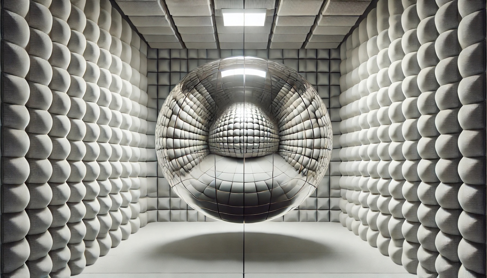

# Ловушка «Эхо-камеры»: Почему интернет нам поддакивает

**Wiki** [Wikidata (Q3334446)](https://www.wikidata.org/wiki/Q3334446)  
**Parent topic** Цифровая психология

Представь, что ты заходишь в комнату, где каждый встречный соглашается с любым твоим словом. Ты говоришь: «Пицца с ананасами — это шедевр», и все вокруг кивают. Приятно? Безусловно. Но через неделю в такой комнате ты начнешь верить, что людей, не любящих ананасы в пицце, просто не существует.

В цифровом мире это называется **эхо-камерой** (от англ. _echo chamber_). Это ситуация, в которой информация или идеи подкрепляются путём их повторения внутри закрытой системы, а альтернативные точки зрения просто не доходят до адресата.

---

## 1. Пузырь фильтров: Твоя персональная реальность

Алгоритмы соцсетей (YouTube, TikTok, VK) созданы с одной целью — удержать твоё внимание как можно дольше. Для этого они анализируют каждый твой лайк, клик и даже секунды, потраченные на просмотр видео.

Так возникает **пузырь фильтров** (термин ввёл интернет-активист Илай Парайзер). Алгоритм «отрезает» всё, что тебе неприятно или неинтересно.

- **Иллюзия большинства:** Если ты смотришь ролики о вреде видеоигр, твоя лента заполнится единомышленниками. Тебе начнёт казаться, что весь мир думает так же, хотя на самом деле ты просто заперт в цифровом коконе.

---

## 2. Предвзятость подтверждения: Ловушка мозга

Наш мозг ленив. Ему гораздо приятнее получать информацию, которая подтверждает его правоту, чем ту, которая заставляет сомневаться. Это психологический феномен — **предвзятость подтверждения** (_confirmation bias_).

Когда алгоритм подсовывает пост, с которым ты согласен, мозг получает микродозу дофамина («Я же говорил!»). В результате:

- Мы разучиваемся критически мыслить.
- Мы перестаём вести конструктивные споры, потому что оппоненты из «другого лагеря» кажутся нам глупыми или злыми — ведь мы их аргументов просто не видим.

---

## 3. Радикализация: Погоня за вниманием

Чтобы ты не заскучал, алгоритмы часто повышают «градус». Если ты заинтересовался здоровым питанием, через неделю тебе могут начать предлагать видео о экстремальных диетах. Это называется **радикализацией контента**.

Алгоритму всё равно, полезна ли информация. Главное, что шокирующий или более резкий контент вызывает сильную эмоцию, а значит — ты дольше не закроешь приложение.

---

## Как «лопнуть» пузырь?

Полностью выйти из системы сложно, но можно сделать свой кругозор шире:

1. **Подпишись на «других»:** Найди блогеров или СМИ, с которыми ты категорически не согласен, и иногда читай их аргументы.
2. **Чисти историю:** Время от времени сбрасывай историю поиска или используй режим инкогнито.
3. **Проверяй факты:** Если новость вызывает у тебя слишком сильный восторг или гнев — скорее всего, это манипуляция.

**Мир гораздо сложнее и интереснее, чем твоя лента рекомендаций!**

---

## Источники для любознательных

- **Основной источник:** [Энциклопедия «Британника» (Echo chamber)](https://www.britannica.com/topic/The-Echo-Chamber)
- **Элемент Викиданных:** [Q3334446 (Echo chamber)](https://www.wikidata.org/wiki/Q3334446)
- **Статья на DBpedia:** [Echo_chamber_(media)](https://dbpedia.org/page/Google's_Ideological_Echo_Chamber)

---

## Смотри также

- [Как работают рекомендации: от клика до «умной» ленты](2-Как%работают%рекомендации.md) — как именно алгоритмы создают «пузырь фильтров» из твоих кликов и лайков
- [Дофаминовая петля: как алгоритмы управляют твоим вниманием](2-Дофаминовая%петля.md) — почему мозг «подсаживается» на подтверждение своей правоты и как дофамин усиливает эхо-камеру
- [Коллективный интеллект: как миллионы умов создают общее знание](4-internet_collective_intelligence.md) — как эхо-камеры разрушают условия для «мудрости толпы»
- [Трансформация мышления: как интернет меняет наши когнитивные способности](4-internet_thinking_transformation.md) — критическое мышление и информационная гигиена как защита от манипуляций
- [Обман в интернете в эпоху нейросетей](5-ai_internet_deception_article.md) — как дезинформация и deepfake усиливают эффект эхо-камер

---
**Авторы:** Слободин Никита  
**Ресурсы:** LLM — Gemini 3.1 Pro Thinking
