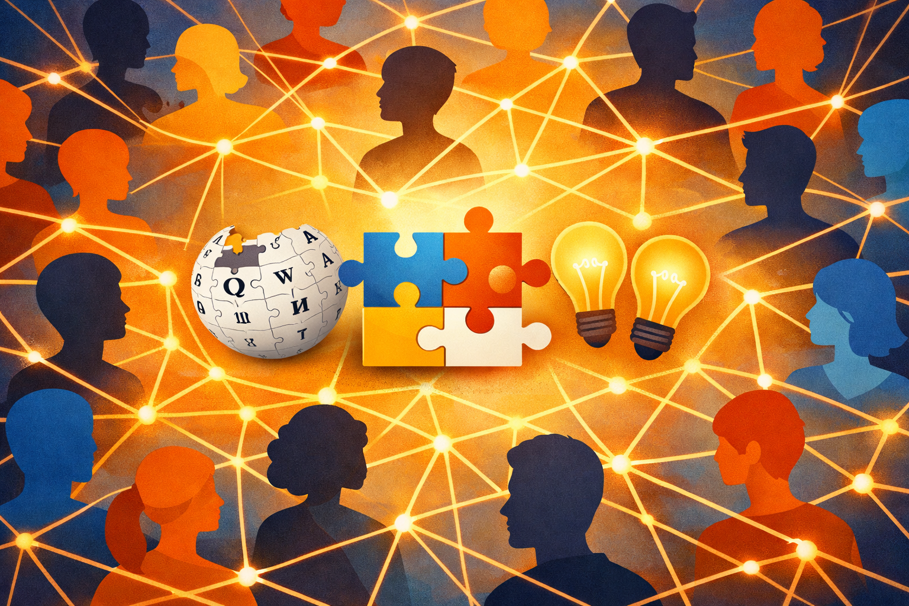

# Коллективный интеллект: как миллионы умов создают общее знание

## Феномен совместного создания информации в цифровую эпоху

Интернет — это не просто склад данных, это живая, дышащая система, которую ежесекундно создают и обновляют миллионы людей по всему миру. Каждый пост в блоге, каждый комментарий на форуме, каждая правка в Wikipedia — это кирпичик в здании общечеловеческого знания.

## Что такое коллективный интеллект

Термин "коллективный интеллект" ввел исследователь Пьер Леви в 1990-х годах. Он определил его как "способность человеческих групп сотрудничать в интеллектуальной деятельности". Проще говоря, это когда много людей вместе думают лучше, чем один самый умный человек.

**Уровни коллективного интеллекта:**

| Уровень | Пример | Как работает |
|:---------|:--------|:--------------|
| Микро | Семья, школьный класс | Люди знают друг друга лично, распределяют роли |
| Мезо | Город, профессиональное сообщество | Люди не знают всех, но есть общие правила и цели |
| Макро | Интернет, всё человечество | Анонимное взаимодействие через платформы |

## Примеры коллективного интеллекта в интернете

### 1. Wikipedia — энциклопедия, которую может править каждый

Запущенная в 2001 году, Wikipedia стала крупнейшим собранием знаний в истории человечества. На сегодняшний день в ней более 60 миллионов статей на сотнях языков.

**Как это работает:**

* Любой человек может создать или отредактировать статью.
* Сообщество добровольцев следит за изменениями и откатывает вандализм.
* Статьи обсуждаются на страницах обсуждения.
* Действует правило "нейтральной точки зрения" — все значимые точки зрения должны быть представлены.
* Каждый факт должен подтверждаться ссылкой на авторитетный источник.

**Интересный факт:** исследования показывают, что Wikipedia по точности сравнима с Британникой (традиционной авторитетнейшей энциклопедией), а по актуальности — превосходит её многократно. Новости попадают в Wikipedia через часы, а в бумажные энциклопедии — через годы.

### 2. Stack Overflow — база знаний программистов

Это сайт, где программисты задают вопросы и отвечают на них. Каждый вопрос может получить несколько ответов, сообщество голосует за лучшие.

**Принципы работы:**

* Репутация пользователей растет за полезные ответы.
* Модераторы следят за порядком и удаляют мусор.
* Вопросы группируются по тегам (языкам программирования, технологиям).
* Запрещено задавать вопросы, на которые уже есть ответы (поиск работает жестко).

**Результат:** огромная база готовых решений. Любой программист сначала ищет ошибку на Stack Overflow, и в 90% случаев она уже там описана.

<!--- Stack Overflow — идеальный пример того, как коллективный разум работает эффективнее индивидуального. --->

### 3. OpenStreetMap — карты мира, нарисованные людьми

В отличие от Google Maps, которые создаются профессиональными картографами, OpenStreetMap рисуют обычные люди. Каждый может добавить тропинку в своем районе, отметить новый магазин или пешеходный переход.

**Преимущества:**

* Детализация — местные жители знают свой район лучше любых спутников.
* Актуальность — изменения вносятся моментально.
* Свобода — карты можно скачивать и использовать бесплатно.
* Глобальность — есть даже карты отдаленных уголков, где спутники не снимают.

### 4. YouTube — крупнейшая образовательная платформа

То, что начиналось как сайт для домашних видео, превратилось в гигантскую библиотеку знаний. На YouTube можно научиться чему угодно: от вязания носков до квантовой физики.

**Формы коллективного знания на YouTube:**

* Обучающие ролики (миллионы людей делятся навыками).
* Лекции университетов (выкладываются официально и неофициально).
* Научно-популярные каналы (сложные темы объясняются доступно).
* Комментарии (часто в комментариях дополняют и исправляют авторов).
* Плейлисты (пользователи собирают подборки видео по темам).

## Мудрость толпы: условия и ограничения

Феномен "мудрости толпы" открыл Фрэнсис Гальтон в 1906 году. На ярмарке он предложил людям угадать вес быка. Индивидуальные ответы сильно различались, но среднее арифметическое всех ответов оказалось почти точным.

**Условия для мудрости толпы:**

1. **Разнообразие мнений.** Люди должны смотреть на проблему с разных сторон.
2. **Независимость.** Мнения не должны влиять друг на друга.
3. **Децентрализация.** Люди используют свое локальное знание.
4. **Агрегация.** Должен быть механизм сбора и усреднения ответов.

В интернете эти условия работают, но есть серьезные проблемы.

## Эхо-камеры и пузыри фильтров

Когда условия нарушаются, мудрость толпы превращается в глупость толпы. Главная угроза — алгоритмические ленты социальных сетей.

**Как работают алгоритмы:**

1. Вы ставите лайк на какой-то пост.
2. Алгоритм запоминает: "этот пользователь любит такое".
3. Вам показывают больше похожего контента.
4. Вы все реже видите то, что вам не нравится.
5. Со временем вы оказываетесь в пузыре, где все думают так же, как вы.
6. Мнения, отличные от ваших, кажутся вам глупыми или враждебными.

**Последствия эхо-камер:**

| Эффект | Описание | Пример |
|:--------|:---------|:-------|
| Поляризация | Крайние мнения усиливаются | "Все наши правы, все чужие — враги" |
| Иллюзия консенсуса | Кажется, что все думают как ты | Удивление результатам выборов |
| Снижение критичности | Информация внутри пузыря не проверяется | Распространение фейков |
| Невозможность диалога | Разные группы перестают понимать друг друга | Политические конфликты в соцсетях |

## Как отличить правду от лжи в коллективном знании

**Методы проверки информации:**

1. **Правило трех источников.** Нашел интересный факт? Найди еще два независимых источника, которые его подтверждают. Если информация только в одном месте — скорее всего, это фейк.
2. **Проверка автора.** Кто написал текст? Реальный эксперт, журналист, блогер или аноним? Есть ли у него репутация?
3. **Проверка даты.** Информация могла устареть. То, что было правдой в 2010 году, сегодня может быть ложью.
4. **Поиск первоисточника.** Новостные сайты часто перевирают факты. Найди оригинал исследования, официальный документ, прямое видео.
5. **Критическое отношение к заголовкам.** Заголовки пишут, чтобы привлечь внимание. Прочитай текст целиком, прежде чем верить.

## Будущее коллективного интеллекта

Ученые работают над тем, чтобы объединить людей и искусственный интеллект в единые системы. Представьте: вы задаете вопрос, и система собирает ответы от тысяч экспертов, анализирует их, проверяет на противоречия и выдает взвешенный результат. Это следующий уровень коллективного разума.

## Интересные факты

Wikipedia содержит более 60 миллионов статей на 300+ языках. Если бы её распечатать, получилось бы около 20 000 томов — в 40 раз больше, чем Британская энциклопедия.

На Stack Overflow задано более 23 миллионов вопросов, и 74% из них имеют принятый ответ. Сайт посещают более 100 миллионов человек ежемесячно.

OpenStreetMap содержит данные о более чем 8 миллиардах объектов, созданных 10 миллионами участников. В некоторых регионах карты OSM детальнее, чем у Google.

Эксперимент Фрэнсиса Гальтона 1906 года с угадыванием веса быка показал: среднее арифметическое 787 ответов было 1197 фунтов, а реальный вес — 1198 фунтов. Ошибка всего 0,08%.

В 2010 году пользователи Reddit за 72 часа собрали $600 000 для учителя, которому нужны были деньги на операцию. Это пример коллективного действия, организованного через интернет.

Проект Folding@home объединяет вычислительные мощности миллионов компьютеров для моделирования сворачивания белков. В 2020 году он стал мощнее всех суперкомпьютеров мира вместе взятых.

---

## Смотри также

- [Ловушка «Эхо-камеры»: почему интернет нам поддакивает](2-Ловушка.md) — подробнее о том, как эхо-камеры и пузыри фильтров подрывают коллективный интеллект
- [Как работают рекомендации: от клика до «умной» ленты](2-Как%работают%рекомендации.md) — механика алгоритмов, которые создают «информационные пузыри»
- [Внешняя память: интернет как жёсткий диск нашего мозга](4-internet_memory.md) — как интернет стал распределённым хранилищем знаний и частью транзактивной памяти
- [Трансформация мышления: как интернет меняет наши когнитивные способности](4-internet_thinking_transformation.md) — критическое мышление и навыки проверки информации в коллективном знании
- [Обман в интернете в эпоху нейросетей](5-ai_internet_deception_article.md) — как генеративный контент угрожает достоверности коллективного знания

---

Авторы: Дэниз Махмутов, @modestaq;
Ресурсы: LLM - DeepSeek, ChatGPT, Claude, Gemini