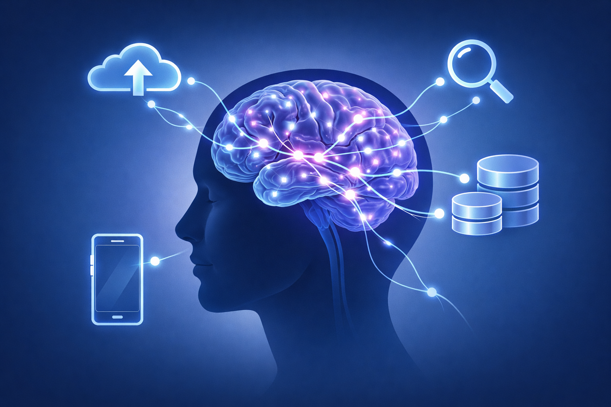

# Внешняя память: интернет как жесткий диск нашего мозга

## Как цифровые технологии изменили способ хранения и использования знаний

Человеческий мозг — удивительный орган, но у него есть жесткие ограничения. Мы не можем запомнить бесконечное количество фактов, дат, имен и цифр. Природа нашла выход: мы запоминаем не саму информацию, а то, где ее найти. В древности это были старейшины племени, в Средневековье — священные тексты и ученые мужи, в XIX веке — энциклопедии и библиотеки. Сегодня главным хранилищем знаний стал интернет.

## Ограничения биологической памяти

Чтобы понять, зачем нам нужна внешняя память, нужно разобраться, как устроен мозг.

**Характеристики человеческой памяти:**

| Тип памяти | Объем | Время хранения | Скорость доступа | Пример |
|:------------|:------|:----------------|:------------------:|:-------|
| Сенсорная | Огромный | До 1 секунды | Мгновенно | Отблеск света, звук пролетевшей мухи |
| Кратковременная | 5–9 элементов | До 30 секунд | Быстро | Номер телефона, который набираешь |
| Долговременная | Практически безграничен | Вся жизнь | От секунд до часов | Лицо мамы, родной язык, таблица умножения |

Главная проблема в том, что **кратковременная память** — это узкое горлышко. Мы можем удерживать в голове одновременно всего 7±2 элемента. Именно поэтому нам трудно запомнить длинный список покупок или сложную инструкцию без записи.

Интернет снимает это ограничение. Мы можем выгружать информацию наружу, освобождая мозг для творчества и анализа.

## Эффект Google: как поисковики изменили нашу память

В 2011 году психологи Бетси Спароу, Дженни Лю и Дэниел Вегнер провели знаменитый эксперимент. Участникам показывали утверждения и просили их запомнить. Одной группе сказали, что информация сохранится в папке на компьютере, другой — что она исчезнет. Результат: те, кто думал, что информация сохранится, запоминали ее хуже.

Этот феномен назвали **эффектом Google**. Наш мозг ленив (с точки зрения энергозатрат) и не тратит ресурсы на запоминание того, что всегда доступно.

**Как изменились стратегии запоминания:**

| Раньше | Сейчас |
|:-------|:-------|
| Заучивали стихи наизусть | Ищем текст по первой строчке |
| Помнили даты всех войн | Гуглим "дата Куликовской битвы" |
| Держали в голове дни рождения друзей | Смотрим в календарь телефона |
| Знать таблицу Менделеева | Открываем картинку в поиске |
| Помнить дорогу домой | Вбиваем адрес в навигатор |

<!--- Важный нюанс: мы не стали глупее. Мы просто перераспределили ресурсы. --->

## Транзактивная память: распределение знаний в группе

Концепцию транзактивной памяти предложил психолог Дэниел Вегнер в 1985 году. Он заметил, что в любых группах (семьях, рабочих коллективах, дружеских компаниях) люди распределяют между собой запоминание информации.

**Классический пример семьи:**

| Член семьи | Что помнит |
|:------------|:-----------|
| Папа | Как менять колесо, где лежат инструменты, как настроить Wi-Fi |
| Мама | Дни рождения всех родственников, рецепты, где что лежит в квартире |
| Ребенок | Как проходить компьютерные игры, где скачать фильмы, пароли от соцсетей |

Никто не помнит всё. Но все знают, *у кого что спросить*. Это и есть транзактивная память.

В XXI веке главным участником этой системы стал интернет. Теперь мы спрашиваем не только у людей, но и у поисковиков. Более того, поисковик часто оказывается умнее любого эксперта, потому что в нем собраны знания миллионов людей.

## Как мы запоминаем сегодня: новый алгоритм

Процесс работы с информацией в современном мире выглядит так:

1. **Встреча с новой информацией.** Мы читаем пост, смотрим видео, слышим новость.
2. **Оценка важности.** Нужно ли это для жизни или просто развлечение?
3. **Если важно:**
   * Раньше: пытались запомнить.
   * Сейчас: сохраняем ссылку, делаем скриншот, добавляем в закладки, записываем ключевые слова для поиска.
4. **При необходимости использования:** ищем по сохраненному пути.

Мы запоминаем не ответы, а **пути доступа к ответам**. Мозг превратился из базы данных в навигационную систему.

## Плюсы внешней памяти

1. **Освобождение когнитивных ресурсов.** Мы не тратим энергию на хранение тонн фактов и можем направить ее на решение сложных задач, творчество, планирование.
2. **Доступность.** Любая информация доступна 24/7 из любой точки мира (где есть интернет).
3. **Актуальность.** В отличие от заученных знаний, интернет-информацию можно постоянно обновлять. Если завтра изменятся правила дорожного движения, вам не нужно переучивать учебник — вы просто найдете новую версию.
4. **Объем.** Ни один человеческий мозг не способен хранить столько, сколько хранит интернет.
5. **Мгновенный поиск.** Найти иголку в стоге сена в интернете можно за секунды благодаря поисковым алгоритмам.

## Минусы и риски внешней памяти

1. **Цифровая амнезия.** Мы действительно перестаем запоминать информацию. Исследования показывают, что люди хуже помнят факты, если знают, что они есть в сети. Проблема в том, что интернет бывает недоступен (сломался телефон, нет связи), и тогда мы оказываемся беспомощными.
2. **Поверхностное усвоение.** Чтобы информация из кратковременной памяти перешла в долговременную, нужно время на ее осмысление и повторение. Когда мы сразу сохраняем ссылку, этого не происходит. Знания остаются чужими, не присвоенными.
3. **Зависимость.** Многие люди испытывают настоящую панику, если оказываются без доступа к сети. Это напоминает ломку у наркоманов. Мы теряем навык думать самостоятельно, полагаясь на готовые ответы.
4. **Искажения.** Поисковики выдают не всю информацию, а ту, которая соответствует алгоритмам и рекламным приоритетам. Мы попадаем в зависимость от корпораций, которые решают, что нам показывать.

## Примеры из жизни

**Ситуация 1: Подготовка к докладу.**
Раньше: нужно было идти в библиотеку, заказывать книги, сидеть в читальном зале, выписывать цитаты от руки. На один доклад уходила неделя.
Сейчас: открываем Wikipedia, смотрим ссылки внизу статьи, копируем ключевые факты, вставляем в презентацию. Доклад готов за час.
Вопрос: качество знаний? В первом случае информация проходила через мозг и осмыслялась. Во втором — осталась на экране.

**Ситуация 2: Потеря телефона.**
Сколько номеров телефонов вы помните наизусть? Ваших родителей? Лучшего друга? Скорой помощи? Большинство людей сегодня не помнят даже свой собственный номер. Потеря телефона означает потерю всей записной книжки. Раньше люди помнили десятки номеров — просто потому, что не было другого выхода.

**Ситуация 3: Дорога в новом районе.**
Раньше люди запоминали маршруты, ориентиры, названия улиц. Сейчас мы просто включаем навигатор и слушаем "через 300 метров поверните направо". Когда навигатор отключается, мы теряемся, потому что мозг не запоминал дорогу — он доверился внешнему устройству.

## Интересные факты

В 2008 году исследователи из Колумбийского университета обнаружили, что люди лучше помнят, где найти информацию, чем саму информацию. Это явление назвали "эффектом Google".

Средний пользователь смартфона проверяет свой телефон 96 раз в день — это каждые 10 минут в период бодрствования.

В 2019 году компания Kaspersky провела опрос: 44% респондентов признались, что не помнят номера телефонов своих детей, потому что они сохранены в контактах.

Исследование 2015 года показало, что студенты, которые делали конспекты от руки, запоминали материал лучше, чем те, кто печатал на ноутбуке. Причина: при письме от руки мозг вынужден перерабатывать информацию, а не просто копировать её.

До изобретения письменности древнегреческие ораторы могли запоминать речи длиной в несколько часов. Сократ предупреждал, что письменность ослабит память — и он оказался прав.

---

## Смотри также

- [Трансформация мышления: как интернет меняет наши когнитивные способности](4-internet_thinking_transformation.md) — как вместе с памятью меняются внимание, чтение и способ обработки информации
- [Коллективный интеллект: как миллионы умов создают общее знание](4-internet_collective_intelligence.md) — Wikipedia, Stack Overflow и другие примеры коллективной «внешней памяти» человечества
- [Сокращение внимания: почему мозг устаёт и «просит новое»](1-Сокращение_внимания_почему_мозг_устает.md) — как постоянные переключения влияют на запоминание и работу мозга
- [Как работают рекомендации: от клика до «умной» ленты](2-Как%работают%рекомендации.md) — алгоритмы, которые решают, какую информацию мы увидим и запомним

---

Авторы: Дэниз Махмутов, @modestaq;
Ресурсы: LLM - DeepSeek, ChatGPT, Claude, Gemini