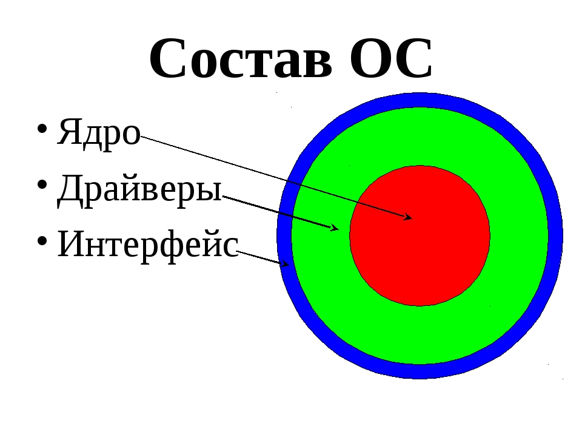
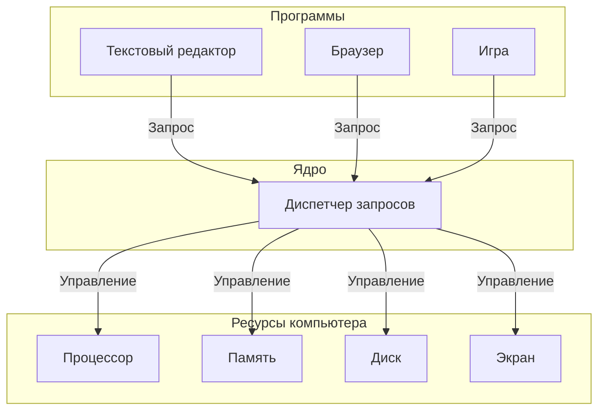

# Ядро операционной системы

## Определение

**Ядро** — это главная часть операционной системы. Это специальная программа, которая всегда работает в компьютере и управляет всеми его частями. Если представить операционную систему как большую фирму, то ядро — это директор этой фирмы. Все программы обращаются к ядру, когда им нужно что-то сделать с компьютером: сохранить файл, показать картинку на экране или отправить данные в интернет.

Ядро существует потому, что программы не могут напрямую работать с частями компьютера. Нужен посредник, который будет раздавать задания и следить, чтобы программы не мешали друг другу. Этим посредником и является ядро.

## Подробное описание

### Зачем нужно ядро

Компьютер состоит из разных частей: процессор (мозг компьютера), память (место для хранения данных), экран, клавиатура и другие устройства. Программы, которыми пользуются люди (браузер, текстовый редактор, игры), не умеют напрямую разговаривать с этими частями. 

Представьте, что в школе много учеников (программы) и один учитель (ядро). Ученики не могут сами решать, когда им выходить к доске или брать учебники. Они поднимают руку и ждут, когда учитель разрешит. Так и программы ждут разрешения от ядра.

Ядро нужно по нескольким причинам:

- **Разделение ресурсов** — чтобы две программы не пытались использовать одну и ту же часть памяти одновременно
- **Защита** — чтобы одна программа не могла сломать другую
- **Удобство** — программисты пишут программы для ядра, а не для каждой модели компьютера отдельно

### Как работает ядро

Когда программа хочет что-то сделать (например, сохранить файл на диск), она отправляет **запрос** ядру. Этот запрос называется **системным вызовом**. Ядро получает запрос, проверяет его и выполняет нужные действия.

### Типы ядер

Существует три основных типа ядер. Они различаются тем, сколько задач выполняет само ядро, а сколько перекладывает на другие программы.

#### Монолитное ядро

В монолитном ядре почти все задачи выполняет само ядро. Это как большой универсальный магазин, где в одном здании есть всё: продукты, одежда, книги и игрушки.

**Преимущества:**
- Работает быстро, потому что все части ядра находятся вместе
- Проще в создании

**Недостатки:**
- Если ломается одна часть, может перестать работать всё ядро
- Трудно добавлять новые функции

#### Микроядро

Микроядро выполняет только самые важные задачи: управление памятью и передачу сообщений между программами. Все остальные задачи (работа с файлами, управление экраном) выполняют отдельные программы. Это как небольшой центральный склад, который только распределяет товары, а магазины находятся в разных местах.

**Преимущества:**
- Если ломается одна часть, остальные продолжают работать
- Легко добавлять новые функции

**Недостатки:**
- Работает медленнее, потому что программам нужно чаще общаться друг с другом

#### Гибридное ядро

Гибридное ядро — это компромисс между монолитным и микроядром. Самые важные части работают внутри ядра для скорости, а менее важные — снаружи для надёжности. Это как магазин с основным залом и отдельными секциями.

### Сравнение типов ядер

| Характеристика | Монолитное ядро | Микроядро | Гибридное ядро |
|----------------|-----------------|-----------|----------------|
| **Скорость работы** | Высокая | Низкая | Средняя |
| **Надёжность** | Низкая | Высокая | Средняя |
| **Сложность создания** | Простое | Сложное | Средней сложности |
| **Примеры систем** | Linux, старые версии Windows | Minix, QNX | Windows, macOS |

### Пример работы ядра

Представьте, что нужно сохранить текст в файл. Вот что происходит:

1. Программа (текстовый редактор) отправляет ядру запрос: «Сохрани этот текст в файл»
2. Ядро проверяет, есть ли место на диске
3. Ядро проверяет, имеет ли программа право записывать файлы
4. Ядро отправляет данные на диск
5. Ядро сообщает программе: «Файл сохранён»

Без ядра программе пришлось бы самой знать, как работает диск, сколько на нём места и как записывать данные. Это очень сложно, поэтому и существует ядро.

### Почему ядро всегда работает

Ядро загружается в память сразу после включения компьютера и работает до выключения. Это нужно потому, что программы постоянно обращаются к ядру за помощью. Если ядро перестанет работать, все программы потеряют управление и компьютер перестанет отвечать.

## Резюме

Ядро — это главная часть операционной системы, которая управляет всеми ресурсами компьютера. Программы не работают с компьютером напрямую, а отправляют запросы ядру. Существует три типа ядер: монолитное (всё в одном), микроядро (только самое важное) и гибридное (смешанное). Каждый тип имеет свои преимущества и недостатки. Ядро нужно для того, чтобы программы не мешали друг другу и могли удобно работать с компьютером.

## См. также

- [[operating_system|Операционная система]]
- [[process|Процессы в операционной системе]]
- [[memory_management|Управление памятью]]
- [[file_system|Файловая система]]
- [[HAL|Слой аппаратных абстракций]]
- [[scheduling|Планирование задач]] 
