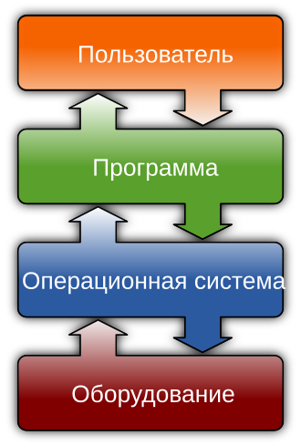
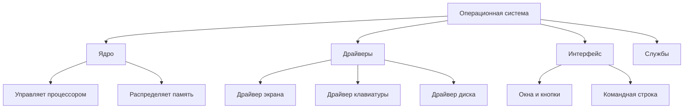
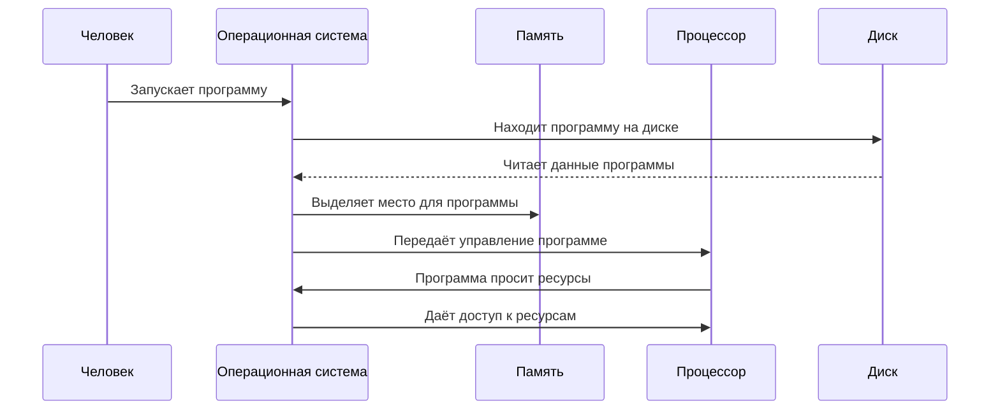
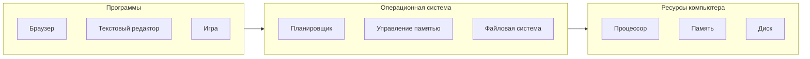

# Операционная система

## Определение

**Операционная система** — это главная программа на компьютере, которая помогает всем остальным программам работать и управляет всеми частями компьютера. Если представить компьютер как большой дом, то операционная система — это хозяин дома, который открывает двери гостям (программам), раздаёт им комнаты (память, доступ к оборудованию) и следит, чтобы все работали дружно.

Без операционной системы компьютер был бы как машина без водителя — много деталей, но никто не знает, куда ехать и что делать.

## Подробное описание

### Зачем нужна операционная система

Компьютер состоит из множества частей: процессор думает, память хранит информацию, диск записывает данные, экран показывает картинки. Каждая часть работает по-своему и говорит на своём языке.

Операционная система нужна, чтобы:

- **Переводить** команды программ на язык, понятный частям компьютера
- **Раздавать ресурсы** — чтобы каждая программа получила нужное количество памяти и времени процессора
- **Защищать** программы друг от друга — чтобы одна программа не сломала другую
- **Упрощать работу** — программисты пишут команды для операционной системы, а не для каждой части компьютера отдельно

### Основные части операционной системы

**Ядро** — это сердце операционной системы. Оно работает постоянно и управляет самыми важными делами: решает, какой программе дать процессор, сколько выделить памяти, когда записать данные на диск.

**Драйверы** — это переводчики. Каждая часть компьютера (экран, клавиатура, принтер) понимает только свои команды. Драйвер переводит команды операционной системы на язык конкретного устройства.

**Интерфейс** — это то, что видит человек. Бывает двух видов:
- Графический интерфейс — окна, кнопки, значки, которые можно нажимать мышкой
- Командная строка — текстовые команды, которые нужно печатать на клавиатуре

**Службы** — это помощники, которые работают в фоне: проверяют время, следят за сетью, запускают программы по расписанию.

### Как операционная система работает с программами

Когда человек запускает программу, происходит следующее:

1. Операционная система находит программу на диске
2. Выделяет место в памяти для программы
3. Загружает программу в память
4. Даёт программе время процессора
5. Следит, чтобы программа не мешала другим

Программа не работает напрямую с частями компьютера. Она просит операционную систему: «покажи текст на экране» или «сохрани файл на диске». Операционная система сама разбирается, как это сделать.

### Как операционная система управляет частями компьютера

Компьютер имеет ограниченные ресурсы:

- **Процессор** может думать только об одном деле в каждый момент времени
- **Память** имеет ограниченный размер
- **Диск** может читать или записывать, но не всё сразу

Операционная система решает, кому что дать:

**Планировщик** решает, какой программе дать процессор и на сколько времени. Он быстро переключается между программами, создавая ощущение, что все работают одновременно.

**Управление памятью** выделяет каждой программе своё место в памяти и следит, чтобы программы не залезали на чужую территорию.

**Файловая система** организует хранение данных на диске — создаёт папки, файлы, следит за свободным местом.

### Разные виды операционных систем

Операционные системы бывают разные, потому что компьютеры тоже разные:

**Для персональных компьютеров:**
- Windows — самая распространённая, много программ, простой интерфейс
- macOS — работает только на компьютерах Apple, красивый дизайн
- Linux — бесплатная, много разных версий, любят программисты

**Для телефонов и планшетов:**
- Android — работает на большинстве телефонов
- iOS — работает только на iPhone и iPad

**Специальные системы:**
- Для серверов (мощных компьютеров, которые хранят сайты и данные)
- Для встраиваемых систем (в стиральных машинах, автомобилях, часах)

### Почему существуют разные части операционной системы

Разделение на части нужно по нескольким причинам:

**Ядро отдельно**, потому что это самая важная часть. Если ядро сломается, весь компьютер перестанет работать. Поэтому оно защищено от ошибок в программах.

**Драйверы отдельно**, потому что устройств очень много. Можно добавить новый драйвер для нового принтера, не переделывая всю операционную систему.

**Интерфейс отдельно**, потому что люди любят разное. Кому-то нравятся окна и кнопки, кому-то — текстовые команды. Можно поменять интерфейс, не трогая ядро.

## Сравнение операционных систем

| Характеристика | Windows | macOS | Linux | Android |
|----------------|---------|-------|-------|---------|
| **Для каких устройств** | Компьютеры | Компьютеры Apple | Компьютеры, серверы | Телефоны, планшеты |
| **Стоимость** | Платная | Бесплатно с компьютером | Бесплатная | Бесплатная |
| **Интерфейс** | Окна, меню | Окна, Dock | Разный, чаще окна | Сенсорный экран |
| **Программы** | Очень много | Много | Много, часто бесплатные | Приложения из магазина |
| **Кто использует** | Дома, в офисах | Дизайнеры, программисты | Программисты, серверы | Все владельцы телефонов |

## Краткое резюме

Операционная система — это главная программа, без которой компьютер не может работать. Она выступает посредником между человеком, программами и частями компьютера.

Основные задачи операционной системы:
- Управлять ресурсами компьютера (процессором, памятью, дисками)
- Запускать программы и давать им необходимые ресурсы
- Предоставлять удобный интерфейс для человека
- Защищать программы друг от друга

Операционная система состоит из ядра (главной части), драйверов (переводчиков для устройств), интерфейса (того, что видит человек) и служб (помощников).

Разные операционные системы созданы для разных устройств и задач, но все они выполняют одну главную функцию — делают компьютер понятным и удобным для человека и программ.

## См. также

* [[process|Процессы, программы в работе]]
* [[memory_management|Управление памятью компьютера]]
* [[file_system|Файловая система, хранение данных]]
* [[kernel|Ядро операционной системы]]
* [[scheduling|Планирование работы программ]]
* [[virtual_memory|Виртуальная память]]
* [[interrupt|Прерывания, сигналы от устройств]]
* [[HAL|Слой аппаратных абстракций]]
* [[IPC|Общение между программами]]
* [[thread|Потоки, части программ]]
