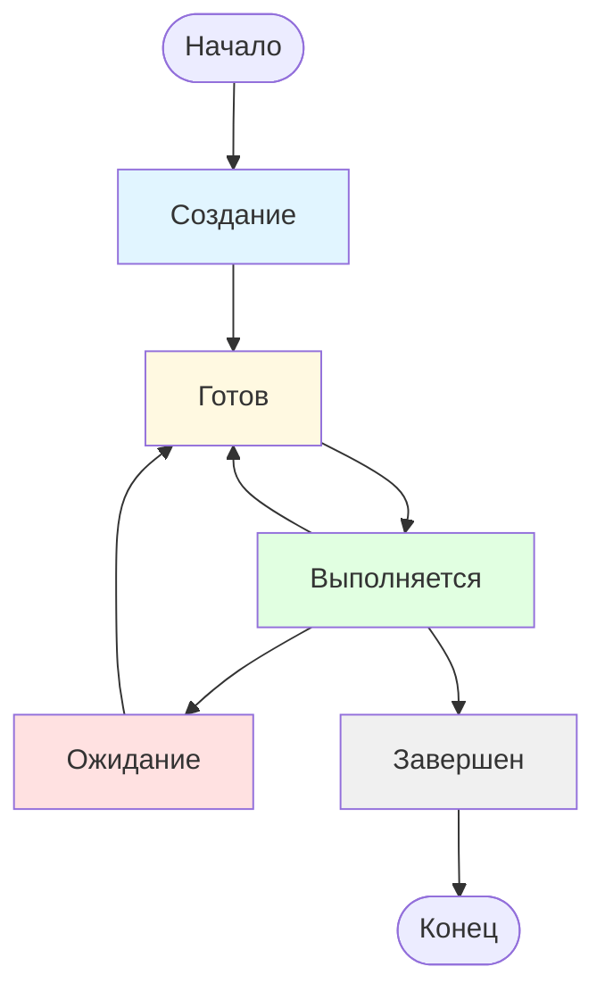

# Процессы: Как операционная система управляет программами

## Определение

Процесс — это запущенная программа, которой операционная система выделила собственные ресурсы для работы. Если программа на [диске](file_system.md) похожа на рецепт блюда в кулинарной книге, то процесс — это сам процесс приготовления этого блюда на кухне: с использованием конкретных ингредиентов, посуды и действий повара. Один и тот же рецепт (программа) может быть использован одновременно для приготовления нескольких блюд (нескольких процессов), каждый из которых будет иметь свои уникальные ингредиенты и стадию готовности.

## Подробное описание

### Зачем нужны процессы и почему они так устроены

Операционная система должна выполнять множество задач одновременно: воспроизводить музыку, загружать картинки из интернета и печатать текст. Чтобы эти задачи не мешали друг другу, система создает для каждой из них отдельный мир, называемый процессом. Главная причина существования процессов — изоляция. Если одна программа совершит ошибку, она не должна ломать другие программы или саму операционную систему.

В современных системах каждый процесс живет в своем собственном виртуальном пространстве. Это значит, что программа «думает», будто она одна владеет всей памятью компьютера, начиная с нуля. На самом деле операционная система хитро перенаправляет обращения программы к разным участкам физической памяти. Это нужно для порядка и безопасности данных. Однако так было не всегда. В некоторых старых системах, например в Amiga OS, процессы не были строго изолированы и могли случайно (или намеренно) менять данные друг друга, что часто приводило к сбоям всего компьютера.

### Внутреннее устройство процесса

Чтобы процесс мог работать, остановиться и потом продолжить работу с того же места, операционная система хранит его состояние. Это состояние состоит из нескольких важных частей.

**Регистры и счетчик инструкций**
Представьте, что центральный процессор — это очень быстрый читатель, который читает книгу (программу) по одной строчке. Чтобы не потерять место, где он остановился, когда его отвлекли на другую задачу, у него есть закладки. Эти закладки называются регистрами.
Самая важная закладка — это **счетчик инструкций**. Он указывает номер команды, которую нужно выполнить следующей. Также существуют регистры общего назначения, где хранятся промежуточные числа для вычислений, и регистры состояния, которые показывают результат последней операции (например, получилось ли число положительным или отрицательным). Без сохранения значений всех этих регистров при переключении между задачами программа бы «забыла», что она делала, и работа прервалась бы.

**Виртуальное пространство и сегменты**
Память процесса разделена на логические части, которые называются сегментами. Хотя в современных системах чаще используется механизм страниц для управления памятью, понятие сегментов помогает понять структуру. Обычно выделяются следующие области:
*   **Код**: здесь хранятся сами инструкции программы. Эта часть обычно защищена от изменения, чтобы программа случайно не стерла сама себя.
*   **Данные**: здесь хранятся глобальные переменные, известные программе с самого начала.
*   **Стек**: это специальная область памяти, работающая как башня из тарелок. Когда программа вызывает одну функцию внутри другой, она кладет «тарелку» с данными текущей функции наверх стека. Когда функция завершается, «тарелка» убирается. Стек нужен для отслеживания вложенных вызовов и локальных переменных.
*   **Куча (Heap)**: область для динамической памяти, которую программа запрашивает во время работы, если ей нужно больше места, чем было запланировано изначально.

**Физическая память и зарезервированные области**
Операционная система сопоставляет виртуальное пространство процесса с реальной физической памятью компьютера. Не вся память процесса обязательно находится в оперативной памяти прямо сейчас; часть может лежать на диске и подгружаться по мере необходимости.
Существуют также особые зарезервированные области памяти. В системах типа Linux для этого используется механизм `mmap`. Он позволяет отображать файлы с диска прямо в адресное пространство процесса или выделять большие куски памяти для особых нужд, минуя стандартное распределение. Это ускоряет работу с большими файлами и позволяет разным процессам эффективно делить память.

### Работа в многопроцессорных системах (SMP)

Современные компьютеры часто имеют несколько процессорных [ядер](kernel.md), работающих одновременно. Такая конфигурация называется SMP (Symmetric Multi-Processing). В этом случае разные процессы могут выполняться буквально в одно и то же время на разных ядрах. Операционная система выступает в роли диспетчера, который решает, какой процесс какому ядру доверить, стараясь распределить нагрузку равномерно. Это значительно ускоряет работу компьютера, так как множество задач решаются параллельно, а не по очереди.

### Жизненный цикл и состояния процесса

Процесс не появляется и не исчезает мгновенно. В течение своей жизни он проходит через несколько состояний, переходя из одного в другое в зависимости от того, что происходит с программой.

**Состояния процесса:**

1.  **Создание**: В этот момент операционная система только начинает создавать процесс. Она выделяет память, создает структуру для хранения данных, но еще не передала управление программе. Это как подготовка кухни перед началом готовки: достают продукты, моют руки, но еще не включили плиту.

2.  **Готов**: Процесс полностью подготовлен к работе: все ресурсы выделены, код загружен в память. Он ждет только одного — когда [планировщик](scheduling.md) операционной системы выделит ему процессорное время. В системе может быть много процессов в состоянии «Готов», и они стоят в очереди.

3.  **Выполняется**: Это активное состояние, когда процессор фактически выполняет инструкции процесса. На однопроцессорной системе в каждый момент времени может выполняться только один процесс. На многопроцессорной (SMP) — столько, сколько есть ядер.

4.  **Ожидание**: Процесс не может продолжать работу, потому что ждет какого-то события. Чаще всего это ожидание ввода-вывода: чтение файла с диска, получение данных из сети, ожидание нажатия клавиши. Пока процесс ждет, процессор не тратится впустую, а переключается на другой процесс.

5.  **Завершен**: Процесс закончил свою работу (или был аварийно остановлен). Операционная система освобождает все ресурсы, занятые процессом: память, файлы, устройства. Сам процесс еще может оставаться в списке существующих процессов короткое время, чтобы родительский процесс мог узнать результат его работы, но затем он полностью удаляется.

**Почему происходят переходы между состояниями:**

*   **Из «Готов» в «Выполняется»**: Планировщик операционной системы выбирает этот процесс из очереди готовых и передает ему управление процессором.

*   **Из «Выполняется» в «Готов»**: Прошел квант времени (небольшой отрезок, выделенный процессу), или появился процесс с более высоким приоритетом. Процесс вынужден уступить процессор, хотя мог бы продолжать работу.

*   **Из «Выполняется» в «Ожидание»**: Процесс запросил операцию ввода-вывода (например, чтение файла) и должен ждать ее завершения. Нет смысла держать процессор, пока данные загружаются с медленного диска.

*   **Из «Ожидание» в «Готов»**: Событие, которого ждал процесс, произошло (данные прочитаны, файл загружен). Теперь процесс снова готов к работе и встает в очередь на выполнение.

*   **Из «Выполняется» в «Завершен»**: Программа выполнила последнюю инструкцию или была принудительно остановлена (ошибка, команда пользователя).

Эта система состояний позволяет операционной системе эффективно управлять множеством процессов, создавая иллюзию, что все они работают одновременно, даже если процессорное ядро всего одно.

### Общение между процессами

Поскольку процессы изолированы друг от друга, им трудно обмениваться информацией. Но иногда это необходимо (например, браузер должен передать данные видеоплееру). Для этого существуют специальные механизмы межпроцессного взаимодействия:

1.  **Прерывания**: сигналы от оборудования или от самой системы, которые заставляют процессор временно остановить текущую задачу и обработать срочное событие. Подробнее об этом механизме можно узнать в статье [прерывания](interrupt.md).
2.  **Общая память**: участок памяти, который операционная система делает видимым для двух или более процессов сразу. Это самый быстрый способ обмена данными, но он требует осторожности, чтобы процессы не испортили данные друг друга.
3.  **Семафоры**: специальные счетчики-сигналы. Процесс может «подождать», пока семафор не покажет, что ресурс свободен, или «поднять» семафор, сообщая другим, что ресурс занят или освобожден.
4.  **Спинлоки**: простой механизм блокировки. Если процесс видит, что нужный ему ресурс занят другим процессом, он начинает крутиться в цикле («спиннить»), постоянно проверяя, не освободился ли ресурс. Этот метод прост, но тратит время процессора впустую, поэтому используется только тогда, когда ожидание предполагается очень коротким.

Важно помнить, что сегменты памяти не всегда являются основным способом контроля доступа. Во многих современных системах управление осуществляется через таблицы страниц, которые более гибко позволяют перемешивать кусочки физической памяти, создавая иллюзию непрерывного пространства для процесса.

### Сравнение объектов и резюме

| Объект | Описание | Аналогия из жизни |
| :--- | :--- | :--- |
| **Программа** | Файл с кодом на диске, пассивный набор инструкций. | Рецепт в кулинарной книге. |
| **Процесс** | Запущенная программа с выделенной памятью и состоянием. | Приготовление блюда по рецепту на кухне. |
| **Счетчик инструкций** | Регистр, указывающий на следующую команду для выполнения. | Палец, держащий место в тексте книги. |
| **Стек** | Область памяти для хранения временных данных функций. | Стопка тарелок: добавил новую функцию — положил тарелку сверху. |
| **Виртуальная память** | Иллюзия у процесса, что он один владеет всей памятью. | Личный кабинет, стены которого магически расширяются. |
| **Семафор** | Механизм сигнализации о доступности ресурсов. | Светофор или жетон в гардеробе. |
| **Спинлок** | Механизм ожидания, при котором процесс активно проверяет статус. | Человек, стоящий у двери и постоянно дергающий ручку, проверяя, открыта ли она. |

**Резюме:**
Процесс является фундаментальной единицей работы операционной системы, обеспечивая выполнение программ в изолированной среде. Благодаря сохранению состояния в регистрах (включая счетчик инструкций) и использованию виртуального пространства с разделением на стек, код и данные, система может быстро переключаться между задачами и запускать их параллельно на нескольких ядрах (SMP). Механизмы вроде общей памяти, семафоров и спинлоков позволяют процессам сотрудничать, несмотря на изоляцию. Понимание структуры процесса объясняет, как компьютер умудряется делать много дел одновременно, не путая данные разных программ.

## См. также

*   [Прерывания](interrupt.md) — механизм обработки срочных событий и сигналов от устройств.
*   [Планирование процессов](scheduling.md) — алгоритмы выбора следующего процесса для выполнения.
*   [Управление памятью](memory_management.md) — способы распределения физической и виртуальной памяти.
*   [Потоки выполнения](thread.md) — легковесные единицы внутри процесса, разделяющие общую память.
*   [Межпроцессорное взаимодействие](IPC.md) — общение процессов

---

**Автор**: [Воронухин Никита](https://github.com/DeZtrOiD)
**LLM - Qwen3.5-Plus**
