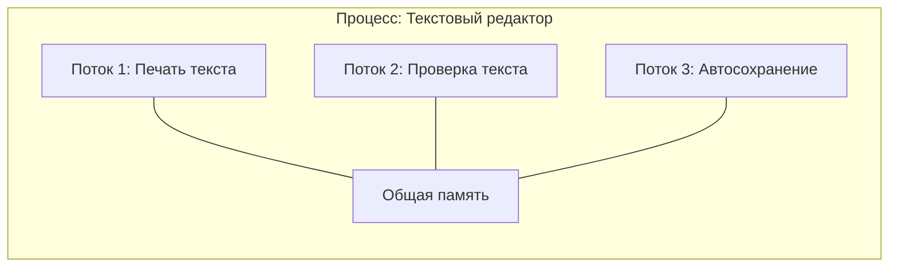
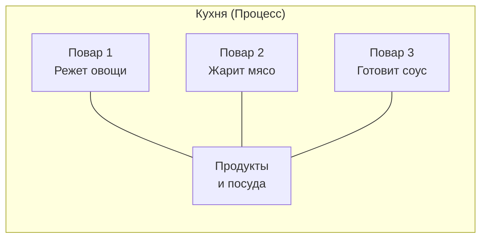
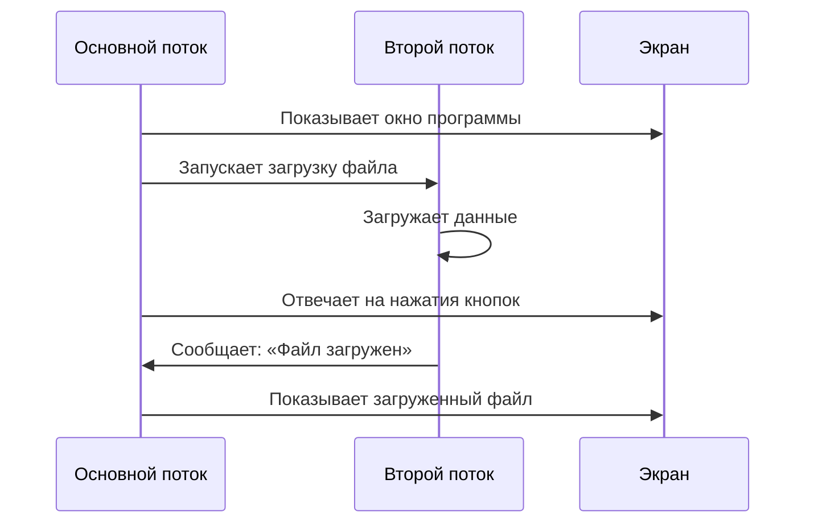

# Потоки выполнения

## Определение

**Поток выполнения** (или просто **поток**) — это отдельный путь выполнения задач внутри программы. 

Если программа — это книга с инструкциями, то поток — это палец, который указывает на текущую строчку, которую нужно прочитать и выполнить. Одна программа может иметь несколько таких «пальцев», которые читают книгу одновременно.

## Подробное описание

### Зачем нужны потоки

Представьте, что вы смотрите мультфильм на компьютере. Одновременно происходит много событий:

- На экране двигаются персонажи
- Играет музыка
- Можно нажать на паузу в любой момент
- Компьютер проверяет, не пришло ли новое письмо

Все эти дела происходят одновременно. Без потоков компьютеру пришлось бы делать их по очереди: сначала показать один кадр мультфильма, потом проверить почту, потом показать следующий кадр. Мультфильм бы постоянно «замирал».

Потоки позволяют компьютеру заниматься несколькими делами внутри одной программы одновременно.

### Процесс и поток: в чём разница

Важно понять разницу между **процессом** и **потоком**:

**Процесс** — это запущенная программа со всеми своими ресурсами: памятью, файлами, настройками. Каждый процесс живёт отдельно от других.

**Поток** — это часть процесса. Один процесс может содержать много потоков. Все потоки одного процесса делят между собой память и ресурсы.

### Пример из жизни

Представьте кухню ресторана:

- **Процесс** — это вся кухня со всеми поварами, продуктами и посудой
- **Потоки** — это отдельные повара на этой кухне

Все повара (потоки) работают на одной кухне (процессе), используют одни и те же продукты (память), но каждый готовит своё блюдо (выполняет свою задачу).

### Почему потоки существуют

Потоки появились не просто так. Есть важные причины:

1. **Экономия ресурсов** — создать новый поток легче и быстрее, чем создать целый новый процесс. Потоку не нужно выделять новую память — он использует память процесса.

2. **Быстрый обмен данными** — поскольку все потоки одного процесса используют общую память, они могут легко обмениваться данными. Им не нужно копировать информацию из одного места в другое.

3. **Отзывчивость программ** — когда вы работаете с программой, один поток занимается вашими действиями (нажатия кнопок, ввод текста), а другие фоновые потоки делают свою работу (сохранение файлов, загрузка данных). Программа не «зависает».

### Как потоки работают вместе

Представьте, что вы читаете книгу и одновременно делаете заметки. Ваши глаза читают текст, а рука пишет. Это два разных действия, но они работают вместе для одной цели — изучения материала.

Так и потоки: каждый делает своё дело, но все работают для одной программы.

### Важная особенность

Все потоки внутри одного процесса делят одну и ту же память. Это значит, что если один поток изменил какие-то данные, другие потоки сразу видят эти изменения.

Это как доска объявлений в школе: если один ученик написал заметку на доске, все остальные ученики сразу могут её прочитать.

## Сравнение процессов и потоков

| Характеристика | Процесс | Поток |
|----------------|---------|-------|
| Что это | Запущенная программа | Часть процесса |
| Память | У каждого процесса своя память | Все потоки делят память процесса |
| Создание | Требует много ресурсов | Создаётся быстро и легко |
| Обмен данными | Сложный, через специальные механизмы | Простой, через общую память |
| Изоляция | Процессы не мешают друг другу | Потоки могут влиять друг на друга |
| Пример | Браузер — это процесс | Каждая вкладка может быть потоком |

## Краткое резюме

- **Поток** — это отдельный путь выполнения задач внутри программы
- Один **процесс** может содержать много **потоков**
- Все потоки одного процесса делят общую память и ресурсы
- Потоки нужны для того, чтобы программы могли делать несколько дел одновременно
- Потоки делают программы более быстрыми и отзывчивыми
- Создать поток легче, чем создать целый процесс
- Основной поток управляет программой, рабочие потоки выполняют дополнительные задачи

Потоки — это как команда помощников внутри программы. Каждый помощник занимается своим делом, но все они работают вместе для достижения общей цели.

## См. также

*   [Процессы](process.md) — владельцы потоков
*   [Планирование задач](scheduling.md) — алгоритмы выбора следующей задачи для выполнения
*   [Управление памятью](memory_management.md) — способы распределения физической и виртуальной памяти.
