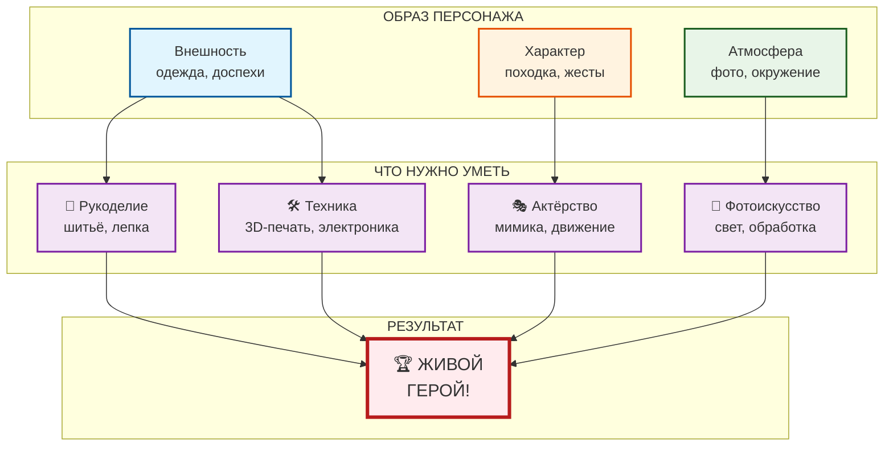

# 👗 Косплей: когда герой оживает

## Введение

Ты когда-нибудь смотрел на крутого персонажа игры и думал: «Вот бы мне такой костюм!»? А кто-то не просто думает, а берёт и делает! Косплей (от английского *costume play* — «костюмированная игра») — это искусство перевоплощения в любимых героев. Люди шьют доспехи, мастерят оружие, меняют внешность и на время становятся теми, кем восхищаются.

## 🎭 Что такое косплей и почему это круто

Косплей — это не просто надевание костюма. Это целая культура, где соединяются шитьё, инженерия, актёрское мастерство и огромная любовь к играм.

Чем занимаются косплееры:

| Занятие | Как это выглядит |
|---------|------------------|
| **Создание костюма** | Шьют одежду, распечатывают на 3D-принтере детали брони, лепят украшения |
| **Грим и пластика** | Меняют лицо с помощью грима, накладных ушей, линз, учатся двигаться как персонаж |
| **Фотографии и видео** | Снимают крутые кадры в образе, часто с дымом, светом или спецэффектами |
| **Фестивали и конвенты** | Встречаются с другими фанатами, участвуют в дефиле и конкурсах |

## 🛠️ Как создаётся образ: от идеи до выхода на сцену

Путь косплеера похож на квест в игре. Вот основные этапы:

### 1️⃣ Выбор персонажа
Обычно выбирают героя, который очень нравится, на которого хочется быть похожим. Это может быть кто угодно — от милого персонажа из *Genshin Impact* до сурового воина из *Ведьмака*.

### 2️⃣ Сбор референсов
Косплееры собирают сотни картинок: как выглядит персонаж со всех сторон, какие у него швы на одежде, узоры на доспехах. Важна каждая деталь!

### 3️⃣ Создание костюма
Тут начинается магия. Кто-то шьёт вручную, кто-то печатает детали на 3D-принтере, кто-то валяет из шерсти или лепит из специальных материалов. Доспехи часто делают из вспененного полиэтилена (EVA-пены) — он лёгкий и хорошо держит форму.

### 4️⃣ Примерка и доработка
Костюм обязательно нужно примерить. В нём должно быть удобно ходить, сидеть, а иногда и танцевать!

### 5️⃣ Выход в свет
Самый волнительный момент — надеть костюм и поехать на фестиваль. Там можно встретить таких же увлечённых людей, сделать кучу фото и даже получить приз за лучший образ.

## 🎮 Популярные игровые персонажи для косплея

| Персонаж | Игра | Почему его любят косплееры |
|----------|------|----------------------------|
| **2B** | *NieR: Automata* | Элегантный чёрный костюм, повязка на глаза, меч — узнаваемо и эффектно |
| **Геральт** | *Ведьмак* | Суровый образ, реалистичные доспехи, можно добавить настоящие шрамы гримом |
| **Персонажи *Genshin Impact*** | *Genshin Impact* | Огромный выбор красивых и детализированных костюмов |
| **Дух-хранитель** | *Hollow Knight* | Необычный минималистичный образ, маску можно сделать из папье-маше |
| **Солдат из *Team Fortress 2*** | *Team Fortress 2* | Узнаваемые силуэты, можно сделать из недорогих материалов |

## 📸 Примеры крутого косплея

### ⚔️ Геральт из «Ведьмака»

Здесь нужны не только доспехи, но и два меча за спиной, грим, делающий лицо старше и суровее, и конечно, белые волосы.

### 🖤 2B из *NieR: Automata*

Костюм кажется простым, но важно передать пластику андроида. Многие косплееры делают светящиеся детали на мече.

### 🐉 Герой *Skyrim* в доспехах

Доспехи из «Древних свитков» — настоящий вызов! Их делают из пены с текстурой металла, добавляют меха и светящиеся камни.

## 🧠 Что развивает косплей (это не просто хобби!)

Косплей — это очень полезное увлечение. Оно помогает прокачать много навыков:

| Навык | Как развивается |
|-------|-----------------|
| **Шитьё и дизайн** | Создание выкроек, работа с разными тканями |
| **Работа с инструментами** | Пайка светодиодов, резка и шлифовка пены, 3D-моделирование |
| **Грим и парикмахерское дело** | Смена внешности, укладка париков, специальный грим |
| **Актёрское мастерство** | Умение двигаться и говорить как персонаж |
| **Навыки фотографа** | Постановка света, обработка фото |

## ✨ Почему люди этим занимаются (истории)

### 🔥 История одной девушки
Девушка боялась публичных выступлений, но очень любила Лару Крофт. Она сделала костюм, вышла на сцену фестиваля и... получила приз зрительских симпатий! Теперь она не боится сцены и каждый год делает новый образ.

### 👨‍🎨 История парня
Парень учился на инженера, но ему было скучно. Увлёкся косплеем и начал делать светящиеся доспехи с движущимися деталями. Его заметили на фестивале разработчики игр и пригласили на работу — делать реквизит для настоящих игр!

## 📊 Схема: из чего складывается образ в косплее

Вот как можно представить все составляющие крутого косплея:

## 🎯 Главный секрет косплея

Самое важное в косплее — это **кайф от процесса**. Можно сделать костюм из подручных материалов, а можно потратить месяцы на идеальные доспехи. Неважно, сколько денег ты потратил. Важно, как сильно ты любишь персонажа и хочешь подарить радость другим фанатам.

Косплей — это способ сказать: «Смотрите, этот герой существует, и я могу им стать!».

---

## 📝 Авторы

**Автор:** Глебова Мария Алексеевна, М8О-307Б-23  
*При создании статьи использовались: нейросеть ChatGPT*
