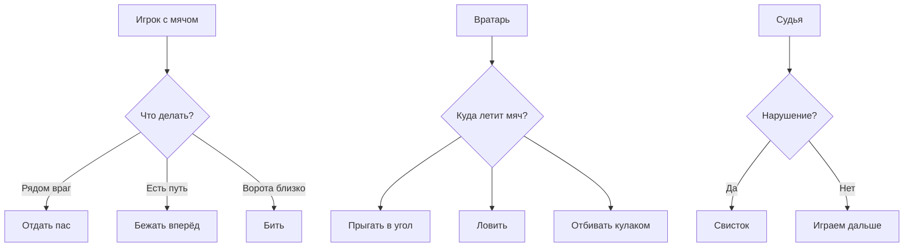
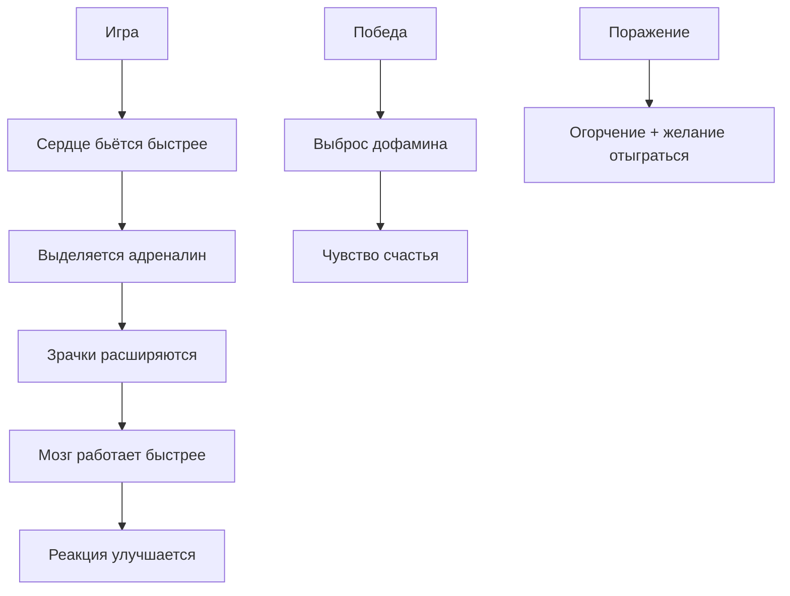

## Гонки, драки и спорт

Как игры учат нас соревноваться, не выходя из дома

---

Представь, что ты хочешь устроить соревнование. Можно позвать друзей во двор и бегать наперегонки. Можно взять мяч и сыграть в футбол. Можно даже побороться — кто кого пересилит.

Но что делать, если на улице дождь? Или друзья живут далеко? Или просто лень одеваться?

Тогда на помощь приходят **спортивные игры**. Садишься на диван, берёшь геймпад — и ты уже на стадионе, или за рулём гоночного болида, или на ринге с чемпионом мира.

Давай разберёмся, как игры учат нас соревноваться, даже когда мы дома в пижаме.

---

### 🏎️ Гонки: чувство скорости без прав

Гоночные игры — одни из самых старых. Ещё в 1970-х люди играли в Gran Trak 10 — простую игру, где машинка ездила по треку.

Сегодня гонки выглядят так реалистично, что можно забыть: ты сидишь в комнате, а не мчишься по трассе со скоростью 300 км/ч.

**Как создают чувство скорости?**

```mermaid
graph TD
    A[Ты нажимаешь газ] --> B[Игра считает: скорость +]
    B --> C[Игра считает: позиция на трассе]
    C --> D[Игра двигает картинку]
    D --> E[Экран "летит" вперёд]
    E --> F[Твой мозг думает: "Я еду!"]
    
    G[Звук мотора] --> F
    H[Вибро в геймпаде] --> F
```

Главный секрет: игра обманывает твои глаза. Она показывает, что дорога убегает назад, а ты стоишь на месте. Мозг привык: если дорога движется — значит, я еду. Вот и иллюзия готова!

**Виды гоночных игр:**

| Тип гонок | Пример | В чём кайф |
|-----------|--------|------------|
| **Аркадные** | Need for Speed, Mario Kart | Просто весело, можно бочкой лететь и не разбиться |
| **Симуляторы** | Gran Turismo, Forza | Как настоящие: если врежешься — всё, ремонт |
| **Картинги** | Малыш на машинке | Для детей, но взрослые тоже обожают |
| **Безумные** | Trackmania | Петли, трамплины, полёты |

В Mario Kart вообще можно кидаться бананами и черепахами в соперников. Попробуй так на настоящей трассе — дисквалифицируют!

---

### 🏁 Чему учат гонки?

Гонки — это не просто «жми на газ». Чтобы побеждать, нужно:

| Навык | Как прокачивается |
|-------|-------------------|
| **Реакция** | Заметить поворот за долю секунды |
| **Память** | Запомнить трассу: где яма, где обгон |
| **Стратегия** | Когда экономить топливо, когда жать на газ |
| **Спокойствие** | Не нервничать, когда тебя обгоняют |

Настоящие гонщики иногда тренируются на компьютере перед выходом на трассу. Серьёзно! Некоторые игры настолько реалистичны, что их используют как тренажёры.

> 🏆 **Факт:** Чемпион Формулы-1 Макс Ферстаппен обожает симуляторы и говорит, что они помогают ему в настоящих гонках.

---

### 🥊 Файтинги: драки по правилам

Файтинги — игры, где два (или больше) бойца выясняют отношения на ринге. Без крови, зато с красивыми ударами и спецэффектами.

**Короли файтингов:**

```
┌─────────────────────────────────────┐
│                                     │
│   👊 Street Fighter                 │
│      Рю, Кен, Чунь-Ли               │
│                                     │
│   👊 Mortal Kombat                   │
│      Скорпион, Саб-Зиро             │
│                                     │
│   👊 Super Smash Bros.               │
│      Марио, Пикачу, Сонику вместе!  │
│                                     │
└─────────────────────────────────────┘
```

**Как работает файтинг?**

```mermaid
graph LR
    A[Ты нажал удар] --> B[Игра смотрит: близко ли враг?]
    B -->|Да| C[Включается анимация удара]
    C --> D[Проверка: попал или враг закрылся?]
    D -->|Попал| E[Отнимаются очки здоровья]
    E --> F[Враг отлетает]
    F --> G[Звук "Вжух!"]
    
    D -->|Не попал| H[Ты открылся для атаки]
    H --> I[Враг бьёт тебя]
```

Всё происходит за доли секунды. Профессионалы нажимают кнопки со скоростью пулемёта — до 10 нажатий в секунду!

---

### 🥋 Чему учат файтинги?

Кажется, что файтинги — это просто «долби по кнопкам». Но на самом деле это глубокая стратегия.

| Навык | Как прокачивается |
|-------|-------------------|
| **Терпение** | Ждать ошибки противника, а не лезть в атаку |
| **Запоминание** | Выучить 20+ приёмов за персонажа |
| **Чтение соперника** | Понять, что он сделает через секунду |
| **Концентрация** | Не отвлекаться ни на секунду |
| **Уважение** | Пожать руку (виртуально) даже после проигрыша |

В хороших файтингах нельзя просто победить. Надо **перехитрить** противника. Заставить его думать, что ты сделаешь одно, а сделать другое.

> 🧠 **Это как шахматы**, только очень быстрые и с ударами ногой с разворота.

---

### ⚽ Спортивные симуляторы: FIFA, NBA и другие

Спортивные игры — это целая вселенная. Каждый год выходят новые FIFA, NBA 2K, Madden NFL. Миллионы людей покупают их, чтобы играть за любимые команды.

**Что внутри спортивного симулятора?**

Возьмём FIFA (футбол). В игре:
- Тысячи реальных футболистов
- Сотни команд
- Десятки стадионов
- Реальные лица, движения, эмоции

**Как работает искусственный интеллект в FIFA?**



Каждый игрок на поле — это маленькая программа со своей логикой. Защитники думают: «Надо закрыть проход». Нападающие: «Надо открыться под пас». Вратарь: «Ловить, не зевать».

Все 22 футболиста (плюс судья) работают одновременно. Компьютер считает их позиции 60 раз в секунду!

---

### 🏆 Чему учат спортивные игры?

| Навык | Как прокачивается |
|-------|-------------------|
| **Командная работа** | В мультиплеере нельзя выиграть одному |
| **Стратегия** | Выбрать схему, расставить игроков |
| **Знание спорта** | Узнаёшь реальных игроков и правила |
| **Азарт** | Гол на последних секундах — взрыв эмоций |
| **Смирение** | Проигрывать тоже надо уметь |

Многие фанаты спортивных игр знают составы команд лучше, чем настоящие тренеры!

---

### 👥 Мультиплеер: соревнуемся с живыми людьми

Самое интересное начинается, когда ты играешь не с компьютером, а с **реальными людьми**.

Компьютер предсказуем. Он действует по алгоритму. Если понять алгоритм — можно обыграть.

А человек... человек может придумать что угодно!

**Что даёт игра с живыми людьми:**

| Плюс | Почему круто |
|------|--------------|
| **Неожиданность** | Люди делают глупости, которые компьютер не придумает |
| **Эмоции** | Радость победы и горечь поражения — настоящие |
| **Дружба** | Можно найти друзей по всему миру |
| **Азарт** | Хочется быть лучше, чем вчера |
| **Уважение** | Научиться проигрывать достойно |

Иногда после игры в FIFA или Mortal Kombat хочется пожать руку сопернику. Иногда — швырнуть геймпад в стену. Но это нормально! Это спорт.

---

### 📈 Эволюция спортивных игр

Посмотри, как менялись спортивные игры за 40 лет:

| Годы | Как выглядело | Что умело |
|------|---------------|-----------|
| 1980 | Две палочки и квадратик | "Теннис" из двух пикселей |
| 1990 | Пиксельные человечки | Можно выбрать команду |
| 2000 | 3D-модели | Реальные лица и имена |
| 2010 | Почти как по TV | Тысячи анимаций |
| Сейчас | Фотореализм | Онлайн-лиги, турниры, киберспорт |

**Киберспорт** — это когда люди играют в игры профессионально, на стадионах, за миллионы долларов. Представь: ты сидишь на трибуне, а на огромном экране — финал по FIFA. Болельщики кричат, комментаторы орут, победитель получает кубок.

Звучит безумно? Но это реальность. Призовые фонды киберспортивных турниров — **миллионы долларов**!

---

### 🧠 Что происходит в голове во время игры?

Учёные изучали, что чувствует человек во время напряжённого матча в FIFA или гонки. Оказалось:



Это почти как настоящий спорт! Только мышцы не болят (ну, кроме пальцев).

---

### 🎮 Почему мы любим соревноваться?

Психологи говорят: соревнование заложено в нас природой. Тысячи лет люди выясняли, кто сильнее, быстрее, умнее. Раньше для этого надо было бегать, драться, кидать копья.

Теперь можно просто взять геймпад.

**Соревновательные игры дают нам:**

- **Азарт** — хочется быть лучшим
- **Прогресс** — сегодня я проиграл, завтра выиграю
- **Общение** — можно обсуждать матчи с друзьями
- **Выплеск эмоций** — покричать в монитор иногда полезно
- **Чувство победы** — я сделал это!

---

### 🤯 Безумные факты о соревновательных играх

> 🏎️ **В Mario Kart можно играть профессионально**. Да, есть киберспортивная лига по Марио на картингах!

> 💰 **Призовой фонд The International (Dota 2)** — больше 40 миллионов долларов. Это как выиграть в лотерею, только надо уметь играть.

> 👴 **Самый старый киберспортсмен** — дедушка 70 лет, играет в Street Fighter и побеждает молодых.

> 🧠 **FIFA-игроки запоминают больше 100 комбинаций кнопок**. Это как выучить иностранный язык.

> 🌍 **В Fortnite играют 350 миллионов человек**. Если бы это была страна, она была бы третьей по населению в мире!

---

### 🏁 Главное о соревновательных играх

| Жанр | Что даёт | Главный навык |
|------|----------|---------------|
| **Гонки** | Скорость, адреналин | Реакция |
| **Файтинги** | Тактическую дуэль | Чтение соперника |
| **Спортивные симуляторы** | Командную игру | Стратегия |
| **Мультиплеер** | Живое общение | Умение проигрывать |

---

