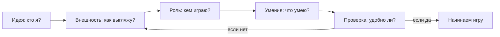

# [Создаем своего героя](./create_your_hero.md)

**ID:** `create_your_hero`  
**Раздел:** 4 Герои и злодеи (Персонажи) • личная папка автора

> 💡 **Коротко:** Редактор персонажа помогает придумать героя, который **выглядит круто**, **удобен в игре** и **похож на тебя** (или на твою мечту).

---

# [Создаем своего героя](./create_your_hero.md)

## Введение
Ты когда-нибудь создавал персонажа в игре — выбирал причёску, цвет глаз, одежду и имя? 🎮 Это и есть **редактор персонажа**. Он нужен не только “для красоты”. Часто от выбора зависит, **как ты играешь**, **как к тебе относятся другие герои** и даже **какую историю ты проживёшь**.

В этой статье разберём:
- что такое редактор персонажа и зачем он нужен;
- почему людям нравится “делать себя” или “делать мечту”;
- что обычно можно настроить;
- как внешний вид и роль (класс) влияют на игру;
- советы, чтобы герой получился и красивым, и удобным.

## Что такое редактор персонажа
**Редактор персонажа** — это набор настроек, с помощью которых игрок собирает героя как конструктор.

Обычно он отвечает за три вещи:
- **Внешность**: лицо, волосы, тело, одежда, цветовые схемы.
- **Роль в игре**: класс (маг/воин/разведчик), стартовые умения, оружие.
- **Самовыражение**: “кто я здесь?”, “каким я хочу быть?”, “какую историю я рассказываю через персонажа?”.

Если редактор хороший, он помогает сделать персонажа таким, чтобы:
- его было **легко узнать** на экране;
- им было **удобно управлять**;
- он “подходил” **под стиль игры** (например, скрытность или сила).

## Почему людям нравится создавать «себя» (и не только)
Есть несколько причин, почему создание героя так затягивает.

- **Хочется быть собой**. Тогда ты делаешь персонажа похожим на себя: похожая прическа, рост, любимые цвета. Так игра становится “личной”.
- **Хочется попробовать роль**. В реальности ты ученик, а в игре можешь стать капитаном космического корабля, рыцарем или детективом.
- **Хочется контролировать историю**. Когда ты сам выбираешь детали, кажется, что ты не просто проходишь игру, а **создаёшь её вместе с авторами**.
- **Хочется выделяться**. В сетевых играх приятно, когда твой герой узнаваем: по силуэту, цветам, аксессуарам.

Иногда даже простая вещь (например, шрам или необычная маска) помогает “оживить” персонажа: у него появляется “прошлое”, и играть становится интереснее ✨.

## Что обычно можно настроить
В разных играх набор настроек разный, но чаще всего можно менять:

### 1) Внешность
- **Лицо**: форма, нос, глаза, брови, веснушки.
- **Волосы**: прическа, цвет, борода/усы.
- **Одежда**: стиль, броня, аксессуары, эмблемы.
- **Цвета**: палитра (иногда можно настроить очень точно).

### 2) Роль (класс) и стиль игры
- **Класс/профессия**: кто ты по “работе” в игре (танк, лекарь, лучник, маг).
- **Статы/навыки**: сила, ловкость, интеллект, скрытность и т.д.
- **Стартовые предметы**: оружие, броня, расходники.

| Класс | Главная сила | Стиль игры | Подходит, если ты любишь… |
|:--|:--|:--|:--|
| Воин/танк | Здоровье, броня | В ближнем бою, держит удар | быть в центре сражения |
| Маг | Заклинания | На расстоянии, мощные атаки | стратегию и комбинации |
| Лучник/разведчик | Ловкость, скорость | Скрытность, точные удары | действовать незаметно |
| Лекарь/поддержка | Лечение, баффы | Помощь команде | играть с друзьями |

### 3) История и характер (если игра это поддерживает)
- **Происхождение**: откуда ты, кто твоя семья, что ты умеешь.
- **Черты характера**: добрый/строгий/ироничный (иногда это влияет на диалоги).
- **Имя и голос**: как к тебе обращаются и как ты звучишь.

Вот простой “поток” создания героя, который подходит почти везде:

И ещё одна схема в виде картинки (её удобно вставлять в презентацию/отчёт):

## Как внешность и класс могут влиять на игру
Кажется, что внешность — это просто “красота”. Но часто она влияет на то, **как ты воспринимаешь персонажа** и как **персонажа воспринимают другие**.

### Влияние на тебя (игрока)
- **Проще вжиться в роль**: если герой выглядит так, как ты задумал, мозг быстрее “верит” в историю.
- **Удобнее играть**: читаемая одежда и контрастные цвета помогают не терять персонажа на экране.
- **Меньше ошибок**: если у героя заметный силуэт, легче понять, где он находится, особенно в динамичных моментах.

### Влияние на игру (механики)
Это зависит от конкретной игры, но встречаются такие варианты:
- **Класс меняет доступные умения** (например, маг лечит, а воин держит удар).
- **Выбор навыков меняет стиль прохождения**: можно идти “в лоб” или тихо и аккуратно.
- **Одежда/броня может давать бонусы**: скорость, защита, скрытность.

Важно помнить: “красиво” и “эффективно” — не всегда одно и то же, но хороший редактор позволяет совместить оба.

## Советы: как сделать персонажа удобным и интересным
Вот практичные советы, которые помогают почти всегда:

- **Сначала придумай идею в одном предложении**: “быстрый разведчик”, “умный маг-исследователь”, “рыцарь-защитник”.
- **Сделай героя узнаваемым**:
  - выбери 1–2 главных цвета;
  - добавь “деталь-подпись” (шрам, значок, необычная шляпа).
- **Подгони внешний вид под стиль игры**:
  - если герой быстрый — делай контрастный образ, чтобы его было видно;
  - если герой тяжёлый — крупный силуэт и массивные детали.
- **Не переборщи с деталями**: иногда простая одежда выглядит лучше, чем “всё и сразу”.
- **Сделай тест**: покрути камеру, зайди в темную и светлую локацию, посмотри, не “пропадает” ли герой 👀.
- **Если игра с сюжетом — придумай мини-биографию из 3 фактов**:
  1) откуда он, 2) чего хочет, 3) чего боится.  
  Это сильно оживляет персонажа.

## Заключение
Редактор персонажа — это не просто меню с ползунками. Это способ создать героя, который:
- отражает твою идею;
- помогает тебе играть так, как тебе нравится;
- делает историю “твоей”.

Когда ты создаёшь персонажа, ты как будто говоришь игре: “Вот кто я (или кем я хочу стать) — давай проживём приключение вместе” 🚀.

---

*Автор: Дзюба Майя • Сгенерировано с помощью GPT-5.3 • Слов: 762 • 2026-03-17*
