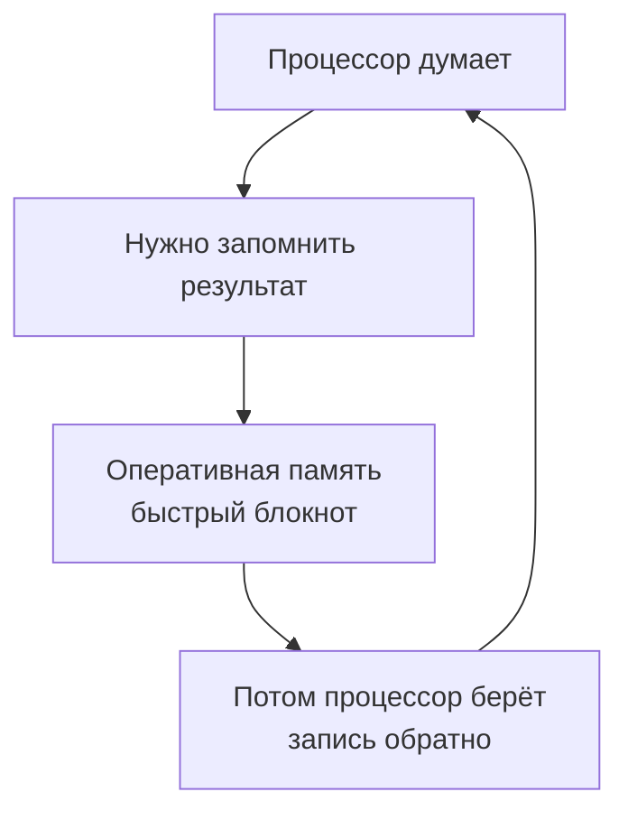

Хитрый процессор и быстрая память

Почему компьютер не путается, когда считает миллионы действий в секунду

---

Представь, что тебе нужно решить 100 примеров по математике. Одновременно ответить на сообщения в чате, включить музыку и следить, чтобы не пригорела яичница на плите. Сложно? А вот компьютер делает такое каждую секунду — и никогда ничего не забывает и не путает. Как у него это получается?

Давай заглянем внутрь системного блока или ноутбука. Там есть два самых главных жителя: **Процессор** и **Память**. Они работают в паре, как два лучших друга.

---

### 🧠 Процессор — супер-мозг с тысячью рук

**Процессор** (или CPU — Central Processing Unit) — это главный мыслительный центр компьютера. Если сравнивать с человеком, то процессор — это и твой мозг, и твои руки одновременно. Только представь:

- Твой мозг может думать над одной задачей за раз.
- А у современного процессора внутри — **от 4 до 16 и больше «мозгов»**! Они называются **ядра**.

> 🎮 **Представь отряд супергероев:** Каждое ядро — это отдельный герой. Один считает математику, второй отвечает за музыку, третий рисует картинку на экране, четвёртый скачивает файл из интернета. И все работают одновременно!

Но самое удивительное даже не это. Каждое ядро работает с невероятной скоростью. Скорость измеряется в **гигагерцах (ГГц)**.

| Скорость | Что это значит |
|----------|----------------|
| 1 ГГц | 1 миллиард операций в секунду |
| 3 ГГц | 3 миллиарда операций в секунду |

То есть процессор с частотой 3 ГГц делает **три миллиарда крошечных действий каждую секунду**! Человек моргает раз в 5 секунд, а процессор за это время успевает выполнить 15 миллиардов операций.

---

### 📚 Память — супер-быстрый блокнот

Но просто быстро считать мало. Нужно же где-то запоминать, что уже сделано, а что ещё предстоит. Для этого у компьютера есть **оперативная память** (или RAM — Random Access Memory).

Представь, что ты решаешь примеры и держишь в голове промежуточные ответы. Если пример сложный, ты записываешь их на листочек, который лежит рядом. Вот этот листочек и есть оперативная память.

Почему она такая особенная?

1. Очень быстрая — процессор может взять из неё данные за наносекунды (это миллиардные доли секунды!).
2. Всё временное — когда ты выключаешь компьютер, блокнот «очищается». Поэтому несохранённый рисунок пропадает, если отключить свет.
3. Ячейки-сейфики — память состоит из миллиардов крошечных ячеек. У каждой — свой адрес. Процессор знает эти адреса и мгновенно находит нужную информацию.

---

🗂️ А как же всё хранить навсегда?

Для долгого хранения есть другой вид памяти — постоянная (SSD или жёсткий диск). Это как книжная полка или большой шкаф с папками.

Тип памяти Это как... Скорость Когда исчезает
Оперативная (RAM) Блокнот на столе 🚀 Мгновенно При выключении
Постоянная (SSD/HDD) Книжный шкаф 🐢 Медленнее Хранится всегда

Процессор работает так:

1. Берёт задачу из «книжного шкафа» (игры или программы).
2. Перекладывает в «быстрый блокнот» (оперативную память).
3. Быстро-быстро там всё считает.
4. Готовый результат показывает на экране или сохраняет обратно в шкаф.

---

⏰ Как они всё успевают и не путаются?

У компьютера есть строгий планировщик задач — специальная программа в процессоре. Она работает как строгий, но справедливый учитель в классе.

👩‍🏫 Представь урок: 30 учеников (программ) хотят ответить. Учитель (планировщик) даёт каждому по 1 миллисекунде. Пока один отвечает, остальные ждут. Но переключение происходит так быстро, что кажется, будто отвечают все одновременно!

Как это выглядит на самом деле:

# картинка

Процессор переключается между задачами миллионы раз в секунду. Для нас это выглядит как одновременная работа: игра не тормозит, музыка играет, сайты грузятся.

---

🎯 Главные секреты

Что это Сколько операций Для чего нужно
Ядро процессора 1 супер-мозг Считать одну задачу
4-ядерный процессор 4 супер-мозга Считать 8-16 задач одновременно
Частота 3 ГГц 3 млрд операций/сек Скорость мышления
Оперативная память 16 ГБ Миллиарды ячеек Быстрый блокнот для текущих дел

---

🔮 Интересный факт

Если бы человек мог считать так же быстро, как процессор (3 миллиарда операций в секунду), то:

· Он бы решил пример, который обычный школьник решает 5 минут, за 0,0000001 секунды
· За одну секунду он бы посчитал все примеры из всех учебников математики в мире
· Ему бы не хватило бумаги записывать ответы — понадобился бы стопка листов высотой с небоскрёб каждую секунду!

---

Вот такой он — хитрый процессор. Миллиарды операций, десятки программ одновременно, и ни одной ошибки. А помогает ему верная подруга — быстрая оперативная память, которая всегда под рукой с нужными цифрами.
