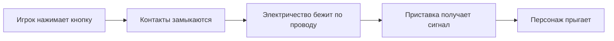
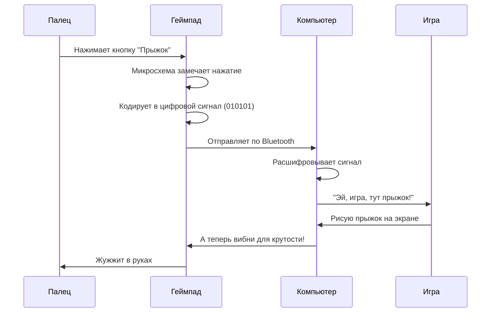

## 3. Кнопки, джойстики и провода

История управления: от деревянного руля до геймпада с вибрацией

---

Представь, что ты хочешь сказать компьютеру: «Иди налево! Прыгай! Стреляй!» Как он тебя поймёт? Ведь у него нет ушей, как у человека.

Для этого люди придумали специальных переводчиков — **устройства ввода**. Самое главное из них — геймпад или джойстик. Но такими, как сейчас, они были не всегда. Давай отправимся в путешествие во времени и посмотрим, как люди учили компьютеры понимать свои команды.

 

---

### 🕹️ Эпоха 1: Ручки и крутилки (1950–1960-е)

Самые первые игры были совсем простыми. Например, теннис — две палочки и квадратик-мячик. Для управления не нужны были десятки кнопок.

> 🎛 **Первые джойстики** напоминали ручку переключения скоростей в самолёте. Просто палка, которую можно наклонять в разные стороны. Внутри — обычные металлические пластинки. Наклоняешь влево — пластинки замыкаются, ток бежит по проводу, компьютер понимает: «Ага, игрок хочет налево!»


Но были и совсем необычные штуки:

| Устройство | Как работало |
|------------|--------------|
| **Руль** | Просто деревянный круг, приделанный к столу. Идеально для гоночных игр! |
| **Световой пистолет** | Стреляешь в экран — специальный датчик замечает, куда попал луч |
| **Потенциометр** | Крутилка, как у старого радио. Чем сильнее крутишь — тем быстрее едет машинка |

Внутри этих устройств не было никаких микросхем. Только провода, металлические контакты и резисторы (такие штуки, которые меняют силу тока).

---

### 🔌 Эпоха 2: Провода и разъёмы (1970–1980-е)

Когда игры стали сложнее, одной палки стало мало. Появились первые **геймпады с кнопками**!

Посмотри на культовую приставку **NES (Nintendo Entertainment System)**. Её геймпад выглядел как прямоугольный кирпичик:

```

┌─────────────────────┐
│   ⬆️                │
│ ⬅️ ⬇️ ➡️   🔴  🔴   │
│          SELECT START│
└─────────────────────┘

```

Всего 4 кнопки направления и 2 кнопки действия (А и В) и две служебные (Select и Start). Этого хватало, чтобы пройти любую игру того времени!

**Как это работало внутри?**

Представь обычный выключатель света. Нажал — свет зажёгся (контакт замкнулся). Отпустил — погас (контакт разомкнулся). Кнопка в геймпаде — это тот же выключатель, только крошечный.




Всё гениально и просто! Но был минус — провода. Провод от геймпада тянулся к приставке. Если ты слишком увлекался игрой, можно было дёрнуть провод и уронить приставку на пол. А если в доме была кошка — она обязательно перегрызала эти провода.

---

📡 Эпоха 3: Беспроводное будущее (1990-е)

Инженеры придумали, как избавиться от проводов. Они отправили команды... по воздуху!

Первые беспроводные геймпады работали как пульты от телевизора — с помощью инфракрасного луча. Нажимаешь кнопку — геймпад мигает невидимым глазом красным огоньком, приставка ловит этот сигнал.

🚫 Но был смешной недостаток: если между тобой и приставкой кто-то проходил — луч прерывался, и персонаж замирал в самый ответственный момент!

Позже придумали радиосигнал (как у радиостанций). Теперь можно было сидеть в любой комнате, и сигнал проходил сквозь стены. А чтобы геймпад не путался с другими устройствами, каждому дали свой «голос» — свой канал связи.

---

🎮 Эпоха 4: Умные геймпады с обратной связью (2000-е)

Современные геймпады — это уже не просто набор кнопок. Это настоящие маленькие компьютеры! Внутри каждого живёт свой процессор и память.

Заглянем внутрь современного геймпада:

```
┌─────────────────────────────────────┐
│  ⬆️⬇️⬅️➡️  🔴🔵🟢🟡  🔛 🔛  🎮     │
│                                     │
│  [~~~~~~~~~~ ВИБРОМОТОРЫ ~~~~~~~~~] │
│  [    АККУМУЛЯТОР    ГИРОСКОП     ] │
└─────────────────────────────────────┘
```

Что внутри Для чего нужно
Микропроцессор Следит за всеми кнопками сразу
Вибромоторы Два грузика, которые крутятся и заставляют геймпад дрожать
Акселерометр Чувствует, как ты наклоняешь геймпад
Гироскоп Понимает, в какую сторону ты повернул устройство
Аккумулятор Чтобы не было проводов
Bluetooth-модуль Отправляет сигналы в приставку по воздуху

---

📱 Эпоха 5: Сенсоры и касания (2010-е — сейчас)

А потом появились сенсорные экраны. Кнопки исчезли совсем! Теперь вместо нажатия — прикосновение.

Как экран понимает, что ты к нему прикоснулся?

✨ Секрет в электричестве. Экран покрыт невидимой сеткой из проводников. Твой палец проводит электричество (потому что внутри нас вода и соли). Когда палец касается стекла, он замыкает крошечные токи в этом месте. Процессор замечает: «Вот здесь палец! Наверное, игрок хочет нажать на эту кнопку».

Современные геймпады тоже научились чувствовать силу нажатия. Нажал слабо — персонаж идёт медленно. Нажал сильно — бежит. Внутри специальные датчики давления, которые понимают, с какой силой ты давишь на кнопку.

---

📡 Как кнопки разговаривают с компьютером

Теперь самое интересное. Когда ты нажимаешь кнопку на современном геймпаде, происходит целое приключение:



Вся эта цепочка занимает меньше одной сотой секунды! Поэтому нам кажется, что персонаж прыгает сразу, как только мы нажали кнопку.

---

🎯 Эволюция управления за 5 минут

Годы Тип управления Фишка
1950-60 Ручки и крутилки Как в самолёте
1970-80 Кнопки и джойстики Просто и надёжно
1990 Инфракрасные пульты Без проводов, но нужна прямая видимость
2000 Радио + вибро Сквозь стены и с отдачей
2010+ Сенсоры + гироскопы Чувствуют наклон и касание

---

🔮 А что дальше?

Учёные уже тестируют управление силой мысли! Датчики на голове считывают мозговые волны. Хочешь прыгнуть — просто подумай об этом. Пока технология только учится, но кто знает — может, через 10 лет мы будем управлять играми без всяких геймпадов?


А пока наслаждайся кнопками, джойстиками и приятной вибрацией в руках — за этим стоит 70 лет инженерной мысли и тысячи изобретателей по всему миру!


## 📝 Авторы

**Жданович Елизавета, 307**  
*С использованием нейросети DeepSeek*

