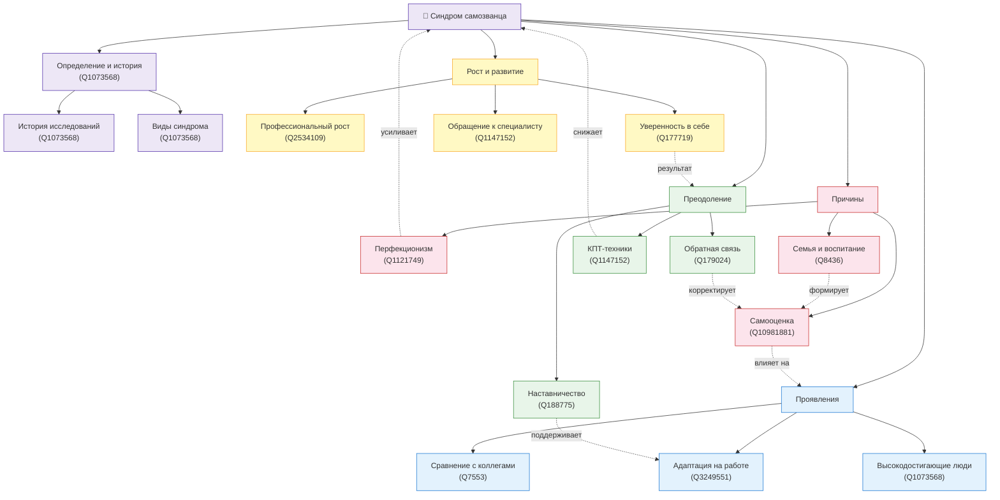

# Синдром самозванца на новой работе

## Описание направления

Раздел энциклопедии, посвящённый синдрому самозванца в контексте начала карьеры и смены места работы. Основная идея — объяснить природу этого психологического явления, его причины и проявления, а также предложить конкретные инструменты для работы с ним и достижения уверенности в профессиональной деятельности.

**Раздел:** 8. Будущее, цели и самореализация  
**Подраздел:** 8.1 Понимание себя  
**Тема:** Синдром самозванца на новой работе

---

## Онтология предметной области

### Визуализация (Mermaid)

### Описание связей

| Тип связи | Обозначение | Примеры |
|-----------|-------------|---------|
| **Иерархическая** (включает / является частью) | Сплошная линия → | Синдром самозванца → Виды; Преодоление → КПТ-техники |
| **Горизонтальная** (влияет / усиливает) | Пунктирная линия -.-> | Перфекционизм → Синдром; Обратная связь → Самооценка |
| **Результирующая** (приводит к) | Пунктирная линия -.-> | Преодоление → Уверенность в себе |

---

### Список понятий

| # | Понятие | WikiData | Категория | Файл |
|---|---------|----------|-----------|------|
| 1 | Синдром самозванца | [Q1073568](https://www.wikidata.org/wiki/Q1073568) | Определение | `articles/impostor_syndrome.md` |
| 2 | История и исследования феномена | [Q1073568](https://www.wikidata.org/wiki/Q1073568) | Определение | `articles/history_of_impostor_syndrome.md` |
| 3 | Виды синдрома самозванца | [Q1073568](https://www.wikidata.org/wiki/Q1073568) | Определение | `articles/types_of_impostor_syndrome.md` |
| 4 | Причины возникновения синдрома самозванца | [Q1073568](https://www.wikidata.org/wiki/Q1073568) | Причины | `articles/causes.md` |
| 5 | Синдром самозванца и перфекционизм | [Q1121749](https://www.wikidata.org/wiki/Q1121749) | Причины | `articles/perfectionism.md` |
| 6 | Роль воспитания и семьи | [Q8436](https://www.wikidata.org/wiki/Q8436) | Причины | `articles/family_influence.md` |
| 7 | Как проявляется синдром на новой работе | [Q1073568](https://www.wikidata.org/wiki/Q1073568) | Проявления | `articles/manifestations.md` |
| 8 | Синдром самозванца и самооценка | [Q10981881](https://www.wikidata.org/wiki/Q10981881) | Проявления | `articles/self_esteem.md` |
| 9 | Синдром самозванца у высокодостигающих людей | [Q1073568](https://www.wikidata.org/wiki/Q1073568) | Проявления | `articles/high_achievers.md` |
| 10 | Адаптация на новом месте работы | [Q3249551](https://www.wikidata.org/wiki/Q3249551) | Проявления | `articles/workplace_adaptation.md` |
| 11 | Обратная связь и как её воспринимать | [Q179024](https://www.wikidata.org/wiki/Q179024) | Проявления | `articles/feedback.md` |
| 12 | Сравнение себя с коллегами | [Q7553](https://www.wikidata.org/wiki/Q7553) | Проявления | `articles/social_comparison.md` |
| 13 | Способы преодоления синдрома самозванца | [Q1073568](https://www.wikidata.org/wiki/Q1073568) | Преодоление | `articles/overcoming.md` |
| 14 | Когнитивно-поведенческие техники | [Q1147152](https://www.wikidata.org/wiki/Q1147152) | Преодоление | `articles/cbt_techniques.md` |
| 15 | Роль наставника и поддержки коллег | [Q188775](https://www.wikidata.org/wiki/Q188775) | Преодоление | `articles/mentorship.md` |
| 16 | Синдром самозванца и профессиональный рост | [Q2534109](https://www.wikidata.org/wiki/Q2534109) | Рост | `articles/professional_growth.md` |
| 17 | Когда стоит обратиться к специалисту | [Q1147152](https://www.wikidata.org/wiki/Q1147152) | Рост | `articles/when_to_seek_help.md` |
| 18 | Уверенность в себе как навык | [Q177719](https://www.wikidata.org/wiki/Q177719) | Рост | `articles/self_confidence.md` |

---

## Источники знаний

### WikiData / SPARQL

Для каждого понятия из таблицы выше могут быть извлечены данные из WikiData с помощью SPARQL-запросов:
- Метки и описания на русском/английском языках
- Иерархические связи (P279 — subclass of, P31 — instance of)
- Связанные сущности (P737 — influenced by и др.)

### Генерация текстов

Тексты энциклопедических статей генерируются с помощью языковых моделей.

Промпт-шаблон:
> **Системный**: "Ты автор энциклопедии для молодых специалистов. Пиши ясно, конкретно и с опорой на психологические исследования."
>
> **Пользователь**: "Напиши подробную статью об понятии «{понятие}». Тема раздела: «Синдром самозванца на новой работе». Описание: {description}. Содержание: введение, история/контекст, суть явления, практические примеры, польза осознания, риски игнорирования, способы работы с темой, заключение. Используй WikiData: {wikidata_context}. Ответ в формате markdown."

### Перекрёстные ссылки

Ссылки между статьями расставляются на основе `concepts.json` по леммам понятий. Первое вхождение каждого понятия в тексте заменяется на markdown-ссылку.

---

## Участники группы

| # | ФИО | Понятия |
|---|-----|---------|
| 1 | Гуляев Андрей | Синдром самозванца, История феномена, Виды синдрома |
| 2 | Лапин Данил| Причины, Перфекционизм, Роль семьи |
| 3 | Болдинова Валерия | Проявления на работе, Самооценка, Высокодостигающие |
| 4 | Фоменко Артем | Адаптация, Обратная связь, Сравнение с коллегами |
| 5 | Суровегин Никита | Преодоление, КПТ-техники, Наставничество |
| 6 | Малеев Владислав | Профессиональный рост, Обращение к специалисту, Уверенность в себе |