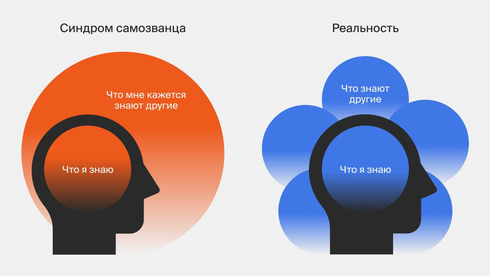

# Синдром самозванца

Представь: ты пришёл в новый класс, сел за парту — и вдруг почувствовал, что все вокруг умнее тебя. Что ты попал сюда случайно, что учитель ошибся, и скоро все об этом узнают. Знакомо? Такое чувство называется **синдром самозванца**.

## Что это такое?

Синдром самозванца — это когда человек не верит в свои собственные успехи. Он думает, что всё, чего он добился, — это случайность или везение, а не результат его труда и способностей. И очень боится, что окружающие это «разоблачат».

Важно понять: это **не болезнь** и **не слабость характера**. Это просто особый способ думать о себе, с которым сталкивается огромное количество людей — даже очень умных и успешных.

## Кто это придумал?

В 1978 году две американских психолога — Полин Клэнс и Сюзанн Аймс — впервые описали это явление. Они заметили, что многие успешные женщины, несмотря на реальные достижения, считали себя «самозванками» и боялись разоблачения. Потом выяснилось, что это чувство знакомо и мужчинам, и детям, и пожилым людям.

## Как это проявляется?

Человек с синдромом самозванца часто думает примерно так:

- «Мне просто повезло, что меня взяли на эту работу»
- «Они скоро поймут, что я ничего не умею»
- «Все вокруг справляются лучше меня»
- «Я не заслуживаю этой похвалы»

Он может много работать, стараться изо всех сил — и всё равно не чувствовать себя достаточно хорошим.

## Интересные факты

- По данным исследований, около **70% людей** хотя бы раз в жизни испытывали синдром самозванца.
- Среди тех, кто часто его испытывает, — известные актёры, учёные, писатели и даже космонавты.
- Чем выше человек поднимается — тем чаще это чувство может появляться, потому что задачи становятся сложнее.
- Синдром самозванца особенно часто возникает в новых ситуациях: новая школа, новая работа, новый коллектив.

## Примеры из жизни

Маша отлично написала контрольную и получила пятёрку. Но вместо радости она думает: «Наверное, учительница не заметила мои ошибки». Это синдром самозванца.

Артём получил грамоту на олимпиаде. Но говорит друзьям: «Просто задания в этот раз были лёгкими». Это тоже он.

## Польза осознания

Само по себе это чувство неприятное. Но знание о нём очень помогает! Когда ты понимаешь, что у этого состояния есть название и оно очень распространено, становится легче. Ты понимаешь, что ты не один такой, и что это можно преодолеть.

## Возможные риски

Если долго игнорировать синдром самозванца, он может:

- мешать браться за новые интересные дела из страха провала;
- заставлять человека работать на износ, лишь бы «доказать» свою ценность;
- приводить к постоянной тревоге и усталости.

## Баланс

Главное правило — не бороться с собой, а научиться замечать эти мысли и не верить им слепо. Синдром самозванца говорит неправду. Твои успехи — настоящие.

## Заключение

Синдром самозванца — это очень распространённое чувство, когда человек не верит в свои достижения и боится «разоблачения». Оно знакомо миллионам людей по всему миру. Хорошая новость: с ним можно научиться справляться — и об этом рассказывают другие статьи этого раздела.

---

Автор: Человек 1

*LLM — Claude (Anthropic)*
