# Нейробиология для подростков

## Краткое описание области

Этот раздел энциклопедии посвящён нейробиологии — науке о мозге и нервной системе.
Здесь простым и понятным языком объясняется, как устроен мозг, как он управляет телом, эмоциями, памятью и поведением.

Материал ориентирован на школьников примерно 8 класса, поэтому статьи написаны в научно-популярном стиле: без сложной терминологии, но с сохранением научной точности.

Главная цель раздела — показать, что мозг не абстрактный орган из учебника биологии, а система, которая каждый день управляет нашими мыслями, эмоциями, решениями и поведением.

---

## Участники команды

| Участник команды | Статьи                                                |
| ---------------- | ------------------------------------------------------|
| Кунавин Кирилл   | Блок 1. Знакомство с мозгом (1–6)                     |
| Скрипов Максим   | Блок 2. Как мозг управляет телом и желаниями (7–13)   |
| Арусланов Кирилл | Блок 3. Чувства и эмоции (14–20)                      |
| Савинов Никита   | Блок 4. Память и обучение (21–24)                     |
| Флоря Юлия       | Блок 5. Баги мозга (25–28)                            |

---

## Визуализация (mermaid)

```mermaid
graph TD
    ROOT["🧠 Нейробиология для подростков"]

    %% ---------------- Блок 1 ----------------
    ROOT --> B1["Блок 1. Знакомство с мозгом"]
    subgraph BLOCK1["Знакомство с мозгом"]
        A01["01. Мозг — самый сложный объект<br/>01_brain_complexity.md"]
        A02["02. Нейрон — главная клетка мозга<br/>02_neuron_main_cell.md"]
        A03["03. Карта нервной системы<br/>03_nervous_system_map.md"]
        A04["04. Главные отделы мозга<br/>04_main_parts_of_the_brain.md"]
        A05["05. Мозг подростка<br/>05_teen_brain.md"]
        A06["06. Как один железный прут изменил личность человека<br/>06_phineas_gage.md"]
    end
    B1 --> A01
    B1 --> A02
    B1 --> A03
    B1 --> A04
    B1 --> A05
    B1 --> A06

    %% ---------------- Блок 2 ----------------
    ROOT --> B2["Блок 2. Как мозг управляет телом и желаниями"]
    subgraph BLOCK2["Как мозг управляет телом и желаниями"]
        A07["07. Стресс: древняя система выживания<br/>07_stress.md"]
        A08["08. Кто включает чувство голода<br/>08_hunger.md"]
        A09["09. Зачем нам нужен сон<br/>09_sleep.md"]
        A10["10. Почему мы так любим сладкое<br/>10_sweet_tooth.md"]
        A11["11. Система вознаграждения<br/>11_reward_system.md"]
        A12["12. Почему мозг ленится<br/>12_lazy_brain.md"]
        A13["13. Как никотин обманывает мозг<br/>13_nicotine.md"]
    end
    B2 --> A07
    B2 --> A08
    B2 --> A09
    B2 --> A10
    B2 --> A11
    B2 --> A12
    B2 --> A13

    %% ---------------- Блок 3 ----------------
    ROOT --> B3["Блок 3. Чувства и эмоции"]
    subgraph BLOCK3["Чувства и эмоции"]
        A14["14. Амигдала — центр страха<br/>14_amygdala_fear.md"]
        A15["15. Почему мы чувствуем эмпатию<br/>15_empathy.md"]
        A16["16. Влюблённость — элегантная химия<br/>16_love_chemistry.md"]
        A17["17. Почему объятия делают нас счастливее<br/>17_hugs_oxytocin.md"]
        A18["18. Почему музыка вызывает мурашки<br/>18_music_chills.md"]
        A19["19. Любопытство как двигатель исследования<br/>19_curiosity.md"]
        A20["20. Почему нам бывает грустно<br/>20_sadness.md"]
    end
    B3 --> A14
    B3 --> A15
    B3 --> A16
    B3 --> A17
    B3 --> A18
    B3 --> A19
    B3 --> A20

    %% ---------------- Блок 4 ----------------
    ROOT --> B4["Блок 4. Память и обучение"]
    subgraph BLOCK4["Память и обучение"]
    direction TB
        A21["21. Устройство памяти<br/>21_how_memory_works.md"]
        A22["22. Мозг, который умеет меняться<br/>22_neuroplasticity.md"]
        A23["23. Гиппокамп — навигатор и архив<br/>23_hippocampus.md"]
        A24["24. Почему зубрёжка плохо работает<br/>24_forgetting_curve.md"]
    end
    B4 --> A21
    B4 --> A22
    B4 --> A23
    B4 --> A24

    A21 ~~~ A22
    A22 ~~~ A23
    A23 ~~~ A24

    %% ---------------- Блок 5 ----------------
    ROOT --> B5["Блок 5. Баги мозга"]
    subgraph BLOCK5["Баги мозга"]
        A25["25. Почему мозг иногда нас обманывает<br/>25_cognitive_biases.md"]
        A26["26. Зрительные иллюзии<br/>26_optical_illusions.md"]
        A27["27. Почему мозг достраивает реальность<br/>27_brain_predicts.md"]
        A28["28. Ложные воспоминания<br/>28_false_memories.md"]
    end
    B5 --> A25
    B5 --> A26
    B5 --> A27
    B5 --> A28

    %% ---------------- Внутриблочные связи ----------------

    A01 -.->|база| A02
    A01 -.->|база| A03
    A01 -.->|база| A04
    A01 -.->|мозг и обучение| A21
    A01 -.->|пластичность| A22

    A02 -.->|сигналы| A03
    A02 -.->|синапсы| A22

    A04 -.->|префронтальная кора| A05
    A04 -.->|лобные доли| A06
    A04 -.->|височные доли| A23

    A07 -.->|реакция угрозы| A14
    A08 -.->|гипоталамус| A09
    A10 -.->|дофамин| A11
    A11 -.->|мотивация| A12
    A11 -.->|зависимость| A13

    A14 -.->|эмоции и лица| A15
    A16 -.->|социальная близость| A17
    A16 -.->|отвержение| A20
    A18 -.->|дофамин| A11
    A19 -.->|дофамин| A11

    A21 -.->|обучение| A22
    A21 -.->|гиппокамп| A23
    A21 -.->|забывание| A24

    A25 -.->|ошибки восприятия| A27
    A26 -.->|достраивание| A27
    A28 -.->|реконструкция памяти| A21

    %% ---------------- Межблочные связи ----------------

    A05 -.->|подростки и стресс| A07
    A05 -.->|подростки и сон| A09
    A05 -.->|подростки и награда| A11
    A05 -.->|подростки и прокрастинация| A12
    A05 -.->|подростки и никотин| A13
    A05 -.->|подростки и эмоции| A20

    A07 -.->|стресс влияет на| A09
    A07 -.->|стресс влияет на| A20
    A08 -.->|глюкоза| A10
    A08 -.->|стресс и аппетит| A07

    A09 -.->|сон укрепляет| A21
    A09 -.->|недосып усиливает| A07

    A11 -.->|влюблённость| A16
    A11 -.->|музыка и награда| A18
    A11 -.->|любопытство| A19

    A12 -.->|самоконтроль| A05
    A13 -.->|дофамин| A11
    A13 -.->|подростковый риск| A05

    A14 -.->|ложная тревога| A27
    A15 -.->|распознавание лиц| A27
    A15 -.->|поддержка| A17
    A17 -.->|поддержка при грусти| A20
    A18 -.->|память и ассоциации| A21
    A18 -.->|ожидание| A27
    A19 -.->|любопытство улучшает| A21
    A19 -.->|обучение| A22

    A20 -.->|эмоции и память| A21

    A23 -.->|пространственная память| A21
    A24 -.->|интервальное повторение| A22

    A25 -.->|ошибки памяти| A28
    A26 -.->|зрительная кора| A04
    A27 -.->|поиск лиц| A14
    A27 -.->|восприятие| A26
    A28 -.->|когнитивные ошибки| A25

    %% ---------------- Стили ----------------
    classDef base fill:none,stroke:#1976d2,stroke-width:1.5px
    classDef body fill:none,stroke:#388e3c,stroke-width:1.5px
    classDef emotion fill:none,stroke:#c2185b,stroke-width:1.5px
    classDef memory fill:none,stroke:#f57c00,stroke-width:1.5px
    classDef bugs fill:none,stroke:#7b1fa2,stroke-width:1.5px
    classDef root fill:none,stroke:#f9a825,stroke-width:2px

    class ROOT,B1,B2,B3,B4,B5 root
    class A01,A02,A03,A04,A05,A06 base
    class A07,A08,A09,A10,A11,A12,A13 body
    class A14,A15,A16,A17,A18,A19,A20 emotion
    class A21,A22,A23,A24 memory
    class A25,A26,A27,A28 bugs

    style BLOCK1 fill:transparent,stroke:#ccc
    style BLOCK2 fill:transparent,stroke:#ccc
    style BLOCK3 fill:transparent,stroke:#ccc
    style BLOCK4 fill:transparent,stroke:#ccc
    style BLOCK5 fill:transparent,stroke:#ccc
```

---

## Список понятий

| #  | Статья                                                                                        | Wikidata                                               |
| -- | --------------------------------------------------------------------------------------------- | ------------------------------------------------------ |
| 1  | [Мозг — самый сложный объект во Вселенной?](articles/01_brain_complexity.md)                  | [Q492038](https://www.wikidata.org/wiki/Q492038)       |
| 2  | [Нейрон — главная клетка мозга](articles/02_neuron_main_cell.md)                              | [Q43054](https://www.wikidata.org/wiki/Q43054)         |
| 3  | [Карта нервной системы](articles/03_nervous_system_map.md)                                    | [Q11392181](https://www.wikidata.org/wiki/Q11392181)   |
| 4  | [Главные отделы мозга: кто за что отвечает](articles/04_main_parts_of_the_brain.md)           | [Q22999251](https://www.wikidata.org/wiki/Q22999251)   |
| 5  | [Мозг подростка](articles/05_teen_brain.md)                                                   | [Q28272888](https://www.wikidata.org/wiki/Q28272888)   |
| 6  | [Как один железный прут изменил личность человека](articles/06_phineas_gage.md)               | [Q316742](https://www.wikidata.org/wiki/Q316742)       |
| 7  | [Стресс: древняя система выживания](articles/07_stress.md)                                    | [Q27725976](https://www.wikidata.org/wiki/Q27725976)   |
| 8  | [Кто включает чувство голода](articles/08_hunger.md)                                          | [Q52294801](https://www.wikidata.org/wiki/Q52294801)   |
| 9  | [Зачем нам нужен сон](articles/09_sleep.md)                                                   | [Q36806073](https://www.wikidata.org/wiki/Q36806073)   |
| 10 | [Почему мы так любим сладкое](articles/10_sweet_tooth.md)                                     | [Q38833475](https://www.wikidata.org/wiki/Q38833475)   |
| 11 | [Система вознаграждения](articles/11_reward_system.md)                                        | [Q670713](https://www.wikidata.org/wiki/Q670713)       |
| 12 | [Почему мозг ленится](articles/12_lazy_brain.md)                                              | [Q330104](https://www.wikidata.org/wiki/Q330104)       |
| 13 | [Как никотин обманывает мозг](articles/13_nicotine.md)                                        | [Q35621339](https://www.wikidata.org/wiki/Q35621339)   |
| 14 | [Амигдала — центр страха](articles/14_amygdala_fear.md)                                       | [Q338924](https://www.wikidata.org/wiki/Q338924)       |
| 15 | [Почему мы чувствуем эмпатию](articles/15_empathy.md)                                         | [Q33421851](https://www.wikidata.org/wiki/Q33421851)   |
| 16 | [Влюблённость — элегантная химия](articles/16_love_chemistry.md)                              | [Q48450953](https://www.wikidata.org/wiki/Q48450953)   |
| 17 | [Почему объятия делают нас счастливее](articles/17_hugs_oxytocin.md)                          | [Q169960](https://www.wikidata.org/wiki/Q169960)       |
| 18 | [Почему музыка вызывает мурашки](articles/18_music_chills.md)                                 | [Q30363944](https://www.wikidata.org/wiki/Q30363944)   |
| 19 | [Любопытство как двигатель исследования](articles/19_curiosity.md)                            | [Q101958785](https://www.wikidata.org/wiki/Q101958785) |
| 20 | [Почему нам бывает грустно](articles/20_sadness.md)                                           | [Q169251](https://www.wikidata.org/wiki/Q169251)       |
| 21 | [Устройство памяти — как мозг хранит воспоминания](articles/21_how_memory_works.md)           | [Q15764599](https://www.wikidata.org/wiki/Q15764599)   |
| 22 | [Нейропластичность](articles/22_neuroplasticity.md)                                           | [Q849491](https://www.wikidata.org/wiki/Q849491)       |
| 23 | [Гиппокамп](articles/23_hippocampus.md)                                                       | [Q74363](https://www.wikidata.org/wiki/Q74363)         |
| 24 | [Кривая забывания](articles/24_forgetting_curve.md)                                           | [Q949167](https://www.wikidata.org/wiki/Q949167)       |
| 25 | [Почему мозг иногда нас обманывает](articles/25_cognitive_biases.md)                          | [Q1127759](https://www.wikidata.org/wiki/Q1127759)     |
| 26 | [Зрительные иллюзии: когда глаза видят одно, а мозг другое](articles/26_optical_illusions.md) | [Q46386499](https://www.wikidata.org/wiki/Q46386499)   |
| 27 | [Почему мозг достраивает реальность](articles/27_brain_predicts.md)                           | [Q40206616](https://www.wikidata.org/wiki/Q40206616)   |
| 28 | [Ложные воспоминания](articles/28_false_memories.md)                                          | [Q56003568](https://www.wikidata.org/wiki/Q56003568)   |

---

## Краткое описание блоков

**Блок 1. Знакомство с мозгом (статьи 1–6)**
В этом блоке даётся базовое представление о мозге и нервной системе. Рассматривается, из чего состоит мозг, как работают нейроны и как передаются сигналы, какие есть отделы мозга и за что они отвечают. Отдельное внимание уделяется особенностям мозга подростка и роли разных областей (например, лобных долей) в поведении и личности. Этот блок создаёт фундамент, необходимый для понимания всех последующих тем.

**Блок 2. Как мозг управляет телом и желаниями (статьи 7–13)**
Здесь рассматриваются системы, которые обеспечивают выживание и повседневное поведение: стресс, голод, сон, мотивация и зависимости. Объясняется, как мозг регулирует состояние организма через гормоны и нейромедиаторы, как формируются желания и привычки, и почему мы иногда выбираем быстрые удовольствия вместо полезных действий. Этот блок связывает физиологию тела с поведением и принятием решений.

**Блок 3. Чувства и эмоции (статьи 14–20)**
В этом блоке показано, как мозг создаёт эмоциональный опыт. Рассматриваются механизмы страха, эмпатии, любви, социальной привязанности и других эмоций, а также роль различных нейромедиаторов и структур мозга. Особое внимание уделяется тому, как эмоции связаны с социальным поведением и взаимодействием с другими людьми.

**Блок 4. Память и обучение (статьи 21–24)**
Этот блок посвящён тому, как мозг запоминает информацию и меняется в процессе обучения. Описываются виды памяти, процессы запоминания и забывания, роль сна в закреплении информации, а также нейропластичность — способность мозга перестраивать свои связи. Также рассматриваются принципы эффективного обучения.

**Блок 5. Баги мозга (статьи 25–28)**
В последнем блоке рассматриваются особенности и ограничения работы мозга. Показано, что мозг не всегда точно отражает реальность: он использует упрощения, делает предсказания и может ошибаться. На примерах когнитивных искажений, зрительных иллюзий и ложных воспоминаний объясняется, почему возникают ошибки мышления и восприятия.

## Как формировались знания

При разработке раздела команда  опиралась на научно-популярные источники по нейробиологии, в частности на книги современных авторов, таких как Ася Казанцева, Фрэнсис Э. Дженсен и других популяризаторов науки. Таким образом, компилируя источники, команда выделила ключевые темы нейробиологии и структурировала их в логичные блоки с тегами, после чего искались наиболее релевантные понятия в wikidata. Далее оставалось только сгенерировать статьи.

Статьи создавались с использованием языковых моделей:

* ChatGPT 5.4,
* Claude.

После генерации тексты статей упрощались и проверялись на логичность и связность.

Изображения для статей также создавались с помощью генеративных моделей (включая инструменты OpenAI, такие как DALL·E, и аналогичные решения). Некоторые были взяты из интернета.

Внутренние связи между статьями (ссылки) формировались с помощью тех же моделей и проверялись вручную.

Таким образом, итоговый раздел представляет собой не просто набор текстов, а связанную систему, где каждая статья дополняет другие.
