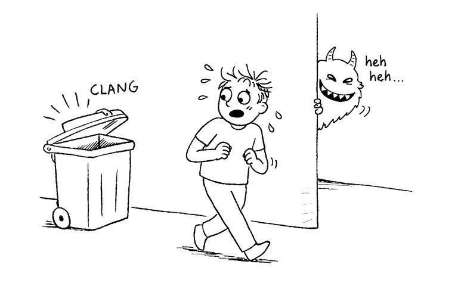

# Амигдала — центр страха

## Когда мозг пугается раньше тебя

Представь: ты идёшь вечером по улице, думаешь о своём, и вдруг за спиной раздаётся резкий хлопок.  
Ты вздрагиваешь, сердце начинает колотиться быстрее, мышцы напрягаются, а взгляд сам ищет источник опасности.

И только через секунду ты понимаешь: это не нападение, не взрыв и не чудовище из темноты. Просто у мусорного бака захлопнулась крышка.

Получается странная вещь: **твоё тело уже испугалось, хотя ты ещё не успел разобраться, что произошло**.

Почему так?

Потому что мозг не любит ждать, когда речь идёт о возможной опасности. У него есть особая система быстрого реагирования, и важную роль в ней играет небольшая структура с необычным названием — **амигдала**.

---

<!--  -->

   
  <em>Здесь кто-то есть?!</em>

---

## Что такое амигдала и где она находится
Амигдала — это небольшая структура, спрятанная глубоко в [височных долях](04_main_parts_of_the_brain.md) мозга. Точнее, амигдал две: по одной в каждом полушарии. Своё название она получила из-за формы — она напоминает маленький миндальный орех.

Несмотря на размер, роль у неё огромная. Амигдала помогает мозгу быстро отвечать на вопросы вроде:

- это безопасно или опасно;
- нужно ли срочно насторожиться;
- что сейчас важнее: спокойно думать или немедленно реагировать.

Её часто называют **центром страха**, но это немного упрощение. Амигдала связана не только со страхом. Она участвует в распознавании эмоционально значимых сигналов вообще: угрозы, тревожных звуков, злых или испуганных лиц, резких изменений вокруг.

Если представить мозг как большой город, то амигдала — это что-то вроде **сигнализации и диспетчерской тревоги**. Она не строит длинные планы, а быстро сообщает: «Эй, на это надо обратить внимание прямо сейчас».

---

<!--  -->

   
  <em>Настало мое время</em>

---

## Что происходит, когда амигдала замечает опасность

Когда амигдала получает сигнал, что рядом может быть что-то опасное, она помогает запустить целую цепочку реакций. Именно из-за этого страх ощущается не только «в голове», но и в теле.

Могут происходить такие вещи:

- сердце начинает биться быстрее;
- дыхание становится чаще;
- мышцы напрягаются;
- зрачки расширяются;
- внимание резко сужается на источнике опасности.

Это и есть знаменитая реакция **«бей, беги или замри»** — один из ключевых механизмов [стресса](07_stress.md). Её задача — не сделать тебя спокойнее, а сделать тебя **быстрее и готовее**.

Если опасность реальна, такая система очень полезна. Допустим, ты резко отдёргиваешь руку от горячей поверхности или отскакиваешь от велосипеда, который внезапно выехал из-за угла. В такие моменты счёт идёт буквально на доли секунды.

Страх перед контрольной работает по похожему принципу, хотя опасность здесь не физическая. Для мозга важные социальные ситуации — экзамен, выступление у доски, страх опозориться — тоже могут восприниматься как серьёзная угроза. Поэтому тело реагирует по-настоящему: не «понарошку», а вполне биологически. Особенно заметно это может быть у подростков, потому что [мозг подростка](05_teen_brain.md) сильнее реагирует на эмоции и социальную оценку.

## Быстрый и медленный путь страха

Одна из самых интересных вещей в работе амигдалы — то, что мозг умеет обрабатывать угрозу **двумя путями**.

### Быстрый путь

Представь, что в траве что-то мелькнуло. Или ты видишь в темноте странный силуэт. Сигнал сначала попадает в область мозга, которая помогает распределять сенсорную информацию, — таламус. А дальше у мозга есть короткий маршрут: **таламус → амигдала**.

Этот путь очень быстрый. Он не даёт подробного ответа на вопрос «что именно я вижу?», зато помогает мгновенно отреагировать. По сути, мозг говорит: «Я ещё не уверен, что это такое, но на всякий случай лучше насторожиться».

Именно поэтому человек может вздрогнуть от шланга, приняв его за змею. Сначала срабатывает тревога, а уже потом приходит понимание.

### Медленный путь

Есть и другой маршрут: **таламус → [кора мозга](04_main_parts_of_the_brain.md) → амигдала**.

Кора мозга работает медленнее, но гораздо точнее. Она анализирует детали: форму, контекст, прошлый опыт. Благодаря этому через секунду ты понимаешь: «Спокойно, это не опасность. Это просто тень от ветки» или «Это не провал всей жизни, а обычная контрольная, к которой можно написать хотя бы часть заданий».

Получается, что быстрый путь нужен для мгновенной реакции, а медленный — для уточнения и проверки.

Это очень умная система. Если бы мозг всегда ждал полного анализа, мы бы слишком медленно реагировали на реальную угрозу. А если бы он всегда доверял только тревоге, мы бы постоянно жили в панике. Поэтому мозг сочетает оба режима: **сначала быстрое предупреждение, потом более точная проверка**.

## Почему мы иногда пугаемся зря

У такой системы есть цена: иногда амигдала поднимает **ложную тревогу**.

Ты наверняка сталкивался с этим:

- испугался куртки на стуле в тёмной комнате;
- вздрогнул от уведомления на телефоне;
- услышал шорох и сразу решил, что в квартире кто-то есть;
- увидел учителя с серьёзным лицом и подумал, что тебя сейчас будут ругать.

А потом оказывается, что всё в порядке.

Но для мозга это не провал, а скорее разумная перестраховка. С точки зрения эволюции лучше десять раз ошибиться и насторожиться зря, чем один раз не заметить настоящую опасность. С похожими особенностями восприятия связана и предсказательная работа мозга, о которой говорится в статье [«Почему мозг достраивает реальность»](27_brain_predicts.md).

Амигдала — не идеальный детектор истины. Она скорее **быстрая, подозрительная и осторожная часть системы**.

## История пациентки S.M.: женщина, которая почти не знала страха

Одна из самых известных историй в нейробиологии связана с женщиной, которую в научных работах называют **S.M.**

У неё было редкое заболевание, из-за которого обе амигдалы оказались сильно повреждены. Для учёных это был очень необычный случай: можно было увидеть, что меняется в жизни человека, если мозговая система страха работает совсем не так, как у большинства людей.

### Змеи, фильмы ужасов и «отсутствующий» страх

Когда исследователи показывали S.M. то, что обычно вызывает испуг, её реакция сильно отличалась от реакции других людей. Она спокойно контактировала со змеями и пауками, хотя многие люди начинают нервничать уже при одном их виде. Она почти не пугалась в «домах ужасов», где другие посетители вздрагивали и кричали. Страшные фильмы тоже не вызывали у неё обычной сильной тревоги.

Но самое важное — это не то, что она «не боялась монстров». Намного важнее было то, что **у неё оказался ослаблен сам механизм предупреждения об опасности**.

### Случай у храма

В одной из историй из её жизни описывается, как поздно вечером S.M. проходила мимо храма, рядом с которым стоял незнакомый мужчина. Он выглядел опасно и явно не внушал доверия. Для большинства людей такая ситуация уже сама по себе стала бы сигналом насторожиться: ускорить шаг, перейти на другую сторону улицы, держаться подальше.

Но S.M. не почувствовала этой привычной волны страха.

Мужчина схватил её, прижал к себе и начал угрожать ножом. Это была ситуация, где обычная реакция страха очень важна: она помогает моментально оценить риск, запомнить угрозу и в будущем избегать похожих обстоятельств.

Однако S.M. повела себя необычно спокойно. Она посмотрела на него и сказала:

> «Если ты причинишь мне вред, Бог и его ангелы будут наблюдать за тобой».

Мужчина неожиданно отпустил её.

S.M. позже рассказывала, что, конечно, понимала умом, что ситуация плохая, но её эмоциональная реакция была не такой, как ожидается у большинства людей. Это и есть один из самых поразительных выводов из её истории: **можно интеллектуально понимать опасность, но без нормально работающей амигдалы не чувствовать её так, как обычно чувствуют люди**.

### Почему это не суперспособность

Иногда кажется, что не бояться ничего — это почти как быть героем боевика. Но история S.M. показывает обратное.

Страх — это не слабость и не «неприятная ошибка мозга». Это защита. Он нужен, чтобы:

- не приближаться к очевидной угрозе;
- запоминать опасные ситуации;
- считывать тревожные сигналы в поведении других людей;
- вовремя уходить, а не оставаться там, где риск слишком велик.

Без страха человек становится не смелее, а **уязвимее**. А если говорить шире, безопасное поведение зависит не только от страха, но и от систем контроля и принятия решений, связанных с [лобными долями](04_main_parts_of_the_brain.md) и хорошо известных по истории [Финеаса Гейджа](06_phineas_gage.md).

История S.M. стала для науки очень важной. Она помогла лучше понять: амигдала действительно играет ключевую роль в том, как мы переживаем страх и замечаем угрозу.

---

<!--  -->

   
  <em>Чего шипим?</em>

---

## Амигдала и лица: почему мозг всё время ищет эмоции

Амигдала участвует не только в страхе, но и в распознавании лиц и эмоций.

Например, когда ты смотришь на человека и почти мгновенно понимаешь, что он сердится, испуган или напряжён, в этом участвуют эмоциональные системы мозга, включая амигдалу. Она помогает быстро выделять то, что может быть важным: злой взгляд, тревожное выражение лица, широко раскрытые глаза. Эта способность важна и для [эмпатии](15_empathy.md) — умения замечать и понимать состояние другого человека.

Но тут есть интересная особенность: мозг иногда **слишком старается находить лица и эмоции**, даже когда перед ним вообще не человек.

Замечал ли ты когда-нибудь лица в узорах ковра, складках штор, облаках, пятнах на стене или даже в розетке? Иногда кажется, будто предмет «смотрит» на тебя или «улыбается». Это не магия и не глюк зрения в плохом смысле. Просто мозг настолько хорошо натренирован искать лица, что иногда находит их там, где их нет. Такое достраивание образов связано с тем, как мозг предсказывает и интерпретирует реальность, — об этом подробнее говорится в статье [«Почему мозг достраивает реальность»](27_brain_predicts.md).

Для человека это полезный навык. Лицо другого человека — очень важный источник информации. По нему можно понять настроение, угрозу, дружелюбие, страх. Поэтому мозг лучше лишний раз ошибётся и увидит «лицо» в рисунке на обоях, чем пропустит настоящее лицо с опасным выражением.

Это хороший пример того, как эмоциональные системы мозга работают быстро и иногда с избытком.

## Как амигдала связана с памятью

Страшные события часто запоминаются особенно ярко. Многие люди плохо помнят, что ели две недели назад, но хорошо помнят момент, когда чуть не упали с велосипеда, потерялись в магазине или выступали перед классом с дрожащими руками.

Так происходит потому, что эмоции помогают мозгу выделять важное. Амигдала в этом участвует: если событие кажется значимым или угрожающим, мозг с большей вероятностью помечает его как достойное запоминания.

Именно поэтому сильные эмоции так тесно связаны с [памятью](21_how_memory_works.md). В формировании воспоминаний важную роль играет и [гиппокамп](23_hippocampus.md), который помогает сохранять и упорядочивать жизненный опыт.

## Почему страх — это не только про опасность, но и про школу, оценки и людей

Когда слышишь слово «страх», легко представить что-то экстремальное: тёмный лес, нападение, фильм ужасов. Но в жизни подростка страх часто выглядит совсем иначе.

Это может быть:

- страх получить двойку;
- страх выйти к доске;
- страх, что над тобой будут смеяться;
- страх подойти познакомиться;
- страх сказать что-то глупое;
- страх провалить важный разговор.

Для мозга социальные угрозы могут быть почти такими же важными, как физические. Люди — социальные существа. Для нас очень важно, как нас оценивают другие, принимают ли в группе, не грозит ли унижение или отвержение.

Поэтому амигдала может включаться и в таких ситуациях тоже. Именно отсюда ощущение комка в горле, дрожи, потных ладоней или резкого напряжения перед контрольной или выступлением.

Это не значит, что страх «глупый». Это значит, что мозг воспринимает ситуацию как значимую.

## А что насчёт других эмоций

Хотя амигдалу чаще всего связывают со страхом, она не существует отдельно от остальных эмоциональных систем. Мозг вообще не работает как набор изолированных кнопок: «эта зона — только страх», «эта — только радость», «эта — только грусть».

Например, чувство удовольствия, мотивации и ожидания награды связано с [системой вознаграждения](11_reward_system.md). А то, почему нам бывает грустно и зачем мозгу вообще нужна такая эмоция, разбирается в статье [«Почему нам бывает грустно»](20_sadness.md).

Это важно помнить: амигдала — очень значимая часть эмоционального мозга, но не единственная.

## Итог

Амигдала — маленькая, но очень влиятельная структура мозга. Она помогает быстро замечать угрозу, запускать реакцию тревоги и переключать организм в режим готовности.

Благодаря ей мы вздрагиваем от резкого хлопка, настораживаемся в подозрительной ситуации и сильнее переживаем то, что кажется опасным — даже если это всего лишь контрольная, важный разговор или выход к доске.

История пациентки S.M. особенно ясно показывает, что страх нужен не для того, чтобы мешать жить. Он нужен, чтобы **предупреждать, защищать и удерживать нас от реально опасных вещей**.

Иногда амигдала действительно перестраховывается. Но для мозга это вполне логично: лучше лишний раз поднять тревогу, чем пропустить то, что может причинить вред.

---
Авторы: @kirbasss;  
Ресурсы: LLM - ChatGPT 5.4
