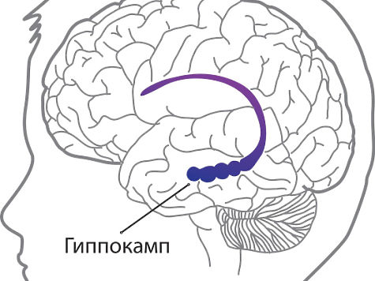

# Гиппокамп — навигатор и архив

Представь: ты идёшь домой из школы и даже не думаешь, куда сворачивать.  
Ноги сами ведут тебя по знакомому маршруту.

Но как мозг «запоминает» дороги?  
И почему мы помним, где были вчера?

За это во многом отвечает особая структура мозга — гиппокамп.

## Что такое гиппокамп

Гиппокамп — это часть мозга, расположенная глубоко внутри височных долей.  
Он играет ключевую роль в:
- формировании воспоминаний,
- ориентации в пространстве,
- обучении.

Без гиппокампа мы не могли бы нормально запоминать новые события.

   ,

## Гиппокамп как навигатор

Гиппокамп помогает нам ориентироваться в пространстве.

В нём есть специальные нейроны — клетки места.  
Они активируются, когда ты находишься в определённой точке.

Фактически мозг строит внутреннюю «карту» окружающего мира.

## Лондонские таксисты

Учёные изучали водителей такси в Лондоне.  
Чтобы получить лицензию, они должны выучить тысячи улиц и маршрутов.

Оказалось, что:
- гиппокамп у таксистов больше, чем у обычных людей,
- особенно его задняя часть, связанная с навигацией.

Это показывает:  
👉 чем больше ты используешь навык, тем сильнее меняется мозг

   ,

## Гиппокамп как архив

Гиппокамп также участвует в сохранении воспоминаний.

Когда происходит событие:
- информация сначала обрабатывается,
- затем «записывается» с участием гиппокампа,
- позже может перейти в долговременную память (см. [Устройство памяти](21_how_memory_works.md)).

## История Генри Молисона

Один из самых известных случаев в нейробиологии — пациент Генри Молисон.

Ему удалили гиппокамп, чтобы вылечить тяжёлую эпилепсию.  
После операции приступы уменьшились, но возникла серьёзная проблема:

👉 он перестал запоминать новые события

Он мог:
- помнить своё детство,
- разговаривать нормально,

но:
- забывал всё, что произошло несколько минут назад.

Этот случай показал, насколько важен гиппокамп для памяти.

   ,

## Почему это важно

Гиппокамп помогает:
- запоминать события,
- ориентироваться в пространстве,
- учиться новому.

И он тоже меняется благодаря нейропластичности (см. [Мозг, который умеет меняться](22_neuroplasticity.md)).

👉 чем больше ты тренируешься — тем эффективнее работает твой «внутренний навигатор»

---
Авторы: @koka_poka575
Ресурсы: LLM - ChatGPT 5.4
