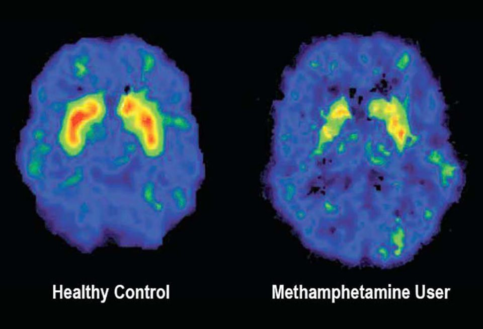

# Как зависимость меняет личность: история одного «эксперимента»

> Знаешь, как выглядит дорога в никуда? Она никогда не начинается с обрыва. Сначала это просто тропинка, на которую свернули «просто посмотреть». А потом ты уже бежишь по ней и не можешь остановиться. Давай расскажу историю. Имя мы изменим, но таких историй — тысячи.

## Знакомься, это Дима

Дима — обычный парень. Ему 15. Он не плохой и не хороший — он самый обычный. Учится себе, играет в компьютерные игры, тусуется с друзьями. Иногда ссорится с родителями, иногда получает пятерки. В общем, ничего особенного.

Как думаешь, Дима планировал стать наркоманом? Конечно нет. Он просто хотел попробовать. Один раз. «За компанию». Ему говорили, что это «легкие» наркотики, что это сейчас модно, что все так делают. И Дима поверил.

А теперь давай посмотрим, что случилось с Димой дальше.

---

## Этап 1. Эксперимент (первые 1–2 месяца)

*Как это выглядит со стороны*

Дима начал иногда курить «травку» с друзьями на выходных. Иногда — нюхать соли на вечеринках. Он думал: «Я же контролирую процесс. Я просто расслабляюсь. Это весело».

*Что происходит внутри на самом деле*

Мозг Димы быстро привыкает к тому, что кайф можно получать без усилий. Обычные радости — вкусная еда, хорошая музыка, общение с девушкой — становятся бледными и неинтересными.

Дима пока этого не замечает. Ему кажется, что все нормально. Но внутри уже запущены часы.

**Признак этапа:**
> «Я могу бросить в любой момент. Просто пока не хочу».

---

## Этап 2. Привычка (3–6 месяцев)

*Как это выглядит со стороны*

Дима уже не ждет выходных, чтобы «расслабиться». Мысль о том, чтобы употребить, приходит сама собой. Просто так, после школы. Или перед тем, как сесть за уроки. Или когда погода плохая.

Друзья начинают замечать, что Дима изменился. Раньше он был веселый, а теперь часто раздраженный. Раньше у него было много интересов, а теперь — только одна тема для разговоров: где и с кем можно «зависнуть».

Дима бросает старую компанию. Те, кто не употребляют, кажутся ему скучными. «Они ничего не понимают в жизни», — думает Дима.

*Что происходит внутри на самом деле*

Мозг Димы перестраивается. Нейронные связи, отвечающие за дружбу, учебу, хобби — отмирают за ненадобностью. Зато связи «стресс → доза» становятся супер-магистралями.

Дима уже не получает удовольствия от вещества. Он просто возвращает себя в «нормальное» состояние. То, что раньше казалось кайфом, теперь просто убирает ломку и плохое настроение.

**Признак этапа:**
> «Мне это нужно, чтобы нормально себя чувствовать. Но я все еще контролирую дозу».

---

## Этап 3. Зависимость (6–12 месяцев)

*Как это выглядит со стороны*

Дима изменился до неузнаваемости. Посмотри на фото годичной давности — это другой человек.

Раньше: чистая одежда, улыбка, ясный взгляд.
Сейчас: осунувшееся лицо, мешки под глазами, грязные волосы. Он похудел. Или наоборот — опух. Зубы портятся, кожа серая.

Дима врет родителям. Постоянно. Где был? У друзей. На что потратил деньги? Потерял. Почему не ночевал домой? Забыл предупредить.

Дима ворует. Сначала у родителей из кошелька — «просто в долг, я верну». Потом у друзей. Потом в магазинах.

Диме плевать на все. На учебу, на будущее, на отношения. Есть только одна цель — найти дозу.

*Что происходит внутри на самом деле*

Это называется **ангедония**. Дима разучился чувствовать радость без вещества. Вообще. Ему не вкусно, не интересно, не весело. Только страшно и больно.

Чтобы почувствовать себя человеком, нужна доза. Доза кончилась — началась ломка. Это не просто «плохое настроение». Это боль во всем теле, озноб, пот, паника. Дима готов на все, чтобы это прекратить.

**Признак этапа:**
> «Я ненавижу себя. Я хочу остановиться. Но не могу».

---

## Что говорят врачи: почему Дима не может остановиться?

Слева — мозг здорового человека, справа — мозг наркомана

Мозг продолжает формироваться примерно до 21-25 лет. Самая последняя часть, которая созревает — это лобные доли. Это та часть, которая отвечает за контроль. У подростков она еще не достроена до конца. А наркотики этот процесс строительства просто выключают.

Дима физически не может оценивать риски как взрослый человек. Его мозг работает по-другому. Желание сильнее разума.

Врачи называют это **«формирование зависимости»**. И это не слабость характера. Это болезнь. Так же как диабет или астма. Только диабет лечат таблетками, а зависимость лечить очень трудно. И не всегда получается.

---

## История Димы. Финал?

Давай остановимся здесь. Потому что дальше есть два варианта.

**Вариант А.** Дима попадает в больницу с передозировкой. Или в тюрьму за кражу. Или просто исчезает — уходит из дома, теряется в большом городе. Таких историй много. Они не заканчиваются хорошо.

**Вариант Б.** Дима встречает человека, который говорит ему правду. Родители, учитель, психолог, кто-то из друзей, кто смог остановиться. Дима попадает в реабилитационный центр. Ему больно, трудно, он срывается, но потихоньку учится жить заново. Учиться радоваться простым вещам. Восстанавливать отношения. Мозг Димы после отказа от наркотиков постепенно восстанавливается.

Вариант Б возможен. Но он требует огромной работы и помощи специалистов. Самому, без поддержки, выбраться почти невозможно. 

---

## Коротко: что случилось с Димой?

Давай соберем в одну таблицу то, через что прошел обычный парень за один год.

| Что было ДО | Что стало ЧЕРЕЗ ГОД |
| :--- | :--- |
| Учился в школе | Бросил школу или его выгнали |
| Был друг | Друзья остались только из «тусовки» |
| Хорошие отношения с родителями | Постоянные ссоры, вранье, кражи |
| Хобби, интересы | Есть только одна цель — доза |
| Нормальный сон и аппетит | Бессонница, худоба, болезни |
| Смотрел в будущее | Живет одним днем, будущего нет |

---

## Почему это важно понять прямо сейчас

Дима не собирался становиться зависимым. Он просто хотел попробовать. Один раз.

У тебя наверняка есть знакомые, которые уже прошли этот путь. Или проходят прямо сейчас. Ты видишь, как они меняются. Ты чувствуешь, что что-то не так.

Ты не сможешь спасти того, кто не хочет спасаться. Но ты можешь сделать выбор за себя.

**История Димы — это не про «плохих людей». Это про обычных. Которые в какой-то момент поверили в «легкие наркотики» и в то, что они «контролируют ситуацию».**

Никто не просыпается утром с мыслью: «Хочу стать наркоманом». Это всегда начинается с одной маленькой уступки. С одного «просто попробую».

---

## Если ты узнал в этой истории себя или друга

Не молчи. Серьезно. Молчание — лучший друг зависимости.

*   Можно позвонить на телефон доверия: **8-800-2000-122**
*   Можно поговорить с родителями (да, это страшно, но они не враги, даже если сейчас кажется иначе)
*   Можно найти школьного психолога
*   Можно позвонить по номеру **8-800-700-50-50** — там работают специалисты по зависимостям

**Стыдно — болеть и ничего не делать. А просить помощь — не стыдно. Это нормально.**

Помни: у Димы в этой истории еще есть шанс. Но чем раньше он остановится, тем больше шансов, что он вернется к нормальной жизни.

---

**Автор:** @aaxelf

**Нейронные сети, использованные при создании статьи:** DeepSeek