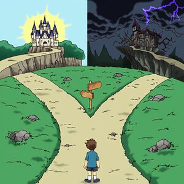
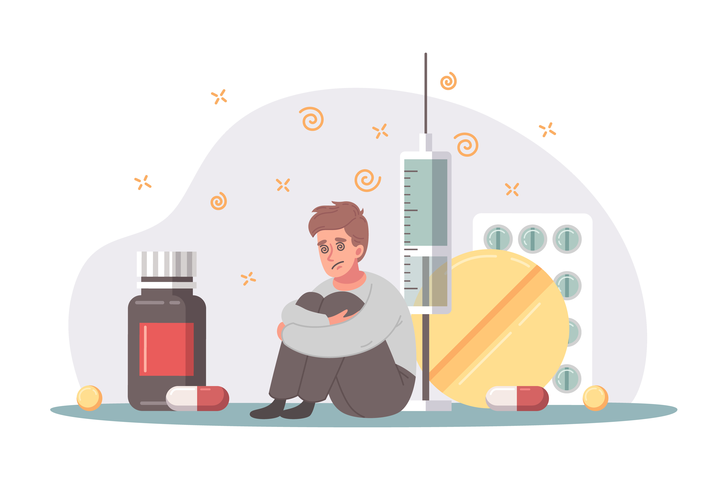
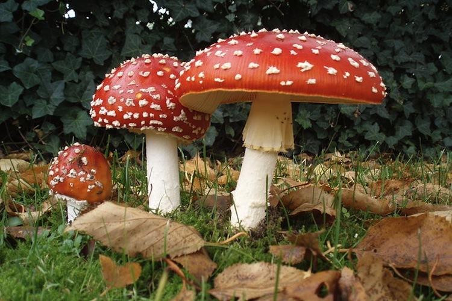
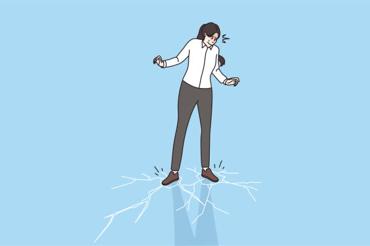
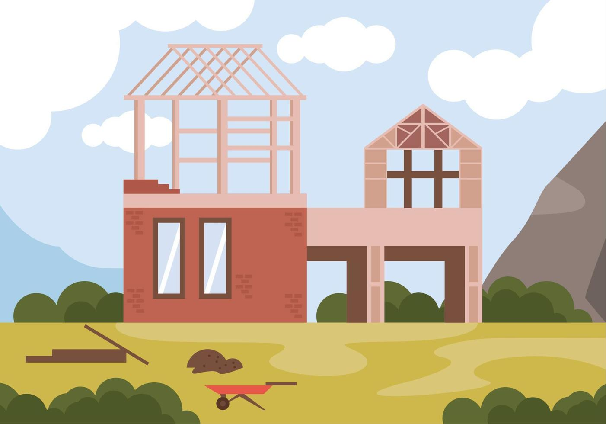
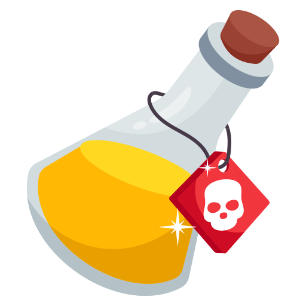
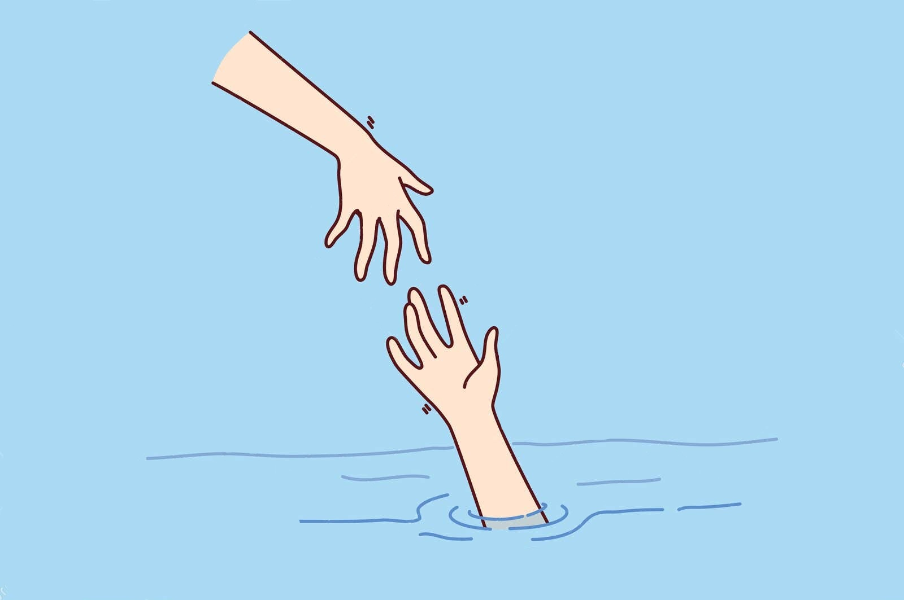

# Мифы и правда о «легких» наркотиках

Представь, что кто-то скажет: «Есть легкие яды, от них ничего не будет». Странно звучит, правда? Потому что яд — он и есть яд. Он может быть слабее или сильнее, но отравиться можно любым.

С наркотиками та же история. В медицине, биологии или химии **нет такого понятия — «легкий наркотик»**. Есть понятие «психоактивное вещество». Сложное слово, но смысл простой: это химия, которая вмешивается в работу твоего мозга. Заставляет его работать неправильно, неестественно.

Термин «легкие» придумали не ученые и не врачи. Его придумали те, кто продает эти вещества, чтобы ты не боялся и захотел попробовать. Это просто рекламный трюк, как наклейка «Био» на вредных чипсах. Задача этой статьи — снять эту наклейку и показать, что внутри на самом деле.

---

## Самые главные мифы, в которые люди зря верят

Давай пройдемся по самым популярным сказкам, которые ходят среди подростков. Под каждым мифом мы напишем правду — сухую и честную.

### Миф №1: «Это просто баловство, это не вызывает привыкания»

Многие думают, что зависимость — это когда человек с иголкой в руке готов на все ради дозы. Им кажется: «Я же не такой, я просто попробую разок, покурю с ребятами на вечеринке». И это самая большая ловушка.

**А теперь правда.**

Привыкание бывает разным. Есть **физическое** — когда тело реально болит без вещества (это называется ломка, и это действительно очень больно). А есть **психологическое** — оно наступает гораздо раньше и незаметнее.

Чтобы понять, как это работает, нужно чуть-чуть знать про свой мозг. Внутри головы у тебя есть сложная система проводов (нейронов), по которым бегают сигналы. За радость и хорошее настроение отвечает вещество под названием **дофамин**.

Обычно дофамин выделяется, когда ты сделал что-то реально крутое:
*   Победил в соревнованиях
*   Получил пятерку за сложный экзамен
*   Встретился с другом, которого давно не видел
*   Съел что-то очень вкусное

Это естественный путь: **достижение → радость**.

Наркотик работает как обманка. Он впрыскивает дофамин просто так, без всяких усилий. Мозг офигевает: «Ничего себе! Как это так? Вот так просто — и сразу кайф? Отлично, запоминаем этот способ!»

И вот тут начинается проблема. После того, как ты попробовал «быстрый дофамин», обычные радости жизни начинают казаться пресными. Тебе уже не так интересно гулять, играть, общаться. Мозг привыкает получать удовольствие только через таблетку или дозу.

Это называется **ангедония** — болезнь, когда ничего не радует, кроме наркотика. И это начинается не через год, а **после нескольких первых разов**.

### Миф №2: «Это же просто "травка", она натуральная, значит безопасная»

Очень частый аргумент. Мол, в лесу трава растет, а химия в таблетках — это плохо, а природа — это хорошо.

**Правка про «натуральность».**

Знаешь, что тоже натуральное и природное? Мухоморы, бледная поганка и яд кураре, которым индейцы смазывали стрелы. Натуральное — не значит полезное.

Во-вторых, то, что сейчас продают под видом «травки» — это часто даже не трава. Современные курительные смеси (спайсы) — это синтетическая химия, которой опрыскали обычную сухую ботву. Ты не знаешь, чем именно опрыскали. Сегодня там одно, завтра — другое. Это как играть в русскую рулетку: никогда не знаешь, что выпадет.

Кстати, про марихуану (коноплю) ученые тоже давно все выяснили. Да, она не вызывает быстрой физической ломки как героин. Но современная марихуана сейчас намного сильнее, чем та, что была у хиппи в 60-х. Ее вывели специально, чтобы она сильнее «вставляла». Исследования показывают, что у подростков, которые регулярно курят травку, снижается IQ (коэффициент интеллекта), ухудшается память и им становится сложнее учиться. Мозг просто перестает работать на полную мощность.

### Миф №3: «Я сильный, я смогу остановиться, когда захочу»

Так думает 99% тех, кто начинает. Им кажется, что они держат руль в своих руках.

**Почему это иллюзия.**

Представь, что ты идешь по тонкому льду. Сначала лед трещит, но ты идешь. Ты думаешь: «Я же вижу трещину, я контролирую ситуацию, я просто дойду до того берега и все». Но когда лед ломается, ты падаешь в воду моментально. Нет времени сказать: «Ой, все, стоп, я передумал».

С мозгом так же. Ты не замечаешь границы, когда просто «пробующий» превращается в «зависимого». Это похоже на то, как если бы в комнате медленно прибавляли температуру. Ты не чувствуешь момента, когда стало невыносимо жарко — ты просто просыпаешься уже в огне.

Вот как выглядит путь:

1.  **Эксперимент.** Тебе интересно, тебя уговаривают друзья, хочется быть своим в компании.
2.  **Привычка.** Ты начинаешь употреблять по выходным. Тебе кажется, что так веселее расслабляться.
3.  **Потребность.** Без вещества ты уже не можешь расслабиться вообще. Ты злой, дерганый, тебе скучно, ничего не радует. Ты ждешь пятницы, чтобы снова стать «нормальным».
4.  **Зависимость.** Ты употребляешь уже не для кайфа, а чтобы просто не чувствовать себя ужасно. Ты готов на все ради дозы.

Разница между 2 и 4 стадией может быть всего в пару месяцев. Ты просто не успеешь сказать себе «стоп».

### Миф №4: «Соли и спайсы — это "химия", они быстро выводятся и не оставляют следов»

Это про синтетические наркотики, которые часто выглядят как порошок или маленькие кристаллики. Про них ходят самые страшные истории, и, к сожалению, это чистая правда.

**Почему они самые опасные.**

*   **Нет дозировки.** Ты покупаешь пакетик. Ты не знаешь, сколько там чистого яда. Сегодня там 10%, завтра 80%. Разница между дозой, которая просто «вставляет», и дозой, которая остановит сердце, может быть микроскопической. Это как прыгать с моста с закрытыми глазами: может, повезет, а может, и нет.
*   **Удар по психике.** Эти вещества могут за одну ночь превратить нормального человека в психопата. Мозг просто «перегревается» и ломается. Люди под солями и спайсами слышат голоса, видят чудовищ, выпрыгивают из окон, потому что им кажется, что они умеют летать, или нападают на своих родителей с ножом, потому что им показалось, что родители — инопланетяне. Таких историй в новостях — сотни.
*   **Скорость разрушения.** Если алкоголь разрушает печень годами, то синтетика сжигает нейроны мозга за считанные месяцы. Человек тупеет на глазах, превращается в овощ. Ему становится все равно на семью, учебу, друзей, хобби. Остается только одна мысль: найти и уколоться/понюхать.

---

## Что говорят ученые и врачи (а это самые умные люди)

Исследования мозга подростков показали одну важную вещь.

Твой мозг — как строящийся дом. Он достраивается примерно до 21-25 лет. Самая последняя часть, которая созревает — это лобные доли. Это та часть мозга, которая отвечает за контроль, за то, чтобы думать головой, прежде чем делать. Это твой «внутренний взрослый», который говорит: «Стоп, не лезь, подумай о последствиях».

Когда в подростковом возрасте ты начинаешь употреблять любые наркотики (даже те, которые называют «легкими»), ты ломаешь строительные леса этого дома. Ты мешаешь сформироваться этому самому контролю. В итоге вырастает человек, который не может управлять своими желаниями. Он хочет — он делает. Он не видит дальше своего носа.

---

## Итог: давайте честно

«Легких наркотиков» не существует. Есть тяжелые последствия, которые просто наступают с разной скоростью. Где-то быстрее (соли, спайсы), где-то чуть медленнее (трава), но дорога всегда ведет в одну сторону — вниз.

Никто из тех, кто начинал, не планировал становиться наркоманом. Никто не просыпался утром с мыслью: «Хочу через год валяться под забором и потерять всех друзей». Это происходит постепенно, шаг за шагом. И первый шаг — это как раз поверить в миф про «легкие» и «безопасные».

Твоя жизнь, твой мозг, твои мечты, твоя семья, твое будущее — это слишком ценное, чтобы ставить это на кон в игре, где правила написаны дилерами и обманщиками.

### Если тебе нужна помощь или совет

Иногда бывает страшно или стыдно говорить об этом с родителями или учителями. Это нормально. Но есть люди, которые обязаны тебе помочь и не будут ругать.

*   **Всероссийский телефон доверия:** 8-800-2000-122
    *   Звонок бесплатный. Можно позвонить и рассказать о том, что беспокоит, даже если это касается твоих друзей или тебя самого. Никто не узнает твой номер и имя.
*   **Телефон доверия для наркозависимых:** 8-800-700-50-50
    *   Здесь работают специальные врачи, которые знают, как помочь.

**Запомни:** попросить помощи — это не слабость. Слабость — молчать и делать вид, что все в порядке, когда внутри назревает беда. Сила — сказать «нет» тому, что тебя разрушает, или сказать «помогите», если беда уже случилась.

---

**Автор:** @aaxelf

**Нейронные сети, использованные при создании статьи:** DeepSeek