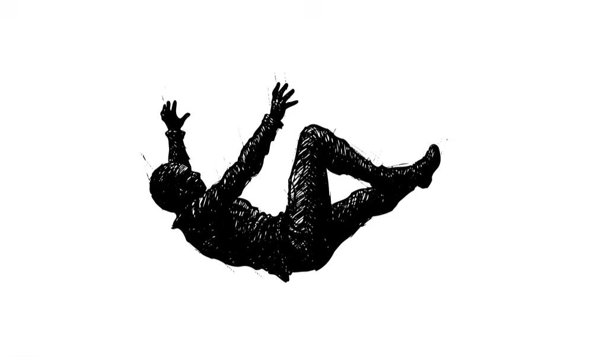
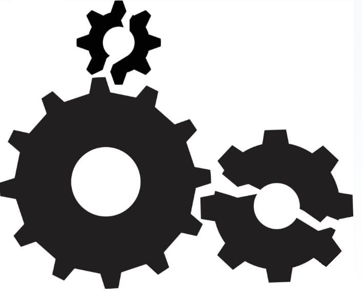
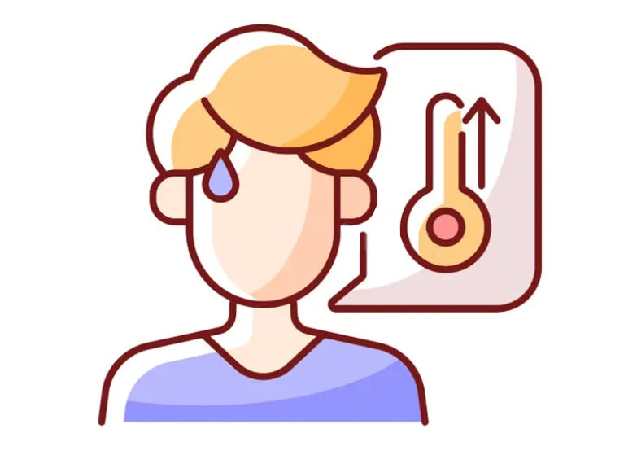

# Передозировка: что происходит с телом и почему это страшно?

> Передозировка — это не сюжет из фильма, где героя откачали и он побежал дальше. В реальности это часто инвалидность или смерть. Давай разберемся, что именно происходит внутри тела, когда ты переходишь черту. Без страшилок, просто биология.

## Что такое передозировка простыми словами?

Представь, что твой организм — это сложный механизм, как космический корабль. У него есть системы дыхания, сердцебиения, охлаждения. А наркотик — это вирус, который ломает все системы сразу.

**Передозировка (или отравление)** — это момент, когда организм больше не может справляться с ядом. Системы начинают отказывать одна за другой.

Важно понять: тебе не нужно принять «лошадиную дозу». Для передозировки достаточно обычной дозы, если:
- Организм ослаблен
- Наркотик оказался сильнее, чем обычно
- Ты смешал несколько веществ
- Ты давно не употреблял (после перерыва чувствительность выше)

---

## Что происходит с разными системами организма

Давай посмотрим на тело человека при передозировке. Это некрасивая картина, но это правда.

### 1. Дыхание: «забыл вдохнуть»

Наркотики из группы **опиатов** (героин, морфин, некоторые обезболивающие) и **депрессанты** напрямую отключают дыхательный центр в мозгу.

Как это работает: мозг посылает сигнал диафрагме: «вдохни». Это происходит автоматически, ты об этом даже не думаешь. Опиаты этот сигнал глушат. Человек просто засыпает... и перестает дышать.

**Что чувствует человек:** Ничего. Он просто теряет сознание. Если рядом никого нет, кто бы его разбудил или перевернул, через 3–5 минут без кислорода наступает смерть.

**Факт:** Часто люди умирают не от того, что доза была огромной, а от того, что заснули на спине и захлебнулись рвотой или просто перестали дышать.

---

### 2. Сердце: «мотор заглох»

**Стимуляторы** (амфетамин, соли, кокаин, экстази) работают наоборот. Они заставляют сердце биться как бешеное.

Нормальный пульс взрослого человека — 60–80 ударов в минуту. Под стимуляторами сердце может разогнаться до **180–200 ударов** в минуту и выше. Это как если бы ты бежал стометровку на максимальной скорости, но без остановки.

Сердце не выдерживает такой нагрузки:
- Оно может просто остановиться (остановка сердца)
- Может случиться **инфаркт** — отмирание участка сердечной мышцы (да, это бывает даже в 16 лет)
- Может случиться **инсульт** — сосуд в мозгу лопается от давления

**Что чувствует человек:** Грудную клетку сдавливает, сердце колотится так, что кажется, сейчас выпрыгнет. Потом темнеет в глазах.

---

### 3. Температура: «внутренняя печка»

Под экстази и некоторыми другими веществами тело теряет способность регулировать температуру.

Обычно, когда жарко, мы потеем и охлаждаемся. Под наркотиком этот механизм ломается. Температура тела может подняться до **40–42 градусов**. Это критический уровень, при котором белки в организме начинают разрушаться (сворачиваться, как яйцо на сковородке).

Плюс на вечеринках люди танцуют, не пьют воду и не чувствуют усталости. Организм перегревается, обезвоживается, и наступает **тепловой удар**.

**Что чувствует человек:** Сначала жар, потом спутанность сознания, потом отказ органов.

---

### 4. Почки: «фильтры забились»

При передозировке стимуляторами мышцы начинают разрушаться слишком быстро (это называется рабдомиолиз). Продукты распада мышц забивают почки, как мусор забивает раковину.

Почки перестают работать. Без диализа (аппарата искусственной почки) человек умирает от отравления продуктами распада собственного организма.

---

## Почему это случается с обычными подростками?

Вот три главные причины, о которых никто не думает, когда в первый раз пробует.

### Причина 1. Фактор непредсказуемости

Ты никогда не знаешь, что именно в пакетике.
- Уличные наркотики — это не лекарство из аптеки с четкой дозировкой.
- Сегодня там 10% чистого вещества, завтра — 80%.
- Туда могут подмешать что угодно: крысиный яд, стиральный порошок, другой наркотик.

**Реальность:** Вчера твой знакомый укололся той же дозой и выжил. Сегодня ты уколешься такой же — и умрешь. Потому что состав другой.

### Причина 2. Смешивание

Очень многие думают: «Выпью пива для расслабления и покурю травки». Или: «Приму колесо и запью энергетиком».

Алкоголь + наркотики = гремучая смесь. Они усиливают действие друг друга. То, что по отдельности организм пережил бы, вместе его убивает.

### Причина 3. Одиночество

Самое страшное — употреблять в одиночку. Если рядом нет никого, кто вызовет скорую, перевернет на бок, не даст захлебнуться рвотой — шансов выжить почти нет.

---

## Мифы о спасении, в которые опасно верить

### Миф: «Если станет плохо, можно принять контрастный душ и все пройдет»
**Правда:** При передозировке нет времени на душ. Человек теряет сознание за минуты. Душ не остановит остановку сердца.

### Миф: «Друзья отвезут в больницу, если что»
**Правда:** Друзья, которые сами под веществами, часто боятся вызывать скорую. Потому что у них тоже могут быть проблемы с законом. Поэтому они могут бросить тебя умирать.

### Миф: «Скорая спасет, даже если я в коме»
**Правда:** Врачи — не боги. Если мозг был без кислорода больше 5–7 минут, спасать уже некого. Тело может остаться живым, но личность умрет. Это называется **вегетативное состояние** — ты лежишь овощем и никогда не проснешься.

---

## Почему это важно знать?

Потому что никто из тех, кто в первый раз пробует наркотик, не думает, что умрет сегодня. Им кажется, что передозировка случается с какими-то другими, «самыми отбитыми». А на самом деле — с обычными.

**Передозировка не выбирает «плохих» или «хороших». Она просто случается.**

Вот сухие факты:
- Передозировка — одна из главных причин смерти среди молодых людей в мире.
- Большинство погибших от передозировки пробовали наркотики «просто так», «по мелочи».
- Часто это происходит не с «наркоманами со стажем», а с новичками, которые ошиблись с дозой.

---

## Если ты это читаешь и тебе страшно — это нормально

Страх — это защитный механизм. Он говорит: «Стоп, опасность!».

Ты не обязан ничего пробовать, чтобы быть крутым. Ты не обязан доказывать, что ты «свой». Твоя жизнь — это единственное, что у тебя есть по-настоящему.

**Если с тобой или твоим другом случилась беда прямо сейчас:**
- **Скорая помощь:** 103 или 112 (с мобильного)
- Не бойся звонить. Врачи обязаны спасать, а не наказывать.

**Если хочешь поговорить анонимно:**
- 8-800-2000-122 — телефон доверия
- 8-800-700-50-50 — помощь при зависимостях

Помни: передозировка не спрашивает, сколько тебе лет и какие у тебя планы на будущее. Она просто приходит.

---

**Автор:** @aaxelf

**Нейронные сети, использованные при создании статьи:** DeepSeek